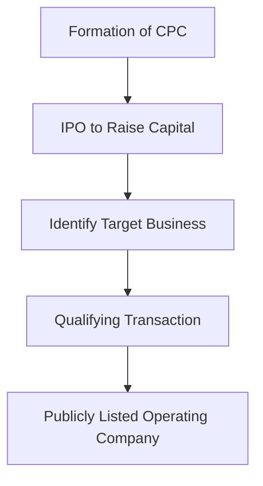
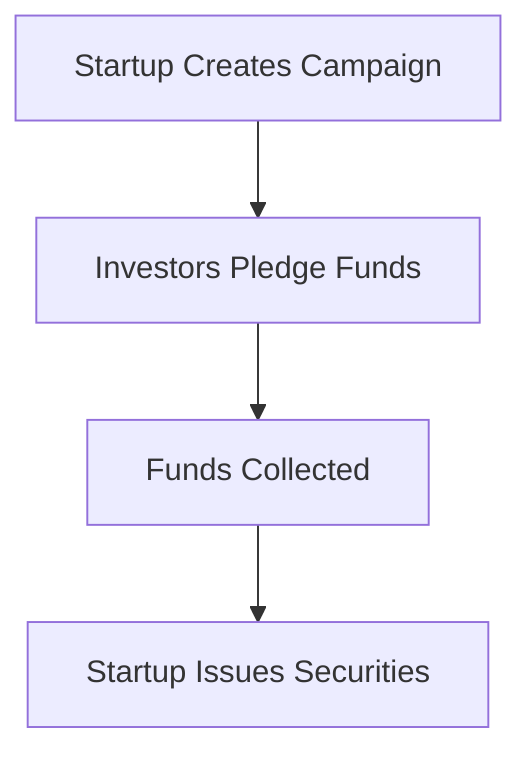

---

linkTitle: "12.4 Other Methods of Distributing Securities to the Public"
title: "Alternative Methods of Distributing Securities to the Public in Canada"
description: "Explore alternative methods for distributing securities in Canada, including junior company distributions, treasury shares, escrowed shares, Capital Pool Companies, NEX board, and crowdfunding."
categories:
- Finance
- Securities
- Investment
tags:
- Canadian Securities
- Capital Pool Companies
- Crowdfunding
- NEX Board
- Junior Companies
date: 2024-10-25
type: docs
nav_weight: 1250000
canonical: "https://securitiesexamsmastery.ca/13/12/5"
license: "© 2023 Tokenizer Inc. CC BY-NC-SA 4.0"
---

## 12.4 Other Methods of Distributing Securities to the Public

In the dynamic landscape of Canadian finance, distributing securities to the public extends beyond traditional exchanges. This section explores alternative methods that cater to diverse business needs and investor interests. Understanding these methods is crucial for financial professionals navigating the Canadian securities market.

### Junior Company Distributions

Junior companies, often in the mining or technology sectors, are smaller firms seeking capital to fund exploration or development projects. These companies typically distribute securities through:

- **Private Placements:** Offering securities to a select group of investors, often institutional or accredited investors, without a public offering. This method is faster and less costly than a public offering but limits the investor pool.
  
- **Initial Public Offerings (IPOs):** Although more common for larger companies, junior firms may pursue IPOs to access broader capital markets. The process involves regulatory scrutiny and significant costs but provides greater liquidity and visibility.

#### Case Study: Junior Mining Companies in Canada

Consider a junior mining company in British Columbia seeking funds for exploration. By opting for a private placement, the company can quickly secure capital from a few strategic investors, such as venture capitalists familiar with the mining sector. This approach allows the company to focus on its core operations without the immediate pressures of public market compliance.

### Treasury Shares

Treasury shares are previously issued shares that a company repurchases and holds for potential resale. Companies use treasury shares to:

- **Raise Capital:** By selling treasury shares, companies can raise funds without issuing new shares, thus avoiding dilution of existing shareholders' equity.
  
- **Employee Compensation:** Treasury shares can be used in stock option plans, aligning employee interests with company performance.

#### Example: Treasury Shares in Action

A Canadian tech firm might buy back shares during a period of strong cash flow and later reissue them when needing funds for a strategic acquisition. This flexibility allows the company to manage its capital structure effectively.

### Escrowed Shares

Escrowed shares are held by a third party and released under specific conditions, often used to ensure compliance with regulatory requirements or performance milestones. These shares are common in:

- **Mergers and Acquisitions:** To ensure the acquired company meets certain performance targets before the shares are fully transferred.
  
- **Initial Public Offerings:** To prevent insiders from immediately selling their shares post-IPO, stabilizing the stock price.

#### Practical Insight: Escrowed Shares in Mergers

In a merger involving a Canadian startup, escrowed shares might be used to ensure the startup achieves specified revenue targets before the shares are released to its founders. This mechanism protects the acquiring company and aligns incentives.

### Capital Pool Companies (CPCs)

A Capital Pool Company (CPC) is a unique Canadian vehicle that raises capital through an IPO with the intent to acquire an existing business. This method allows entrepreneurs to access public markets without the initial burden of a full IPO.

#### Diagram: CPC Process

#### Example: Successful CPC Transition

A CPC raises $2 million through an IPO and identifies a promising tech startup as its target. After completing the qualifying transaction, the startup becomes a publicly listed entity, benefiting from increased capital and market exposure.

### NEX Board

The NEX board is a separate trading platform within the TSX Venture Exchange for companies that have fallen below the TSX Venture's listing requirements. It provides:

- **Continued Trading:** Allows companies to maintain a public listing while restructuring or seeking new business opportunities.
  
- **Investor Access:** Offers investors opportunities to invest in turnaround stories or undervalued assets.

#### Case Study: NEX Board Resurgence

A resource company struggling with low commodity prices moves to the NEX board. By restructuring its operations and securing new financing, the company eventually meets the requirements to relist on the TSX Venture Exchange, offering investors significant returns.

### Crowdfunding

Crowdfunding involves raising small amounts of money from a large number of people, typically via the Internet. In Canada, equity crowdfunding is regulated to protect investors while allowing startups to access capital.

#### Diagram: Crowdfunding Process

#### Example: Crowdfunding Success

A Canadian clean energy startup uses an online platform to raise $500,000 from individual investors. This capital enables the startup to develop a prototype, demonstrating the power of community-driven funding.

### Best Practices and Challenges

**Best Practices:**

- **Regulatory Compliance:** Ensure all methods comply with Canadian securities regulations to avoid legal issues.
- **Investor Communication:** Maintain transparency with investors, providing regular updates and financial disclosures.

**Common Challenges:**

- **Market Volatility:** Alternative methods can be sensitive to market conditions, affecting investor interest and capital availability.
- **Regulatory Hurdles:** Navigating the regulatory landscape requires expertise and can be resource-intensive.

### Conclusion

Alternative methods of distributing securities offer flexibility and opportunities for both companies and investors in Canada. By understanding these methods, financial professionals can better advise clients and navigate the complexities of the Canadian securities market.

### Additional Resources

- **Canadian Securities Administrators (CSA):** [CSA Website](https://www.securities-administrators.ca/)
- **TSX Venture Exchange:** [TSX Venture](https://www.tsx.com/)
- **National Crowdfunding & Fintech Association of Canada:** [NCFA Canada](https://ncfacanada.org/)

### **Ready to Test Your Knowledge?**

**Practice 10 Essential CSC Exam Questions to Master Your Certification**



### Which method allows junior companies to raise capital without a public offering?

- [x] Private Placements
- [ ] Initial Public Offerings
- [ ] Treasury Shares
- [ ] Crowdfunding

> **Explanation:** Private placements involve offering securities to a select group of investors, often without a public offering.

### What is a Capital Pool Company (CPC)?

- [x] A company set up to raise capital through an IPO with the intent to acquire a business
- [ ] A company that issues treasury shares
- [ ] A company listed on the NEX board
- [ ] A company that uses crowdfunding to raise capital

> **Explanation:** A CPC is a company that raises capital through an IPO with the intent to acquire an existing business or assets.

### What is the primary purpose of escrowed shares in mergers?

- [x] To ensure performance targets are met before shares are transferred
- [ ] To raise capital for the acquiring company
- [ ] To provide employee compensation
- [ ] To stabilize stock prices post-IPO

> **Explanation:** Escrowed shares are used to ensure that performance targets are met before the shares are fully transferred, protecting the acquiring company.

### Which platform is part of the TSX Venture Exchange for companies below listing requirements?

- [x] NEX Board
- [ ] Capital Pool Company
- [ ] Crowdfunding Platform
- [ ] Private Placement Market

> **Explanation:** The NEX board is a separate trading platform for companies that have fallen below the TSX Venture's listing requirements.

### How does crowdfunding typically raise money?

- [x] By collecting small amounts from a large number of people via the Internet
- [ ] By issuing treasury shares to institutional investors
- [ ] By conducting a private placement with accredited investors
- [ ] By listing on the NEX board

> **Explanation:** Crowdfunding involves raising small amounts of money from a large number of people, usually via the Internet.

### What is a common use of treasury shares?

- [x] Employee compensation through stock option plans
- [ ] Raising capital through an IPO
- [ ] Listing on the NEX board
- [ ] Conducting a private placement

> **Explanation:** Treasury shares can be used for employee compensation, aligning employee interests with company performance.

### What is a key benefit of the NEX board?

- [x] Allows continued trading while restructuring
- [ ] Provides immediate access to public markets
- [ ] Guarantees investor returns
- [ ] Eliminates regulatory requirements

> **Explanation:** The NEX board allows companies to maintain a public listing while restructuring or seeking new business opportunities.

### Which method involves a third party holding shares until certain conditions are met?

- [x] Escrowed Shares
- [ ] Treasury Shares
- [ ] Private Placements
- [ ] Crowdfunding

> **Explanation:** Escrowed shares are held by a third party and released under specific conditions, often used in mergers and acquisitions.

### What is a primary challenge of alternative distribution methods?

- [x] Market Volatility
- [ ] Guaranteed investor interest
- [ ] Lack of regulatory oversight
- [ ] Immediate capital availability

> **Explanation:** Market volatility can affect investor interest and capital availability in alternative distribution methods.

### True or False: Crowdfunding is unregulated in Canada.

- [ ] True
- [x] False

> **Explanation:** Crowdfunding is regulated in Canada to protect investors while allowing startups to access capital.


