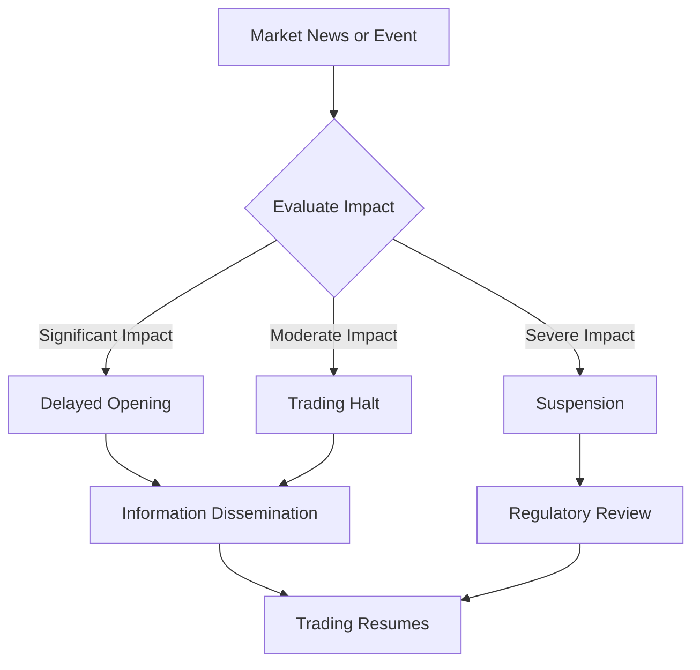

## 12.7 Temporary Interruptions of Trading

In the dynamic world of securities trading, temporary interruptions can occur due to various reasons, impacting how securities are bought and sold on exchanges. Understanding these interruptions is crucial for investors, traders, and financial professionals navigating the Canadian financial landscape. This section delves into the different types of temporary interruptions, their causes, and their implications for market participants.

### Understanding Temporary Interruptions

Temporary interruptions in trading are mechanisms used by exchanges to maintain orderly markets and protect investors. These interruptions can take several forms, including delayed openings, trading halts, and suspensions. Each serves a specific purpose and is implemented under particular circumstances.

#### Delayed Opening

A delayed opening occurs when the start of trading for a specific security is postponed. This delay is typically implemented to manage high trading volumes or to allow for the dissemination of significant information that could impact the security's price. For example, if a major Canadian company like RBC announces a significant merger or acquisition before the market opens, the exchange might delay the opening of trading for RBC's shares to ensure that all market participants have time to digest the news.

**Example Scenario:**

Imagine a scenario where a Canadian technology firm announces a groundbreaking new product just before the market opens. The exchange may delay the opening of trading for this firm's shares to allow investors to assess the news and adjust their trading strategies accordingly. This helps prevent erratic price movements and ensures a fair trading environment.

#### Halt in Trading

A halt in trading is a temporary suspension of trading in a security, often due to significant news or events that could drastically affect the security's price. Trading halts are typically short-term and are used to provide time for the dissemination of important information, allowing investors to make informed decisions.

**Case Study:**

Consider a situation where a major Canadian bank, such as TD, experiences a significant cybersecurity breach. The exchange might halt trading of TD's shares to allow the bank to release a detailed statement about the breach and its potential impact. This pause gives investors time to evaluate the situation and prevents panic selling based on incomplete information.

#### Suspension

Suspensions are more severe than trading halts and involve a longer-term cessation of trading in a security. Suspensions can occur due to regulatory issues, such as non-compliance with exchange rules, or financial distress within the company. Unlike halts, suspensions can last for an extended period, sometimes until the underlying issues are resolved.

**Practical Example:**

A Canadian mining company facing financial difficulties might have its shares suspended from trading if it fails to meet the exchange's listing requirements. This suspension protects investors from trading in a potentially unstable security and gives the company time to address its financial issues.

### Regulatory Framework and Best Practices

In Canada, the Canadian Securities Administrators (CSA) and individual provincial regulators oversee the implementation of trading interruptions. These bodies ensure that interruptions are used appropriately to maintain market integrity and protect investors.

**Best Practices for Investors:**

1. **Stay Informed:** Keep abreast of news and announcements related to your investments. Understanding the reasons behind trading interruptions can help you make informed decisions.

2. **Diversify Your Portfolio:** Diversification can mitigate the impact of trading interruptions on your overall investment strategy.

3. **Monitor Regulatory Announcements:** Pay attention to announcements from regulatory bodies and exchanges, as these can provide insights into potential trading interruptions.

4. **Use Limit Orders:** Consider using limit orders to manage your trades during volatile periods, ensuring that you buy or sell securities at your desired price.

### Visualizing Trading Interruptions

Below is a diagram illustrating the process and decision points involved in implementing a trading interruption.

### Challenges and Considerations

While trading interruptions are essential for maintaining market stability, they can pose challenges for investors and traders. Understanding these challenges and adopting strategies to mitigate them is crucial.

**Common Challenges:**

- **Market Uncertainty:** Interruptions can create uncertainty, leading to volatility once trading resumes.
- **Liquidity Issues:** During interruptions, investors may face difficulties in executing trades, impacting liquidity.
- **Information Asymmetry:** Not all investors may have access to the same information during interruptions, leading to potential disparities in decision-making.

**Strategies to Overcome Challenges:**

- **Enhance Communication:** Ensure clear communication with financial advisors and brokers during interruptions.
- **Utilize Technology:** Leverage financial tools and platforms to access real-time information and analytics.
- **Educate Yourself:** Continuously educate yourself about market mechanisms and regulatory frameworks.

### Conclusion

Temporary interruptions of trading are vital tools for maintaining orderly markets and protecting investors. By understanding the different types of interruptions and their implications, investors can navigate the Canadian securities landscape more effectively. Staying informed, diversifying portfolios, and leveraging technology are key strategies for managing the challenges associated with trading interruptions.

### **Ready to Test Your Knowledge?**

**Practice 10 Essential CSC Exam Questions to Master Your Certification**



### What is a delayed opening in the context of securities trading?

- [x] A postponement of the market opening for a specific security to manage trading volumes.
- [ ] A permanent closure of the market for a specific security.
- [ ] A temporary suspension of trading due to regulatory issues.
- [ ] An extension of trading hours for a specific security.

> **Explanation:** A delayed opening is a temporary postponement of the market opening for a specific security, often to manage high trading volumes or allow for the dissemination of significant information.

### What is the primary purpose of a trading halt?

- [x] To provide time for the dissemination of important information.
- [ ] To permanently suspend trading in a security.
- [ ] To extend trading hours for a specific security.
- [ ] To reduce trading volumes.

> **Explanation:** A trading halt is a temporary suspension of trading in a security, often to allow time for the dissemination of important information, enabling investors to make informed decisions.

### Which regulatory body oversees trading interruptions in Canada?

- [x] Canadian Securities Administrators (CSA)
- [ ] Securities and Exchange Commission (SEC)
- [ ] Financial Conduct Authority (FCA)
- [ ] European Securities and Markets Authority (ESMA)

> **Explanation:** The Canadian Securities Administrators (CSA) oversee trading interruptions in Canada, ensuring they are used appropriately to maintain market integrity.

### What is a suspension in securities trading?

- [x] A longer-term cessation of trading in a security due to regulatory issues or financial distress.
- [ ] A temporary postponement of the market opening for a specific security.
- [ ] An extension of trading hours for a specific security.
- [ ] A temporary suspension of trading due to significant news.

> **Explanation:** A suspension is a longer-term cessation of trading in a security, often due to regulatory issues or financial distress within the company.

### How can investors mitigate the impact of trading interruptions?

- [x] Diversify their portfolio.
- [ ] Focus on a single security.
- [ ] Avoid using limit orders.
- [ ] Ignore regulatory announcements.

> **Explanation:** Diversifying a portfolio can help mitigate the impact of trading interruptions by spreading risk across different securities.

### What might cause a delayed opening for a security?

- [x] Significant news or events impacting the security's price.
- [ ] A lack of trading interest in the security.
- [ ] A routine market update.
- [ ] A minor price fluctuation.

> **Explanation:** A delayed opening is often caused by significant news or events that could impact the security's price, requiring time for information dissemination.

### What is a common challenge associated with trading interruptions?

- [x] Market uncertainty and volatility.
- [ ] Increased liquidity.
- [ ] Guaranteed price stability.
- [ ] Enhanced trading volumes.

> **Explanation:** Trading interruptions can create market uncertainty and volatility, leading to potential challenges for investors.

### What strategy can help investors manage challenges during trading interruptions?

- [x] Enhance communication with financial advisors.
- [ ] Focus solely on short-term gains.
- [ ] Ignore market news and events.
- [ ] Avoid using technology.

> **Explanation:** Enhancing communication with financial advisors can help investors manage challenges during trading interruptions by providing guidance and insights.

### What is the role of the Canadian Securities Administrators (CSA) in trading interruptions?

- [x] To oversee the implementation of trading interruptions and ensure market integrity.
- [ ] To execute trades on behalf of investors.
- [ ] To provide financial advice to individual investors.
- [ ] To manage the financial portfolios of Canadian citizens.

> **Explanation:** The CSA oversees the implementation of trading interruptions, ensuring they are used appropriately to maintain market integrity and protect investors.

### True or False: A trading halt is a permanent suspension of trading in a security.

- [ ] True
- [x] False

> **Explanation:** False. A trading halt is a temporary suspension of trading in a security, often due to significant news or events, and is not permanent.


