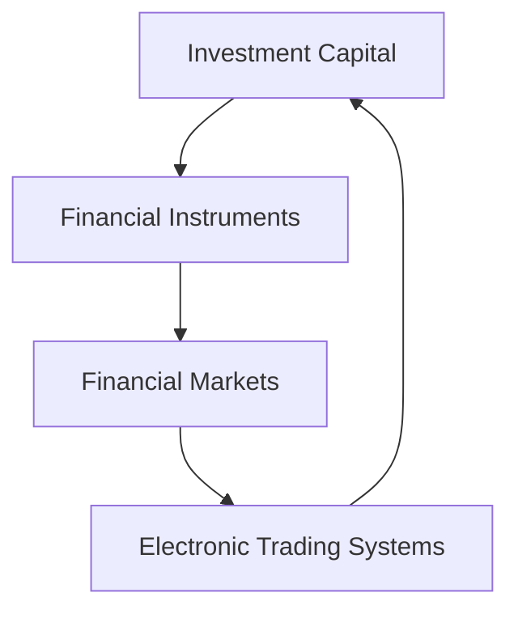

## 2.1 Chapter Overview

Welcome to Chapter 2 of the CSC® Exam Prep Guide: Volume 1, where we delve into the intricate world of the capital market. This chapter serves as a cornerstone for understanding how investment capital flows through financial markets, the role of various financial instruments, and the impact of electronic trading systems. By the end of this chapter, you will have a comprehensive understanding of these elements and how they interconnect within the Canadian financial landscape.

### Understanding the Scope of the Chapter

#### Key Topics Covered

1. **Investment Capital**: We will explore the sources and uses of investment capital, focusing on how capital is raised and allocated within the market. This includes an examination of equity and debt financing, and the role of investors in providing capital to businesses and governments.

2. **Financial Instruments**: This section will cover the various types of financial instruments, such as stocks, bonds, and derivatives. We will discuss their characteristics, how they are used in investment strategies, and their significance in the capital market.

3. **Financial Markets**: We will analyze the structure and function of financial markets, including primary and secondary markets. The focus will be on how these markets facilitate the transfer of capital and the role of market participants.

4. **Electronic Trading Systems**: The chapter will also address the evolution of trading systems, highlighting the shift from traditional floor trading to electronic platforms. We will discuss the advantages and challenges of electronic trading, including speed, transparency, and accessibility.

#### Primary Objectives and Learning Outcomes

By the end of this chapter, you should be able to:

- Describe the flow of investment capital and its impact on the economy.
- Identify and differentiate between various financial instruments and their uses.
- Understand the structure and function of financial markets, including the roles of different participants.
- Explain the workings of electronic trading systems and their influence on market dynamics.

#### Interrelation of Content Areas

Each section of this chapter builds upon the previous one, creating a cohesive understanding of the capital market. Investment capital is the lifeblood of financial markets, and financial instruments are the vehicles through which capital is deployed. Financial markets provide the infrastructure for trading these instruments, while electronic trading systems enhance the efficiency and reach of these markets.

### Theoretical Concepts and Practical Applications

While theoretical knowledge is essential, this chapter emphasizes practical applications. We will use real-world examples and case studies to illustrate key concepts. For instance, we will examine how Canadian pension funds allocate assets across different financial instruments and the impact of electronic trading on the Toronto Stock Exchange (TSX).

### Glossary

- **Capital Market**: A financial market in which long-term debt or equity-backed securities are bought and sold. It plays a crucial role in channeling savings and investment in the economy.
  
- **Financial Markets**: Markets where financial instruments are traded, facilitating the transfer of capital between investors and users. These include stock exchanges, bond markets, and derivatives markets.

### Practical Examples and Case Studies

#### Example: Canadian Pension Funds

Canadian pension funds, such as the Canada Pension Plan Investment Board (CPPIB), are significant players in the capital market. They invest in a diverse range of financial instruments, including equities, fixed income, and alternative assets. By analyzing their investment strategies, we can gain insights into asset allocation and risk management practices.

#### Case Study: Electronic Trading on the TSX

The Toronto Stock Exchange has embraced electronic trading, which has transformed how securities are bought and sold. This case study will explore the benefits of electronic trading, such as increased liquidity and reduced transaction costs, while also addressing challenges like algorithmic trading and market volatility.

### Diagrams and Visual Aids

To enhance your understanding, we will use diagrams to illustrate concepts such as the flow of investment capital, the structure of financial markets, and the process of electronic trading.

### Best Practices and Common Pitfalls

#### Best Practices

- **Diversification**: Spread investments across various financial instruments to mitigate risk.
- **Due Diligence**: Conduct thorough research before investing in any financial instrument.
- **Regulatory Compliance**: Ensure adherence to Canadian financial regulations to avoid legal issues.

#### Common Pitfalls

- **Overconcentration**: Avoid putting too much capital into a single investment.
- **Market Timing**: Attempting to time the market can lead to significant losses.
- **Ignoring Fees**: Be aware of transaction costs and management fees, which can erode returns.

### Encouraging Critical Thinking and Continuous Learning

As you progress through this chapter, consider how the concepts apply to your own financial decisions. Analyze your investment portfolio's asset allocation or evaluate the impact of Canadian tax laws on your investment returns. Engage with additional resources, such as official Canadian financial regulations and open-source financial tools, to deepen your understanding.

### Summary

In summary, this chapter provides a comprehensive overview of the capital market, focusing on investment capital, financial instruments, financial markets, and electronic trading systems. By understanding these elements, you will be better equipped to navigate the Canadian financial landscape and make informed investment decisions.

## Quiz Time!



### What is the primary function of the capital market?

- [x] To facilitate the buying and selling of long-term debt and equity-backed securities
- [ ] To provide short-term loans to businesses
- [ ] To regulate financial institutions
- [ ] To manage government budgets

> **Explanation:** The capital market is primarily responsible for facilitating the buying and selling of long-term debt and equity-backed securities, which helps in channeling savings and investments in the economy.

### Which of the following is a characteristic of financial markets?

- [x] They facilitate the transfer of capital between investors and users
- [ ] They only deal with short-term financial instruments
- [ ] They are exclusively for government securities
- [ ] They operate independently of economic conditions

> **Explanation:** Financial markets facilitate the transfer of capital between investors and users, allowing for the trading of various financial instruments.

### What is a key advantage of electronic trading systems?

- [x] Increased liquidity and reduced transaction costs
- [ ] Limited access to market data
- [ ] Higher transaction fees
- [ ] Slower execution times

> **Explanation:** Electronic trading systems offer increased liquidity and reduced transaction costs, making trading more efficient and accessible.

### What is a common pitfall in investment strategies?

- [x] Overconcentration in a single investment
- [ ] Diversifying across multiple asset classes
- [ ] Conducting due diligence
- [ ] Following regulatory compliance

> **Explanation:** Overconcentration in a single investment can lead to significant risk, as it lacks diversification.

### How do Canadian pension funds typically manage risk?

- [x] By diversifying investments across various financial instruments
- [ ] By investing solely in equities
- [x] By conducting thorough research and analysis
- [ ] By avoiding alternative assets

> **Explanation:** Canadian pension funds manage risk by diversifying investments across various financial instruments and conducting thorough research and analysis.

### What role do financial instruments play in the capital market?

- [x] They are vehicles through which capital is deployed
- [ ] They are used solely for speculative purposes
- [ ] They have no impact on investment strategies
- [ ] They are only traded in primary markets

> **Explanation:** Financial instruments are vehicles through which capital is deployed, playing a crucial role in investment strategies and the capital market.

### What is a benefit of diversification in investment?

- [x] Mitigating risk by spreading investments
- [ ] Increasing exposure to a single asset class
- [x] Enhancing potential returns through varied investments
- [ ] Reducing the number of investment options

> **Explanation:** Diversification helps mitigate risk by spreading investments across different asset classes and can enhance potential returns through varied investments.

### What is the impact of electronic trading on market dynamics?

- [x] It increases market efficiency and transparency
- [ ] It decreases the speed of transactions
- [ ] It limits access to international markets
- [ ] It raises transaction costs

> **Explanation:** Electronic trading increases market efficiency and transparency by providing faster execution and broader access to market data.

### What is the significance of regulatory compliance in financial markets?

- [x] It ensures adherence to legal standards and protects investors
- [ ] It is optional for large institutions
- [ ] It only applies to international markets
- [ ] It has no impact on market stability

> **Explanation:** Regulatory compliance ensures adherence to legal standards, protecting investors and maintaining market stability.

### True or False: Financial markets operate independently of economic conditions.

- [ ] True
- [x] False

> **Explanation:** Financial markets are influenced by economic conditions, as they reflect the supply and demand for capital and investment opportunities.


