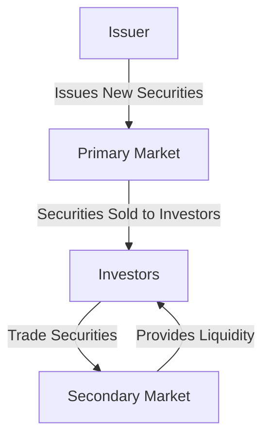

## 2.12 Primary and Secondary Markets

In the world of finance, understanding the distinction between primary and secondary markets is crucial for anyone involved in securities trading and investment. These markets form the backbone of the financial system, facilitating the flow of capital and enabling investors to buy and sell securities. This section delves into the intricacies of these markets, focusing on their roles, processes, and the regulatory framework within the Canadian context.

### Understanding Primary Markets

The primary market is where new securities are created and sold for the first time. It is the platform through which issuers, such as corporations or governments, raise capital by issuing new stocks or bonds. The most common method of issuing new securities in the primary market is through an Initial Public Offering (IPO).

#### Initial Public Offering (IPO)

An IPO is the process by which a private company offers its shares to the public for the first time. This transition from a private to a public entity allows the company to raise significant capital to fund expansion, pay off debt, or invest in new projects. The IPO process involves several steps:

1. **Preparation and Planning:** The company must prepare financial statements, business plans, and other documentation to comply with regulatory requirements. This often involves hiring investment banks to underwrite the offering.

2. **Regulatory Approval:** In Canada, the company must file a prospectus with the Canadian Securities Administrators (CSA) and receive approval before proceeding with the IPO.

3. **Pricing and Marketing:** The underwriters determine the initial price of the shares based on demand and market conditions. A roadshow is conducted to attract potential investors.

4. **Issuance:** Once the shares are priced, they are offered to the public through the stock exchange, such as the Toronto Stock Exchange (TSX).

#### Role of Issuers in the Primary Market

Issuers play a critical role in the primary market. They are responsible for providing accurate and comprehensive information about the securities being offered. This transparency is essential for maintaining investor confidence and ensuring compliance with regulatory standards.

### Exploring Secondary Markets

Once securities are issued in the primary market, they are traded among investors in the secondary market. The secondary market provides liquidity, enabling investors to buy and sell securities without affecting the issuing company directly. This market includes stock exchanges like the TSX and over-the-counter (OTC) markets.

#### Trading in the Secondary Market

In the secondary market, securities are traded between investors. The issuing company does not receive any proceeds from these transactions. Instead, the market facilitates price discovery and provides a platform for investors to realize gains or losses on their investments.

- **Stock Exchanges:** These are centralized platforms where securities are listed and traded. The TSX is a prominent example in Canada, offering a regulated environment for trading.

- **Over-the-Counter (OTC) Markets:** These are decentralized markets where trading occurs directly between parties. OTC markets often involve securities not listed on formal exchanges.

#### Role of Investors in the Secondary Market

Investors in the secondary market are primarily concerned with buying and selling securities to achieve their financial goals. They rely on market information, analysis, and trends to make informed decisions. The secondary market's liquidity and efficiency are crucial for investor confidence and market stability.

### Regulatory Framework and Institutions

The Canadian financial system is governed by a robust regulatory framework designed to protect investors and ensure market integrity. Key institutions include:

- **Canadian Securities Administrators (CSA):** A national organization that coordinates securities regulation across Canada.

- **Investment Industry Regulatory Organization of Canada (IIROC):** Oversees investment dealers and trading activity on debt and equity marketplaces in Canada.

- **Toronto Stock Exchange (TSX):** The primary stock exchange in Canada, providing a platform for trading securities.

### Practical Examples and Case Studies

To illustrate the concepts discussed, consider the IPO of a major Canadian company like Shopify. In 2015, Shopify went public on the TSX, raising significant capital to fuel its growth. This IPO process involved regulatory compliance, pricing strategies, and marketing efforts to attract investors.

In the secondary market, consider the trading of shares of a Canadian bank like RBC. Investors buy and sell RBC shares on the TSX, influenced by factors such as economic conditions, interest rates, and company performance.

### Diagrams and Visual Aids

Below is a diagram illustrating the flow of securities from the primary to the secondary market:

### Best Practices and Common Challenges

**Best Practices:**
- For issuers, maintaining transparency and compliance with regulatory requirements is crucial.
- Investors should conduct thorough research and analysis before participating in IPOs or trading in the secondary market.

**Common Challenges:**
- Market volatility can impact the pricing and success of IPOs.
- Investors may face challenges in assessing the true value of securities in the secondary market.

### Additional Resources

For further exploration, consider the following resources:

- **Books:** *"Investment Banking: Valuation, Leveraged Buyouts, and Mergers and Acquisitions"* by Joshua Rosenbaum and Joshua Pearl
- **Articles:** "Primary vs. Secondary Markets" - [Investopedia](https://www.investopedia.com/ask/answers/042215/what-difference-between-primary-and-secondary-market.asp)

### Summary

Understanding the primary and secondary markets is essential for navigating the financial landscape. These markets play a pivotal role in capital formation and investment, providing opportunities for issuers and investors alike. By grasping the processes, roles, and regulations involved, you can make informed decisions and effectively participate in the Canadian financial system.

### **Ready to Test Your Knowledge?**

**Practice 10 Essential CSC Exam Questions to Master Your Certification**



### What is the primary market?

- [x] A market where new securities are issued and sold for the first time
- [ ] A market where existing securities are traded among investors
- [ ] A market for trading commodities
- [ ] A market for foreign exchange

> **Explanation:** The primary market is where new securities are created and sold for the first time, allowing issuers to raise capital.

### What is an IPO?

- [x] The first sale of a company's shares to the public
- [ ] A secondary market transaction
- [ ] A type of bond issuance
- [ ] A government auction

> **Explanation:** An IPO, or Initial Public Offering, is the process by which a private company offers its shares to the public for the first time.

### What role do issuers play in the primary market?

- [x] They provide securities to investors
- [ ] They trade securities among themselves
- [ ] They regulate the market
- [ ] They provide liquidity

> **Explanation:** Issuers create and sell new securities in the primary market to raise capital.

### What is the secondary market?

- [x] A market where existing securities are traded among investors
- [ ] A market for issuing new securities
- [ ] A market for trading commodities
- [ ] A market for foreign exchange

> **Explanation:** The secondary market is where existing securities are traded among investors, providing liquidity and price discovery.

### Which of the following is a key institution in the Canadian financial system?

- [x] Canadian Securities Administrators (CSA)
- [ ] Federal Reserve
- [x] Investment Industry Regulatory Organization of Canada (IIROC)
- [ ] European Central Bank

> **Explanation:** The CSA and IIROC are key institutions in Canada, overseeing securities regulation and trading activities.

### What is the role of investors in the secondary market?

- [x] To buy and sell securities to achieve financial goals
- [ ] To issue new securities
- [ ] To regulate the market
- [ ] To provide underwriting services

> **Explanation:** Investors in the secondary market buy and sell securities to achieve their financial objectives.

### What is a common challenge in the primary market?

- [x] Market volatility affecting IPO pricing
- [ ] Lack of liquidity
- [x] Regulatory compliance
- [ ] High transaction costs

> **Explanation:** Market volatility can impact the pricing and success of IPOs, and issuers must comply with regulatory requirements.

### What is the Toronto Stock Exchange (TSX)?

- [x] A primary stock exchange in Canada
- [ ] A regulatory body
- [ ] A government agency
- [ ] A financial advisory firm

> **Explanation:** The TSX is a primary stock exchange in Canada, providing a platform for trading securities.

### What is the purpose of a roadshow in an IPO?

- [x] To attract potential investors
- [ ] To finalize the IPO pricing
- [ ] To comply with regulatory requirements
- [ ] To issue new bonds

> **Explanation:** A roadshow is conducted to attract potential investors and generate interest in the IPO.

### True or False: The issuing company receives proceeds from transactions in the secondary market.

- [ ] True
- [x] False

> **Explanation:** In the secondary market, the issuing company does not receive proceeds from transactions; these occur between investors.


