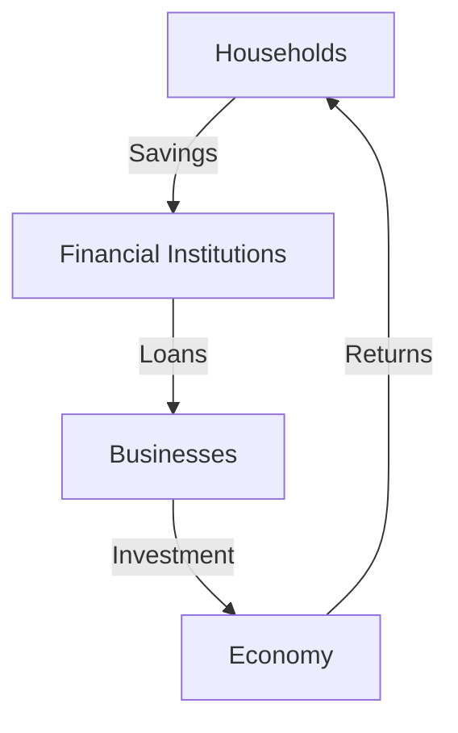

## 2.2 Learning Objectives

In this section, we delve into the critical learning objectives that will guide your understanding of the capital markets, focusing on the role of investment capital, the types of financial instruments, the operation of financial markets, and the mechanisms of electronic trading. By mastering these objectives, you will be well-equipped to navigate the complexities of the Canadian financial landscape and apply your knowledge to real-world scenarios.

### Identify Key Learning Goals

#### Describe the Role of Investment Capital in the Economy

Investment capital is the lifeblood of economic growth and development. It serves as the fuel that powers businesses, governments, and individuals to achieve their financial goals. Understanding the supply and use of investment capital is crucial for any finance professional. 

- **Supply of Investment Capital:** Investment capital is sourced from savings, retained earnings, and external financing. In Canada, this includes contributions to Registered Retirement Savings Plans (RRSPs) and Tax-Free Savings Accounts (TFSAs), which provide tax-advantaged ways for individuals to save and invest.

- **Use of Investment Capital:** Businesses use investment capital to fund operations, expand production, and innovate. Governments invest in infrastructure and public services, while individuals invest in education, housing, and retirement savings.

**Example:** Consider a Canadian pension fund investing in infrastructure projects. The fund allocates capital to build roads and bridges, which in turn stimulates economic activity by creating jobs and improving transportation efficiency.

#### Differentiate Between Types of Financial Instruments

Financial instruments are the vehicles through which capital is transferred and invested. They vary in terms of risk, return, and liquidity.

- **Equity Instruments:** Represent ownership in a company, such as stocks. Investors earn returns through dividends and capital appreciation.

- **Debt Instruments:** Represent a loan made by an investor to a borrower, such as bonds. Investors earn returns through interest payments.

- **Derivative Instruments:** Financial contracts whose value is derived from an underlying asset, such as options and futures. They are used for hedging and speculative purposes.

**Example:** A Canadian investor might purchase shares of RBC (Royal Bank of Canada) to gain exposure to the financial sector, while also buying government bonds to balance risk with stable income.

#### Describe the Distinguishing Features and Operation of Financial Markets

Financial markets facilitate the buying and selling of financial instruments. They are categorized into primary and secondary markets.

- **Primary Markets:** Where new securities are issued and sold for the first time. Companies raise capital through initial public offerings (IPOs).

- **Secondary Markets:** Where existing securities are traded among investors. The Toronto Stock Exchange (TSX) is a prominent secondary market in Canada.

**Example:** When Shopify, a Canadian e-commerce company, went public, it issued shares in the primary market. These shares are now traded on the TSX, a secondary market.

#### Understand the Mechanisms and Platforms Facilitating Electronic Trading

Electronic trading platforms have revolutionized how securities are bought and sold, offering speed, efficiency, and transparency.

- **Equity Markets:** Platforms like the TSX and TSX Venture Exchange provide electronic trading services for stocks.

- **Fixed-Income Markets:** Platforms such as CanDeal facilitate electronic trading of bonds and other fixed-income securities.

**Example:** An investor using an online brokerage account can execute trades on the TSX in real-time, benefiting from lower transaction costs and immediate order execution.

### Align Study Strategies

To achieve these learning objectives, it is essential to develop effective study strategies that incorporate a variety of resources and techniques.

- **Develop Targeted Study Plans:** Break down each learning objective into manageable sections and allocate time to study each part thoroughly.

- **Utilize Resources:** Leverage textbooks, online courses, and financial news outlets to gain a comprehensive understanding of capital markets.

- **Engage in Active Learning:** Summarize key points, create mind maps, and discuss concepts with peers to reinforce understanding.

- **Apply to Real-World Scenarios:** Analyze case studies and simulate investment decisions to apply theoretical knowledge to practical situations.

### Glossary

- **Investment Advisor:** A professional who provides financial services and advice to clients regarding investments. They help clients develop investment strategies and manage portfolios.

### Visual Aids

To enhance your understanding, consider the following diagram illustrating the flow of investment capital in the economy:

This diagram shows how households provide savings to financial institutions, which in turn lend to businesses. Businesses invest in the economy, generating returns that flow back to households.

## Quiz Time!



### What is the primary role of investment capital in the economy?

- [x] To fuel economic growth and development
- [ ] To increase government debt
- [ ] To reduce consumer spending
- [ ] To limit business expansion

> **Explanation:** Investment capital is essential for economic growth as it funds business operations, infrastructure, and innovation.

### Which of the following is an example of an equity instrument?

- [x] Stocks
- [ ] Bonds
- [ ] Options
- [ ] Futures

> **Explanation:** Stocks represent ownership in a company and are classified as equity instruments.

### What distinguishes primary markets from secondary markets?

- [x] Primary markets involve the issuance of new securities, while secondary markets involve trading existing securities.
- [ ] Primary markets are for government bonds only, while secondary markets are for corporate bonds.
- [ ] Primary markets are less regulated than secondary markets.
- [ ] Secondary markets are only for derivative instruments.

> **Explanation:** Primary markets deal with new securities, while secondary markets facilitate trading among investors.

### What is a key feature of electronic trading platforms?

- [x] They offer speed, efficiency, and transparency in trading.
- [ ] They are only available to institutional investors.
- [ ] They require physical presence on the trading floor.
- [ ] They are limited to equity markets only.

> **Explanation:** Electronic trading platforms provide fast and efficient trading with transparency, accessible to a wide range of investors.

### Which platform is known for electronic trading of fixed-income securities in Canada?

- [x] CanDeal
- [ ] TSX
- [ ] NASDAQ
- [ ] NYSE

> **Explanation:** CanDeal is a platform that facilitates electronic trading of bonds and other fixed-income securities in Canada.

### How can investors balance risk in their portfolios?

- [x] By diversifying investments across different asset classes
- [ ] By investing only in high-risk stocks
- [ ] By avoiding bonds altogether
- [ ] By focusing solely on short-term gains

> **Explanation:** Diversification across asset classes helps balance risk and achieve a more stable portfolio.

### What is the role of an investment advisor?

- [x] To provide financial services and advice to clients regarding investments
- [ ] To manage government budgets
- [ ] To regulate financial markets
- [ ] To issue new securities

> **Explanation:** Investment advisors help clients develop strategies and manage investment portfolios.

### What is a derivative instrument?

- [x] A financial contract whose value is derived from an underlying asset
- [ ] A direct ownership stake in a company
- [ ] A type of government bond
- [ ] A form of cash deposit

> **Explanation:** Derivatives derive their value from underlying assets like stocks, bonds, or commodities.

### Which account type in Canada offers tax-advantaged savings?

- [x] RRSP
- [ ] Checking account
- [ ] Savings account
- [ ] Credit card account

> **Explanation:** RRSPs offer tax advantages for retirement savings in Canada.

### True or False: The TSX is a primary market.

- [ ] True
- [x] False

> **Explanation:** The TSX is a secondary market where existing securities are traded among investors.



By mastering these learning objectives, you will be well-prepared to understand and engage with the capital markets, making informed decisions that align with your financial goals and regulatory requirements.
