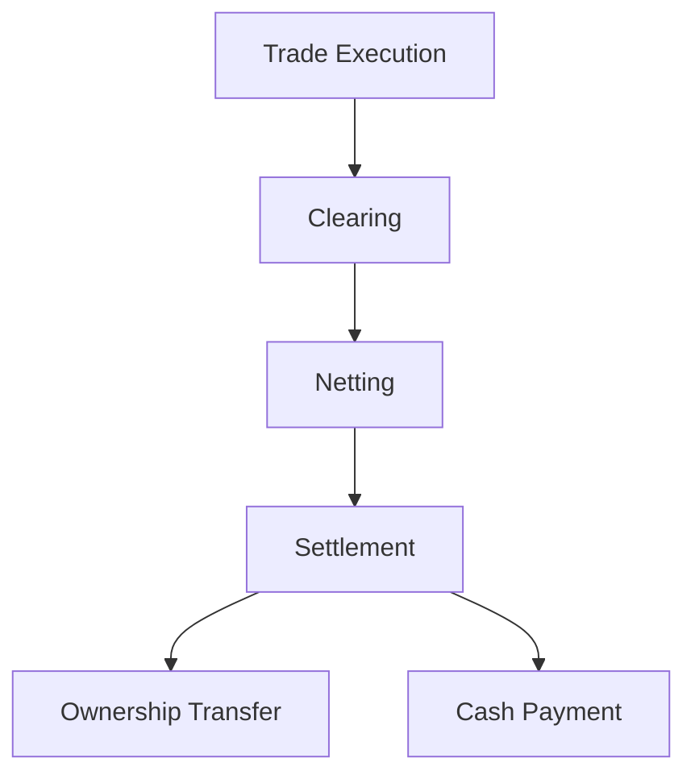

## 2.20 Clearing and Settlement in Financial Markets

In the intricate world of financial markets, the processes of clearing and settlement are fundamental to ensuring that transactions are executed smoothly and efficiently. These processes are critical for maintaining market stability and confidence among participants. In this section, we will delve into the mechanisms of clearing and settlement, the role of CDS Clearing and Depository Services in Canada, and the concept of netting, which plays a pivotal role in reducing settlement risks.

### Understanding Clearing and Settlement

**Clearing** is the process of reconciling and confirming trade details between parties involved in a transaction. This involves verifying the transaction details, such as the number of securities, the price, and the parties involved. Clearing ensures that both parties agree on the terms of the trade before proceeding to the next step.

**Settlement**, on the other hand, is the final exchange of securities and cash to complete a transaction. It involves the actual transfer of ownership of the securities from the seller to the buyer and the corresponding payment from the buyer to the seller. Settlement marks the conclusion of a trade and is crucial for the integrity of financial markets.

### The Role of CDS Clearing and Depository Services

In Canada, CDS Clearing and Depository Services (CDS) plays a central role in the clearing and settlement of securities transactions. As the primary clearinghouse, CDS ensures that trades are settled efficiently and accurately. It acts as an intermediary between buyers and sellers, reducing the risk of default by guaranteeing the completion of transactions.

CDS provides a range of services, including:

- **Trade Matching and Confirmation:** Ensuring that trade details are accurately matched and confirmed between parties.
- **Netting Services:** Reducing the number of settlements required by offsetting multiple transactions.
- **Custody and Asset Servicing:** Safeguarding securities and managing corporate actions such as dividends and interest payments.

For more information on CDS and its services, visit [CDS Clearing and Depository Services](https://www.cds.ca/).

### The Concept of Netting

**Netting** is a process that offsets multiple transactions to minimize the number of settlements required. By aggregating trades and calculating the net obligation of each participant, netting significantly reduces the volume of transactions that need to be settled. This not only enhances efficiency but also reduces settlement risk, which is the risk that one party will fail to deliver on its obligations.

Netting offers several benefits:

- **Reduced Settlement Risk:** By decreasing the number of transactions, netting lowers the risk of default by any single party.
- **Increased Efficiency:** Fewer transactions mean lower operational costs and faster settlement times.
- **Improved Liquidity:** Participants can manage their cash and securities more effectively, freeing up resources for other investments.

### Importance of Accurate and Efficient Settlement Processes

Accurate and efficient settlement processes are vital for market stability. They ensure that trades are completed on time and that the risk of default is minimized. This reliability fosters trust among market participants, encouraging more active trading and investment.

Inaccurate or delayed settlements can lead to significant financial losses and undermine confidence in the financial system. Therefore, robust clearing and settlement mechanisms are essential for the smooth functioning of capital markets.

### Practical Example: A Canadian Pension Fund

Consider a Canadian pension fund that invests in a diversified portfolio of equities and fixed-income securities. Efficient clearing and settlement processes are crucial for the fund to manage its investments effectively. By utilizing netting services provided by CDS, the fund can reduce the number of transactions it needs to settle, thereby minimizing operational costs and enhancing liquidity.

### Diagram: Clearing and Settlement Process

Below is a simplified diagram illustrating the clearing and settlement process:

### Best Practices and Common Challenges

**Best Practices:**

- **Timely Reconciliation:** Regularly reconcile trade details to ensure accuracy.
- **Leverage Technology:** Use advanced software solutions to automate clearing and settlement processes.
- **Risk Management:** Implement robust risk management frameworks to mitigate settlement risks.

**Common Challenges:**

- **Operational Risks:** Errors in trade details can lead to settlement failures.
- **Market Volatility:** Sudden market changes can impact settlement processes.
- **Regulatory Compliance:** Adhering to evolving regulations requires constant vigilance.

### References and Additional Resources

- **Institutions:** [CDS Clearing and Depository Services](https://www.cds.ca/)
- **Books:** *"Securities Clearing"* by Paul P. Jacobsen
- **Articles:** "Understanding Clearing and Settlement" - [Investopedia](https://www.investopedia.com/terms/c/clearing.asp)

### Encouragement for Further Exploration

Understanding clearing and settlement processes is crucial for anyone involved in financial markets. By mastering these concepts, you can enhance your ability to manage investments effectively and contribute to market stability. Consider exploring additional resources and staying informed about regulatory changes to deepen your knowledge.

### **Ready to Test Your Knowledge?**

**Practice 10 Essential CSC Exam Questions to Master Your Certification**



### What is the primary role of clearing in financial transactions?

- [x] Reconciling and confirming trade details between parties
- [ ] Executing trades on the stock exchange
- [ ] Transferring ownership of securities
- [ ] Calculating dividends and interest payments

> **Explanation:** Clearing involves reconciling and confirming trade details to ensure both parties agree on the terms before settlement.

### What does settlement involve in financial markets?

- [x] The final exchange of securities and cash
- [ ] The initial negotiation of trade terms
- [ ] The calculation of net obligations
- [ ] The issuance of new securities

> **Explanation:** Settlement is the process of exchanging securities and cash to complete a transaction.

### How does netting benefit financial transactions?

- [x] Reduces the number of settlements required
- [x] Minimizes settlement risk
- [ ] Increases the number of trades
- [ ] Complicates the clearing process

> **Explanation:** Netting offsets multiple transactions, reducing the number of settlements and minimizing risk.

### Which organization is responsible for clearing and settlement in Canada?

- [x] CDS Clearing and Depository Services
- [ ] Bank of Canada
- [ ] Toronto Stock Exchange
- [ ] Canadian Securities Administrators

> **Explanation:** CDS Clearing and Depository Services is the primary clearinghouse in Canada.

### What is a key benefit of efficient settlement processes?

- [x] Market stability
- [ ] Increased transaction costs
- [ ] Longer settlement times
- [ ] Higher default risk

> **Explanation:** Efficient settlement processes ensure timely completion of trades, contributing to market stability.

### What is the main function of CDS in the Canadian financial market?

- [x] Ensuring trades are settled efficiently and accurately
- [ ] Issuing new securities
- [ ] Regulating financial markets
- [ ] Providing investment advice

> **Explanation:** CDS acts as an intermediary to ensure efficient and accurate settlement of trades.

### Why is accurate reconciliation important in clearing?

- [x] To ensure trade details are correct
- [ ] To increase the number of trades
- [ ] To delay settlement processes
- [ ] To complicate the clearing process

> **Explanation:** Accurate reconciliation ensures that trade details are correct, preventing settlement failures.

### What is a common challenge in settlement processes?

- [x] Operational risks
- [ ] Increased liquidity
- [ ] Decreased transaction costs
- [ ] Simplified trade execution

> **Explanation:** Operational risks, such as errors in trade details, can lead to settlement failures.

### How can technology improve clearing and settlement processes?

- [x] By automating processes
- [ ] By increasing manual interventions
- [ ] By complicating trade details
- [ ] By delaying settlements

> **Explanation:** Technology can automate processes, reducing errors and increasing efficiency.

### True or False: Netting increases the number of settlements required.

- [ ] True
- [x] False

> **Explanation:** Netting reduces the number of settlements by offsetting multiple transactions.


