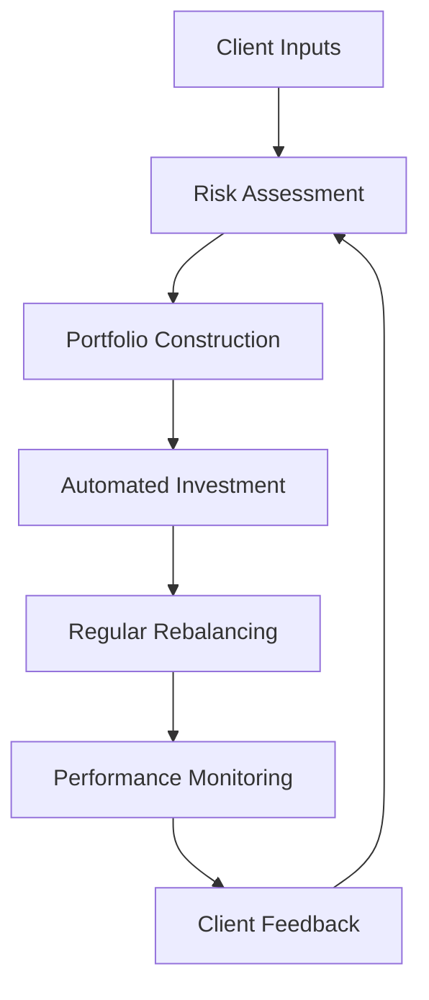

## 2.22 Robo-Advisors

In recent years, the financial landscape has been significantly transformed by technological advancements, particularly in the realm of investment management. One of the most notable innovations is the emergence of robo-advisors, which have democratized access to investment advice and portfolio management. This section delves into the concept of robo-advisors, their functionalities, growth in Canada, and their advantages and limitations compared to traditional investment advisors.

### Understanding Robo-Advisors

**Robo-Advisor**: An automated platform that provides financial planning services with minimal human intervention.

Robo-advisors are digital platforms that offer automated, algorithm-driven financial planning services with little to no human supervision. They collect information from clients about their financial situation and future goals through an online survey, and then use the data to offer advice and/or automatically invest client assets. The core of a robo-advisor's functionality is based on Modern Portfolio Theory, which aims to maximize returns for a given level of risk.

### Common Features and Functionalities

Robo-advisors typically offer a range of features that make them appealing to a broad audience:

1. **Automated Portfolio Management**: Utilizing algorithms, robo-advisors create and manage a diversified portfolio of Exchange-Traded Funds (ETFs) tailored to the client's risk tolerance and investment goals.

2. **Low Fees**: By minimizing human intervention, robo-advisors can offer their services at a fraction of the cost of traditional financial advisors.

3. **Accessibility**: With a user-friendly interface, robo-advisors are accessible to anyone with an internet connection, making investment management available to a wider audience.

4. **Tax Optimization**: Many robo-advisors offer tax-loss harvesting, a strategy to minimize taxes on investment gains.

5. **Regular Rebalancing**: Portfolios are automatically rebalanced to maintain the desired asset allocation, ensuring that the investment strategy remains aligned with the client's goals.

### Growth and Adoption in Canada

The adoption of robo-advisors in Canada has been robust, driven by a tech-savvy population and a growing demand for cost-effective investment solutions. Canadian robo-advisors like Wealthsimple, Nest Wealth, and Questrade have gained significant traction, offering tailored solutions that cater to the unique needs of Canadian investors, such as RRSPs and TFSAs.

The Canadian regulatory environment, overseen by the Canadian Securities Administrators (CSA) and the Investment Industry Regulatory Organization of Canada (IIROC), has provided a framework that supports the growth of robo-advisors while ensuring investor protection. This regulatory support has been crucial in building trust and encouraging adoption among Canadian investors.

### Advantages of Robo-Advisors

1. **Cost-Effectiveness**: Robo-advisors typically charge lower fees than traditional advisors, making them an attractive option for cost-conscious investors.

2. **Convenience**: The ability to manage investments online at any time provides unparalleled convenience for users.

3. **Transparency**: Robo-advisors often provide clear insights into fee structures and investment strategies, enhancing transparency.

4. **Accessibility for Beginners**: With low minimum investment requirements, robo-advisors are accessible to novice investors who may not have substantial capital to invest.

### Limitations of Robo-Advisors

1. **Lack of Personalization**: While robo-advisors offer automated solutions, they may lack the personalized touch and nuanced advice that a human advisor can provide.

2. **Limited Scope**: Robo-advisors primarily focus on investment management and may not offer comprehensive financial planning services, such as estate planning or tax advice.

3. **Algorithm Dependence**: The reliance on algorithms means that robo-advisors may not be able to react to market anomalies or unique client circumstances as effectively as a human advisor.

### Practical Example: Wealthsimple in Canada

Wealthsimple, one of Canada's leading robo-advisors, exemplifies the typical offerings of a robo-advisory service. It provides a range of investment portfolios composed of ETFs, tailored to different risk profiles. Wealthsimple also offers features like automatic rebalancing and tax-loss harvesting, making it a popular choice among Canadian investors seeking a hands-off investment approach.

### Visualizing the Robo-Advisor Process

Below is a simplified diagram illustrating the typical process flow of a robo-advisor:

### Best Practices and Common Pitfalls

**Best Practices:**
- Regularly review your investment goals and risk tolerance to ensure alignment with your robo-advisor's strategy.
- Take advantage of educational resources provided by robo-advisors to enhance your financial literacy.

**Common Pitfalls:**
- Over-reliance on automation without understanding the underlying investment strategy.
- Ignoring the importance of a diversified financial plan that includes more than just investment management.

### Further Exploration

For those interested in delving deeper into the world of robo-advisors, consider exploring the following resources:

- **Books:** *"The Robo-Advisor Handbook"* by Sergio M. Focardi
- **Articles:** "How Robo-Advisors Are Changing the Investment Landscape" - [Forbes](https://www.forbes.com/sites/forbestechcouncil/2021/04/06/how-robo-advisors-are-changing-the-investment-landscape/)
- **Online Courses:** [Coursera's Introduction to Robo-Advisors](https://www.coursera.org/learn/robo-advisors)

### Conclusion

Robo-advisors represent a significant shift in the investment management landscape, offering a cost-effective, convenient, and accessible alternative to traditional financial advisors. While they have their limitations, the advantages they offer make them a compelling choice for many investors, particularly those in Canada. As technology continues to evolve, the role of robo-advisors is likely to expand, further transforming how individuals manage their investments.

### **Ready to Test Your Knowledge?**

**Practice 10 Essential CSC Exam Questions to Master Your Certification**



### What is a robo-advisor?

- [x] An automated platform that provides financial planning services with minimal human intervention.
- [ ] A traditional financial advisor who uses technology.
- [ ] A manual investment management service.
- [ ] A type of mutual fund.

> **Explanation:** A robo-advisor is an automated platform that offers financial planning services using algorithms, with minimal human intervention.

### Which investment theory do robo-advisors primarily rely on?

- [x] Modern Portfolio Theory
- [ ] Efficient Market Hypothesis
- [ ] Behavioral Finance
- [ ] Arbitrage Pricing Theory

> **Explanation:** Robo-advisors primarily use Modern Portfolio Theory to construct portfolios that maximize returns for a given level of risk.

### What is a common feature of robo-advisors?

- [x] Automated portfolio management
- [ ] High fees
- [ ] Manual rebalancing
- [ ] Personalized estate planning

> **Explanation:** Robo-advisors offer automated portfolio management, which is a key feature that differentiates them from traditional advisors.

### What is a limitation of robo-advisors?

- [x] Lack of personalization
- [ ] High cost
- [ ] Inaccessibility
- [ ] Manual investment processes

> **Explanation:** Robo-advisors may lack the personalized advice and nuanced understanding that a human advisor can provide.

### Which Canadian regulatory body oversees robo-advisors?

- [x] Canadian Securities Administrators (CSA)
- [ ] Federal Reserve
- [ ] Securities and Exchange Commission (SEC)
- [ ] Financial Conduct Authority (FCA)

> **Explanation:** The Canadian Securities Administrators (CSA) is one of the regulatory bodies that oversee robo-advisors in Canada.

### What is tax-loss harvesting?

- [x] A strategy to minimize taxes on investment gains
- [ ] A method to increase investment returns
- [ ] A way to avoid paying taxes entirely
- [ ] A technique for maximizing dividends

> **Explanation:** Tax-loss harvesting is a strategy used to offset capital gains and minimize taxes on investment gains.

### Which of the following is a benefit of using robo-advisors?

- [x] Low fees
- [ ] Personalized estate planning
- [x] Accessibility for beginners
- [ ] High minimum investment requirements

> **Explanation:** Robo-advisors offer low fees and are accessible to beginners, making them attractive to a wide range of investors.

### What type of securities do robo-advisors typically use in portfolios?

- [x] Exchange-Traded Funds (ETFs)
- [ ] Individual stocks
- [ ] Real estate
- [ ] Commodities

> **Explanation:** Robo-advisors typically use Exchange-Traded Funds (ETFs) to construct diversified portfolios.

### How do robo-advisors maintain the desired asset allocation?

- [x] Regular rebalancing
- [ ] Manual adjustments by clients
- [ ] Annual reviews
- [ ] Quarterly reports

> **Explanation:** Robo-advisors automatically rebalance portfolios to maintain the desired asset allocation.

### True or False: Robo-advisors can provide comprehensive financial planning services, including estate planning and tax advice.

- [ ] True
- [x] False

> **Explanation:** Robo-advisors primarily focus on investment management and may not offer comprehensive financial planning services like estate planning or tax advice.


