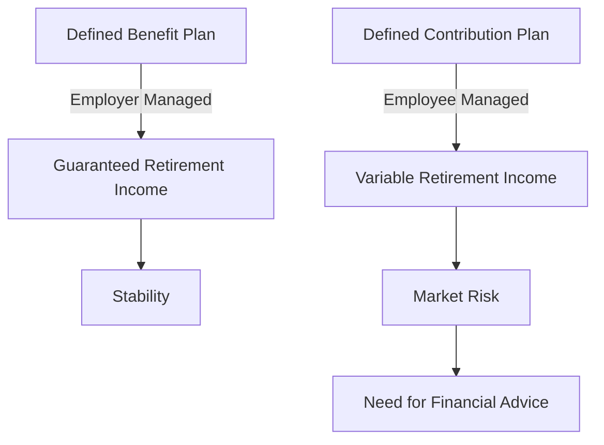

## 2.23 Social and Economic Shifts Affecting Capital Markets

The Canadian capital markets are continuously evolving, influenced by a myriad of social and economic shifts. Understanding these changes is crucial for financial professionals and investors alike. This section delves into the impact of demographic changes, the transition from defined benefit to defined contribution pension plans, and the influence of savings rates and household debt levels on financial planning and investment. Additionally, we will explore how millennials and baby boomers are shaping investment trends in Canada.

### Demographic Changes and Their Impact on Capital Markets

Demographics, defined as statistical data relating to the population and particular groups within it, play a significant role in shaping capital markets. In Canada, two prominent demographic groups—millennials and baby boomers—are particularly influential.

#### Millennials

Millennials, born between 1981 and 1996, are now entering their prime earning years. This cohort is characterized by a strong preference for technology and sustainable investing. Their investment choices are often guided by environmental, social, and governance (ESG) criteria, which has led to a surge in ESG-focused funds. Canadian financial institutions, such as RBC and TD, have responded by offering a range of ESG investment products.

#### Baby Boomers

Baby boomers, born between 1946 and 1964, are either approaching or already in retirement. This group has accumulated significant wealth and is shifting its focus from wealth accumulation to wealth preservation and income generation. The demand for fixed-income securities and dividend-paying stocks has increased as a result. Additionally, the aging population is influencing sectors such as healthcare and real estate, with increased demand for retirement communities and healthcare services.

### Transition from Defined Benefit to Defined Contribution Pension Plans

The shift from defined benefit (DB) to defined contribution (DC) pension plans is a significant trend affecting Canadian capital markets. A defined benefit pension plan promises a specified monthly benefit at retirement, often based on salary and years of service. In contrast, a defined contribution pension plan involves regular contributions from the employer, employee, or both, with retirement benefits depending on investment performance.

#### Implications for Investors

This transition places more responsibility on individuals to manage their retirement savings. As a result, there is a growing demand for financial advice and investment products that cater to retirement planning. Financial advisors must be adept at guiding clients through asset allocation strategies that balance growth and risk, particularly as individuals approach retirement age.

### Savings Rates and Household Debt Levels

Savings rates and household debt levels are critical factors influencing financial planning and investment decisions. In Canada, household debt levels have been rising, with the debt-to-income ratio—a measure of an individual's monthly debt payments compared to their monthly gross income—reaching record highs.

#### Impact on Financial Planning

High levels of household debt can constrain consumer spending and limit the ability to save for retirement. Financial planners must consider these factors when advising clients, emphasizing the importance of debt management and disciplined saving strategies. Tools such as Registered Retirement Savings Plans (RRSPs) and Tax-Free Savings Accounts (TFSAs) are essential in helping Canadians save for the future while benefiting from tax advantages.

### The Role of Millennials and Baby Boomers in Shaping Investment Trends

Both millennials and baby boomers are driving significant changes in investment trends. Millennials' preference for digital platforms and sustainable investments has led to the rise of robo-advisors and fintech solutions. Meanwhile, baby boomers' focus on income-generating investments has increased demand for annuities and other fixed-income products.

#### Case Study: Canadian Pension Funds

Canadian pension funds, such as the Canada Pension Plan Investment Board (CPPIB), have adapted to these demographic shifts by diversifying their portfolios across global markets and asset classes. This approach not only mitigates risk but also capitalizes on growth opportunities in emerging markets.

### Practical Examples and Real-World Scenarios

To illustrate these concepts, consider the following examples:

- **Investment Strategy for Millennials:** A millennial investor might allocate a portion of their portfolio to ESG-focused exchange-traded funds (ETFs) offered by Canadian banks, leveraging their preference for sustainable investing.
  
- **Retirement Planning for Baby Boomers:** A baby boomer nearing retirement might work with a financial advisor to transition their portfolio from growth-oriented stocks to a mix of bonds and dividend-paying equities, ensuring a steady income stream.

### Diagrams and Visual Aids

Below is a diagram illustrating the shift from defined benefit to defined contribution pension plans and its impact on individual retirement planning:

### Best Practices and Common Pitfalls

**Best Practices:**
- Diversify investments to mitigate risk.
- Regularly review and adjust asset allocation based on life stage and market conditions.
- Leverage tax-advantaged accounts like RRSPs and TFSAs for retirement savings.

**Common Pitfalls:**
- Over-reliance on high-risk investments without considering market volatility.
- Neglecting to adjust investment strategies as retirement approaches.
- Failing to account for rising household debt in financial planning.

### References and Additional Resources

For further exploration, consider the following resources:

- **Statistics Canada:** [www.statcan.gc.ca](https://www.statcan.gc.ca/)
- **Canadian Pensioners Association Article:** "The Shift from Defined Benefit to Defined Contribution Plans" - [www.cpa.ca](https://www.cpa.ca/)
- **Book:** *"Pensions and Retirement Provision for Workers in Canada"* by Paul Beaudoin

### Encouragement for Application

As you navigate the complexities of the Canadian capital markets, consider how these social and economic shifts impact your financial strategies. Whether you're advising clients or managing your own investments, staying informed and adaptable is key to success.

### **Ready to Test Your Knowledge?**

**Practice 10 Essential CSC Exam Questions to Master Your Certification**



### How do demographic changes impact capital markets?

- [x] They influence investment trends and demand for financial products.
- [ ] They have no significant impact on capital markets.
- [ ] They only affect government policies.
- [ ] They are irrelevant to financial planning.

> **Explanation:** Demographic changes, such as aging populations and the preferences of millennials, significantly influence investment trends and the demand for specific financial products.

### What is a defined benefit pension plan?

- [x] A retirement plan that promises a specified monthly benefit at retirement.
- [ ] A retirement plan where benefits depend on investment performance.
- [ ] A plan with no employer contributions.
- [ ] A plan that only offers lump-sum payments.

> **Explanation:** A defined benefit pension plan promises a specified monthly benefit at retirement, often based on salary and years of service.

### What is the primary difference between defined benefit and defined contribution pension plans?

- [x] Defined benefit plans promise a specific benefit, while defined contribution plans depend on investment performance.
- [ ] Defined contribution plans promise a specific benefit, while defined benefit plans depend on investment performance.
- [ ] Both plans offer the same retirement benefits.
- [ ] Defined benefit plans have no employer contributions.

> **Explanation:** Defined benefit plans promise a specific retirement benefit, while defined contribution plans' benefits depend on investment performance.

### How do high household debt levels affect financial planning?

- [x] They constrain consumer spending and limit saving for retirement.
- [ ] They have no impact on financial planning.
- [ ] They increase the ability to save for retirement.
- [ ] They only affect government policies.

> **Explanation:** High household debt levels constrain consumer spending and limit the ability to save for retirement, impacting financial planning.

### Which demographic group is driving the demand for ESG investments?

- [x] Millennials
- [ ] Baby Boomers
- [ ] Generation X
- [ ] Silent Generation

> **Explanation:** Millennials are driving the demand for ESG investments due to their preference for sustainable and socially responsible investing.

### What is the debt-to-income ratio?

- [x] A measure of an individual's monthly debt payments compared to their monthly gross income.
- [ ] A measure of a company's debt compared to its income.
- [ ] A measure of government debt compared to GDP.
- [ ] A measure of household savings compared to income.

> **Explanation:** The debt-to-income ratio measures an individual's monthly debt payments compared to their monthly gross income.

### Why is the transition from defined benefit to defined contribution plans significant?

- [x] It places more responsibility on individuals to manage their retirement savings.
- [ ] It reduces the need for financial advisors.
- [ ] It guarantees higher retirement benefits.
- [ ] It eliminates employer contributions.

> **Explanation:** The transition from defined benefit to defined contribution plans places more responsibility on individuals to manage their retirement savings, as benefits depend on investment performance.

### What investment strategy might a baby boomer nearing retirement consider?

- [x] Transitioning from growth-oriented stocks to bonds and dividend-paying equities.
- [ ] Investing solely in high-risk stocks.
- [ ] Focusing only on technology stocks.
- [ ] Ignoring fixed-income securities.

> **Explanation:** A baby boomer nearing retirement might transition from growth-oriented stocks to bonds and dividend-paying equities to ensure a steady income stream.

### How can financial planners help clients with high household debt?

- [x] Emphasizing debt management and disciplined saving strategies.
- [ ] Encouraging more borrowing.
- [ ] Ignoring debt levels in financial planning.
- [ ] Advising clients to invest in high-risk stocks.

> **Explanation:** Financial planners can help clients with high household debt by emphasizing debt management and disciplined saving strategies.

### True or False: Millennials are more likely to use digital platforms for investing.

- [x] True
- [ ] False

> **Explanation:** True. Millennials are more likely to use digital platforms for investing, reflecting their preference for technology-driven solutions.


