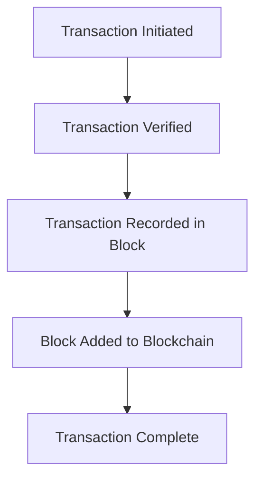

## 2.24 Cryptocurrency in Capital Markets

The advent of cryptocurrency has revolutionized the financial landscape, introducing new opportunities and challenges for investors and regulators alike. In this section, we will explore the fundamental concepts of cryptocurrency and blockchain technology, examine the integration of Bitcoin into traditional investment portfolios, and discuss the various investment vehicles available for cryptocurrency in Canada. We will also highlight the regulatory challenges and investor concerns associated with this rapidly evolving market.

### Understanding Cryptocurrency and Blockchain Technology

**Cryptocurrency** is a digital or virtual currency that employs cryptography for security, making it difficult to counterfeit. Unlike traditional currencies issued by governments, cryptocurrencies operate on decentralized networks based on blockchain technology.

**Blockchain** is a decentralized digital ledger that records transactions across many computers. This technology ensures transparency and security, as each transaction is verified by network participants and recorded in a block. Once a block is filled, it is added to the chain in chronological order, creating an immutable record.

#### Diagram: How Blockchain Works

### The Emergence of Bitcoin in Investment Portfolios

**Bitcoin**, the first and most widely recognized cryptocurrency, was introduced in 2009 by an anonymous entity known as Satoshi Nakamoto. It has since become a popular asset for investors seeking diversification and potential high returns. Bitcoin's integration into traditional investment portfolios has been driven by its perceived value as a hedge against inflation and its potential for significant appreciation.

#### Case Study: Bitcoin in Canadian Pension Funds

Some Canadian pension funds have begun to explore Bitcoin as part of their investment strategies. For example, the Ontario Teachers' Pension Plan has considered small allocations to Bitcoin to diversify its portfolio and enhance returns. This move reflects a growing trend among institutional investors to include cryptocurrencies as part of a broader asset allocation strategy.

### Investment Vehicles for Cryptocurrency in Canada

Investors in Canada have several options for gaining exposure to cryptocurrencies, each with its own set of benefits and risks.

#### 1. Direct Purchase

Investors can buy cryptocurrencies directly through exchanges such as Bitbuy or Coinsquare. This method allows for direct ownership but requires secure storage solutions, such as hardware wallets, to protect against theft.

#### 2. Cryptocurrency Exchange-Traded Funds (ETFs)

Cryptocurrency ETFs, such as the Purpose Bitcoin ETF, provide a convenient way for investors to gain exposure to Bitcoin without directly owning the asset. These ETFs track the price of Bitcoin and are traded on traditional stock exchanges, offering liquidity and ease of access.

#### 3. Cryptocurrency Mutual Funds

Some mutual funds, like the CI Galaxy Bitcoin Fund, offer exposure to Bitcoin and other cryptocurrencies. These funds are managed by professional portfolio managers, providing investors with diversification and expert oversight.

#### 4. Blockchain Technology Stocks

Investors can also gain indirect exposure to cryptocurrencies by investing in companies involved in blockchain technology, such as Hive Blockchain Technologies or Hut 8 Mining Corp. These stocks offer potential growth opportunities linked to the broader adoption of blockchain.

### Regulatory Challenges and Investor Concerns

The rapid growth of the cryptocurrency market has posed significant regulatory challenges. In Canada, the Canadian Securities Administrators (CSA) have issued guidelines to ensure that cryptocurrency trading platforms comply with securities laws. These regulations aim to protect investors and maintain market integrity.

#### Key Regulatory Concerns

- **Fraud and Market Manipulation:** The decentralized nature of cryptocurrencies can make them susceptible to fraudulent schemes and market manipulation.
- **Security Risks:** The risk of hacking and theft remains a significant concern for investors holding cryptocurrencies.
- **Volatility:** Cryptocurrencies are known for their price volatility, which can lead to substantial gains or losses.

### Best Practices for Cryptocurrency Investment

1. **Diversify Your Portfolio:** Avoid over-concentration in cryptocurrencies by maintaining a balanced portfolio that includes traditional assets.
2. **Conduct Thorough Research:** Understand the underlying technology and market dynamics before investing.
3. **Use Secure Storage Solutions:** Protect your digital assets with secure wallets and follow best practices for cybersecurity.
4. **Stay Informed About Regulations:** Keep abreast of regulatory developments to ensure compliance and mitigate risks.

### Additional Resources

- **Regulations:** [Canadian Securities Administrators on Cryptocurrency](https://www.securities-administrators.ca/aboutcsa.aspx)
- **Articles:** "The Rise of Cryptocurrency in Canada" - [CBC News](https://www.cbc.ca/news/business/cryptocurrency)
- **Books:** *"Blockchain Basics: A Non-Technical Introduction in 25 Steps"* by Daniel Drescher

### Summary

Cryptocurrencies have become an integral part of the capital markets, offering new opportunities for diversification and growth. However, they also present unique challenges that require careful consideration and strategic planning. By understanding the underlying technology, exploring various investment vehicles, and staying informed about regulatory developments, investors can effectively navigate the evolving landscape of cryptocurrency in Canada.

### **Ready to Test Your Knowledge?**

**Practice 10 Essential CSC Exam Questions to Master Your Certification**



### What is cryptocurrency?

- [x] A digital or virtual currency that uses cryptography for security.
- [ ] A physical currency issued by governments.
- [ ] A type of stock in technology companies.
- [ ] A traditional form of investment.

> **Explanation:** Cryptocurrency is a digital or virtual currency that uses cryptography for security, making it distinct from physical currencies.

### What technology underpins cryptocurrency?

- [x] Blockchain
- [ ] Cloud computing
- [ ] Artificial intelligence
- [ ] Quantum computing

> **Explanation:** Blockchain is the decentralized digital ledger technology that underpins cryptocurrencies, ensuring transparency and security.

### Which is the first and most widely recognized cryptocurrency?

- [x] Bitcoin
- [ ] Ethereum
- [ ] Ripple
- [ ] Litecoin

> **Explanation:** Bitcoin is the first and most widely recognized cryptocurrency, introduced in 2009.

### What is an ETF?

- [x] A type of security that tracks an index, commodity, bonds, or a basket of assets.
- [ ] A direct purchase of cryptocurrency.
- [ ] A mutual fund focused on technology stocks.
- [ ] A government bond.

> **Explanation:** An ETF, or Exchange-Traded Fund, is a type of security that tracks an index, commodity, bonds, or a basket of assets, and is traded on stock exchanges.

### Which Canadian regulatory body provides guidelines for cryptocurrency trading platforms?

- [x] Canadian Securities Administrators (CSA)
- [ ] Bank of Canada
- [ ] Canada Revenue Agency
- [ ] Financial Consumer Agency of Canada

> **Explanation:** The Canadian Securities Administrators (CSA) provide guidelines to ensure that cryptocurrency trading platforms comply with securities laws.

### What is a common concern for cryptocurrency investors?

- [x] Volatility
- [ ] Stability
- [ ] Lack of growth potential
- [ ] Guaranteed returns

> **Explanation:** Volatility is a common concern for cryptocurrency investors, as prices can fluctuate significantly.

### How can investors gain indirect exposure to cryptocurrencies?

- [x] Investing in blockchain technology stocks
- [ ] Buying government bonds
- [x] Purchasing cryptocurrency ETFs
- [ ] Opening a savings account

> **Explanation:** Investors can gain indirect exposure to cryptocurrencies by investing in blockchain technology stocks and purchasing cryptocurrency ETFs.

### What is a best practice for cryptocurrency investment?

- [x] Diversify your portfolio
- [ ] Invest all funds in a single cryptocurrency
- [ ] Ignore regulatory developments
- [ ] Use unsecured storage solutions

> **Explanation:** Diversifying your portfolio is a best practice for cryptocurrency investment to mitigate risks and enhance returns.

### What is a risk associated with holding cryptocurrencies?

- [x] Security risks
- [ ] Guaranteed profits
- [ ] Lack of market interest
- [ ] Fixed returns

> **Explanation:** Security risks, such as hacking and theft, are associated with holding cryptocurrencies.

### True or False: Cryptocurrencies are issued by central banks.

- [ ] True
- [x] False

> **Explanation:** False. Cryptocurrencies are not issued by central banks; they operate on decentralized networks.


