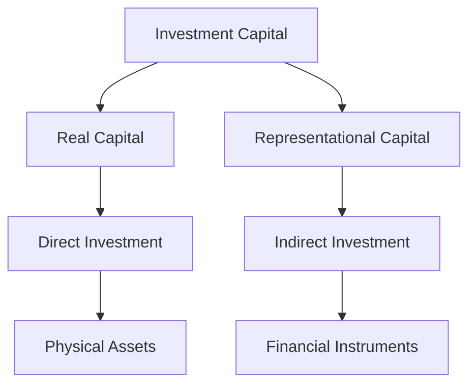

## 2.2 Investment Capital

Investment capital is a cornerstone of the financial markets, serving as the fuel that powers economic growth and development. In the Canadian context, understanding the nuances of investment capital is crucial for both individual investors and financial professionals. This section delves into the definitions, types, and roles of investment capital, providing a comprehensive guide to navigating the Canadian investment landscape.

### Defining Investment Capital

Investment capital refers to the funds used to purchase assets or securities with the expectation of generating returns. It is the lifeblood of businesses and economies, enabling the creation of goods and services, infrastructure development, and technological advancements. Investment capital can be broadly categorized into two types: real capital and representational capital.

#### Real Capital

Real capital consists of tangible assets that are used in the production of goods and services. These include physical items such as land, buildings, machinery, and equipment. Real capital is essential for businesses as it forms the backbone of their operational capabilities. For instance, a manufacturing company requires machinery and factory space to produce its products.

#### Representational Capital

Representational capital, on the other hand, comprises financial assets that represent claims on real capital. These include money, stocks, bonds, and other financial instruments. Representational capital is crucial for facilitating trade and investment in the economy. It allows investors to allocate resources efficiently without directly owning physical assets.

### Direct vs. Indirect Investment

Investment can be approached in two primary ways: direct investment and indirect investment. Understanding these approaches is vital for making informed financial decisions.

#### Direct Investment

Direct investment involves the purchase of physical assets or a significant stake in a business. This type of investment is characterized by direct ownership and control over the assets. Examples include buying real estate, acquiring a manufacturing plant, or investing in a startup company. Direct investment typically requires substantial capital and involves higher risk due to the direct exposure to the asset's performance.

**Example:** A Canadian investor purchasing a commercial property in Toronto is engaging in direct investment. They own the property outright and are responsible for its management and maintenance.

#### Indirect Investment

Indirect investment involves investing through financial instruments such as stocks, bonds, or mutual funds. This approach allows investors to gain exposure to a wide range of assets without directly owning them. Indirect investment is often preferred for its liquidity, diversification, and lower entry costs.

**Example:** Purchasing shares of the Royal Bank of Canada (RBC) on the Toronto Stock Exchange is an indirect investment. The investor does not own the bank but holds a financial interest in its performance.

### The Importance of Representational Capital in Productive Investments

Representational capital plays a pivotal role in productive investments by providing the necessary liquidity and flexibility for economic activities. It enables businesses to raise funds for expansion, innovation, and operational efficiency. In the Canadian financial market, representational capital is instrumental in supporting sectors such as technology, natural resources, and infrastructure.

**Case Study:** Consider the role of representational capital in the Canadian pension fund industry. Pension funds, such as the Canada Pension Plan Investment Board (CPPIB), utilize representational capital to invest in a diversified portfolio of assets, including equities, fixed income, and alternative investments. This approach helps secure the financial future of millions of Canadians by generating stable returns over the long term.

### The Role of Investment Advisors in Facilitating Indirect Investments

Investment advisors are key players in the financial ecosystem, guiding investors through the complexities of indirect investments. They provide expertise in asset allocation, risk management, and regulatory compliance, ensuring that investment strategies align with clients' financial goals.

In Canada, investment advisors must adhere to regulations set by the Canadian Investment Regulatory Organization (CIRO) and provincial securities commissions. These regulations ensure that advisors act in the best interests of their clients, providing transparent and ethical financial advice.

**Practical Example:** An investment advisor at TD Wealth Management might assist a client in constructing a diversified portfolio that includes Canadian equities, government bonds, and international mutual funds. The advisor's role is to balance risk and return while considering the client's investment horizon and risk tolerance.

### Visualizing Investment Capital

To better understand the flow of investment capital, consider the following diagram illustrating the relationship between real and representational capital, and the pathways of direct and indirect investments.

### Best Practices and Common Challenges

**Best Practices:**
- Diversify investments to mitigate risk.
- Stay informed about market trends and economic indicators.
- Regularly review and adjust investment strategies to align with financial goals.

**Common Challenges:**
- Navigating regulatory requirements and compliance.
- Managing market volatility and economic uncertainty.
- Balancing short-term gains with long-term objectives.

### References and Additional Resources

For further exploration of investment capital and related topics, consider the following resources:

- **Books:** *"Principles of Corporate Finance"* by Brealey, Myers, and Allen
- **Articles:** "Direct vs. Indirect Investment" - [The Balance](https://www.thebalance.com/direct-vs-indirect-investment-1289587)
- **Canadian Institutions:** Canadian Investment Regulatory Organization (CIRO), Canada Pension Plan Investment Board (CPPIB)
- **Open-Source Tools:** Financial modeling software such as QuantLib for analyzing investment strategies.

### Summary

Investment capital is a fundamental component of the Canadian financial market, driving economic growth and innovation. By understanding the distinctions between real and representational capital, and the dynamics of direct and indirect investments, investors can make informed decisions that align with their financial objectives. Investment advisors play a crucial role in facilitating these investments, ensuring compliance and optimizing returns. As the financial landscape evolves, staying informed and adaptable is key to successful investing.

### **Ready to Test Your Knowledge?**

**Practice 10 Essential CSC Exam Questions to Master Your Certification**



### What is investment capital?

- [x] Funds used to purchase assets or securities with the expectation of generating returns
- [ ] Tangible assets such as land and buildings
- [ ] Financial instruments like stocks and bonds
- [ ] A type of government bond

> **Explanation:** Investment capital refers to the funds used to purchase assets or securities with the expectation of generating returns.

### Which of the following is an example of real capital?

- [x] Machinery
- [ ] Stocks
- [ ] Bonds
- [ ] Mutual funds

> **Explanation:** Real capital consists of tangible assets such as machinery, land, and buildings.

### What characterizes direct investment?

- [x] Direct ownership and control over physical assets
- [ ] Investing through financial instruments
- [ ] High liquidity and diversification
- [ ] Low entry costs

> **Explanation:** Direct investment involves direct ownership and control over physical assets.

### How does representational capital facilitate productive investments?

- [x] By providing liquidity and flexibility for economic activities
- [ ] By directly owning physical assets
- [ ] By reducing financial risks
- [ ] By increasing government regulations

> **Explanation:** Representational capital provides liquidity and flexibility, enabling businesses to raise funds for productive investments.

### What role do investment advisors play in indirect investments?

- [x] Guiding investors through asset allocation and risk management
- [ ] Directly managing physical assets
- [x] Ensuring regulatory compliance
- [ ] Setting government policies

> **Explanation:** Investment advisors guide investors through asset allocation, risk management, and ensure regulatory compliance.

### Which of the following is a common challenge in investment capital management?

- [x] Navigating regulatory requirements
- [ ] High liquidity of assets
- [ ] Low market volatility
- [ ] Stable economic conditions

> **Explanation:** Navigating regulatory requirements is a common challenge in investment capital management.

### What is the primary benefit of indirect investment?

- [x] Liquidity and diversification
- [ ] Direct control over assets
- [x] Lower entry costs
- [ ] Higher risk exposure

> **Explanation:** Indirect investment offers liquidity, diversification, and lower entry costs.

### Which Canadian institution is involved in managing pension funds?

- [x] Canada Pension Plan Investment Board (CPPIB)
- [ ] Canadian Investment Regulatory Organization (CIRO)
- [ ] Royal Bank of Canada (RBC)
- [ ] Toronto Stock Exchange (TSX)

> **Explanation:** The Canada Pension Plan Investment Board (CPPIB) manages pension funds in Canada.

### What is a best practice for managing investment capital?

- [x] Diversifying investments
- [ ] Concentrating on a single asset class
- [ ] Ignoring market trends
- [ ] Avoiding regulatory compliance

> **Explanation:** Diversifying investments is a best practice for managing investment capital.

### True or False: Representational capital includes tangible assets like machinery.

- [ ] True
- [x] False

> **Explanation:** Representational capital includes financial assets like money, stocks, and bonds, not tangible assets like machinery.


