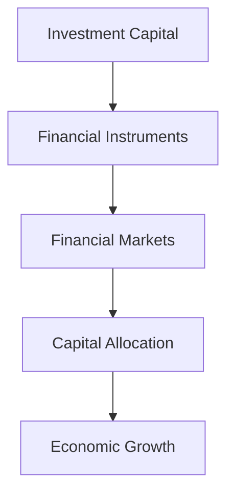

## 2.3 Content Areas

In this section, we delve into the foundational elements of the Canadian capital market, focusing on three critical content areas: Investment Capital, Financial Instruments, and Financial Markets. Understanding these components is essential for navigating the complex landscape of securities and investments in Canada. Each area plays a pivotal role in the functioning of the economy, facilitating the flow of funds and enabling economic growth.

### Investment Capital

Investment capital refers to the funds that are used by businesses and governments to acquire assets and finance operations. It is the lifeblood of economic activity, enabling the creation of goods and services, infrastructure development, and technological innovation. In Canada, investment capital can originate from various sources, including:

- **Personal Savings:** Individuals contribute to investment capital through savings accounts, Registered Retirement Savings Plans (RRSPs), and Tax-Free Savings Accounts (TFSAs). These vehicles provide tax advantages and encourage long-term savings, which can be channeled into investments.

- **Corporate Earnings:** Companies reinvest profits into their operations or new ventures, generating capital for expansion and innovation. This reinvestment is crucial for maintaining competitiveness and driving economic growth.

- **Government Funding:** Governments raise capital through taxation and the issuance of bonds. This capital is used for public projects, infrastructure, and services that support the economy.

- **Foreign Investment:** International investors contribute to Canada's investment capital by purchasing Canadian securities and assets. This inflow of capital supports domestic markets and enhances economic stability.

Investment capital is characterized by its potential for growth and risk. Investors seek to maximize returns while managing risks associated with market volatility, economic conditions, and geopolitical factors. The effective allocation of investment capital is essential for optimizing economic outcomes and achieving financial goals.

### Financial Instruments

Financial instruments are the vehicles through which investment capital is deployed. They represent a claim on future cash flows or assets and are used to facilitate transactions in the financial markets. In Canada, financial instruments can be broadly categorized into:

- **Equities:** Represent ownership in a company. Common stocks and preferred shares are the primary equity instruments, offering potential for capital appreciation and dividends. For example, investing in shares of major Canadian banks like RBC or TD provides exposure to the financial sector's growth.

- **Debt Securities:** Include bonds and debentures, which are loans made by investors to issuers (corporations or governments). These instruments provide regular interest payments and return of principal at maturity. Canadian government bonds are a popular choice for conservative investors seeking stable returns.

- **Derivatives:** Financial contracts whose value is derived from underlying assets, such as stocks, bonds, or commodities. Options and futures are common derivatives used for hedging and speculative purposes. For instance, a Canadian wheat farmer might use futures contracts to lock in prices and manage risk.

- **Mutual Funds and ETFs:** Pooled investment vehicles that offer diversification and professional management. They allow investors to access a broad range of assets and strategies, from Canadian equity funds to global bond ETFs.

Each financial instrument has unique features, risks, and return profiles. Understanding these characteristics is crucial for selecting appropriate investments that align with individual or institutional objectives.

### Financial Markets

Financial markets are platforms where financial instruments are bought and sold. They play a vital role in capital distribution, providing liquidity, price discovery, and risk management. In Canada, the financial markets are diverse and include:

- **Stock Markets:** The Toronto Stock Exchange (TSX) is the primary venue for trading equities in Canada. It hosts a wide range of companies, from large multinationals to emerging startups, offering investors opportunities to participate in the country's economic growth.

- **Bond Markets:** Facilitate the issuance and trading of debt securities. The Canadian bond market includes government and corporate bonds, providing a mechanism for raising capital and managing interest rate risk.

- **Derivatives Markets:** Enable the trading of futures, options, and other derivative products. These markets are essential for hedging risks and speculating on price movements in various asset classes.

- **Foreign Exchange Markets:** Involve the trading of currencies, crucial for international trade and investment. The Canadian dollar (CAD) is actively traded, reflecting the country's economic ties with global partners.

Financial markets are interconnected, with each catering to specific types of financial instruments. They are influenced by factors such as economic indicators, monetary policy, and investor sentiment. Understanding the dynamics of these markets is essential for making informed investment decisions and managing financial risks.

### Connecting Concepts

The interplay between investment capital, financial instruments, and financial markets is fundamental to the functioning of the economy. Investment capital flows through financial markets via financial instruments, facilitating the allocation of resources and enabling economic growth. Here's how these elements connect:

- **Capital Supply and Demand:** The availability of investment capital influences the supply and demand for financial instruments. A surplus of capital can lead to lower interest rates and increased investment activity, while a shortage can constrain growth.

- **Market Dynamics:** Financial markets respond to changes in capital flows, economic conditions, and investor behavior. Understanding these dynamics helps investors anticipate market trends and adjust their strategies accordingly.

- **Instrument Selection:** Different markets cater to various financial instruments, each with distinct risk and return characteristics. Investors must select instruments that align with their risk tolerance and investment objectives.

By understanding these connections, investors can better navigate the complexities of the capital markets and optimize their investment strategies.

### Glossary

- **Investment Capital:** Funds used by businesses and governments to buy assets and finance operations.

### Diagrams and Visuals

To enhance understanding, let's visualize the flow of investment capital through financial markets using a diagram:

```mermaid
graph TD;
    A[Investment Capital] --> B[Financial Instruments];
    B --> C[Financial Markets];
    C --> D[Capital Allocation];
    D --> E[Economic Growth];
```

This diagram illustrates how investment capital is channeled through financial instruments into financial markets, leading to capital allocation and ultimately contributing to economic growth.

### Best Practices and Challenges

- **Best Practices:** Diversify investments across different asset classes and markets to manage risk. Stay informed about economic trends and market developments to make timely decisions.

- **Common Challenges:** Navigating market volatility and managing investment risks are ongoing challenges. Investors must balance the pursuit of returns with risk management strategies.

- **Strategies to Overcome Challenges:** Use a disciplined investment approach, leveraging tools like asset allocation and risk assessment. Consider consulting financial advisors for personalized guidance.

### Additional Resources

For further exploration of these topics, consider the following resources:

- **Books:** "The Wealthy Barber" by David Chilton for personal finance insights, and "Investment Analysis and Portfolio Management" by Frank K. Reilly for advanced investment strategies.

- **Online Courses:** The Canadian Securities Institute offers courses on securities and investment management.

- **Regulatory References:** Visit the Canadian Investment Regulatory Organization (CIRO) website for up-to-date regulatory information.

By understanding the content areas of investment capital, financial instruments, and financial markets, you can build a solid foundation for navigating the Canadian capital market and achieving your financial goals.

## Quiz Time!



### What is investment capital primarily used for?

- [x] To acquire assets and finance operations
- [ ] To pay off debts
- [ ] To purchase consumer goods
- [ ] To fund charitable activities

> **Explanation:** Investment capital is used by businesses and governments to acquire assets and finance operations, driving economic growth.

### Which of the following is a characteristic of equities?

- [x] Ownership in a company
- [ ] Fixed interest payments
- [ ] Guaranteed returns
- [ ] Short-term maturity

> **Explanation:** Equities represent ownership in a company and offer potential for capital appreciation and dividends.

### What role do financial markets play in the economy?

- [x] Provide liquidity and price discovery
- [ ] Eliminate investment risks
- [ ] Guarantee profits
- [ ] Control government policies

> **Explanation:** Financial markets provide liquidity, price discovery, and risk management, facilitating the flow of capital.

### Which financial instrument is a loan made by investors to issuers?

- [x] Bonds
- [ ] Stocks
- [ ] Options
- [ ] Mutual funds

> **Explanation:** Bonds are debt securities representing loans made by investors to issuers, providing interest payments and return of principal.

### What is the primary function of the Toronto Stock Exchange (TSX)?

- [x] Trading equities
- [ ] Issuing government bonds
- [ ] Managing foreign exchange
- [ ] Regulating financial institutions

> **Explanation:** The TSX is the primary venue for trading equities in Canada, hosting a wide range of companies.

### How do derivatives derive their value?

- [x] From underlying assets
- [ ] From government policies
- [ ] From investor sentiment
- [ ] From market rumors

> **Explanation:** Derivatives derive their value from underlying assets such as stocks, bonds, or commodities.

### What is a common strategy to manage investment risks?

- [x] Diversification
- [ ] Concentration
- [ ] Speculation
- [ ] Ignoring market trends

> **Explanation:** Diversification involves spreading investments across different asset classes to manage risk.

### Which of the following is a pooled investment vehicle?

- [x] Mutual funds
- [ ] Individual stocks
- [ ] Corporate bonds
- [ ] Currency pairs

> **Explanation:** Mutual funds are pooled investment vehicles offering diversification and professional management.

### What influences the supply and demand for financial instruments?

- [x] Availability of investment capital
- [ ] Weather conditions
- [ ] Political speeches
- [ ] Celebrity endorsements

> **Explanation:** The availability of investment capital influences the supply and demand for financial instruments.

### True or False: Financial markets guarantee profits for investors.

- [ ] True
- [x] False

> **Explanation:** Financial markets do not guarantee profits; they facilitate transactions and provide liquidity and price discovery.


