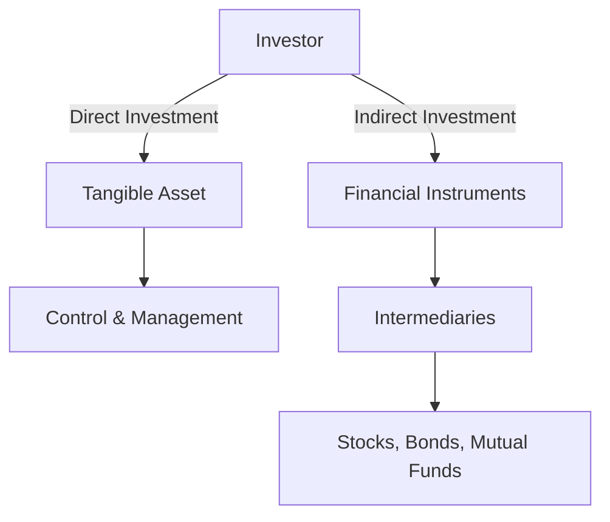

## 2.4.1 Direct and Indirect Investing

Investing is a fundamental component of the financial landscape, providing individuals and institutions with opportunities to grow wealth and contribute to economic development. In this section, we delve into the concepts of direct and indirect investing, examining their characteristics, benefits, risks, and roles in the capital markets. Understanding these investment types is crucial for making informed financial decisions and optimizing investment strategies.

### Differentiating Between Investment Types

#### Direct Investment

**Direct Investment** involves the acquisition of tangible assets or businesses, granting the investor direct control or ownership. This type of investment is characterized by a hands-on approach, where investors are actively involved in managing the asset or business.

**Examples of Direct Investment:**
- **Purchasing Real Estate:** Buying a home or commercial property where the investor directly owns and manages the asset.
- **Investing in a New Plant:** Establishing or expanding a manufacturing facility, where the investor has control over operations and production.

**Benefits of Direct Investment:**
- **Control and Influence:** Investors have direct control over the asset, allowing them to make strategic decisions.
- **Potential for High Returns:** Direct investments can yield substantial returns, especially in growing markets or industries.

**Risks of Direct Investment:**
- **High Capital Requirement:** Direct investments often require significant capital outlay, limiting accessibility for some investors.
- **Illiquidity:** Tangible assets can be difficult to sell quickly, posing liquidity risks.

#### Indirect Investment

**Indirect Investment** involves investing through financial instruments, such as stocks, bonds, or mutual funds, where the investor does not have direct ownership of the underlying asset. Instead, these investments are facilitated by intermediaries like banks or investment firms.

**Examples of Indirect Investment:**
- **Buying Stocks:** Purchasing shares in a company, where the investor owns a portion of the company but does not manage its operations.
- **Depositing Savings in a Bank:** Placing money in a savings account, where the bank uses the funds for lending and investment activities.

**Benefits of Indirect Investment:**
- **Flexibility and Liquidity:** Indirect investments are generally more liquid, allowing investors to buy or sell with ease.
- **Diversification:** Investors can spread risk across various assets and sectors, reducing exposure to individual asset volatility.

**Risks of Indirect Investment:**
- **Market Volatility:** Indirect investments are subject to market fluctuations, which can impact returns.
- **Limited Control:** Investors have little to no control over the management of the underlying assets.

### Understanding Investment Mechanisms

#### Tangible Asset Ownership in Direct Investments

Direct investments result in tangible asset ownership, providing investors with physical control and the ability to directly influence outcomes. This ownership structure can lead to significant economic benefits, such as infrastructure development and increased productivity.

#### Role of Intermediaries in Indirect Investments

Intermediaries play a crucial role in facilitating indirect investments by pooling resources, managing funds, and providing access to a wide range of financial instruments. These entities enhance the efficiency of capital markets by mobilizing capital for productive uses and offering investors diversified investment options.

#### Impact of Ownership Structures

Ownership structures significantly influence investment returns and risks. Direct ownership allows for greater control and potential for higher returns, while indirect ownership offers diversification and reduced individual asset risk. Investors must weigh these factors when choosing their investment strategies.

### Assessing Investment Outcomes

#### Long-term Economic Benefits of Direct Investments

Direct investments contribute to long-term economic growth by fostering infrastructure development, creating jobs, and enhancing productivity. For example, investing in a new manufacturing plant can stimulate local economies and drive innovation.

#### Diversification and Risk Management in Indirect Investments

Indirect investments enable investors to diversify their portfolios, spreading risk across various assets and sectors. This diversification is crucial for managing market volatility and achieving stable returns over time.

#### Influence on Economic Stability and Growth

Both direct and indirect investments play vital roles in economic stability and growth. Direct investments drive tangible economic development, while indirect investments provide liquidity and flexibility to capital markets, supporting overall economic resilience.

#### Strategic Choices Based on Financial Goals and Risk Tolerance

Investors must align their investment choices with their financial goals and risk tolerance. Direct investments may suit those seeking control and long-term growth, while indirect investments appeal to those prioritizing liquidity and diversification. Understanding these dynamics is essential for crafting effective investment strategies.

### Glossary

- **Direct Investment:** Investment in physical assets or businesses where the investor has direct control or ownership.
- **Indirect Investment:** Investment through financial instruments where the investor does not have direct ownership of the underlying asset.

### Visualizing Investment Types

To better understand the flow of direct and indirect investments, consider the following diagram:

### Conclusion

Understanding the distinctions between direct and indirect investing is crucial for making informed financial decisions. Each investment type offers unique benefits and risks, influencing economic stability and growth. By aligning investment strategies with financial goals and risk tolerance, investors can optimize their portfolios and contribute to the broader capital market ecosystem.

## Quiz Time!



### Which of the following is an example of direct investment?

- [x] Purchasing a commercial property
- [ ] Buying shares in a mutual fund
- [ ] Depositing money in a savings account
- [ ] Investing in a government bond

> **Explanation:** Purchasing a commercial property is a direct investment because it involves acquiring a tangible asset with direct ownership and control.

### What is a key benefit of indirect investment?

- [ ] High capital requirement
- [x] Diversification
- [ ] Direct control over assets
- [ ] Illiquidity

> **Explanation:** Indirect investment allows for diversification, spreading risk across various assets and sectors, which is a key benefit.

### How do intermediaries facilitate indirect investments?

- [x] By pooling resources and managing funds
- [ ] By providing direct control over assets
- [ ] By requiring high capital outlay
- [ ] By limiting access to financial instruments

> **Explanation:** Intermediaries facilitate indirect investments by pooling resources, managing funds, and providing access to a wide range of financial instruments.

### What is a potential risk of direct investment?

- [ ] Market volatility
- [ ] Diversification
- [x] Illiquidity
- [ ] Flexibility

> **Explanation:** Direct investments can be illiquid, making it difficult to sell assets quickly, which poses a risk.

### Which investment type typically offers more liquidity?

- [ ] Direct investment
- [x] Indirect investment
- [ ] Real estate investment
- [ ] Infrastructure investment

> **Explanation:** Indirect investments typically offer more liquidity, allowing investors to buy or sell with ease.

### What role do direct investments play in economic growth?

- [x] Infrastructure development and job creation
- [ ] Providing liquidity to capital markets
- [ ] Offering diversification
- [ ] Reducing market volatility

> **Explanation:** Direct investments contribute to economic growth by fostering infrastructure development and creating jobs.

### How do indirect investments help in risk management?

- [x] By diversifying portfolios
- [ ] By providing direct control
- [ ] By requiring high capital outlay
- [ ] By limiting access to financial instruments

> **Explanation:** Indirect investments help in risk management by diversifying portfolios, spreading risk across various assets and sectors.

### What is a common characteristic of direct investments?

- [ ] High liquidity
- [ ] Limited control
- [x] Tangible asset ownership
- [ ] Diversification

> **Explanation:** Direct investments are characterized by tangible asset ownership, providing investors with physical control.

### Which investment type is more suitable for investors seeking control and long-term growth?

- [x] Direct investment
- [ ] Indirect investment
- [ ] Savings account
- [ ] Mutual funds

> **Explanation:** Direct investment is more suitable for investors seeking control and long-term growth due to direct ownership and management.

### True or False: Indirect investments are generally more liquid than direct investments.

- [x] True
- [ ] False

> **Explanation:** True. Indirect investments are generally more liquid, allowing investors to buy or sell with ease compared to direct investments.


