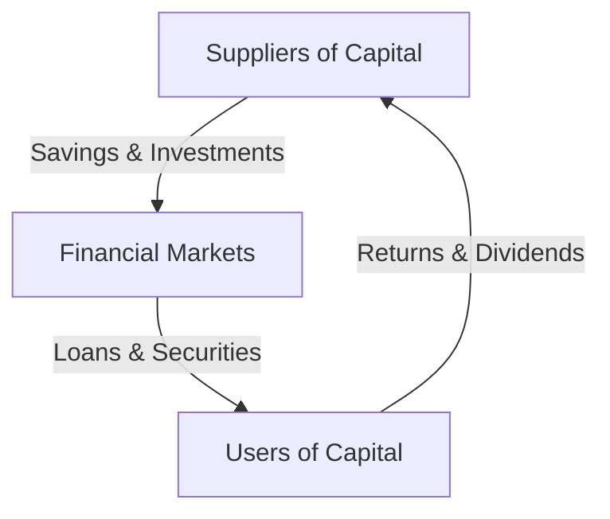

## 2.4 Investment Capital

Investment capital is a cornerstone of economic growth and development, serving as the lifeblood of financial markets and the broader economy. In this section, we will delve into the multifaceted nature of investment capital, exploring its definition, characteristics, and the dynamics of its flow within and across borders. We will also examine the roles of various suppliers and users of capital, with a particular focus on the Canadian financial landscape.

### Understanding Investment Capital

Investment capital can be understood as both real and representational wealth. Real wealth refers to tangible assets such as machinery, buildings, and infrastructure, which are directly used in production. Representational wealth, on the other hand, includes financial instruments like stocks, bonds, and other securities that represent claims on real assets or future income streams.

#### Direct vs. Indirect Investment

Investment can be categorized into direct and indirect forms:

- **Direct Investment:** This involves acquiring ownership or control over a tangible asset. Examples include purchasing real estate or investing in a business to gain a controlling interest. Direct investment often entails a long-term commitment and a hands-on approach to managing the asset.

- **Indirect Investment:** This occurs through financial instruments such as stocks, bonds, or mutual funds. Investors do not directly own the underlying assets but hold claims on them. Indirect investment provides liquidity and diversification, allowing investors to spread risk across various assets.

#### Role of Investment Capital in Economic Activities

Investment capital plays a crucial role in economic activities by enabling businesses to expand facilities, improve productivity, and foster innovation. For instance, a Canadian manufacturing company might use investment capital to upgrade its machinery, leading to increased production efficiency and competitiveness in global markets. Similarly, investment in research and development can drive innovation, resulting in new products and services that enhance economic growth.

Representational capital is vital in financial markets, where it is transformed into productive investments. For example, when a company issues shares, it raises capital that can be used for expansion projects, thereby converting financial capital into real economic activity.

### Characteristics of Capital

Investment capital possesses three key characteristics: mobility, sensitivity, and scarcity. These characteristics significantly influence capital allocation and investment decisions.

#### Mobility

Capital mobility refers to the ease with which capital can move across borders or between different sectors of the economy. High mobility allows investors to seek the best returns globally, promoting efficient capital allocation. For instance, Canadian pension funds may invest in international markets to diversify their portfolios and achieve higher returns.

#### Sensitivity

Capital is sensitive to various factors, including interest rates, inflation, and political stability. Changes in these factors can influence investment decisions. For example, a rise in Canadian interest rates might attract foreign investors seeking higher returns, while political instability could deter investment.

#### Scarcity

Capital is a scarce resource, meaning there is a limited supply relative to demand. This scarcity drives competition for investment opportunities, influencing the cost of capital. In Canada, sectors like technology and renewable energy often compete for limited investment capital, impacting their growth prospects.

#### Factors Attracting Capital

Several factors attract capital to specific countries or locations, including stable governance, favorable economic conditions, and robust legal frameworks. Canada, with its stable political environment and strong regulatory system, is an attractive destination for foreign investment.

Country risk evaluation is a critical process in assessing the economic, political, and social risks that could affect capital investment in a specific country. Investors consider factors such as government stability, regulatory environment, and economic performance when evaluating country risk.

### Suppliers and Users of Capital

Understanding the dynamics between suppliers and users of capital is essential for comprehending how investment capital flows through the economy.

#### Suppliers of Capital

Various entities supply capital, including:

- **Individuals:** Through savings and investments in financial markets, individuals provide capital for economic activities.

- **Non-Financial Corporations:** Companies reinvest profits or issue securities to supply capital for expansion and innovation.

- **Governments:** Through budget surpluses or sovereign wealth funds, governments can be significant suppliers of capital.

- **Foreign Investors:** International investors bring capital into a country, seeking opportunities for returns.

Each supplier type plays a unique role in providing investment capital. For instance, individuals contribute through retirement savings plans like RRSPs and TFSAs, while corporations might issue bonds to raise funds for new projects.

#### Users of Capital

Users of capital include:

- **Individuals:** Require capital for personal investments, such as purchasing homes or funding education.

- **Businesses:** Need capital for operations, expansion, and innovation. For example, a Canadian tech startup might seek venture capital to develop new software.

- **Governments:** Use capital for infrastructure projects, public services, and economic development initiatives.

Users obtain capital through various means, including borrowing from financial institutions, generating internal funds, or accessing securities markets. For instance, a Canadian government might issue bonds to finance infrastructure projects.

### Capital Flow Dynamics

The movement of capital from suppliers to users is a dynamic process influenced by various factors.

#### Capital Mobility Across Borders

Capital mobility across borders is driven by factors such as interest rate differentials, exchange rate stability, and economic growth prospects. For example, a Canadian investor might allocate capital to emerging markets to capitalize on higher growth potential.

#### Competition for Investment Opportunities

Capital scarcity drives competition for investment opportunities, influencing the allocation of resources. In Canada, sectors like clean energy and technology often compete for limited capital, impacting their development and innovation.

#### Economic Implications of Insufficient Capital Investment

Insufficient capital investment can have significant economic implications, including industry slowdown and increased unemployment. For instance, a lack of investment in infrastructure can lead to bottlenecks, reducing economic efficiency and growth.

### Visualizing Capital Flow

To better understand the flow of capital, consider the following diagram illustrating the movement of capital from suppliers to users:

This diagram highlights the cyclical nature of capital flow, where suppliers provide capital through savings and investments, which are then channeled through financial markets to users. Users, in turn, generate returns that flow back to suppliers, completing the cycle.

### Conclusion

Investment capital is a vital component of economic growth and development, facilitating the expansion of businesses, innovation, and infrastructure development. Understanding the characteristics and dynamics of capital flow is essential for making informed investment decisions and fostering a robust economic environment. By recognizing the roles of various suppliers and users of capital, investors can better navigate the complexities of the financial markets and contribute to sustainable economic growth.

## Quiz Time!



### What is the primary difference between direct and indirect investment?

- [x] Direct investment involves acquiring ownership or control over an asset, while indirect investment involves financial instruments.
- [ ] Direct investment is always short-term, while indirect investment is long-term.
- [ ] Direct investment is risk-free, while indirect investment carries risk.
- [ ] Direct investment is only available to corporations, while indirect investment is available to individuals.

> **Explanation:** Direct investment involves acquiring ownership or control over tangible assets, such as real estate or businesses, whereas indirect investment involves financial instruments like stocks and bonds, without direct ownership of the underlying asset.

### Which of the following is NOT a characteristic of investment capital?

- [ ] Mobility
- [ ] Sensitivity
- [ ] Scarcity
- [x] Abundance

> **Explanation:** Investment capital is characterized by mobility, sensitivity, and scarcity. Abundance is not a characteristic of capital, as it is typically limited in supply relative to demand.

### What factor is most likely to attract foreign investment to a country?

- [x] Stable governance and favorable economic conditions
- [ ] High inflation rates
- [ ] Political instability
- [ ] High levels of corruption

> **Explanation:** Stable governance and favorable economic conditions are key factors that attract foreign investment, as they provide a secure and predictable environment for investors.

### Who are the primary suppliers of investment capital?

- [x] Individuals, non-financial corporations, governments, and foreign investors
- [ ] Only individuals and governments
- [ ] Only non-financial corporations and foreign investors
- [ ] Only banks and financial institutions

> **Explanation:** The primary suppliers of investment capital include individuals, non-financial corporations, governments, and foreign investors, each playing a unique role in providing capital for economic activities.

### How do users of capital typically obtain it?

- [x] Borrowing, internal generation, or securities markets
- [ ] Only through borrowing
- [ ] Only through issuing stocks
- [ ] Only through government grants

> **Explanation:** Users of capital typically obtain it through borrowing from financial institutions, generating internal funds, or accessing securities markets by issuing stocks or bonds.

### What is the impact of capital scarcity on investment opportunities?

- [x] It drives competition for investment opportunities.
- [ ] It eliminates investment opportunities.
- [ ] It reduces the need for investment.
- [ ] It has no impact on investment opportunities.

> **Explanation:** Capital scarcity drives competition for investment opportunities, influencing the allocation of resources and the cost of capital.

### What is the role of country risk evaluation in capital investment?

- [x] Assessing economic, political, and social risks that could affect investment
- [ ] Determining the interest rates for investment
- [ ] Calculating the return on investment
- [ ] Identifying tax benefits for investors

> **Explanation:** Country risk evaluation involves assessing the economic, political, and social risks that could affect capital investment in a specific country, helping investors make informed decisions.

### What is the economic implication of insufficient capital investment?

- [x] Industry slowdown and increased unemployment
- [ ] Rapid economic growth
- [ ] Decreased inflation
- [ ] Increased government revenue

> **Explanation:** Insufficient capital investment can lead to industry slowdown and increased unemployment, as businesses may lack the resources needed for expansion and innovation.

### What does the term "capital mobility" refer to?

- [x] The ease with which capital can move across borders or between sectors
- [ ] The difficulty of converting capital into cash
- [ ] The stability of capital in a specific location
- [ ] The abundance of capital in a market

> **Explanation:** Capital mobility refers to the ease with which capital can move across borders or between different sectors of the economy, allowing investors to seek the best returns globally.

### True or False: Representational wealth includes tangible assets like machinery and buildings.

- [ ] True
- [x] False

> **Explanation:** Representational wealth includes financial instruments like stocks and bonds, which represent claims on real assets or future income streams, rather than tangible assets like machinery and buildings.


