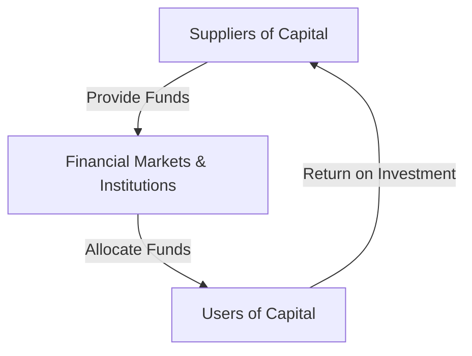

## 2.4 Suppliers and Users of Capital

In the intricate web of the Canadian financial ecosystem, the interplay between suppliers and users of capital forms the backbone of economic activity. Understanding these roles and their interrelationships is crucial for anyone involved in finance, from retail investors to seasoned professionals. This section delves into the primary suppliers and users of capital, illustrating their impact on economic growth and stability.

### Primary Suppliers of Capital

The suppliers of capital are entities that provide the financial resources necessary for economic activities. They include:

#### 1. Individuals

Individuals, often referred to as retail investors, play a significant role in supplying capital. They invest their savings in various financial instruments such as stocks, bonds, and mutual funds. In Canada, individuals can leverage tax-advantaged accounts like Registered Retirement Savings Plans (RRSPs) and Tax-Free Savings Accounts (TFSAs) to maximize their investment potential.

#### 2. Non-Financial Corporations

These are companies that generate surplus funds from their operations. Instead of holding idle cash, they invest in financial markets to earn returns. For instance, a Canadian technology firm might invest in government bonds or equities to diversify its income streams.

#### 3. Governments

Governments at various levels (federal, provincial, and municipal) can also be suppliers of capital. They invest in infrastructure projects, public services, and other initiatives that require significant financial resources. Surplus funds from budgetary allocations can be invested in financial markets to generate additional revenue.

#### 4. Foreign Investors

Foreign investors are non-Canadian entities that invest in Canadian securities and assets. They bring in capital from outside the country, contributing to the liquidity and depth of Canadian financial markets. This group includes foreign governments, corporations, and individual investors.

### Main Users of Capital

Users of capital are entities that require financial resources to fund their operations, investments, and growth initiatives. They include:

#### 1. Individuals

Individuals use capital for personal investments, purchasing homes, education, and other personal expenditures. They often seek loans or mortgages from financial institutions to meet these needs.

#### 2. Businesses

Businesses, ranging from small enterprises to large corporations, are significant users of capital. They require funds for expansion, research and development, and day-to-day operations. Canadian businesses often access capital through equity financing (issuing stocks) or debt financing (issuing bonds or taking loans).

#### 3. Governments

Governments use capital to fund public projects, infrastructure development, and social programs. They often issue bonds to raise the necessary funds, which are then repaid over time with interest.

### Interrelationship Between Suppliers and Users of Capital

The relationship between suppliers and users of capital is symbiotic and essential for economic vitality. Suppliers provide the necessary funds that users require to undertake various economic activities. This flow of capital is facilitated by financial markets and institutions, which act as intermediaries.

#### Financial Markets and Institutions

Financial markets, such as the Toronto Stock Exchange (TSX), provide a platform for the exchange of capital between suppliers and users. Financial institutions, including banks and investment firms, play a crucial role in channeling funds from savers to borrowers, ensuring efficient capital allocation.

#### Impact on Economic Growth and Stability

An adequate supply of capital is vital for economic growth and stability. It enables businesses to expand, innovate, and create jobs, contributing to overall economic prosperity. For instance, when Canadian banks provide loans to small businesses, they fuel entrepreneurship and economic development.

Conversely, a shortage of capital can lead to economic stagnation, as businesses and individuals struggle to access the funds needed for growth and consumption. Therefore, maintaining a healthy balance between capital supply and demand is crucial for a stable and thriving economy.

### Practical Examples and Case Studies

#### Canadian Pension Funds

Canadian pension funds, such as the Canada Pension Plan Investment Board (CPPIB), are significant suppliers of capital. They invest in a diverse range of assets, including equities, bonds, and real estate, to generate returns for future retirees. These investments provide capital to businesses and governments, supporting economic activities across the country.

#### Major Canadian Banks

Banks like RBC and TD are pivotal in the Canadian financial landscape. They act as intermediaries, collecting deposits from individuals and institutions and lending these funds to businesses and governments. This process facilitates the efficient allocation of capital, driving economic growth.

### Diagrams and Visual Aids

Below is a diagram illustrating the flow of capital between suppliers and users:

### Best Practices and Common Challenges

#### Best Practices

- **Diversification:** Suppliers should diversify their investments to mitigate risks and enhance returns.
- **Efficient Capital Allocation:** Users should prioritize projects with the highest potential returns to maximize the impact of the capital received.

#### Common Challenges

- **Market Volatility:** Fluctuations in financial markets can affect the availability and cost of capital.
- **Regulatory Compliance:** Both suppliers and users must navigate complex regulatory environments to ensure compliance and avoid penalties.

### References and Additional Resources

- **Statistics Canada on Capital Markets:** [Statistics Canada](https://www.statcan.gc.ca/)
- **Investopedia Article on Capital:** ["Suppliers and Users of Capital"](https://www.investopedia.com/terms/c/capital.asp)

### Glossary

- **Retail Investor:** An individual investor who buys and sells securities for personal accounts.
- **Institutional Investor:** Organizations such as pension funds and mutual funds that invest large sums of money.
- **Foreign Investor:** Non-Canadian entities that invest in Canadian securities and assets.

### **Ready to Test Your Knowledge?**

**Practice 10 Essential CSC Exam Questions to Master Your Certification**



### Who are considered primary suppliers of capital?

- [x] Individuals
- [x] Non-financial corporations
- [x] Governments
- [x] Foreign investors

> **Explanation:** All listed entities are primary suppliers of capital, providing financial resources for economic activities.

### What role do individuals play in the capital market?

- [x] Suppliers of capital
- [x] Users of capital
- [ ] Only suppliers of capital
- [ ] Only users of capital

> **Explanation:** Individuals can be both suppliers and users of capital, investing their savings and borrowing for personal needs.

### How do financial markets facilitate the flow of capital?

- [x] By providing a platform for exchange
- [ ] By hoarding capital
- [ ] By restricting access to funds
- [ ] By eliminating intermediaries

> **Explanation:** Financial markets provide a platform for the exchange of capital between suppliers and users.

### What is the impact of adequate capital supply on the economy?

- [x] Economic growth and stability
- [ ] Economic stagnation
- [ ] Increased unemployment
- [ ] Decreased innovation

> **Explanation:** Adequate capital supply supports economic growth and stability by enabling businesses to expand and innovate.

### Which of the following is a common challenge in capital markets?

- [x] Market volatility
- [ ] Excessive capital supply
- [ ] Lack of financial institutions
- [ ] Over-regulation

> **Explanation:** Market volatility can affect the availability and cost of capital, posing a challenge for both suppliers and users.

### What is a key benefit of diversification for suppliers of capital?

- [x] Risk mitigation
- [ ] Increased risk
- [ ] Reduced returns
- [ ] Limited investment options

> **Explanation:** Diversification helps mitigate risks by spreading investments across various assets.

### How do major Canadian banks contribute to the capital market?

- [x] By acting as intermediaries
- [ ] By hoarding capital
- [ ] By restricting loans
- [ ] By eliminating financial markets

> **Explanation:** Major Canadian banks act as intermediaries, channeling funds from savers to borrowers.

### What is the role of foreign investors in the Canadian capital market?

- [x] They provide additional liquidity
- [ ] They restrict capital flow
- [ ] They only invest in foreign markets
- [ ] They have no impact

> **Explanation:** Foreign investors provide additional liquidity and depth to Canadian financial markets.

### What is a Registered Retirement Savings Plan (RRSP)?

- [x] A tax-advantaged account for individuals
- [ ] A type of corporate bond
- [ ] A government loan program
- [ ] A foreign investment fund

> **Explanation:** An RRSP is a tax-advantaged account that allows individuals to save for retirement.

### True or False: Governments can be both suppliers and users of capital.

- [x] True
- [ ] False

> **Explanation:** Governments can supply capital through budget surpluses and use capital for public projects and services.


