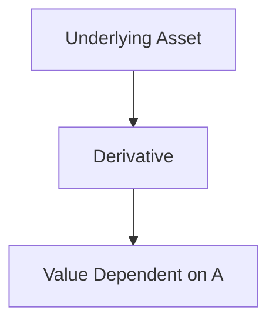

## 2.8 Derivatives

Derivatives are powerful financial instruments that derive their value from an underlying asset, index, or rate. These underlying assets can include stocks, bonds, commodities, currencies, interest rates, or market indices. Derivatives are essential tools in the financial markets, offering opportunities for hedging, speculation, and risk management. In this section, we will explore the nature of derivatives, differentiate between key types, and discuss their applications and regulatory considerations within the Canadian context.

### What are Derivatives?

Derivatives are contracts whose value is dependent on the performance of an underlying entity. This dependency means that the price of a derivative is directly linked to the price movements of the underlying asset. Derivatives can be traded on exchanges or over-the-counter (OTC), providing flexibility in terms of customization and risk exposure.

#### Key Characteristics of Derivatives:

- **Leverage:** Derivatives often allow investors to gain exposure to a large position with a relatively small amount of capital.
- **Flexibility:** They can be tailored to meet specific risk management needs.
- **Liquidity:** Many derivatives are highly liquid, allowing for easy entry and exit from positions.

### Types of Derivatives

Derivatives come in various forms, but two of the most common types are options and forwards. Each serves different purposes and suits different investor needs.

#### Options

Options are contracts that provide the holder the right, but not the obligation, to buy or sell an asset at a predetermined price within a specified time frame. There are two main types of options:

- **Call Options:** Give the holder the right to buy the underlying asset.
- **Put Options:** Give the holder the right to sell the underlying asset.

Options are particularly useful for hedging against potential losses or for speculative purposes. For example, a Canadian investor might purchase call options on a stock they believe will increase in value, allowing them to benefit from the upside while limiting downside risk.

#### Forwards

Forwards are customized contracts between two parties to buy or sell an asset at a specified price on a future date. Unlike options, forwards are binding agreements, meaning both parties are obligated to fulfill the terms of the contract.

Forwards are typically used by sophisticated investors and institutions to hedge against price fluctuations. For instance, a Canadian wheat farmer might enter into a forward contract to lock in a selling price for their crop, protecting against the risk of falling prices.

### Suitability for Sophisticated Investors

Derivatives are complex instruments that require a deep understanding of financial markets and risk management. They are generally more suitable for sophisticated investors, such as institutional investors, hedge funds, and experienced individual investors. These investors have the expertise to manage the risks associated with derivatives and the resources to absorb potential losses.

### Uses of Derivatives

Derivatives serve two primary purposes in financial markets: hedging and speculation.

#### Hedging

Hedging involves using derivatives to reduce or eliminate the risk of adverse price movements in an asset. For example, a Canadian exporter might use currency futures to hedge against the risk of a strengthening Canadian dollar, which could reduce the value of their foreign revenue when converted back to CAD.

#### Speculation

Speculators use derivatives to bet on the future direction of market prices. This can involve taking long or short positions in derivatives to profit from anticipated price movements. While speculation can lead to significant profits, it also carries substantial risk, as market movements can be unpredictable.

### Regulatory Considerations in Canada

In Canada, derivatives are subject to regulation by various bodies, including the Canadian Securities Administrators (CSA) and the Investment Industry Regulatory Organization of Canada (IIROC). These organizations ensure that derivatives markets operate fairly and transparently, protecting investors from fraud and market manipulation.

Investors should familiarize themselves with the regulatory framework governing derivatives in Canada, including disclosure requirements, trading rules, and risk management practices. Compliance with these regulations is crucial for maintaining market integrity and investor confidence.

### Practical Examples and Case Studies

#### Example 1: Hedging with Options

Consider a Canadian pension fund that holds a significant position in a Canadian bank's stock, such as RBC. To protect against potential declines in the stock's value, the fund might purchase put options. This strategy allows the fund to sell the stock at a predetermined price, mitigating losses if the stock price falls.

#### Example 2: Speculating with Forwards

A Canadian investor anticipates that the price of oil will rise over the next six months. They enter into a forward contract to buy oil at today's price, expecting to sell it at a higher price in the future. If their prediction is correct, they profit from the price difference.

### Diagrams and Visual Aids

Below is a simple diagram illustrating the relationship between a derivative and its underlying asset:

### Best Practices and Common Pitfalls

**Best Practices:**

- **Understand the Instrument:** Thoroughly understand the derivative's structure, risks, and potential returns before investing.
- **Risk Management:** Use derivatives as part of a broader risk management strategy, not as standalone investments.
- **Stay Informed:** Keep abreast of market conditions and regulatory changes that may impact derivative positions.

**Common Pitfalls:**

- **Over-Leverage:** Avoid excessive leverage, which can amplify losses as well as gains.
- **Lack of Diversification:** Do not rely solely on derivatives for portfolio diversification.
- **Ignoring Costs:** Be aware of transaction costs and fees associated with trading derivatives.

### Additional Resources

For further exploration of derivatives, consider the following resources:

- **Books:** *"Options, Futures, and Other Derivatives"* by John C. Hull
- **Articles:** "Understanding Derivatives" - [Investopedia](https://www.investopedia.com/terms/d/derivative.asp)

These resources provide comprehensive insights into the mechanics of derivatives and their applications in financial markets.

### Conclusion

Derivatives are versatile financial instruments that play a crucial role in modern financial markets. Whether used for hedging or speculation, they offer opportunities for sophisticated investors to manage risk and enhance returns. Understanding the intricacies of derivatives, including their regulatory environment in Canada, is essential for anyone looking to incorporate these instruments into their investment strategy.

### **Ready to Test Your Knowledge?**

**Practice 10 Essential CSC Exam Questions to Master Your Certification**



### What is a derivative?

- [x] A financial instrument whose value is dependent on an underlying asset
- [ ] A type of stock that pays dividends
- [ ] A bond issued by a corporation
- [ ] A mutual fund that invests in real estate

> **Explanation:** A derivative is a financial instrument whose value is derived from the value of an underlying asset, such as stocks, bonds, or commodities.

### Which of the following is a characteristic of options?

- [x] They provide the right, but not the obligation, to buy or sell an asset
- [ ] They are binding contracts to buy or sell an asset
- [ ] They are only used for hedging purposes
- [ ] They are traded exclusively on exchanges

> **Explanation:** Options give the holder the right, but not the obligation, to buy or sell an asset at a predetermined price within a specified time frame.

### What is the primary purpose of using derivatives for hedging?

- [x] To reduce or eliminate risk
- [ ] To increase leverage
- [ ] To speculate on market movements
- [ ] To diversify a portfolio

> **Explanation:** Hedging with derivatives aims to reduce or eliminate the risk of adverse price movements in an asset.

### Which regulatory body oversees derivatives markets in Canada?

- [x] Canadian Securities Administrators (CSA)
- [ ] Federal Reserve
- [ ] Securities and Exchange Commission (SEC)
- [ ] Bank of England

> **Explanation:** The Canadian Securities Administrators (CSA) is one of the regulatory bodies overseeing derivatives markets in Canada.

### What is a forward contract?

- [x] A customized contract to buy or sell an asset at a specified price on a future date
- [ ] A standardized contract traded on an exchange
- [ ] A contract that provides the right, but not the obligation, to buy or sell an asset
- [ ] A financial instrument used exclusively for speculation

> **Explanation:** A forward contract is a customized agreement between two parties to buy or sell an asset at a specified price on a future date.

### Which of the following is a common pitfall when using derivatives?

- [x] Over-leverage
- [ ] Diversification
- [ ] Risk management
- [ ] Regulatory compliance

> **Explanation:** Over-leverage is a common pitfall, as it can amplify losses as well as gains when using derivatives.

### What is the main difference between options and forwards?

- [x] Options provide the right, but not the obligation, to buy or sell; forwards are binding contracts
- [ ] Options are only used for speculation; forwards are only used for hedging
- [ ] Options are traded on exchanges; forwards are not
- [ ] Options are standardized; forwards are not

> **Explanation:** Options provide the right, but not the obligation, to buy or sell an asset, whereas forwards are binding contracts to buy or sell an asset at a future date.

### How can derivatives be used for speculation?

- [x] By taking long or short positions to profit from anticipated price movements
- [ ] By reducing risk in an investment portfolio
- [ ] By diversifying investments across different asset classes
- [ ] By complying with regulatory requirements

> **Explanation:** Speculators use derivatives to take long or short positions to profit from anticipated price movements in the market.

### Why are derivatives considered suitable for sophisticated investors?

- [x] They require a deep understanding of financial markets and risk management
- [ ] They are simple and easy to understand
- [ ] They are risk-free investments
- [ ] They are only available to institutional investors

> **Explanation:** Derivatives are complex instruments that require a deep understanding of financial markets and risk management, making them more suitable for sophisticated investors.

### True or False: Derivatives can only be used for hedging purposes.

- [ ] True
- [x] False

> **Explanation:** Derivatives can be used for both hedging and speculation, providing flexibility in managing risk and taking advantage of market opportunities.


