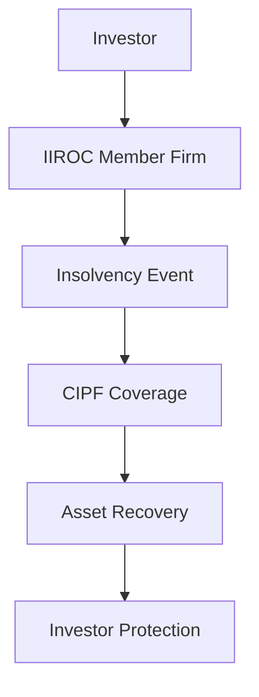

## 3.9 Canadian Investor Protection Fund (CIPF)

The Canadian Investor Protection Fund (CIPF) plays a crucial role in the Canadian financial landscape, providing a safety net for investors dealing with IIROC (Investment Industry Regulatory Organization of Canada) member firms. Understanding the CIPF's establishment, role, and mechanisms is essential for anyone involved in Canadian securities.

### Establishment and Primary Role of CIPF

The CIPF was established in 1969 as a non-profit corporation with the primary purpose of protecting investors in the event that a member firm becomes insolvent. The fund's creation was a response to the need for a robust investor protection mechanism in Canada, ensuring that investors' assets are safeguarded even if their brokerage firm fails.

**Primary Role:**
- **Investor Protection:** CIPF provides coverage to clients of IIROC member firms, ensuring that their cash and securities are protected if the firm becomes insolvent.
- **Confidence in the Market:** By offering this protection, CIPF helps maintain investor confidence in the Canadian financial markets, which is vital for the stability and growth of the economy.

### How CIPF Coverage Works

CIPF coverage is designed to protect clients of IIROC member firms by covering losses of cash and securities held by the firm in the event of its insolvency. Here’s how it works:

1. **Eligibility:** Only clients of IIROC member firms are eligible for CIPF coverage. This includes individual investors, joint accounts, and certain types of trusts and estates.
   
2. **Coverage Limits:** CIPF provides coverage up to $1 million per account category. The account categories include:
   - General accounts (cash and margin accounts combined)
   - Registered retirement accounts (e.g., RRSPs, RRIFs)
   - Registered education savings plans (RESPs)

3. **Claims Process:** In the event of a firm's insolvency, CIPF steps in to facilitate the return of assets to clients. Clients must file a claim with CIPF, which will then assess the claim and determine the amount of coverage applicable.

4. **Exclusions:** CIPF does not cover losses resulting from market fluctuations, unsuitable investments, or fraudulent activities by the firm or its representatives.

### Funding Mechanism and Coverage Limits

The CIPF is funded through assessments on IIROC member firms. These assessments are based on the firm's size and the level of risk they pose to the fund. The fund maintains a reserve to ensure it can meet its obligations in the event of a member firm's insolvency.

**Funding Mechanism:**
- **Assessments:** IIROC member firms contribute to the CIPF based on their financial health and risk profile.
- **Reserve Fund:** CIPF maintains a reserve fund, which is invested in a diversified portfolio to ensure liquidity and growth.

**Coverage Limits:**
- **Per Account Category:** As mentioned, CIPF provides coverage up to $1 million per account category, ensuring a broad safety net for investors.
- **Aggregate Limit:** There is no aggregate limit on the total amount CIPF can pay out, ensuring that all eligible claims can be covered.

### Practical Examples and Case Studies

To illustrate the importance and functionality of CIPF, consider the following scenarios:

**Example 1:**
A Canadian investor holds a diversified portfolio of stocks and bonds in a general account with an IIROC member firm. If the firm becomes insolvent, CIPF will cover the investor's losses up to $1 million, ensuring the investor's financial security.

**Example 2:**
A family has an RESP with an IIROC member firm to save for their child's education. In the event of the firm's insolvency, CIPF will protect the RESP assets up to $1 million, safeguarding the child's educational future.

### Diagrams and Visual Aids

To better understand the flow of protection offered by CIPF, consider the following diagram:

This diagram illustrates the process from an investor's relationship with an IIROC member firm, through an insolvency event, to the protection and recovery facilitated by CIPF.

### Best Practices and Common Pitfalls

**Best Practices:**
- **Diversification:** While CIPF provides a safety net, investors should still diversify their portfolios to mitigate risk.
- **Due Diligence:** Investors should conduct thorough research on their brokerage firms and ensure they are IIROC members to qualify for CIPF protection.

**Common Pitfalls:**
- **Assuming Unlimited Coverage:** Investors should be aware of the $1 million coverage limit per account category and plan accordingly.
- **Ignoring Exclusions:** Understanding what CIPF does not cover is crucial to avoid unexpected losses.

### References and Additional Resources

For further exploration of CIPF and its role in the Canadian financial system, consider the following resources:

- [CIPF Coverage Details](http://www.cipf.ca/)
- [IIROC - CIPF](https://www.iiroc.ca/investors/cipf-insurance)

These resources provide comprehensive information on CIPF's coverage, claims process, and the regulatory framework governing its operations.

### Summary

The Canadian Investor Protection Fund (CIPF) is a vital component of the Canadian financial regulatory environment, providing essential protection to investors dealing with IIROC member firms. By understanding CIPF's coverage, funding mechanisms, and best practices, investors can make informed decisions and safeguard their financial assets.

### **Ready to Test Your Knowledge?**

**Practice 10 Essential CSC Exam Questions to Master Your Certification**



### What is the primary role of the Canadian Investor Protection Fund (CIPF)?

- [x] To protect investors in the event of a member firm's insolvency
- [ ] To regulate the stock market
- [ ] To provide investment advice
- [ ] To insure against market losses

> **Explanation:** The CIPF's primary role is to protect investors if a member firm becomes insolvent.

### Which clients are eligible for CIPF coverage?

- [x] Clients of IIROC member firms
- [ ] Clients of any Canadian bank
- [ ] Clients of mutual fund companies
- [ ] Clients of insurance companies

> **Explanation:** CIPF coverage is specifically for clients of IIROC member firms.

### What is the coverage limit per account category under CIPF?

- [x] $1 million
- [ ] $500,000
- [ ] $2 million
- [ ] $750,000

> **Explanation:** CIPF provides coverage up to $1 million per account category.

### What does CIPF not cover?

- [x] Losses from market fluctuations
- [ ] Insolvency of a member firm
- [ ] Cash and securities
- [ ] Joint accounts

> **Explanation:** CIPF does not cover losses resulting from market fluctuations.

### How is CIPF funded?

- [x] Through assessments on IIROC member firms
- [ ] Through government grants
- [ ] Through investor contributions
- [ ] Through stock market investments

> **Explanation:** CIPF is funded by assessments on IIROC member firms.

### What is the purpose of the CIPF reserve fund?

- [x] To ensure liquidity and meet obligations
- [ ] To provide loans to member firms
- [ ] To invest in high-risk securities
- [ ] To pay dividends to investors

> **Explanation:** The reserve fund ensures liquidity and that CIPF can meet its obligations.

### Which of the following is a best practice for investors?

- [x] Diversifying their portfolios
- [ ] Investing only in one firm
- [ ] Ignoring the CIPF coverage limits
- [ ] Relying solely on CIPF for protection

> **Explanation:** Diversification is a best practice to mitigate risk.

### What should investors do to ensure CIPF protection?

- [x] Verify their firm is an IIROC member
- [ ] Invest in high-risk securities
- [ ] Ignore the firm's financial health
- [ ] Only invest in mutual funds

> **Explanation:** Ensuring the firm is an IIROC member qualifies them for CIPF protection.

### What is a common pitfall regarding CIPF coverage?

- [x] Assuming unlimited coverage
- [ ] Understanding the exclusions
- [ ] Knowing the coverage limits
- [ ] Diversifying investments

> **Explanation:** Assuming unlimited coverage is a common pitfall.

### True or False: CIPF covers losses from unsuitable investments.

- [ ] True
- [x] False

> **Explanation:** CIPF does not cover losses from unsuitable investments.


