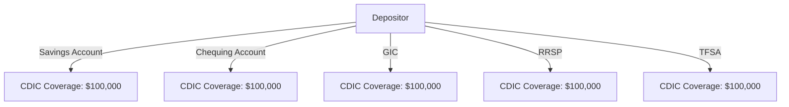

## 3.11 Canada Deposit Insurance Corporation (CDIC)

The Canada Deposit Insurance Corporation (CDIC) plays a crucial role in maintaining the stability and confidence in the Canadian financial system. As a federal Crown corporation, CDIC provides deposit insurance to protect eligible deposits at member institutions in the event of a failure. This section delves into the intricacies of CDIC's operations, coverage limits, and the benefits it offers to depositors.

### Understanding the Role of CDIC

The CDIC was established in 1967 to safeguard the savings of Canadians in the event of a bank failure. It insures deposits at member financial institutions, which include banks, trust companies, and loan companies. By providing this insurance, CDIC helps maintain public confidence in the Canadian banking system, contributing to its overall stability.

CDIC's primary role is to protect depositors by reimbursing them for their insured deposits if a member institution fails. This protection is crucial for maintaining trust in the financial system, as it assures depositors that their savings are secure even in times of financial distress.

### Coverage Limits and Types of Deposits Insured

CDIC insures eligible deposits up to $100,000 per depositor, per insured category, at each member institution. This coverage limit applies to both principal and interest combined. It's important to note that CDIC insurance is automatic and free; depositors do not need to apply for it.

#### Types of Deposits Covered

CDIC covers a variety of deposit types, including:

- **Savings Accounts:** Traditional savings accounts held at member institutions.
- **Chequing Accounts:** Everyday transaction accounts used for managing personal finances.
- **Term Deposits:** Includes Guaranteed Investment Certificates (GICs) with terms of five years or less.
- **Foreign Currency Deposits:** Deposits held in foreign currencies, such as U.S. dollars, are also insured.
- **Registered Accounts:** Deposits in Registered Retirement Savings Plans (RRSPs), Tax-Free Savings Accounts (TFSAs), and Registered Retirement Income Funds (RRIFs) are covered separately.

However, CDIC does not insure mutual funds, stocks, bonds, or other investment products. It's essential for depositors to understand which of their assets are covered to make informed financial decisions.

### Eligibility Criteria for CDIC Insurance

To be eligible for CDIC insurance, deposits must meet specific criteria:

1. **Held at a Member Institution:** The deposit must be with a CDIC member institution. Most major Canadian banks and financial institutions are members.
2. **Canadian Dollar Denomination:** Deposits must be in Canadian dollars, except for foreign currency deposits, which are also covered.
3. **Payable in Canada:** The deposit must be payable in Canada to qualify for insurance.

Depositors benefit from CDIC insurance as it provides peace of mind and financial security. In the unlikely event of a bank failure, CDIC ensures that depositors receive their insured funds promptly, minimizing financial disruption.

### Practical Examples and Case Studies

To illustrate the importance of CDIC insurance, consider the following scenario:

**Case Study: The Collapse of a Small Canadian Bank**

Imagine a small Canadian bank, "Maple Trust," faces financial difficulties due to poor investment decisions and economic downturns. As a result, Maple Trust is unable to meet its obligations and is declared insolvent. Depositors at Maple Trust, who have savings accounts, GICs, and RRSPs, are understandably concerned about their funds.

Thanks to CDIC insurance, depositors with eligible deposits at Maple Trust are protected up to $100,000 per insured category. This means that an individual with a savings account, a GIC, and an RRSP at Maple Trust could potentially receive up to $300,000 in insured funds, assuming each account holds $100,000 or more. CDIC steps in to reimburse depositors, ensuring their financial security despite the bank's failure.

### Visualizing CDIC Coverage

To better understand how CDIC coverage works, consider the following diagram:

This diagram illustrates how a depositor's various accounts are insured separately, each up to $100,000, providing comprehensive protection across different account types.

### Best Practices and Common Pitfalls

When managing deposits, it's essential to be aware of best practices and potential pitfalls:

- **Diversify Deposits:** Spread deposits across different member institutions to maximize CDIC coverage.
- **Understand Coverage Limits:** Be aware of the $100,000 limit per insured category to avoid exceeding coverage.
- **Stay Informed:** Regularly review the CDIC website and resources to stay updated on coverage details and member institutions.

### Additional Resources

For further exploration of CDIC and its coverage, consider the following resources:

- [CDIC Insurance Details](https://www.cdic.ca/en/Pages/default.aspx)
- [CDIC Coverage Guide](https://www.cdic.ca/en/deposit-insurance/what-is-deposit-insurance/)

These resources provide comprehensive information on CDIC's operations, coverage, and member institutions, helping depositors make informed decisions.

### Conclusion

The Canada Deposit Insurance Corporation (CDIC) is a vital component of the Canadian financial system, providing essential protection for depositors. By understanding CDIC's role, coverage limits, and eligibility criteria, depositors can confidently manage their finances, knowing their savings are secure. As you navigate the Canadian financial landscape, remember to leverage CDIC's resources and best practices to optimize your financial security.

### **Ready to Test Your Knowledge?**

**Practice 10 Essential CSC Exam Questions to Master Your Certification**



### What is the primary role of the Canada Deposit Insurance Corporation (CDIC)?

- [x] To insure deposits at member institutions in case of a failure
- [ ] To provide loans to financial institutions
- [ ] To regulate interest rates on savings accounts
- [ ] To offer investment advice to depositors

> **Explanation:** CDIC's primary role is to insure deposits at member institutions, protecting depositors in the event of a bank failure.

### What is the maximum coverage limit per depositor per insured category at a CDIC member institution?

- [x] $100,000
- [ ] $50,000
- [ ] $150,000
- [ ] $200,000

> **Explanation:** CDIC insures eligible deposits up to $100,000 per depositor, per insured category, at each member institution.

### Which of the following types of deposits are covered by CDIC insurance?

- [x] Savings accounts
- [x] Chequing accounts
- [ ] Mutual funds
- [ ] Stocks

> **Explanation:** CDIC covers savings and chequing accounts but does not insure mutual funds or stocks.

### Which of the following is NOT a criterion for CDIC insurance eligibility?

- [ ] Held at a member institution
- [ ] Canadian dollar denomination
- [ ] Payable in Canada
- [x] Investment in mutual funds

> **Explanation:** CDIC does not insure mutual funds; it insures eligible deposits like savings and chequing accounts.

### How can depositors maximize their CDIC coverage?

- [x] By spreading deposits across different member institutions
- [ ] By investing in mutual funds
- [ ] By holding all deposits in one account
- [ ] By converting deposits to foreign currency

> **Explanation:** Depositors can maximize CDIC coverage by spreading deposits across different member institutions, each insured up to $100,000.

### What happens to deposits in foreign currencies under CDIC insurance?

- [x] They are insured
- [ ] They are not insured
- [ ] They are insured only if converted to Canadian dollars
- [ ] They are insured up to $50,000

> **Explanation:** CDIC insures deposits in foreign currencies, such as U.S. dollars, up to the coverage limit.

### Which of the following accounts are insured separately by CDIC?

- [x] RRSPs
- [x] TFSAs
- [ ] Mutual funds
- [ ] Stocks

> **Explanation:** CDIC insures RRSPs and TFSAs separately, but not mutual funds or stocks.

### What is the benefit of CDIC insurance to depositors?

- [x] Financial security in case of a bank failure
- [ ] Higher interest rates on deposits
- [ ] Access to exclusive investment opportunities
- [ ] Free financial planning services

> **Explanation:** CDIC insurance provides financial security by reimbursing depositors for insured deposits if a member institution fails.

### Which of the following is a best practice for managing deposits with CDIC insurance?

- [x] Regularly review CDIC resources and coverage details
- [ ] Invest all savings in mutual funds
- [ ] Keep all deposits in one account
- [ ] Convert all deposits to foreign currency

> **Explanation:** Regularly reviewing CDIC resources and coverage details helps depositors stay informed and manage their deposits effectively.

### True or False: CDIC insurance is automatic and free for eligible deposits.

- [x] True
- [ ] False

> **Explanation:** CDIC insurance is automatic and free for eligible deposits at member institutions, providing peace of mind to depositors.


