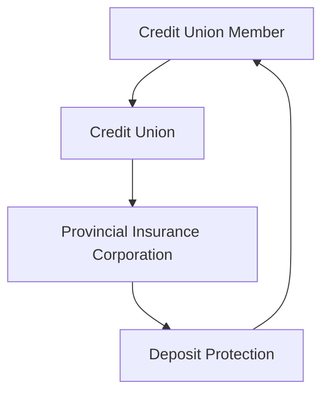

## 3.12 Provincial Insurance Corporations

In the Canadian financial landscape, provincial insurance corporations play a crucial role in safeguarding the deposits of credit union members. These organizations ensure that members' savings are protected, fostering trust and stability within the financial system. This section delves into the functions of provincial insurance corporations, the variations in coverage across provinces, and the importance of verifying insurance details for accurate protection.

### Understanding Provincial Insurance Corporations

**Provincial Insurance Corporations** are entities established by provincial governments to provide deposit insurance for credit union members. Unlike banks, which are federally regulated and insured by the Canada Deposit Insurance Corporation (CDIC), credit unions fall under provincial jurisdiction. Each province has its own insurance corporation responsible for protecting the deposits of credit union members within its borders.

### Role in Protecting Credit Union Members' Deposits

The primary role of provincial insurance corporations is to protect the deposits of credit union members. This protection is vital for maintaining confidence in the financial system, as it assures members that their savings are secure even if a credit union faces financial difficulties. The insurance coverage typically includes savings accounts, chequing accounts, term deposits, and other similar financial products offered by credit unions.

### Variations in Coverage and Terminology Across Provinces

One of the complexities in understanding provincial insurance corporations is the variation in coverage and terminology across different provinces. Each province has its own set of rules, coverage limits, and terminologies, which can lead to confusion among credit union members. Here are some examples of these variations:

- **British Columbia:** The Credit Union Deposit Insurance Corporation of British Columbia (CUDIC) provides unlimited deposit insurance coverage for all deposits held in B.C. credit unions.
- **Ontario:** The Financial Services Regulatory Authority of Ontario (FSRA) offers deposit insurance coverage up to $250,000 per insured category.
- **Alberta:** The Credit Union Deposit Guarantee Corporation (CUDGC) provides unlimited deposit insurance coverage for deposits in Alberta credit unions.

These differences highlight the importance of understanding the specific terms and conditions applicable in each province.

### Importance of Verifying Provincial Insurance Details

Given the variations in coverage and terminology, it is crucial for credit union members to verify the details of their provincial insurance coverage. This verification ensures that members are fully aware of the extent of their protection and can make informed decisions about their savings. Members should regularly check with their credit union and the relevant provincial insurance corporation to stay updated on any changes in coverage or regulations.

### Practical Example: Comparing Provincial Insurance Coverage

Consider a credit union member with deposits in both Ontario and British Columbia. In Ontario, their deposits are insured up to $250,000 per insured category, while in British Columbia, their deposits enjoy unlimited coverage. This difference could influence the member's decision on where to hold larger sums of money, depending on their risk tolerance and financial goals.

### Step-by-Step Guidance for Verifying Insurance Coverage

1. **Identify Your Credit Union's Province:** Determine the province in which your credit union operates, as this will dictate the applicable insurance corporation.
2. **Visit the Provincial Insurance Corporation's Website:** Access the official website of the provincial insurance corporation to review the coverage details.
3. **Contact Your Credit Union:** Speak with a representative at your credit union to confirm the insurance coverage and any specific terms that may apply.
4. **Stay Informed:** Regularly check for updates or changes in coverage limits or regulations that may affect your deposits.

### Diagrams and Visual Aids

To enhance understanding, consider the following diagram illustrating the relationship between credit unions, provincial insurance corporations, and deposit protection:

This diagram shows the flow of protection from the credit union member to the provincial insurance corporation, which ensures deposit protection.

### Best Practices and Common Pitfalls

**Best Practices:**
- Regularly verify your deposit insurance coverage.
- Understand the specific terms and conditions of your province's insurance corporation.
- Diversify your deposits if necessary to maximize insurance coverage.

**Common Pitfalls:**
- Assuming all credit union deposits are insured in the same way as bank deposits.
- Failing to stay informed about changes in provincial insurance regulations.

### References and Additional Resources

For further exploration of provincial insurance corporations and their regulations, consider the following resources:

- [Financial Consumer Agency of Canada on Provincial Insurers](http://www.fcac-acfc.gc.ca/Eng/forConsumers/topics/banking/Pages/Provinci-Assureur.aspx)
- [List of Provincial Insurance Corporations](https://www.canada.ca/en/financial-consumer-agency/services/savings-investing/deposit-insurance.html)

These resources provide comprehensive information on the various provincial insurance corporations and their roles in protecting credit union members' deposits.

### Encouraging Application of Financial Principles

Understanding the role of provincial insurance corporations is essential for making informed financial decisions. By verifying insurance coverage and staying informed about provincial regulations, credit union members can ensure their deposits are adequately protected. This knowledge empowers members to optimize their savings strategies and enhance their financial security.

### **Ready to Test Your Knowledge?**

**Practice 10 Essential CSC Exam Questions to Master Your Certification**



### What is the primary role of provincial insurance corporations?

- [x] To protect the deposits of credit union members
- [ ] To regulate all financial institutions in Canada
- [ ] To provide loans to credit union members
- [ ] To manage investment portfolios for credit unions

> **Explanation:** Provincial insurance corporations are responsible for protecting the deposits of credit union members within their respective provinces.

### Which province offers unlimited deposit insurance coverage for credit union deposits?

- [x] British Columbia
- [ ] Ontario
- [ ] Alberta
- [ ] Quebec

> **Explanation:** British Columbia provides unlimited deposit insurance coverage for all deposits held in B.C. credit unions.

### Why is it important to verify provincial insurance details?

- [x] To ensure accurate protection of deposits
- [ ] To increase the interest rate on deposits
- [ ] To qualify for additional loans
- [ ] To avoid paying taxes on deposits

> **Explanation:** Verifying provincial insurance details ensures that credit union members are aware of the extent of their deposit protection.

### What is the coverage limit for credit union deposits in Ontario?

- [x] $250,000 per insured category
- [ ] Unlimited coverage
- [ ] $100,000 per account
- [ ] $500,000 per insured category

> **Explanation:** In Ontario, the deposit insurance coverage is up to $250,000 per insured category.

### Which organization provides deposit insurance for federally regulated banks in Canada?

- [x] Canada Deposit Insurance Corporation (CDIC)
- [ ] Financial Services Regulatory Authority of Ontario (FSRA)
- [ ] Credit Union Deposit Insurance Corporation of British Columbia (CUDIC)
- [ ] Credit Union Deposit Guarantee Corporation (CUDGC)

> **Explanation:** The Canada Deposit Insurance Corporation (CDIC) provides deposit insurance for federally regulated banks in Canada.

### What should credit union members do to stay informed about their deposit insurance coverage?

- [x] Regularly check with their credit union and provincial insurance corporation
- [ ] Only rely on information from friends and family
- [ ] Assume all deposits are insured equally
- [ ] Ignore changes in regulations

> **Explanation:** Credit union members should regularly check with their credit union and provincial insurance corporation to stay informed about their deposit insurance coverage.

### How can credit union members maximize their insurance coverage?

- [x] Diversify their deposits across different insured categories
- [ ] Keep all deposits in one account
- [ ] Withdraw all funds and hold them in cash
- [ ] Invest in high-risk financial products

> **Explanation:** By diversifying their deposits across different insured categories, credit union members can maximize their insurance coverage.

### What is a common pitfall regarding provincial insurance coverage?

- [x] Assuming all credit union deposits are insured in the same way as bank deposits
- [ ] Regularly verifying insurance coverage
- [ ] Understanding provincial regulations
- [ ] Diversifying deposits

> **Explanation:** A common pitfall is assuming that all credit union deposits are insured in the same way as bank deposits, which is not the case due to provincial variations.

### What is the relationship between credit unions and provincial insurance corporations?

- [x] Provincial insurance corporations provide deposit protection for credit union members
- [ ] Credit unions regulate provincial insurance corporations
- [ ] Provincial insurance corporations offer loans to credit unions
- [ ] Credit unions insure provincial insurance corporations

> **Explanation:** Provincial insurance corporations provide deposit protection for credit union members, ensuring their savings are secure.

### True or False: All provinces in Canada offer the same deposit insurance coverage for credit unions.

- [ ] True
- [x] False

> **Explanation:** False. Each province has its own set of rules, coverage limits, and terminologies for deposit insurance, leading to variations across provinces.


