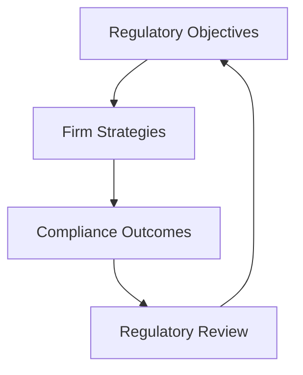

## 3.14 Principles-Based Regulation

In the ever-evolving landscape of financial regulation, the debate between principles-based and rules-based approaches remains pivotal. Understanding these regulatory frameworks is crucial for financial professionals navigating the Canadian market. This section delves into principles-based regulation, contrasting it with rules-based regulation, and explores its advantages and challenges within the Canadian context.

### Understanding Principles-Based Regulation

**Principles-Based Regulation** is a regulatory approach that sets broad objectives and allows firms the flexibility to determine how best to achieve compliance. This method emphasizes outcomes rather than prescriptive rules, encouraging firms to develop innovative solutions that align with regulatory goals. In contrast, **Rules-Based Regulation** prescribes specific rules and standards that firms must follow, leaving little room for interpretation or flexibility.

### Principles-Based vs. Rules-Based Regulation

To better understand these approaches, let's compare their characteristics:

| Aspect                     | Principles-Based Regulation                                | Rules-Based Regulation                                    |
|----------------------------|------------------------------------------------------------|-----------------------------------------------------------|
| **Flexibility**            | High - Firms have discretion in achieving compliance       | Low - Firms must adhere to specific rules                  |
| **Innovation**             | Encourages innovative solutions                            | Limits innovation due to rigid rules                       |
| **Compliance Costs**       | Potentially lower due to flexibility                       | Potentially higher due to detailed requirements            |
| **Interpretation**         | Requires subjective judgment                               | Clear and objective                                       |
| **Adaptability**           | Easily adaptable to new circumstances                      | Slow to adapt due to need for rule changes                 |
| **Enforcement**            | Focuses on outcomes and principles                         | Focuses on rule adherence                                  |

### Advantages of Principles-Based Regulation

1. **Flexibility**: One of the primary advantages of principles-based regulation is its flexibility. Firms can tailor their compliance strategies to their specific circumstances, fostering a more dynamic and responsive regulatory environment. This flexibility is particularly beneficial in rapidly changing markets where rigid rules may quickly become obsolete.

2. **Reduced Compliance Costs**: By allowing firms to determine the most efficient way to meet regulatory objectives, principles-based regulation can lead to reduced compliance costs. Firms can allocate resources more effectively, focusing on achieving outcomes rather than merely ticking boxes.

3. **Encouragement of Innovation**: With the freedom to interpret and apply principles, firms are encouraged to innovate. This can lead to the development of new products, services, and processes that not only comply with regulations but also enhance competitiveness.

### Challenges of Principles-Based Regulation

1. **Subjective Judgment**: The flexibility of principles-based regulation can also be a drawback. It requires firms and regulators to exercise subjective judgment, which can lead to inconsistencies in interpretation and enforcement. This subjectivity can create uncertainty for firms trying to ensure compliance.

2. **Documentation Requirements**: To demonstrate compliance with broad principles, firms often need to maintain extensive documentation. This can offset some of the cost savings associated with reduced compliance requirements and can be burdensome for smaller firms.

3. **Potential for Regulatory Arbitrage**: The flexibility inherent in principles-based regulation can sometimes be exploited by firms seeking to circumvent regulatory intent. This requires vigilant oversight by regulators to ensure that firms are genuinely adhering to the spirit of the regulations.

### Practical Examples and Case Studies

#### Canadian Pension Funds

Canadian pension funds, such as the Canada Pension Plan Investment Board (CPPIB), often operate under principles-based regulatory frameworks. This allows them to pursue diverse investment strategies that align with their long-term objectives while ensuring compliance with overarching regulatory principles.

#### Major Canadian Banks

Major Canadian banks like RBC and TD have leveraged principles-based regulation to innovate in areas such as digital banking and financial technology. By focusing on regulatory outcomes, these institutions have been able to develop new services that meet customer needs while adhering to regulatory standards.

### Diagram: Principles-Based Regulation Framework

Below is a diagram illustrating the principles-based regulation framework, highlighting the relationship between regulatory objectives, firm strategies, and compliance outcomes.

### Best Practices and Common Pitfalls

**Best Practices:**

- **Engage with Regulators**: Maintain open communication with regulators to ensure alignment on compliance expectations.
- **Focus on Outcomes**: Prioritize achieving regulatory outcomes over merely following processes.
- **Document Thoroughly**: Keep comprehensive records to demonstrate compliance with principles.

**Common Pitfalls:**

- **Over-Reliance on Flexibility**: Avoid exploiting regulatory flexibility in ways that undermine regulatory intent.
- **Inconsistent Interpretation**: Ensure consistent interpretation of principles across the organization to avoid compliance issues.

### References and Further Exploration

For those interested in exploring principles-based regulation further, consider the following resources:

- [Understanding Principles-Based Regulation](https://www.investopedia.com/terms/p/principles-based-regulation.asp)
- [CSA Principles-Based Approach](https://www.securities-administrators.ca/)

### Conclusion

Principles-based regulation offers a flexible and innovative approach to financial regulation, particularly suited to the dynamic Canadian financial landscape. While it presents challenges, such as subjective judgment and documentation requirements, its advantages in terms of flexibility and reduced compliance costs make it a valuable framework for many financial institutions. By understanding and effectively implementing principles-based regulation, financial professionals can navigate the complexities of the Canadian regulatory environment with confidence.

### **Ready to Test Your Knowledge?**

**Practice 10 Essential CSC Exam Questions to Master Your Certification**



### What is a key characteristic of principles-based regulation?

- [x] Flexibility in achieving compliance
- [ ] Strict adherence to specific rules
- [ ] High compliance costs
- [ ] Limited innovation

> **Explanation:** Principles-based regulation allows firms flexibility in how they achieve compliance, focusing on outcomes rather than specific rules.

### Which of the following is an advantage of principles-based regulation?

- [x] Encouragement of innovation
- [ ] Increased compliance costs
- [ ] Rigid adherence to rules
- [ ] Limited adaptability

> **Explanation:** Principles-based regulation encourages innovation by allowing firms to develop their own methods for achieving regulatory objectives.

### What is a challenge associated with principles-based regulation?

- [x] Subjective judgment
- [ ] Clear and objective rules
- [ ] High compliance costs
- [ ] Limited flexibility

> **Explanation:** Principles-based regulation requires subjective judgment, which can lead to inconsistencies in interpretation and enforcement.

### How does principles-based regulation impact compliance costs?

- [x] It can reduce compliance costs
- [ ] It increases compliance costs
- [ ] It has no impact on compliance costs
- [ ] It doubles compliance costs

> **Explanation:** By allowing firms to determine the most efficient way to meet regulatory objectives, principles-based regulation can lead to reduced compliance costs.

### Which type of regulation is more adaptable to new circumstances?

- [x] Principles-Based Regulation
- [ ] Rules-Based Regulation
- [ ] Both are equally adaptable
- [ ] Neither is adaptable

> **Explanation:** Principles-based regulation is more adaptable to new circumstances due to its flexible nature.

### What is a common pitfall of principles-based regulation?

- [x] Over-reliance on flexibility
- [ ] Strict adherence to rules
- [ ] High compliance costs
- [ ] Limited innovation

> **Explanation:** Over-reliance on flexibility can lead to regulatory arbitrage, where firms exploit the flexibility to circumvent regulatory intent.

### Which Canadian institution benefits from principles-based regulation?

- [x] Canada Pension Plan Investment Board (CPPIB)
- [ ] U.S. Federal Reserve
- [ ] European Central Bank
- [ ] Bank of Japan

> **Explanation:** The CPPIB operates under principles-based regulatory frameworks, allowing it to pursue diverse investment strategies.

### What is a best practice for firms under principles-based regulation?

- [x] Engage with regulators
- [ ] Ignore regulatory outcomes
- [ ] Focus solely on processes
- [ ] Limit documentation

> **Explanation:** Engaging with regulators ensures alignment on compliance expectations and helps firms navigate principles-based regulation effectively.

### What is the focus of principles-based regulation?

- [x] Achieving regulatory outcomes
- [ ] Following specific rules
- [ ] Minimizing innovation
- [ ] Increasing compliance costs

> **Explanation:** Principles-based regulation focuses on achieving regulatory outcomes rather than adhering to specific rules.

### Principles-based regulation is more suitable for which type of market?

- [x] Dynamic and rapidly changing markets
- [ ] Static and unchanging markets
- [ ] Markets with no regulations
- [ ] Markets with strict rules

> **Explanation:** Principles-based regulation is more suitable for dynamic and rapidly changing markets due to its flexibility and adaptability.


