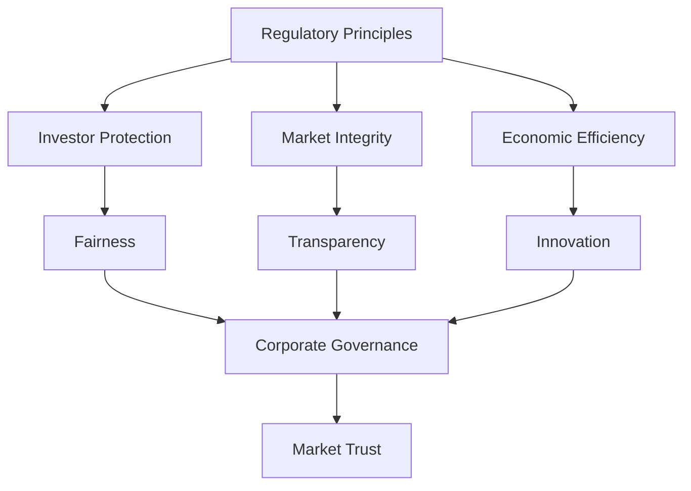

## 3.2 Regulation and Supervision

In the complex landscape of Canadian financial markets, regulation and supervision play pivotal roles in ensuring investor protection, maintaining market integrity, and fostering economic stability. This section delves into the principles underlying securities legislation, the purpose of securities regulation, and the frameworks that guide corporate governance within the industry.

### Understanding Principles Underlying Securities Legislation

Securities legislation in Canada is built upon core principles designed to protect investors and maintain the integrity of the financial markets. These principles include:

- **Investor Protection:** Ensuring that investors have access to accurate information and are safeguarded against fraudulent practices.
- **Market Integrity:** Maintaining fair and efficient markets where all participants have equal access to information.
- **Economic Efficiency:** Facilitating capital formation and economic growth by ensuring that markets operate smoothly.
- **Fairness and Transparency:** Ensuring that all market participants operate under a clear set of rules and that information is disclosed in a timely and accurate manner.

These principles aim to strike a balance between regulation and market flexibility, fostering innovation and competitiveness while safeguarding the interests of investors. The role of case law and statutory provisions is crucial in shaping regulatory practices, as they provide the legal framework and precedents that guide regulatory decisions.

### Explore the Purpose of Securities Regulation

The primary goals of securities regulation are multifaceted, encompassing consumer protection, fairness, economic stability, and social objectives. Key purposes include:

- **Consumer Protection:** Ensuring that investors are informed and protected from unfair practices.
- **Fairness:** Promoting equitable treatment of all market participants.
- **Economic Stability:** Contributing to the overall stability of the financial system by preventing systemic risks.
- **Social Objectives:** Supporting broader societal goals, such as promoting sustainable investment practices.

Regulation ensures that market participants operate transparently and ethically, fostering trust and confidence in the financial system. Structural changes in the securities industry, such as technological advancements and globalization, have heightened the need for adaptive regulatory frameworks. Inadequate regulation can lead to diminished market trust and reduced investor participation, highlighting the importance of robust regulatory oversight.

### Examine Principles-Based Regulation

Principles-based regulation is a flexible approach that sets broad objectives for firms to achieve, as opposed to the detailed prescriptions of rules-based regulation. This approach offers several advantages:

- **Flexibility:** Allows firms to tailor their compliance strategies to their specific circumstances.
- **Innovation:** Encourages creative solutions and adaptation to new challenges.
- **Responsiveness:** Enables regulators to address emerging risks without the need for constant rule changes.

However, principles-based regulation also presents challenges, such as the difficulty firms may face in interpreting broad principles and ensuring consistent compliance. Internal compliance systems become crucial in navigating this regulatory environment, as they help firms align their practices with regulatory expectations.

### Assess the Role of Corporate Governance

Corporate governance refers to the system of rules, practices, and processes by which a company is directed and controlled. In the securities industry, strong corporate governance is essential for promoting ethical behavior and maintaining market integrity. Key aspects include:

- **Board Oversight:** Ensuring that the board of directors effectively oversees management and protects shareholder interests.
- **Transparency:** Providing clear and accurate information to stakeholders.
- **Accountability:** Holding management accountable for their actions and decisions.

The relationship between corporate governance and regulatory compliance is symbiotic, as strong governance practices support compliance efforts and vice versa. Poor corporate governance can lead to significant repercussions, such as financial scandals or loss of investor confidence, underscoring the need for robust governance frameworks.

### Glossary

- **Principles-Based Regulation:** A regulatory approach where broad objectives are set, allowing firms flexibility in how to achieve them.
- **Rules-Based Regulation:** A regulatory approach that involves specific, detailed rules that firms must follow.
- **Corporate Governance:** The system of rules, practices, and processes by which a company is directed and controlled.
- **Market Integrity:** The maintenance of fair, transparent, and efficient markets where all participants have equal access to information.
- **Case Law:** Law established by the outcome of former cases that sets precedent for future cases.
- **Statutory Provisions:** Specific sections or clauses within a statute that outline legal requirements and obligations.

### Practical Examples and Case Studies

To illustrate these concepts, consider the following examples:

- **Canadian Pension Funds:** These funds often employ sophisticated investment strategies that require adherence to regulatory principles to ensure the protection of beneficiaries' interests.
- **Major Canadian Banks (e.g., RBC, TD):** These institutions are subject to stringent corporate governance standards to maintain investor confidence and market stability.

### Diagrams and Visual Aids

Below is a diagram illustrating the relationship between regulatory principles, corporate governance, and market integrity:

### Best Practices and Common Challenges

- **Best Practices:** Implement robust internal compliance systems, foster a culture of transparency, and ensure board accountability.
- **Common Challenges:** Navigating the complexities of principles-based regulation and maintaining consistent compliance across diverse operations.

### Encouragement for Continuous Learning

As the financial landscape evolves, continuous learning and adaptation are crucial. Engage with additional resources, such as official Canadian financial regulations, open-source financial tools, and online courses, to deepen your understanding and stay informed.

## Quiz Time!



### What is the primary goal of securities regulation?

- [x] Protect investors and maintain market integrity
- [ ] Maximize corporate profits
- [ ] Minimize government intervention
- [ ] Eliminate all market risks

> **Explanation:** The primary goal of securities regulation is to protect investors and maintain market integrity, ensuring fair and transparent markets.

### Which regulatory approach allows firms flexibility in achieving broad objectives?

- [x] Principles-Based Regulation
- [ ] Rules-Based Regulation
- [ ] Statutory Regulation
- [ ] Case Law Regulation

> **Explanation:** Principles-based regulation sets broad objectives, allowing firms flexibility in how they achieve them.

### What is a key advantage of principles-based regulation?

- [x] Flexibility and innovation
- [ ] Detailed compliance requirements
- [ ] Reduced need for internal compliance systems
- [ ] Guaranteed market stability

> **Explanation:** Principles-based regulation offers flexibility and encourages innovation by allowing firms to tailor their compliance strategies.

### What role does corporate governance play in the securities industry?

- [x] Promotes ethical behavior and market integrity
- [ ] Increases regulatory burdens
- [ ] Guarantees financial success
- [ ] Eliminates market competition

> **Explanation:** Corporate governance promotes ethical behavior and market integrity by ensuring accountability and transparency.

### How does poor corporate governance affect the industry?

- [x] Leads to financial scandals and loss of investor confidence
- [ ] Guarantees higher profits
- [ ] Reduces regulatory oversight
- [ ] Increases market competition

> **Explanation:** Poor corporate governance can lead to financial scandals and loss of investor confidence, impacting the entire industry.

### What is the relationship between corporate governance and regulatory compliance?

- [x] Symbiotic, supporting each other
- [ ] Independent, with no interaction
- [ ] Conflicting, with opposing goals
- [ ] Redundant, with overlapping functions

> **Explanation:** Corporate governance and regulatory compliance have a symbiotic relationship, supporting each other to ensure ethical practices.

### What is market integrity?

- [x] Maintenance of fair, transparent, and efficient markets
- [ ] Maximization of corporate profits
- [ ] Elimination of all market risks
- [ ] Reduction of regulatory oversight

> **Explanation:** Market integrity involves maintaining fair, transparent, and efficient markets where all participants have equal access to information.

### What is a statutory provision?

- [x] A specific section or clause within a statute outlining legal requirements
- [ ] A general principle guiding regulatory practices
- [ ] A case law precedent
- [ ] An internal compliance policy

> **Explanation:** A statutory provision is a specific section or clause within a statute that outlines legal requirements and obligations.

### What is the impact of inadequate regulation on the market?

- [x] Diminished trust and reduced investor participation
- [ ] Increased market efficiency
- [ ] Guaranteed economic stability
- [ ] Enhanced corporate profits

> **Explanation:** Inadequate regulation can lead to diminished trust and reduced investor participation, undermining market stability.

### Principles-based regulation is more flexible than rules-based regulation.

- [x] True
- [ ] False

> **Explanation:** Principles-based regulation is indeed more flexible, allowing firms to adapt their compliance strategies to meet broad objectives.


