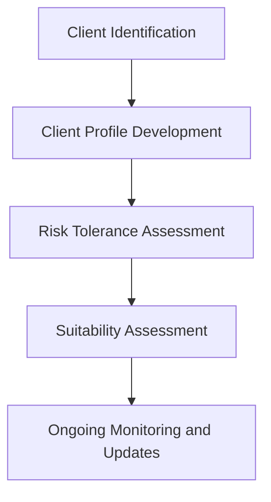

---

linkTitle: "3.19 Know Your Client (KYC) Rule"
title: "Know Your Client (KYC) Rule: Essential for Securities Regulation"
description: "Explore the critical role of the Know Your Client (KYC) rule in Canadian securities regulation, including steps for compliance, its impact on suitability assessments, and fraud prevention."
categories:
- Canadian Securities
- Regulatory Compliance
- Financial Services
tags:
- KYC
- Securities Regulation
- Client Suitability
- Fraud Prevention
- Canadian Finance
date: 2024-10-25
type: docs
nav_weight: 500000
canonical: "https://securitiesexamsmastery.ca/13/3/20"
license: "© 2023 Tokenizer Inc. CC BY-NC-SA 4.0"
---

## 3.19 Know Your Client (KYC) Rule

The Know Your Client (KYC) rule is a cornerstone of securities regulation in Canada, playing a pivotal role in ensuring that financial advisors and institutions act in the best interests of their clients. This rule mandates the collection and verification of essential client information to assess the suitability of investment products and services. By understanding the client's financial situation, investment knowledge, and risk tolerance, financial professionals can provide tailored advice that aligns with the client's goals and regulatory requirements.

### Importance of the KYC Rule in Securities Regulation

The KYC rule is integral to maintaining the integrity and stability of the financial markets. It serves several critical functions:

1. **Client Protection:** By ensuring that investment recommendations are suitable for the client's financial situation and risk tolerance, the KYC rule protects clients from unsuitable investments that could lead to financial loss.

2. **Fraud Prevention:** KYC processes help prevent fraudulent activities by verifying the identity of clients and ensuring that they are legitimate. This reduces the risk of money laundering and other financial crimes.

3. **Regulatory Compliance:** Adhering to KYC requirements is essential for compliance with Canadian securities regulations, such as those enforced by the Canadian Investment Regulatory Organization (CIRO) and the Investment Industry Regulatory Organization of Canada (IIROC).

4. **Market Integrity:** By ensuring that all market participants are legitimate and that their transactions are transparent, the KYC rule helps maintain trust in the financial system.

### Steps Involved in Performing KYC

Performing KYC involves several key steps, each designed to gather and verify comprehensive information about the client:

1. **Client Identification:**
   - Collect basic personal information, including name, address, date of birth, and occupation.
   - Verify identity using government-issued identification, such as a passport or driver's license.

2. **Client Profile Development:**
   - Gather detailed information about the client's financial situation, including income, assets, liabilities, and net worth.
   - Assess the client's investment knowledge and experience to determine their understanding of financial markets and products.

3. **Risk Tolerance Assessment:**
   - Evaluate the client's risk tolerance through questionnaires or interviews, considering factors such as investment goals, time horizon, and comfort with market volatility.

4. **Suitability Assessment:**
   - Analyze the collected information to determine the suitability of various investment products and strategies for the client.
   - Document the rationale for investment recommendations, ensuring they align with the client's profile and regulatory requirements.

5. **Ongoing Monitoring and Updates:**
   - Regularly review and update client information to reflect changes in their financial situation or investment objectives.
   - Maintain open communication with clients to ensure their needs and preferences are continuously met.

### Role of KYC in Suitability Assessments and Fraud Prevention

The KYC rule is crucial in conducting suitability assessments, which are essential for providing personalized investment advice. By thoroughly understanding a client's financial situation and risk tolerance, financial advisors can recommend products that are appropriate and beneficial for the client. This not only enhances client satisfaction but also reduces the risk of regulatory penalties for unsuitable recommendations.

In terms of fraud prevention, KYC processes act as a first line of defense against financial crimes. By verifying client identities and monitoring transactions, financial institutions can detect and prevent suspicious activities, such as money laundering or identity theft. This is particularly important in today's digital age, where cyber threats are increasingly sophisticated.

### Practical Example: KYC in Action

Consider a scenario involving a Canadian financial advisor working with a new client, Jane. Jane is a 45-year-old professional with a moderate risk tolerance and a goal of saving for retirement in 20 years. During the KYC process, the advisor collects Jane's personal and financial information, assesses her investment knowledge, and evaluates her risk tolerance. Based on this information, the advisor recommends a diversified portfolio of mutual funds and bonds that align with Jane's long-term goals and risk profile.

This example illustrates how the KYC rule enables advisors to provide tailored advice that meets the client's needs while ensuring compliance with regulatory standards.

### Diagrams and Visual Aids

To further illustrate the KYC process, consider the following flowchart depicting the steps involved:

This diagram provides a visual representation of the sequential steps involved in performing KYC, highlighting the importance of each stage in ensuring comprehensive client understanding and regulatory compliance.

### References and Additional Resources

For further exploration of KYC requirements and best practices, consider the following resources:

- [IIROC KYC Requirements](https://www.iiroc.ca/regulation/guidance-material/kickendoor): Official guidelines from the Investment Industry Regulatory Organization of Canada.
- Canadian Securities Administrators (CSA): Provides comprehensive information on securities regulation in Canada.
- Open-source financial tools and frameworks: Explore tools like KYC software solutions that streamline the client onboarding process.

### Conclusion

The Know Your Client (KYC) rule is a fundamental aspect of securities regulation, ensuring that financial professionals act in the best interests of their clients while maintaining market integrity. By following the steps outlined in this chapter, financial advisors can effectively gather and verify client information, conduct suitability assessments, and prevent fraudulent activities. As the financial landscape continues to evolve, staying informed about KYC requirements and best practices is essential for success in the Canadian securities industry.

### **Ready to Test Your Knowledge?**

**Practice 10 Essential CSC Exam Questions to Master Your Certification**



### What is the primary purpose of the Know Your Client (KYC) rule?

- [x] To ensure investment recommendations are suitable for the client
- [ ] To maximize the financial institution's profits
- [ ] To simplify the client onboarding process
- [ ] To reduce paperwork for financial advisors

> **Explanation:** The KYC rule is designed to ensure that investment recommendations are suitable for the client's financial situation and risk tolerance.

### Which of the following is NOT a step in the KYC process?

- [ ] Client Identification
- [ ] Risk Tolerance Assessment
- [ ] Suitability Assessment
- [x] Product Promotion

> **Explanation:** Product promotion is not a step in the KYC process, which focuses on gathering and verifying client information.

### How does the KYC rule help prevent fraud?

- [x] By verifying client identities and monitoring transactions
- [ ] By increasing investment returns
- [ ] By reducing the number of clients
- [ ] By simplifying regulatory compliance

> **Explanation:** KYC processes help prevent fraud by verifying client identities and monitoring transactions for suspicious activities.

### What is the role of KYC in suitability assessments?

- [x] To ensure investment recommendations align with the client's profile
- [ ] To increase the advisor's commission
- [ ] To reduce the client's investment options
- [ ] To simplify the investment process

> **Explanation:** KYC ensures that investment recommendations align with the client's financial situation and risk tolerance.

### Which organization provides official guidelines for KYC requirements in Canada?

- [x] IIROC
- [ ] SEC
- [ ] FINRA
- [ ] FCA

> **Explanation:** The Investment Industry Regulatory Organization of Canada (IIROC) provides official guidelines for KYC requirements in Canada.

### What information is typically collected during the client identification step of KYC?

- [x] Name, address, date of birth, and occupation
- [ ] Investment preferences and goals
- [ ] Financial institution's profit margins
- [ ] Market trends and forecasts

> **Explanation:** Basic personal information such as name, address, date of birth, and occupation is collected during client identification.

### How often should client information be updated in the KYC process?

- [x] Regularly, to reflect changes in their financial situation
- [ ] Only at the initial meeting
- [ ] Every five years
- [ ] Only when requested by the client

> **Explanation:** Client information should be regularly updated to reflect changes in their financial situation or investment objectives.

### What is a key benefit of conducting a risk tolerance assessment?

- [x] It helps tailor investment recommendations to the client's comfort with market volatility
- [ ] It guarantees high investment returns
- [ ] It reduces the need for client communication
- [ ] It simplifies the investment process

> **Explanation:** A risk tolerance assessment helps tailor investment recommendations to the client's comfort with market volatility.

### True or False: The KYC rule is only applicable to new clients.

- [ ] True
- [x] False

> **Explanation:** The KYC rule applies to both new and existing clients, requiring regular updates to client information.

### What is the main goal of the suitability assessment in the KYC process?

- [x] To determine the appropriateness of investment products for the client
- [ ] To increase the advisor's sales targets
- [ ] To simplify the client's investment portfolio
- [ ] To reduce regulatory oversight

> **Explanation:** The suitability assessment aims to determine the appropriateness of investment products for the client's financial situation and risk tolerance.


