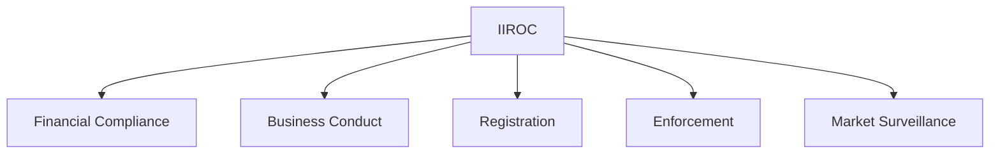

## 3.5 Investment Industry Regulatory Organization of Canada (IIROC)

The Investment Industry Regulatory Organization of Canada (IIROC) plays a pivotal role in maintaining the integrity of the Canadian financial markets. As the national self-regulatory organization, IIROC oversees all investment dealers and trading activities on debt and equity marketplaces in Canada. This section delves into IIROC's mandate, its regulatory functions, and its impact on the Canadian financial landscape.

### IIROC’s Mandate

IIROC's primary mandate is to protect investors and support healthy Canadian capital markets. It achieves this by setting and enforcing high-quality regulatory and investment industry standards. IIROC ensures that investment dealers operate with integrity, transparency, and accountability, fostering investor confidence and market stability.

### IIROC’s Role in Regulatory Standards

IIROC is responsible for establishing and enforcing regulatory standards for its dealer members and their employees. These standards cover various aspects of the investment industry, including financial compliance, business conduct, registration, enforcement, and market surveillance. By setting these standards, IIROC ensures that all market participants adhere to ethical practices and legal requirements, thereby safeguarding the interests of investors and the public.

### Key Functions of IIROC

IIROC's functions are comprehensive and multifaceted, addressing different aspects of the investment industry to ensure a fair and efficient market environment.

#### Financial Compliance

Financial compliance is a cornerstone of IIROC's regulatory framework. IIROC monitors the financial health of its dealer members to ensure they meet minimum capital requirements and maintain adequate risk management practices. This oversight helps prevent financial instability and protects clients' assets.

#### Business Conduct

IIROC sets standards for business conduct to ensure that dealer members act in the best interests of their clients. This includes rules on ethical behavior, conflict of interest management, and fair dealing. IIROC's business conduct standards promote transparency and trust between investment dealers and their clients.

#### Registration

IIROC oversees the registration of investment dealers and their representatives. This process ensures that only qualified individuals and firms are authorized to operate in the Canadian securities market. IIROC's registration requirements include rigorous background checks, proficiency standards, and ongoing education to maintain high levels of competence and professionalism.

#### Enforcement

Enforcement is a critical function of IIROC, aimed at addressing violations of its rules and standards. IIROC conducts investigations and takes disciplinary actions against individuals and firms that breach regulatory requirements. Enforcement actions can include fines, suspensions, or permanent bans, serving as a deterrent against misconduct.

#### Market Surveillance

Market surveillance involves monitoring trading activities to detect and prevent misconduct, such as insider trading, market manipulation, and other fraudulent activities. IIROC employs advanced technology and analytics to oversee trading on Canadian marketplaces, ensuring market integrity and investor protection.

### Practical Examples and Case Studies

To illustrate IIROC's impact, consider the case of a major Canadian bank, such as RBC, which operates under IIROC's regulatory framework. RBC must adhere to IIROC's financial compliance standards, ensuring it maintains sufficient capital reserves and risk management practices. Additionally, RBC's investment advisors are subject to IIROC's business conduct rules, which require them to prioritize clients' interests and provide transparent advice.

Another example is IIROC's market surveillance function, which played a crucial role in detecting unusual trading patterns during a recent market event. By identifying potential insider trading activities, IIROC was able to initiate an investigation, ultimately leading to enforcement actions against the involved parties.

### Best Practices and Common Challenges

Investment dealers and their representatives should prioritize compliance with IIROC's standards to avoid regulatory issues. Best practices include maintaining robust internal controls, conducting regular compliance audits, and fostering a culture of ethical behavior within the organization.

Common challenges include keeping up with evolving regulatory requirements and managing the costs associated with compliance. To address these challenges, firms can leverage technology solutions and seek guidance from compliance experts to streamline their processes and ensure adherence to IIROC's standards.

### Additional Resources

For further exploration of IIROC's regulatory framework and enforcement actions, consider the following resources:

- [IIROC Regulatory Framework](https://www.iiroc.ca/regulation)
- [IIROC Enforcement Actions](https://www.iiroc.ca/enforcement-actions.aspx)

These resources provide valuable insights into IIROC's operations and its role in maintaining the integrity of the Canadian financial markets.

### Glossary

- **IIROC:** The regulatory body that oversees investment dealers and trading activity in Canada.
- **Market Surveillance:** Monitoring trading activities to detect and prevent misconduct.

### Conclusion

IIROC's comprehensive regulatory framework plays a vital role in ensuring the integrity and stability of the Canadian financial markets. By overseeing investment dealers and trading activities, IIROC protects investors and fosters confidence in the market. Understanding IIROC's functions and standards is essential for finance professionals operating in Canada, as it enables them to navigate the regulatory landscape effectively and uphold the highest standards of practice.

### **Ready to Test Your Knowledge?**

**Practice 10 Essential CSC Exam Questions to Master Your Certification**



### What is the primary mandate of IIROC?

- [x] To protect investors and support healthy Canadian capital markets
- [ ] To maximize profits for investment dealers
- [ ] To regulate international trade
- [ ] To manage Canadian monetary policy

> **Explanation:** IIROC's primary mandate is to protect investors and support healthy Canadian capital markets by setting and enforcing regulatory standards.

### Which of the following is NOT a key function of IIROC?

- [ ] Financial Compliance
- [ ] Business Conduct
- [ ] Registration
- [x] Monetary Policy

> **Explanation:** Monetary policy is managed by the Bank of Canada, not IIROC. IIROC's key functions include financial compliance, business conduct, registration, enforcement, and market surveillance.

### How does IIROC ensure market integrity?

- [x] By conducting market surveillance to detect and prevent misconduct
- [ ] By setting interest rates
- [ ] By providing investment advice
- [ ] By issuing government bonds

> **Explanation:** IIROC ensures market integrity through market surveillance, monitoring trading activities to detect and prevent misconduct.

### What action can IIROC take against a dealer member that violates its rules?

- [x] Fines, suspensions, or permanent bans
- [ ] Increase their market share
- [ ] Provide them with a loan
- [ ] Offer them a government contract

> **Explanation:** IIROC can take enforcement actions such as fines, suspensions, or permanent bans against dealer members that violate its rules.

### What is the role of IIROC in the registration process?

- [x] To ensure only qualified individuals and firms are authorized to operate in the securities market
- [ ] To set interest rates for registered firms
- [ ] To provide tax advice to registered firms
- [ ] To manage the marketing strategies of registered firms

> **Explanation:** IIROC oversees the registration process to ensure that only qualified individuals and firms are authorized to operate in the Canadian securities market.

### Which Canadian financial institution must adhere to IIROC's financial compliance standards?

- [x] RBC
- [ ] Bank of England
- [ ] Federal Reserve
- [ ] European Central Bank

> **Explanation:** RBC, as a Canadian financial institution, must adhere to IIROC's financial compliance standards.

### What is a common challenge faced by firms in complying with IIROC's standards?

- [x] Keeping up with evolving regulatory requirements
- [ ] Managing international trade agreements
- [ ] Setting interest rates
- [ ] Developing new financial products

> **Explanation:** A common challenge is keeping up with evolving regulatory requirements and managing the costs associated with compliance.

### What technology does IIROC use for market surveillance?

- [x] Advanced technology and analytics
- [ ] Manual record-keeping
- [ ] Physical inspections
- [ ] Satellite imaging

> **Explanation:** IIROC uses advanced technology and analytics for market surveillance to monitor trading activities effectively.

### What is the purpose of IIROC's business conduct standards?

- [x] To ensure dealer members act in the best interests of their clients
- [ ] To increase dealer members' profits
- [ ] To reduce taxes for dealer members
- [ ] To promote international trade

> **Explanation:** IIROC's business conduct standards ensure that dealer members act in the best interests of their clients, promoting transparency and trust.

### IIROC is responsible for setting and enforcing regulatory standards for investment dealers in Canada.

- [x] True
- [ ] False

> **Explanation:** True. IIROC is responsible for setting and enforcing regulatory standards for investment dealers and their employees in Canada.


