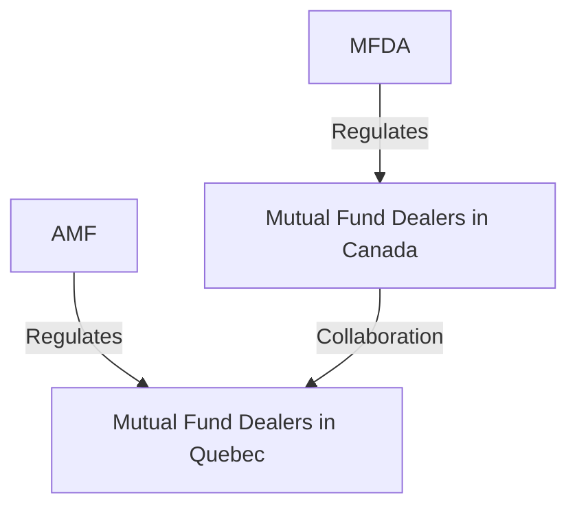

## 3.6 Mutual Fund Dealers Association (MFDA)

The Mutual Fund Dealers Association of Canada (MFDA) plays a pivotal role in the Canadian financial landscape by regulating the distribution and sales of mutual funds. As a self-regulatory organization (SRO), the MFDA ensures that mutual fund dealers adhere to high standards of conduct, thereby safeguarding investor interests and maintaining market integrity. This section delves into the MFDA's responsibilities, jurisdiction, and its relationship with Quebec's regulatory body, the Autorité des marchés financiers (AMF).

### The Role of the MFDA

The MFDA is tasked with overseeing mutual fund dealers across Canada, except in Quebec, where the AMF holds jurisdiction. Established in 1998, the MFDA's primary objective is to enhance investor protection and promote public confidence in the mutual fund industry. By setting and enforcing rules, the MFDA ensures that its member firms operate ethically and transparently.

### Responsibilities of the MFDA

The MFDA's responsibilities encompass several key areas:

1. **Member Admission:** The MFDA sets stringent criteria for admitting new members. Prospective members must demonstrate financial stability, operational competence, and a commitment to ethical conduct. This rigorous admission process helps maintain the integrity of the mutual fund industry.

2. **Auditing and Compliance:** Regular audits and compliance reviews are conducted to ensure that member firms adhere to MFDA rules and regulations. These audits assess financial health, operational practices, and adherence to ethical standards. Non-compliance can result in penalties or suspension.

3. **Rule Enforcement:** The MFDA enforces a comprehensive set of rules designed to protect investors and ensure fair market practices. These rules cover areas such as sales practices, disclosure requirements, and conflict of interest management. The MFDA has the authority to impose fines, suspensions, or expulsion for rule violations.

4. **Penalties and Disciplinary Actions:** When member firms or their representatives breach MFDA rules, the organization can impose disciplinary actions. These may include fines, suspensions, or permanent bans from the industry. Such measures serve as a deterrent against unethical behavior and reinforce the importance of compliance.

### MFDA Jurisdiction and Relationship with the AMF

While the MFDA regulates mutual fund dealers across Canada, its jurisdiction does not extend to Quebec. In Quebec, the AMF serves as the regulatory authority for mutual fund dealers. The MFDA and AMF collaborate to ensure consistent regulatory standards across the country, fostering a cohesive regulatory environment.

The MFDA's jurisdictional boundaries are illustrated in the following diagram:

### MFDA Investor Protection Corporation (MFDA IPC)

The MFDA IPC provides an additional layer of protection for investors. It offers coverage to clients of MFDA member firms in the event of insolvency. This protection is crucial for maintaining investor confidence and ensuring the stability of the mutual fund industry.

For more information on MFDA IPC coverage, visit the [MFDA IPC Coverage](http://mfda.ca/mfda-investor-protection-corporation/mfda-ipc-coverage/) page.

### Practical Example: Case Study of a Compliance Audit

Consider a scenario where a Canadian mutual fund dealer undergoes an MFDA compliance audit. The audit reveals discrepancies in the firm's sales practices, specifically in the disclosure of fees to clients. As a result, the MFDA imposes a fine and mandates corrective measures, including enhanced training for sales representatives. This case underscores the MFDA's commitment to enforcing ethical standards and protecting investors.

### Best Practices and Common Challenges

**Best Practices:**
- **Regular Training:** Member firms should conduct regular training sessions to ensure that all representatives are familiar with MFDA rules and ethical standards.
- **Robust Compliance Systems:** Implementing strong compliance systems can help firms identify and rectify potential issues before they escalate.

**Common Challenges:**
- **Keeping Up with Regulatory Changes:** The regulatory environment is dynamic, and firms must stay informed about changes to MFDA rules.
- **Balancing Compliance and Business Objectives:** Firms must balance the need for compliance with their business goals, ensuring that ethical practices do not hinder growth.

### Additional Resources

For further exploration of the MFDA and its regulatory framework, consider the following resources:
- [MFDA Overview](https://mfda.ca/about-mfda/)
- [Canadian Securities Administrators (CSA)](https://www.securities-administrators.ca/)
- [Autorité des marchés financiers (AMF)](https://lautorite.qc.ca/en/)

### Summary

The MFDA plays a crucial role in regulating the mutual fund industry in Canada, ensuring that dealers operate with integrity and transparency. By understanding the MFDA's responsibilities and jurisdiction, financial professionals can better navigate the regulatory landscape and uphold high standards of conduct.

### **Ready to Test Your Knowledge?**

**Practice 10 Essential CSC Exam Questions to Master Your Certification**



### What is the primary role of the MFDA?

- [x] Regulating the distribution and sales of mutual funds in Canada
- [ ] Regulating the stock exchange
- [ ] Managing pension funds
- [ ] Overseeing insurance companies

> **Explanation:** The MFDA is responsible for regulating the distribution and sales of mutual funds in Canada, ensuring ethical practices and investor protection.

### Which province is not under the MFDA's jurisdiction?

- [ ] Ontario
- [ ] British Columbia
- [x] Quebec
- [ ] Alberta

> **Explanation:** Quebec is not under the MFDA's jurisdiction; instead, the AMF regulates mutual fund dealers in Quebec.

### What does the MFDA IPC provide?

- [x] Protection to investors of MFDA member firms
- [ ] Insurance for mutual funds
- [ ] Loans to mutual fund dealers
- [ ] Tax benefits for investors

> **Explanation:** The MFDA IPC provides protection to investors of MFDA member firms in the event of insolvency.

### What action can the MFDA take against non-compliant member firms?

- [x] Impose fines
- [ ] Offer loans
- [ ] Provide tax incentives
- [ ] Grant licenses

> **Explanation:** The MFDA can impose fines, suspensions, or expulsion for non-compliance with its rules.

### How do the MFDA and AMF collaborate?

- [x] By ensuring consistent regulatory standards across Canada
- [ ] By sharing financial data
- [ ] By merging their operations
- [ ] By setting interest rates

> **Explanation:** The MFDA and AMF collaborate to ensure consistent regulatory standards across Canada, despite their separate jurisdictions.

### What is a common challenge for mutual fund dealers?

- [x] Keeping up with regulatory changes
- [ ] Finding investors
- [ ] Managing real estate portfolios
- [ ] Setting interest rates

> **Explanation:** A common challenge for mutual fund dealers is keeping up with the dynamic regulatory environment and changes to MFDA rules.

### What is a best practice for MFDA member firms?

- [x] Conducting regular training sessions
- [ ] Reducing staff
- [ ] Increasing fees
- [ ] Limiting client interactions

> **Explanation:** Conducting regular training sessions ensures that representatives are familiar with MFDA rules and ethical standards.

### What does the MFDA audit assess?

- [x] Financial health and operational practices
- [ ] Marketing strategies
- [ ] Real estate holdings
- [ ] Client entertainment expenses

> **Explanation:** The MFDA audit assesses financial health, operational practices, and adherence to ethical standards.

### What can result from a compliance audit revealing discrepancies?

- [x] Fines and corrective measures
- [ ] Increased sales
- [ ] Reduced regulations
- [ ] Tax incentives

> **Explanation:** Discrepancies revealed in a compliance audit can result in fines and mandated corrective measures.

### True or False: The MFDA can impose permanent bans from the industry for rule violations.

- [x] True
- [ ] False

> **Explanation:** The MFDA has the authority to impose permanent bans from the industry for serious rule violations, reinforcing the importance of compliance.


