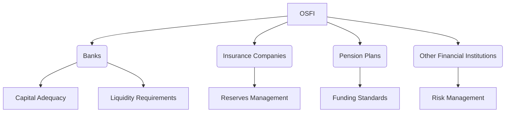

## 3.7 Office of the Superintendent of Financial Institutions (OSFI)

The Office of the Superintendent of Financial Institutions (OSFI) plays a crucial role in maintaining the stability and integrity of Canada's financial system. As the federal regulator, OSFI is responsible for supervising and regulating a wide array of financial institutions, ensuring they operate in a safe and sound manner. This section delves into OSFI's responsibilities, the types of institutions it oversees, and its objectives in safeguarding the Canadian financial landscape.

### Understanding OSFI's Role

OSFI was established in 1987 to consolidate the regulation of financial institutions under a single federal body. Its primary mandate is to protect the rights and interests of depositors, policyholders, and pension plan members while contributing to public confidence in the Canadian financial system. OSFI achieves this by setting and enforcing standards for financial institutions, conducting regular examinations, and providing guidance on risk management practices.

### Institutions Overseen by OSFI

OSFI supervises a diverse range of federally registered financial institutions, including:

- **Banks:** OSFI regulates all federally incorporated banks in Canada, ensuring they adhere to capital adequacy, liquidity, and risk management standards. Major banks such as the Royal Bank of Canada (RBC) and Toronto-Dominion Bank (TD) fall under OSFI's purview.

- **Insurance Companies:** Both life and property & casualty insurance companies are subject to OSFI's oversight. This includes ensuring these companies maintain sufficient reserves to meet policyholder obligations.

- **Pension Plans:** OSFI supervises federally regulated private pension plans, ensuring they are adequately funded and managed in accordance with the Pension Benefits Standards Act.

- **Other Financial Institutions:** OSFI also oversees trust and loan companies, cooperative credit associations, and fraternal benefit societies.

### OSFI's Objectives and Contributions

OSFI's overarching objective is to contribute to the safety and soundness of the Canadian financial system. It achieves this through several key activities:

1. **Regulatory Framework Development:** OSFI develops and implements a comprehensive regulatory framework that sets out the requirements for capital adequacy, liquidity, and risk management. This framework is designed to ensure financial institutions can withstand economic shocks and continue to operate effectively.

2. **Supervision and Monitoring:** OSFI conducts regular on-site examinations and off-site monitoring of financial institutions to assess their financial condition and risk management practices. This proactive approach helps identify potential issues before they escalate into significant problems.

3. **Guidance and Advisory Services:** OSFI provides guidance and advisory services to financial institutions, helping them understand and comply with regulatory requirements. This includes issuing guidelines on emerging risks such as cybersecurity and climate change.

4. **Collaboration with Other Regulators:** OSFI collaborates with other domestic and international regulatory bodies to promote a coordinated approach to financial regulation. This includes working with the Canadian Investment Regulatory Organization (CIRO) and the Financial Stability Board (FSB).

### Practical Examples and Case Studies

To illustrate OSFI's impact, consider the following examples:

- **Stress Testing in Banks:** OSFI requires banks to conduct regular stress tests to assess their resilience to adverse economic scenarios. For instance, during the COVID-19 pandemic, OSFI intensified its oversight of banks' stress testing processes to ensure they could withstand the economic fallout.

- **Pension Plan Solvency:** OSFI's supervision of pension plans includes ensuring they maintain adequate funding levels. A case study involving a large Canadian pension plan demonstrated how OSFI's intervention helped the plan address funding shortfalls and improve its financial health.

### Best Practices and Common Challenges

Financial institutions under OSFI's supervision are encouraged to adopt best practices in risk management, governance, and compliance. However, they may face challenges such as adapting to evolving regulatory requirements and managing emerging risks. To overcome these challenges, institutions should:

- **Stay Informed:** Regularly review OSFI's guidelines and updates to stay informed about regulatory changes.

- **Enhance Risk Management:** Implement robust risk management frameworks that address both traditional and emerging risks.

- **Foster a Compliance Culture:** Cultivate a culture of compliance within the organization, ensuring all employees understand and adhere to regulatory requirements.

### Diagrams and Visual Aids

Below is a diagram illustrating OSFI's regulatory framework and its interaction with financial institutions:

### Additional Resources

For further exploration of OSFI's regulatory framework and supervision practices, consider the following resources:

- [OSFI Regulatory Framework](https://www.osfi-bsif.gc.ca/Eng/Pages/default.aspx)
- [OSFI Supervision](https://www.osfi-bsif.gc.ca/Eng/wt-ow/Pages/default.aspx)

These resources provide comprehensive information on OSFI's guidelines, standards, and supervisory activities.

### Summary

The Office of the Superintendent of Financial Institutions (OSFI) is a cornerstone of Canada's financial regulatory environment. By supervising and regulating banks, insurance companies, pension plans, and other financial institutions, OSFI ensures the stability and integrity of the financial system. Through its regulatory framework, supervision practices, and collaborative efforts, OSFI plays a vital role in safeguarding the interests of depositors, policyholders, and pension plan members.

### **Ready to Test Your Knowledge?**

**Practice 10 Essential CSC Exam Questions to Master Your Certification**



### What is the primary role of OSFI?

- [x] To regulate and supervise federally registered financial institutions in Canada
- [ ] To manage Canada's monetary policy
- [ ] To oversee provincial credit unions
- [ ] To provide financial advice to Canadian citizens

> **Explanation:** OSFI's primary role is to regulate and supervise federally registered financial institutions, ensuring their safety and soundness.

### Which of the following institutions is NOT overseen by OSFI?

- [ ] Banks
- [ ] Insurance Companies
- [x] Provincial Credit Unions
- [ ] Pension Plans

> **Explanation:** OSFI does not oversee provincial credit unions, as they fall under provincial jurisdiction.

### What is one of OSFI's key objectives?

- [x] To contribute to the safety and soundness of the Canadian financial system
- [ ] To set interest rates for Canadian banks
- [ ] To provide loans to small businesses
- [ ] To manage the Canadian stock market

> **Explanation:** OSFI's key objective is to contribute to the safety and soundness of the Canadian financial system.

### How does OSFI ensure financial institutions can withstand economic shocks?

- [x] By developing a comprehensive regulatory framework
- [ ] By providing direct financial support to institutions
- [ ] By setting fixed interest rates
- [ ] By managing the national budget

> **Explanation:** OSFI develops a regulatory framework that includes capital adequacy and liquidity requirements to ensure institutions can withstand economic shocks.

### What type of guidance does OSFI provide to financial institutions?

- [x] Risk management practices
- [ ] Investment strategies
- [ ] Marketing techniques
- [ ] Customer service protocols

> **Explanation:** OSFI provides guidance on risk management practices to help institutions comply with regulatory requirements.

### Which of the following is a challenge faced by institutions under OSFI's supervision?

- [x] Adapting to evolving regulatory requirements
- [ ] Managing customer complaints
- [ ] Increasing sales targets
- [ ] Expanding into international markets

> **Explanation:** Institutions face challenges in adapting to evolving regulatory requirements set by OSFI.

### What is a best practice for institutions under OSFI's supervision?

- [x] Implementing robust risk management frameworks
- [ ] Reducing staff training programs
- [ ] Increasing marketing budgets
- [ ] Focusing solely on short-term profits

> **Explanation:** Implementing robust risk management frameworks is a best practice for institutions under OSFI's supervision.

### How does OSFI collaborate with other regulators?

- [x] By promoting a coordinated approach to financial regulation
- [ ] By setting global interest rates
- [ ] By providing loans to other countries
- [ ] By managing international trade agreements

> **Explanation:** OSFI collaborates with other regulators to promote a coordinated approach to financial regulation.

### What is the purpose of stress testing in banks?

- [x] To assess their resilience to adverse economic scenarios
- [ ] To determine employee performance
- [ ] To evaluate customer satisfaction
- [ ] To calculate annual profits

> **Explanation:** Stress testing assesses banks' resilience to adverse economic scenarios, ensuring they can withstand financial shocks.

### True or False: OSFI was established to manage Canada's monetary policy.

- [ ] True
- [x] False

> **Explanation:** False. OSFI was established to regulate and supervise financial institutions, not to manage monetary policy.


