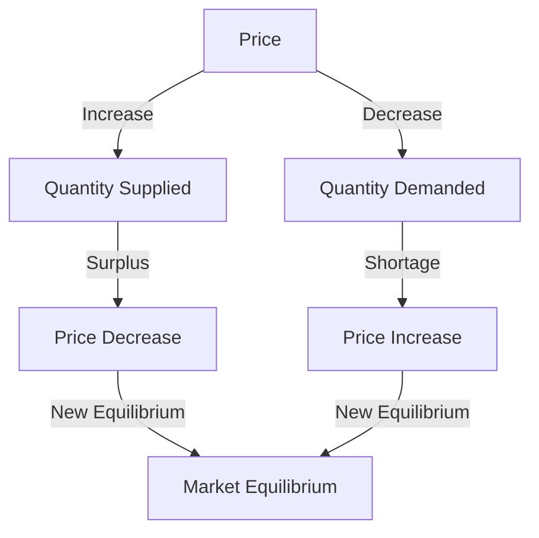

## 4.1.1 Process of Achieving Market Equilibrium

In the world of economics, understanding how markets achieve equilibrium is crucial for both investors and financial professionals. Market equilibrium is the point where the quantity of a good supplied equals the quantity demanded, resulting in a stable market price. This section delves into the dynamics of supply and demand, the mechanisms through which markets adjust to reach equilibrium, and the impact of external factors on this process.

### Dynamics of Supply and Demand

#### Defining Supply and Demand

**Supply** refers to the quantity of a good or service that producers are willing and able to sell at various prices over a given period. The **supply curve** is a graphical representation that shows the relationship between the price of a good and the quantity supplied. Typically, the supply curve slopes upward, indicating that higher prices incentivize producers to supply more of the good.

**Demand**, on the other hand, refers to the quantity of a good or service that consumers are willing and able to purchase at various prices. The **demand curve** is a graphical representation that shows the relationship between the price of a good and the quantity demanded. The demand curve usually slopes downward, reflecting the inverse relationship between price and quantity demanded—consumers tend to buy more of a good when its price decreases.

#### Role in Determining Market Prices

The interaction between supply and demand determines the market price of a good. When the market is in equilibrium, the quantity supplied equals the quantity demanded, and there is no tendency for the price to change. However, shifts in either the supply or demand curves can disrupt this balance, leading to changes in market prices.

### Shifts in Supply and Demand Curves

#### Effects on Market Equilibrium

When the supply or demand curve shifts, it results in a new equilibrium price and quantity. For instance:

- **Increase in Demand:** If consumer preferences shift towards a particular good, the demand curve will shift to the right. This increase in demand leads to a higher equilibrium price and quantity, assuming the supply remains constant.

- **Decrease in Demand:** Conversely, if consumer preferences shift away from a good, the demand curve shifts to the left, resulting in a lower equilibrium price and quantity.

- **Increase in Supply:** If production costs decrease or technological advancements occur, the supply curve shifts to the right. This increase in supply leads to a lower equilibrium price and a higher quantity.

- **Decrease in Supply:** If production costs rise or there are disruptions in production, the supply curve shifts to the left, resulting in a higher equilibrium price and a lower quantity.

### Mechanisms of Market Adjustment

#### Price Adjustments

Markets adjust to changes in supply and demand through price adjustments. When there is a **surplus** (quantity supplied exceeds quantity demanded), prices tend to fall to encourage more consumption and reduce production. Conversely, when there is a **shortage** (quantity demanded exceeds quantity supplied), prices tend to rise to discourage consumption and encourage production.

#### External Factors Influencing Equilibrium

Several external factors can influence market equilibrium, including:

- **Consumer Preferences:** Changes in tastes and preferences can shift the demand curve, affecting equilibrium prices and quantities.

- **Production Costs:** Changes in the cost of inputs, such as labor or raw materials, can shift the supply curve.

- **Government Policies:** Taxes, subsidies, and regulations can impact both supply and demand, altering market equilibrium.

- **Technological Advances:** Innovations can increase supply by reducing production costs or creating new products, shifting the supply curve.

### Graphical Representation of Market Equilibrium

To better understand market equilibrium, let's visualize it using a supply and demand graph.

In this diagram, the intersection of the supply and demand curves represents the market equilibrium. Price adjustments occur when there is a surplus or shortage, moving the market back towards equilibrium.

### Practical Examples and Case Studies

#### Canadian Financial Context

Consider the Canadian housing market, where demand often outpaces supply in major cities like Toronto and Vancouver. This persistent demand, driven by factors such as immigration and urbanization, shifts the demand curve to the right, leading to higher prices and a new equilibrium.

Similarly, the introduction of new technologies in the Canadian energy sector can shift the supply curve to the right, reducing costs and prices for consumers.

### Best Practices and Challenges

#### Best Practices

- **Monitor Market Trends:** Stay informed about changes in consumer preferences and production costs to anticipate shifts in supply and demand.

- **Adapt to External Factors:** Be prepared to adjust strategies in response to government policies or technological advancements.

#### Common Challenges

- **Volatility:** Markets can be volatile, with frequent shifts in supply and demand leading to price fluctuations.

- **Regulatory Changes:** Sudden changes in regulations can disrupt market equilibrium, requiring quick adaptation.

### Summary

Understanding the process of achieving market equilibrium is essential for navigating the complexities of financial markets. By analyzing the dynamics of supply and demand, recognizing the impact of external factors, and utilizing graphical representations, financial professionals can make informed decisions and anticipate market changes.

## Quiz Time!



### What is the role of supply and demand in determining market prices?

- [x] They interact to establish the equilibrium price where quantity supplied equals quantity demanded.
- [ ] They have no effect on market prices.
- [ ] Supply determines prices independently of demand.
- [ ] Demand determines prices independently of supply.

> **Explanation:** Supply and demand interact to determine the market price, achieving equilibrium when quantity supplied equals quantity demanded.

### What happens when the demand curve shifts to the right?

- [x] Equilibrium price and quantity increase.
- [ ] Equilibrium price and quantity decrease.
- [ ] Equilibrium price increases, quantity decreases.
- [ ] Equilibrium price decreases, quantity increases.

> **Explanation:** A rightward shift in the demand curve indicates increased demand, leading to higher equilibrium price and quantity.

### What is a surplus?

- [x] A situation where quantity supplied exceeds quantity demanded at a given price.
- [ ] A situation where quantity demanded exceeds quantity supplied at a given price.
- [ ] A situation where supply and demand are equal.
- [ ] A situation where prices are too high.

> **Explanation:** A surplus occurs when the quantity supplied is greater than the quantity demanded, often leading to price decreases.

### How do markets adjust to eliminate a shortage?

- [x] Prices increase to reduce demand and increase supply.
- [ ] Prices decrease to increase demand and reduce supply.
- [ ] Supply decreases to match demand.
- [ ] Demand increases to match supply.

> **Explanation:** In a shortage, prices rise to reduce demand and encourage more supply, moving towards equilibrium.

### Which factor can shift the supply curve to the right?

- [x] Technological advancements.
- [ ] Increase in production costs.
- [ ] Decrease in consumer preferences.
- [ ] Government regulations.

> **Explanation:** Technological advancements can reduce production costs, increasing supply and shifting the supply curve to the right.

### What is the graphical representation of the relationship between price and quantity demanded?

- [x] Demand curve.
- [ ] Supply curve.
- [ ] Equilibrium curve.
- [ ] Price curve.

> **Explanation:** The demand curve graphically represents the relationship between price and quantity demanded.

### What external factor can influence market equilibrium?

- [x] Government policies.
- [ ] Consumer ignorance.
- [ ] Random chance.
- [ ] Market isolation.

> **Explanation:** Government policies, such as taxes and subsidies, can significantly impact market equilibrium by affecting supply and demand.

### What occurs when the supply curve shifts to the left?

- [x] Equilibrium price increases, quantity decreases.
- [ ] Equilibrium price decreases, quantity increases.
- [ ] Equilibrium price and quantity increase.
- [ ] Equilibrium price and quantity decrease.

> **Explanation:** A leftward shift in the supply curve indicates reduced supply, leading to higher equilibrium price and lower quantity.

### How do price adjustments help achieve market equilibrium?

- [x] By eliminating surpluses and shortages.
- [ ] By creating new surpluses and shortages.
- [ ] By maintaining constant prices.
- [ ] By ignoring supply and demand changes.

> **Explanation:** Price adjustments help eliminate surpluses and shortages, moving the market towards equilibrium.

### True or False: A decrease in production costs will shift the supply curve to the left.

- [ ] True
- [x] False

> **Explanation:** A decrease in production costs typically shifts the supply curve to the right, indicating an increase in supply.


