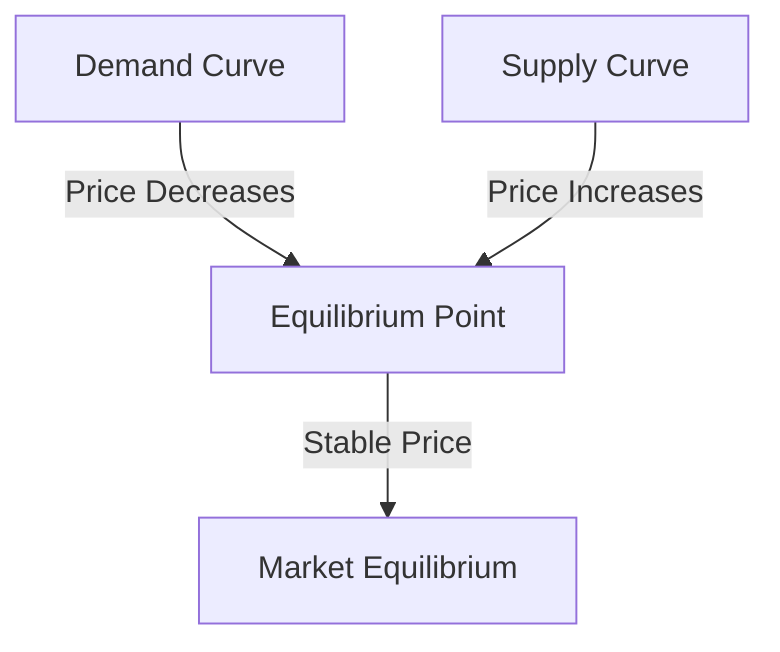

## 4.1 Defining Economics

Economics is a social science that studies how individuals, businesses, governments, and nations make choices on allocating resources to satisfy their needs and wants. It is crucial for understanding market activities as it provides insights into how markets operate, how resources are distributed, and how economic agents interact within the market. In this section, we will delve into the core concepts of economics, focusing on market equilibrium, supply and demand, and the factors influencing these dynamics.

### Understanding Economics and Its Importance

Economics is often divided into two main branches: microeconomics and macroeconomics. Microeconomics focuses on the behavior of individual agents, such as households and firms, and their interactions in specific markets. Macroeconomics, on the other hand, examines the economy as a whole, including issues like inflation, unemployment, and economic growth.

Understanding economics is essential for making informed decisions in financial markets. It helps investors, policymakers, and businesses anticipate changes in market conditions and adjust their strategies accordingly. For instance, by understanding economic indicators and trends, Canadian investors can make better decisions about asset allocation in their portfolios, considering factors like interest rates and inflation.

### The Market Economy: Supply and Demand

A market economy is an economic system where decisions regarding investment, production, and distribution are driven by the forces of supply and demand. In such an economy, prices are determined in a free price system set by the interaction of supply and demand.

- **Supply** refers to the quantity of a good or service that producers are willing and able to sell at various prices over a given period.
- **Demand** refers to the quantity of a good or service that consumers are willing and able to purchase at various prices over a given period.

The interaction between supply and demand determines the market price and quantity of goods and services exchanged. This interaction is fundamental to understanding how markets function and how resources are allocated efficiently.

### Market Equilibrium: Achieving Balance

**Market Equilibrium** is a situation where the quantity of a product demanded by consumers equals the quantity supplied by producers, resulting in a stable market price. At this point, there is no tendency for the price to change unless there is a shift in supply or demand.

#### The Process of Achieving Market Equilibrium

Market equilibrium is achieved through the natural adjustment of prices in response to changes in supply and demand. When there is an excess supply (surplus), prices tend to fall, encouraging more consumers to buy the product and reducing the quantity supplied. Conversely, when there is excess demand (shortage), prices tend to rise, discouraging consumption and encouraging producers to supply more.

The following diagram illustrates the concept of market equilibrium:

In this diagram, the intersection of the demand and supply curves represents the equilibrium point, where the market is balanced.

#### Factors Influencing Market Equilibrium

Several factors can influence the stability of market equilibrium, including:

- **Changes in Consumer Preferences:** Shifts in tastes and preferences can lead to changes in demand, affecting equilibrium.
- **Technological Advancements:** Innovations can increase supply by reducing production costs, shifting the supply curve.
- **Government Policies:** Regulations, taxes, and subsidies can alter supply and demand, impacting equilibrium.
- **External Shocks:** Events such as natural disasters or geopolitical tensions can disrupt supply chains and affect market stability.

### Real-World Examples: Shifts in Market Equilibrium

To better understand how market equilibrium shifts, let's examine some real-world scenarios:

#### Example 1: The Impact of Technology on the Canadian Automotive Market

In recent years, advancements in electric vehicle (EV) technology have significantly impacted the Canadian automotive market. As production costs for EVs decrease, the supply curve shifts to the right, leading to lower prices and increased demand. This shift in equilibrium results in a higher quantity of EVs sold at a lower price, illustrating how technological advancements can influence market dynamics.

#### Example 2: Government Policy and the Housing Market

Government policies, such as changes in interest rates or housing regulations, can have profound effects on the housing market. For instance, a reduction in interest rates by the Bank of Canada can increase demand for mortgages, shifting the demand curve to the right. This shift can lead to higher home prices and increased construction activity, demonstrating the impact of policy decisions on market equilibrium.

### Glossary

- **Market Equilibrium:** A situation where the quantity of a product demanded equals the quantity supplied, resulting in a stable price.
- **Supply and Demand:** Fundamental economic concepts where supply refers to the quantity a market can offer and demand refers to the quantity a market is willing to buy.

### Conclusion

Understanding economics and market equilibrium is essential for navigating the complexities of financial markets. By analyzing supply and demand dynamics, investors and policymakers can make informed decisions that align with market conditions. As we've seen through real-world examples, external factors such as technology and government policy play a crucial role in shaping market equilibrium. By staying informed and adaptable, financial professionals can better anticipate changes and optimize their strategies in the Canadian market.

## Quiz Time!



### What is the primary focus of microeconomics?

- [x] The behavior of individual agents and their interactions in specific markets
- [ ] The economy as a whole, including inflation and unemployment
- [ ] The study of government policies and regulations
- [ ] The analysis of international trade dynamics

> **Explanation:** Microeconomics focuses on the behavior of individual agents, such as households and firms, and their interactions in specific markets.

### What determines the market price in a market economy?

- [x] The interaction of supply and demand
- [ ] Government regulations
- [ ] International trade agreements
- [ ] The level of inflation

> **Explanation:** In a market economy, prices are determined by the interaction of supply and demand.

### What is market equilibrium?

- [x] A situation where the quantity demanded equals the quantity supplied
- [ ] A situation where supply exceeds demand
- [ ] A situation where demand exceeds supply
- [ ] A situation where prices are constantly changing

> **Explanation:** Market equilibrium occurs when the quantity of a product demanded equals the quantity supplied, resulting in a stable price.

### What happens when there is excess supply in a market?

- [x] Prices tend to fall
- [ ] Prices tend to rise
- [ ] Demand increases
- [ ] Supply decreases

> **Explanation:** When there is excess supply, prices tend to fall, encouraging more consumers to buy the product and reducing the quantity supplied.

### Which factor can shift the supply curve to the right?

- [x] Technological advancements
- [ ] Increased consumer preferences
- [ ] Higher taxes
- [ ] Natural disasters

> **Explanation:** Technological advancements can increase supply by reducing production costs, shifting the supply curve to the right.

### How can government policies impact market equilibrium?

- [x] By altering supply and demand through regulations, taxes, and subsidies
- [ ] By setting fixed prices for goods and services
- [ ] By controlling the production of goods
- [ ] By eliminating competition in the market

> **Explanation:** Government policies can impact market equilibrium by altering supply and demand through regulations, taxes, and subsidies.

### What is the effect of a reduction in interest rates on the housing market?

- [x] Increased demand for mortgages
- [ ] Decreased demand for mortgages
- [ ] Increased supply of homes
- [ ] Decreased supply of homes

> **Explanation:** A reduction in interest rates can increase demand for mortgages, shifting the demand curve to the right and affecting home prices.

### What role do external shocks play in market equilibrium?

- [x] They can disrupt supply chains and affect market stability
- [ ] They stabilize market prices
- [ ] They have no impact on market dynamics
- [ ] They only affect international markets

> **Explanation:** External shocks, such as natural disasters or geopolitical tensions, can disrupt supply chains and affect market stability.

### What is the impact of technological advancements on market equilibrium?

- [x] They can increase supply and lower prices
- [ ] They decrease supply and increase prices
- [ ] They have no impact on supply and demand
- [ ] They only affect consumer preferences

> **Explanation:** Technological advancements can increase supply by reducing production costs, leading to lower prices and increased demand.

### True or False: Market equilibrium results in a constantly changing price.

- [ ] True
- [x] False

> **Explanation:** Market equilibrium results in a stable price where the quantity demanded equals the quantity supplied, with no tendency for the price to change unless there is a shift in supply or demand.


