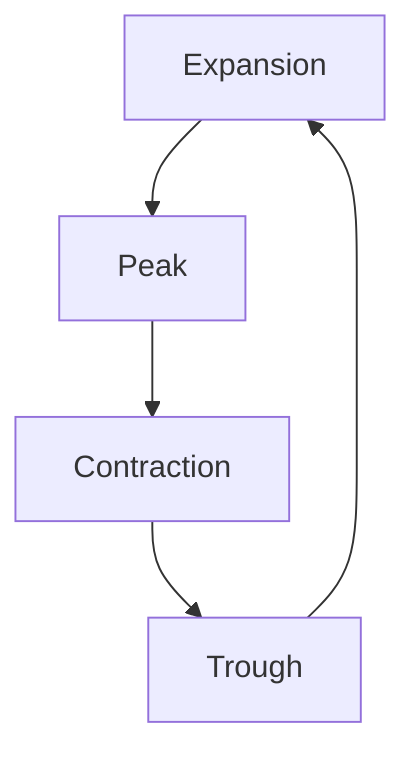

## Overview of Chapter 4

In this chapter, we delve into the foundational concepts of economics and their critical role in shaping financial markets. Understanding economics is essential for making informed investment decisions, as it provides insights into how resources are allocated, how economies grow, and how various factors influence market dynamics. This overview will guide you through the distinctions between microeconomics and macroeconomics, the measurement of economic growth, key economic indicators, and the impact of international economics on domestic investments.

### Fundamental Concepts of Economics

Economics is the social science that examines how individuals, businesses, and governments make choices regarding the allocation of resources to satisfy their needs and wants. It is divided into two main branches: microeconomics and macroeconomics.

#### Microeconomics vs. Macroeconomics

**Microeconomics** focuses on the behavior of individual consumers, firms, and industries. It examines how these entities make decisions about resource allocation, pricing, and production. Key concepts in microeconomics include supply and demand, elasticity, and market structures.

**Macroeconomics**, on the other hand, looks at the economy as a whole. It studies aggregate indicators such as GDP, unemployment rates, and inflation to understand the broader economic environment. Macroeconomics is concerned with national economic policies and their impact on economic growth and stability.

### Measuring Economic Growth

Economic growth is a crucial indicator of an economy's health and is typically measured by the Gross Domestic Product (GDP). GDP represents the total market value of all final goods and services produced within a country over a specific period. It provides a snapshot of a country's economic performance and is used to compare economic productivity across different nations.

Factors influencing economic growth include:

- **Capital Investment:** Investments in infrastructure, technology, and education can enhance productivity and drive growth.
- **Labor Force:** The size and skill level of the workforce impact economic output.
- **Innovation:** Technological advancements can lead to new products and more efficient production processes.
- **Government Policies:** Fiscal and monetary policies can stimulate or hinder economic growth.

### Key Economic Indicators

Investors rely on various economic indicators to make informed decisions. These indicators provide insights into the current state of the economy and potential future trends.

#### Business Cycles

The business cycle refers to the fluctuations in economic activity that an economy experiences over time. It consists of four phases:

1. **Expansion:** Characterized by increasing economic activity, rising GDP, and improving employment rates.
2. **Peak:** The economy reaches its maximum output, and growth begins to slow.
3. **Contraction:** Economic activity declines, leading to reduced GDP and rising unemployment.
4. **Trough:** The economy hits its lowest point before beginning to recover.

Understanding business cycles helps investors anticipate market trends and adjust their strategies accordingly.

#### Labor Markets

The labor market is a critical component of the economy, influencing consumer spending and overall economic growth. Key labor market indicators include:

- **Unemployment Rate:** The percentage of the labor force that is unemployed and actively seeking employment.
- **Labor Force Participation Rate:** The proportion of the working-age population that is either employed or actively seeking work.
- **Wage Growth:** Changes in average wages can impact consumer spending and inflation.

#### Interest Rates

Interest rates, set by central banks like the Bank of Canada, play a significant role in economic activity. They influence borrowing costs, consumer spending, and investment. Lower interest rates typically stimulate economic growth by making borrowing cheaper, while higher rates can slow growth to control inflation.

### International Economics and Domestic Investment

Global economic trends and policies can significantly impact domestic investment environments. International trade, exchange rates, and foreign investment flows are key factors that shape the domestic economy.

- **Trade Agreements:** Agreements like the Canada-United States-Mexico Agreement (CUSMA) affect trade flows and economic relationships.
- **Exchange Rates:** Fluctuations in currency values can impact the competitiveness of exports and imports.
- **Foreign Direct Investment (FDI):** Inflows of foreign capital can boost domestic industries and create jobs.

### Practical Examples and Case Studies

To illustrate these concepts, consider the investment strategies of Canadian pension funds. These funds often analyze economic indicators such as GDP growth and interest rates to adjust their asset allocations. For instance, during periods of economic expansion, they might increase their exposure to equities to capitalize on growth, while in contractions, they may shift towards bonds for stability.

Another example is the impact of interest rate changes by the Bank of Canada on major Canadian banks like RBC and TD. When interest rates rise, these banks might adjust their lending rates, affecting consumer loans and mortgages, which in turn influences their profitability and stock performance.

### Diagrams and Visual Aids

To enhance understanding, let's visualize the business cycle using a diagram:

This diagram illustrates the cyclical nature of economic activity, highlighting the transitions between different phases.

### Best Practices and Common Pitfalls

When analyzing economic indicators, it's crucial to consider the broader context and potential lag effects. For example, changes in interest rates may take time to impact the economy fully. Additionally, relying solely on one indicator can be misleading; a comprehensive analysis should consider multiple data points.

### References and Further Exploration

For those interested in deepening their understanding of economics, consider the following resources:

- **Books:** *"Principles of Economics"* by N. Gregory Mankiw
- **Online Courses:** [Coursera’s Introduction to Economics](https://www.coursera.org/learn/intro-economics)
- **Articles:** [Understanding GDP and Economic Growth](https://www.investopedia.com/terms/g/gdp.asp)
- **Institutions:** [Statistics Canada](https://www.statcan.gc.ca/), [Bank of Canada](https://www.bankofcanada.ca/)

These resources provide valuable insights into economic principles and their application in financial markets.

### Glossary

- **Economics:** The social science that studies how individuals, businesses, and governments make choices on allocating resources to satisfy their needs and wants.
- **GDP (Gross Domestic Product):** The total market value of all final goods and services produced within a country in a specific period.
- **Inflation:** The rate at which the general level of prices for goods and services is rising, eroding purchasing power.
- **Business Cycle:** The fluctuations in economic activity that an economy experiences over a period, typically consisting of expansion, peak, contraction, and trough phases.

### **Ready to Test Your Knowledge?**

**Practice 10 Essential CSC Exam Questions to Master Your Certification**



### What is the primary focus of microeconomics?

- [x] The behavior of individual consumers and firms
- [ ] The overall economy and aggregate indicators
- [ ] International trade and exchange rates
- [ ] Government fiscal policies

> **Explanation:** Microeconomics focuses on the behavior of individual consumers, firms, and industries, examining how they make decisions about resource allocation, pricing, and production.

### Which of the following is a key indicator of economic growth?

- [x] GDP (Gross Domestic Product)
- [ ] Unemployment Rate
- [ ] Interest Rates
- [ ] Exchange Rates

> **Explanation:** GDP is the total market value of all final goods and services produced within a country and is a primary indicator of economic growth.

### What phase of the business cycle is characterized by declining economic activity?

- [ ] Expansion
- [ ] Peak
- [x] Contraction
- [ ] Trough

> **Explanation:** The contraction phase of the business cycle is characterized by declining economic activity, reduced GDP, and rising unemployment.

### How do lower interest rates typically affect economic growth?

- [x] They stimulate growth by making borrowing cheaper
- [ ] They slow growth by increasing borrowing costs
- [ ] They have no impact on economic growth
- [ ] They lead to higher inflation

> **Explanation:** Lower interest rates make borrowing cheaper, which can stimulate economic growth by encouraging consumer spending and investment.

### What is the impact of exchange rate fluctuations on exports?

- [x] They can affect the competitiveness of exports
- [ ] They have no impact on exports
- [ ] They only affect imports
- [ ] They stabilize export prices

> **Explanation:** Exchange rate fluctuations can impact the competitiveness of exports by making them more or less expensive for foreign buyers.

### Which institution sets interest rates in Canada?

- [ ] Statistics Canada
- [x] Bank of Canada
- [ ] Canadian Securities Administrators
- [ ] Canada Revenue Agency

> **Explanation:** The Bank of Canada is responsible for setting interest rates in Canada, influencing economic activity and inflation.

### What is the role of foreign direct investment (FDI) in the domestic economy?

- [x] It boosts domestic industries and creates jobs
- [ ] It only affects international trade
- [ ] It reduces domestic economic growth
- [ ] It has no impact on the domestic economy

> **Explanation:** Foreign direct investment (FDI) brings capital into the domestic economy, boosting industries and creating jobs.

### What is the labor force participation rate?

- [x] The proportion of the working-age population that is either employed or actively seeking work
- [ ] The percentage of the labor force that is unemployed
- [ ] The average wage growth rate
- [ ] The total number of jobs available in the economy

> **Explanation:** The labor force participation rate measures the proportion of the working-age population that is either employed or actively seeking work.

### Which phase of the business cycle follows a peak?

- [ ] Expansion
- [x] Contraction
- [ ] Trough
- [ ] Recovery

> **Explanation:** The contraction phase follows a peak in the business cycle, characterized by declining economic activity.

### True or False: Macroeconomics focuses on individual consumer behavior.

- [ ] True
- [x] False

> **Explanation:** False. Macroeconomics focuses on the economy as a whole, studying aggregate indicators like GDP, unemployment, and inflation, rather than individual consumer behavior.



This comprehensive overview of Chapter 4 provides a solid foundation in economics, equipping you with the knowledge to understand and navigate the financial markets effectively.
