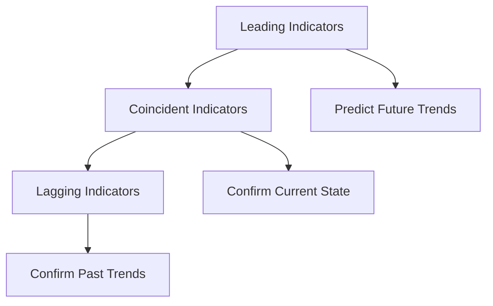

## 4.10 Economic Indicators

Economic indicators are vital statistics that provide insights into the economic performance of a country. They are essential tools for economists, policymakers, and investors to analyze economic trends and make informed decisions. Understanding these indicators can help predict future economic activity, assess current economic conditions, and evaluate past economic performance.

### Types of Economic Indicators

Economic indicators are generally categorized into three types: leading, coincident, and lagging indicators. Each type serves a unique purpose in economic analysis and provides different insights into the economic cycle.

#### Leading Indicators

Leading indicators are statistics that tend to change before the economy as a whole changes. They are used to predict future economic activity, making them invaluable for investors and policymakers who need to anticipate economic trends. Examples of leading indicators include:

- **Stock Market Returns:** Often considered a barometer of economic health, stock market performance can signal future economic activity. A rising stock market may indicate investor confidence and potential economic growth.

- **Consumer Confidence Index (CCI):** This measures the degree of optimism that consumers feel about the overall state of the economy and their personal financial situation. High consumer confidence can lead to increased consumer spending, which drives economic growth.

- **Manufacturing Orders:** An increase in new orders for manufactured goods suggests that businesses are optimistic about future demand, which can lead to increased production and economic expansion.

#### Coincident Indicators

Coincident indicators change at approximately the same time as the economy, providing information about the current state of the economy. They help confirm the phase of the economic cycle. Examples include:

- **Gross Domestic Product (GDP):** GDP measures the total value of goods and services produced in a country. It is a comprehensive indicator of economic activity and is used to confirm whether an economy is in expansion or contraction.

- **Employment Levels:** Employment statistics, such as the unemployment rate, provide insights into the labor market and overall economic health. High employment levels typically indicate a strong economy.

- **Retail Sales:** This measures consumer spending on goods and services, reflecting the current demand in the economy. Strong retail sales suggest robust economic activity.

#### Lagging Indicators

Lagging indicators are statistics that change after the economy has already begun to follow a particular trend. They confirm patterns and trends that have already occurred. Examples include:

- **Unemployment Rate:** While employment levels are a coincident indicator, the unemployment rate is considered lagging because it takes time for changes in the economy to affect employment levels.

- **Corporate Profits:** These reflect the health of the business sector and tend to rise or fall after the economy has already begun to expand or contract.

- **Interest Rates:** Central banks often adjust interest rates in response to economic changes, making them a lagging indicator of economic activity.

### Significance of Economic Indicators

Economic indicators are crucial for investors as they provide insights into the economic environment, helping to shape investment strategies. By analyzing these indicators, investors can make informed decisions about asset allocation, risk management, and market timing.

For instance, if leading indicators suggest an economic downturn, investors might shift their portfolios towards more defensive assets, such as bonds or dividend-paying stocks. Conversely, if indicators point to economic growth, investors might increase their exposure to equities or other growth-oriented investments.

### Practical Application: Canadian Context

In Canada, economic indicators play a significant role in shaping investment strategies and economic policies. For example, the Bank of Canada closely monitors indicators like GDP growth, inflation rates, and employment statistics to set monetary policy. Canadian investors use these indicators to assess market conditions and adjust their portfolios accordingly.

Consider a scenario where the Canadian Consumer Confidence Index shows a significant increase. This might lead investors to anticipate higher consumer spending, prompting them to invest in sectors like retail or consumer goods.

### Diagrams and Visual Aids

Below is a diagram illustrating the relationship between leading, coincident, and lagging indicators in the economic cycle:

### Best Practices and Common Pitfalls

**Best Practices:**
- Regularly monitor a diverse set of indicators to gain a comprehensive view of the economic landscape.
- Use economic indicators in conjunction with other analytical tools and models for more robust investment decisions.

**Common Pitfalls:**
- Relying solely on a single type of indicator can lead to incomplete analysis.
- Ignoring the broader economic context when interpreting indicators can result in misguided conclusions.

### References and Further Reading

- **Books:** *"Macroeconomics"* by N. Gregory Mankiw
- **Articles:** [Types of Economic Indicators](https://www.investopedia.com/terms/e/economic-indicators.asp)

### Conclusion

Understanding economic indicators is crucial for anyone involved in financial markets or economic policy. By differentiating between leading, coincident, and lagging indicators, investors and policymakers can better anticipate economic trends, assess current conditions, and confirm past performance. This knowledge empowers them to make informed decisions that align with their financial goals and economic objectives.

### **Ready to Test Your Knowledge?**

**Practice 10 Essential CSC Exam Questions to Master Your Certification**



### What are economic indicators?

- [x] Statistics that provide information about the economic performance of a country.
- [ ] Tools used exclusively by central banks to set interest rates.
- [ ] Measures of individual company performance.
- [ ] Indicators of global political stability.

> **Explanation:** Economic indicators are statistics that provide information about the economic performance of a country, helping to analyze trends and make informed decisions.

### Which of the following is a leading indicator?

- [x] Stock Market Returns
- [ ] Gross Domestic Product (GDP)
- [ ] Unemployment Rate
- [ ] Corporate Profits

> **Explanation:** Stock market returns are considered a leading indicator as they often change before the economy as a whole changes.

### What type of indicator is the Consumer Confidence Index?

- [x] Leading Indicator
- [ ] Coincident Indicator
- [ ] Lagging Indicator
- [ ] None of the above

> **Explanation:** The Consumer Confidence Index is a leading indicator as it predicts future economic activity based on consumer sentiment.

### Which indicator is used to confirm the current state of the economy?

- [x] Gross Domestic Product (GDP)
- [ ] Stock Market Returns
- [ ] Unemployment Rate
- [ ] Interest Rates

> **Explanation:** GDP is a coincident indicator that changes at the same time as the economy, confirming the current state.

### What is a lagging indicator?

- [x] An indicator that changes after the economy has already begun to follow a particular trend.
- [ ] An indicator that predicts future economic activity.
- [ ] An indicator that changes at the same time as the economy.
- [ ] An indicator that measures consumer spending.

> **Explanation:** A lagging indicator changes after the economy has already begun to follow a particular trend, confirming past trends.

### Which of the following is a coincident indicator?

- [x] Employment Levels
- [ ] Stock Market Returns
- [ ] Consumer Confidence Index
- [ ] Corporate Profits

> **Explanation:** Employment levels are coincident indicators as they change at the same time as the economy.

### How do investors use economic indicators?

- [x] To make informed decisions about asset allocation and market timing.
- [ ] To set interest rates for central banks.
- [ ] To measure individual company performance.
- [ ] To predict political changes.

> **Explanation:** Investors use economic indicators to make informed decisions about asset allocation, risk management, and market timing.

### What does a high Consumer Confidence Index indicate?

- [x] Increased consumer spending and potential economic growth.
- [ ] Decreased consumer spending and economic contraction.
- [ ] Stability in corporate profits.
- [ ] High unemployment rates.

> **Explanation:** A high Consumer Confidence Index indicates increased consumer spending and potential economic growth.

### Which of the following is NOT a type of economic indicator?

- [x] Political Indicator
- [ ] Leading Indicator
- [ ] Coincident Indicator
- [ ] Lagging Indicator

> **Explanation:** Political Indicator is not a recognized type of economic indicator.

### True or False: Interest rates are considered a leading indicator.

- [ ] True
- [x] False

> **Explanation:** Interest rates are considered a lagging indicator because they are often adjusted in response to changes in the economy.


