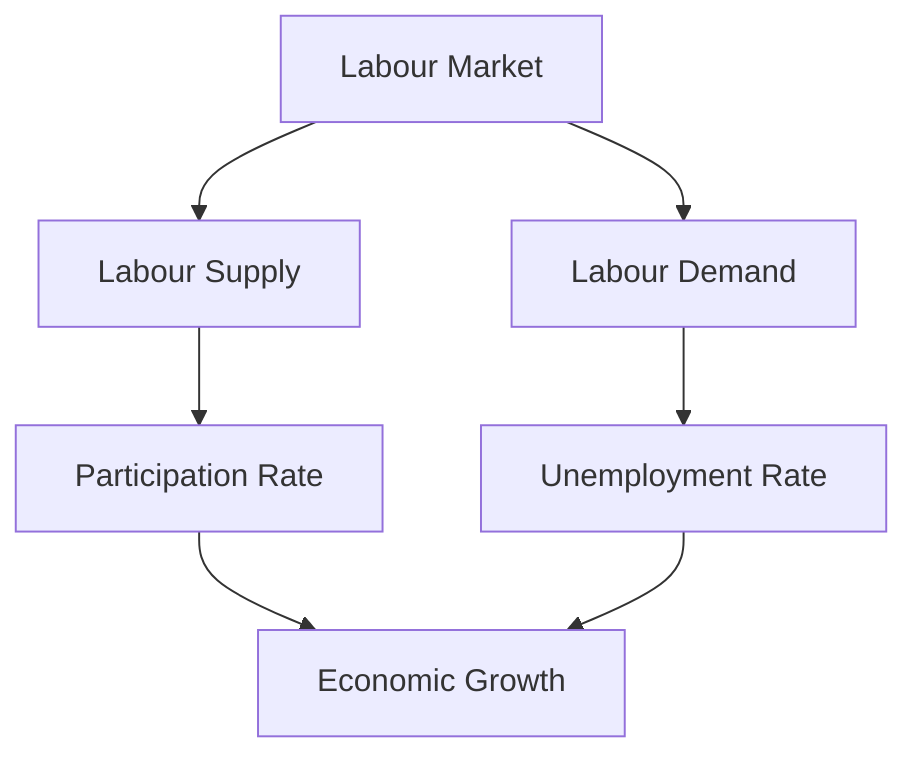

## 4.12 The Labour Market

The labour market is a fundamental component of any economy, serving as the arena where the supply of labour (workers) meets the demand for labour (employers). Understanding its structure and dynamics is crucial for grasping how economies function and grow. This section will delve into the intricacies of the labour market, focusing on key indicators, influencing factors, and its relationship with overall economic health.

### Structure and Dynamics of the Labour Market

The labour market operates through the interaction of workers seeking employment and employers looking to hire. It is influenced by various factors, including economic conditions, demographic trends, and government policies. The market can be segmented into different sectors such as public and private, formal and informal, and skilled and unskilled labour.

#### Key Components of the Labour Market

1. **Labour Supply:** This is determined by the number of individuals willing and able to work. Factors influencing labour supply include population size, age distribution, and participation rates.

2. **Labour Demand:** Driven by employers' need for workers, labour demand is influenced by economic conditions, technological advancements, and industry growth.

3. **Wages and Salaries:** These are determined by the interaction of labour supply and demand, as well as by collective bargaining and minimum wage laws.

4. **Labour Mobility:** The ability of workers to move between jobs, industries, or geographic locations affects the flexibility and efficiency of the labour market.

### Key Labour Market Indicators

Understanding the labour market requires analyzing specific indicators that provide insights into its health and dynamics.

#### Participation Rate

The participation rate is a critical measure, representing the percentage of the working-age population that is either employed or actively seeking employment. It reflects the active portion of the population contributing to the economy and is influenced by factors such as cultural norms, retirement age, and educational opportunities.

#### Unemployment Rate

The unemployment rate measures the percentage of the labour force that is unemployed and actively seeking work. It is a vital indicator of economic health, with high unemployment suggesting economic distress and low unemployment indicating a robust economy.

### Factors Influencing the Labour Market

Several factors shape the labour market, affecting both supply and demand.

#### Education and Training

Education and training are pivotal in determining the skill level of the workforce. Higher education levels generally lead to a more skilled labour force, which can drive innovation and productivity. In Canada, initiatives like the Canada Training Benefit aim to enhance workers' skills, aligning them with market needs.

#### Economic Policies

Government policies, including taxation, minimum wage laws, and labour regulations, significantly impact the labour market. Policies promoting job creation and workforce development can stimulate labour demand, while those imposing high taxes or restrictive regulations may hinder it.

#### Technological Advancements

Technological progress can lead to job displacement in certain sectors while creating new opportunities in others. The rise of automation and artificial intelligence, for example, has transformed industries, necessitating a shift in the skills required by the workforce.

### The Labour Market and Economic Health

The labour market is intrinsically linked to the overall economic health of a country. A strong labour market typically correlates with economic growth, as employment drives consumer spending and investment. Conversely, a weak labour market can lead to reduced economic activity and lower living standards.

#### Economic Cycles and the Labour Market

Economic cycles, characterized by periods of expansion and contraction, significantly affect the labour market. During expansions, job creation accelerates, reducing unemployment. In contrast, recessions often lead to job losses and higher unemployment rates.

#### Case Study: The Canadian Labour Market

Canada's labour market has demonstrated resilience and adaptability in the face of global economic challenges. For instance, during the COVID-19 pandemic, the Canadian government implemented measures such as the Canada Emergency Response Benefit (CERB) to support workers and stabilize the labour market.

### Practical Examples and Real-World Scenarios

Consider the example of a Canadian pension fund evaluating its investment strategy. Understanding labour market trends can inform decisions about investing in sectors poised for growth due to technological advancements or demographic shifts.

Similarly, a financial advisor might assess the impact of labour market conditions on a client's retirement planning, considering factors like job stability and wage growth.

### Diagrams and Visual Aids

To enhance understanding, let's visualize the relationship between labour market indicators and economic health.

This diagram illustrates how labour supply and demand influence key indicators, which in turn impact economic growth.

### Best Practices and Common Challenges

**Best Practices:**

- **Continuous Learning:** Encourage ongoing education and skill development to adapt to changing market demands.
- **Policy Advocacy:** Support policies that promote job creation and workforce development.

**Common Challenges:**

- **Skill Mismatch:** Addressing the gap between the skills workers possess and those required by employers.
- **Economic Disparities:** Tackling regional and sectoral disparities in employment opportunities.

### References and Further Reading

- **Books:** *"Labor Economics"* by Paul R. Krugman and Robin Wells
- **Articles:** [Labour Market Indicators](https://www.investopedia.com/terms/l/labour-market.asp)

### Conclusion

Understanding the labour market is essential for financial professionals and investors, as it provides insights into economic trends and potential investment opportunities. By analyzing key indicators and considering influencing factors, one can make informed decisions that align with market dynamics.

### **Ready to Test Your Knowledge?**

**Practice 10 Essential CSC Exam Questions to Master Your Certification**



### What is the participation rate?

- [x] The percentage of the working-age population that is part of the labour force.
- [ ] The percentage of the labour force that is unemployed.
- [ ] The total number of people employed in a country.
- [ ] The number of job openings in the economy.

> **Explanation:** The participation rate measures the active portion of the working-age population that is either employed or actively seeking employment.

### What does a high unemployment rate indicate?

- [x] Economic distress
- [ ] Economic growth
- [ ] High consumer spending
- [ ] Increased investment

> **Explanation:** A high unemployment rate typically indicates economic distress, as it suggests a lack of job opportunities and economic activity.

### Which factor significantly influences labour supply?

- [x] Population size
- [ ] Technological advancements
- [ ] Government spending
- [ ] Interest rates

> **Explanation:** Population size is a key determinant of labour supply, as it affects the number of individuals available to work.

### How do technological advancements affect the labour market?

- [x] They can lead to job displacement in certain sectors.
- [ ] They always increase the number of jobs available.
- [ ] They have no impact on the labour market.
- [ ] They only affect the demand for unskilled labour.

> **Explanation:** Technological advancements can lead to job displacement in some sectors while creating new opportunities in others.

### What is the impact of education on the labour market?

- [x] It generally leads to a more skilled workforce.
- [ ] It decreases the participation rate.
- [x] It can drive innovation and productivity.
- [ ] It has no impact on labour demand.

> **Explanation:** Education enhances the skill level of the workforce, driving innovation and productivity, which can increase labour demand.

### What role do economic policies play in the labour market?

- [x] They can stimulate or hinder labour demand.
- [ ] They only affect the supply side of the labour market.
- [ ] They have no impact on wages.
- [ ] They solely determine the unemployment rate.

> **Explanation:** Economic policies, such as taxation and labour regulations, can either stimulate or hinder labour demand.

### What is a common challenge in the labour market?

- [x] Skill mismatch
- [ ] High participation rate
- [x] Economic disparities
- [ ] Low unemployment rate

> **Explanation:** Skill mismatch and economic disparities are common challenges that can affect employment opportunities and economic growth.

### How does the labour market affect economic health?

- [x] A strong labour market typically correlates with economic growth.
- [ ] It has no impact on consumer spending.
- [ ] It only affects government revenue.
- [ ] It solely determines inflation rates.

> **Explanation:** A strong labour market drives consumer spending and investment, contributing to economic growth.

### What is the relationship between economic cycles and the labour market?

- [x] Economic cycles significantly affect the labour market.
- [ ] They have no impact on employment levels.
- [ ] They only influence wage rates.
- [ ] They solely determine the participation rate.

> **Explanation:** Economic cycles, characterized by periods of expansion and contraction, significantly affect employment levels and labour market dynamics.

### True or False: The labour market is unaffected by demographic trends.

- [ ] True
- [x] False

> **Explanation:** Demographic trends, such as age distribution and population growth, significantly influence the labour market by affecting labour supply and demand.


