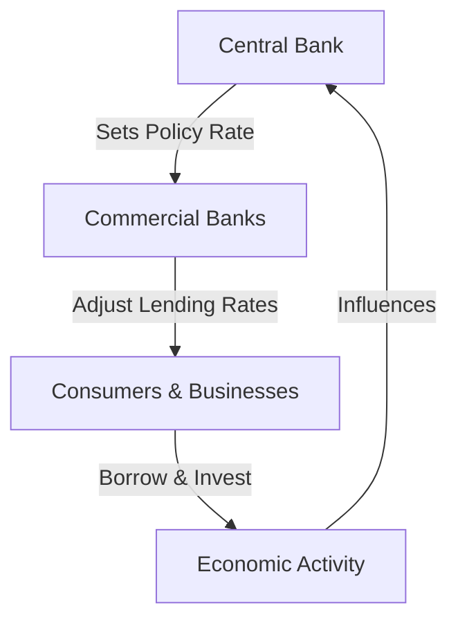

## 4.13 The Role of Interest Rates

Interest rates are a fundamental component of the financial landscape, influencing a wide array of economic activities. They serve as the cost of borrowing money, expressed as a percentage of the loan amount, and play a crucial role in shaping consumer behavior, business investment decisions, and overall economic growth. This section delves into the multifaceted role of interest rates, their influence on various economic actors, and the impact of central bank policies on these rates.

### Defining Interest Rates and Their Economic Role

Interest rates are essentially the price of money. When individuals or businesses borrow funds, they pay interest as a cost for accessing these funds. Conversely, when they save or invest, they earn interest as a reward for deferring consumption. The level of interest rates affects the economy by influencing spending, saving, and investment decisions.

In the Canadian context, interest rates are pivotal in guiding economic activity. They affect everything from mortgage rates and consumer loans to corporate bonds and government securities. By altering the cost of borrowing and the return on savings, interest rates can either stimulate or restrain economic growth.

### Influence on Consumer and Business Behavior

Interest rates have a direct impact on consumer and business behavior. For consumers, lower interest rates reduce the cost of borrowing, encouraging spending on big-ticket items like homes and cars. This increased spending can boost economic activity. Conversely, higher interest rates make borrowing more expensive, which can dampen consumer spending and slow economic growth.

For businesses, interest rates influence decisions on capital investment. Lower rates reduce the cost of financing new projects, encouraging businesses to expand operations, invest in new technologies, or hire additional staff. Higher rates, on the other hand, increase the cost of borrowing, potentially leading businesses to delay or scale back investment plans.

### Relationship Between Interest Rates and Investment Capital

The relationship between interest rates and investment capital is a critical aspect of economic dynamics. When interest rates are low, the cost of capital decreases, making it more attractive for businesses to invest in new projects. This can lead to increased capital formation, which is essential for long-term economic growth.

In contrast, high interest rates can deter investment by increasing the cost of financing. This can lead to reduced capital spending, slowing down economic expansion. Investors also tend to shift their portfolios towards fixed-income securities when interest rates rise, seeking higher returns from bonds and other interest-bearing assets.

### Impact of Central Bank Policies on Interest Rates

Central banks, such as the Bank of Canada, play a crucial role in setting interest rates through monetary policy. By adjusting the policy interest rate, central banks influence the cost of borrowing and the level of economic activity. 

#### Central Bank Tools and Strategies

Central banks use various tools to influence interest rates, including open market operations, reserve requirements, and the discount rate. The primary tool, however, is the policy interest rate, which serves as a benchmark for other interest rates in the economy.

- **Open Market Operations:** Buying and selling government securities to influence the money supply and interest rates.
- **Reserve Requirements:** Adjusting the amount of funds banks must hold in reserve, affecting their ability to lend.
- **Discount Rate:** The interest rate charged to commercial banks for borrowing funds from the central bank.

#### Case Study: Bank of Canada's Interest Rate Policy

The Bank of Canada uses its policy interest rate to achieve its inflation target, which is typically set at 2%. By raising or lowering this rate, the Bank influences economic activity to maintain price stability. For example, during periods of economic slowdown, the Bank may lower interest rates to stimulate borrowing and spending. Conversely, in times of rapid economic growth and rising inflation, it may raise rates to cool the economy.

### Practical Examples and Real-World Scenarios

To illustrate the impact of interest rates, consider the following examples:

- **Canadian Housing Market:** When the Bank of Canada lowers interest rates, mortgage rates typically fall, making home loans more affordable and boosting housing demand. This can lead to increased home sales and rising property values.
  
- **Corporate Investment Decisions:** A Canadian manufacturing firm may decide to expand its production facilities when interest rates are low, as the cost of financing the expansion is reduced. This investment can lead to job creation and increased economic output.

### Diagrams and Visual Aids

To better understand the relationship between interest rates and economic activity, consider the following diagram illustrating the flow of interest rates through the economy:

### Best Practices and Common Pitfalls

**Best Practices:**
- Monitor central bank announcements and economic indicators to anticipate interest rate changes.
- Diversify investment portfolios to manage interest rate risk.
- Consider the long-term impact of interest rate changes on financial planning and investment strategies.

**Common Pitfalls:**
- Over-reliance on short-term interest rate movements for investment decisions.
- Ignoring the broader economic context when assessing interest rate changes.
- Failing to adjust financial strategies in response to changing interest rate environments.

### References and Further Reading

For those interested in exploring the topic further, consider the following resources:

- **Books:** *"Monetary Theory and Policy"* by Carl E. Walsh
- **Online Resources:** [How Interest Rates Affect Economy](https://www.bankofcanada.ca/education/interest-rates/)

### Conclusion

Interest rates are a powerful tool in the economic toolkit, influencing consumer behavior, business investment, and overall economic growth. Understanding their role and impact is essential for financial professionals and investors alike. By staying informed about central bank policies and economic trends, individuals and businesses can make more informed financial decisions.

### **Ready to Test Your Knowledge?**

**Practice 10 Essential CSC Exam Questions to Master Your Certification**



### What is an interest rate?

- [x] The cost of borrowing money, expressed as a percentage of the loan amount.
- [ ] The total amount of money borrowed.
- [ ] The principal amount of a loan.
- [ ] The annual income from an investment.

> **Explanation:** An interest rate is the cost of borrowing money, expressed as a percentage of the loan amount.

### How do lower interest rates affect consumer behavior?

- [x] They encourage spending on big-ticket items.
- [ ] They discourage spending and increase savings.
- [ ] They have no effect on consumer behavior.
- [ ] They lead to higher taxes.

> **Explanation:** Lower interest rates reduce the cost of borrowing, encouraging consumers to spend more on big-ticket items like homes and cars.

### What is the primary tool used by central banks to influence interest rates?

- [x] Policy interest rate
- [ ] Reserve requirements
- [ ] Discount rate
- [ ] Open market operations

> **Explanation:** The primary tool used by central banks to influence interest rates is the policy interest rate.

### What happens to investment capital when interest rates are high?

- [ ] It becomes more attractive to invest.
- [x] It becomes less attractive to invest.
- [ ] It has no effect on investment capital.
- [ ] It increases the availability of capital.

> **Explanation:** High interest rates increase the cost of financing, making investment capital less attractive.

### Which of the following is a tool used by central banks to influence interest rates?

- [x] Open market operations
- [ ] Tax policy
- [x] Reserve requirements
- [ ] Government spending

> **Explanation:** Central banks use tools like open market operations and reserve requirements to influence interest rates.

### What is the impact of higher interest rates on business investment?

- [ ] It encourages more investment.
- [x] It discourages investment.
- [ ] It has no impact on investment.
- [ ] It leads to increased government spending.

> **Explanation:** Higher interest rates increase the cost of borrowing, discouraging business investment.

### How do central banks achieve their inflation targets?

- [x] By adjusting the policy interest rate
- [ ] By setting tax rates
- [x] By influencing economic activity
- [ ] By controlling government spending

> **Explanation:** Central banks achieve their inflation targets by adjusting the policy interest rate to influence economic activity.

### What is the relationship between interest rates and economic activity?

- [x] Interest rates influence economic activity.
- [ ] Economic activity determines interest rates.
- [ ] There is no relationship between the two.
- [ ] Interest rates only affect government spending.

> **Explanation:** Interest rates influence economic activity by affecting borrowing and spending decisions.

### What is the effect of low interest rates on the housing market?

- [x] They make home loans more affordable.
- [ ] They increase the cost of home loans.
- [ ] They have no effect on the housing market.
- [ ] They decrease housing demand.

> **Explanation:** Low interest rates make home loans more affordable, boosting housing demand.

### True or False: Central banks use fiscal policy to set interest rates.

- [ ] True
- [x] False

> **Explanation:** Central banks use monetary policy, not fiscal policy, to set interest rates.


