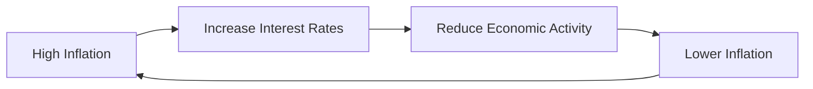

## 4.15 Costs of Inflation

Inflation, the rate at which the general level of prices for goods and services rises, eroding purchasing power, is a critical economic concept with far-reaching implications. Understanding the costs associated with inflation is essential for financial professionals, investors, and policymakers alike. This section delves into the various costs of inflation, its impact on different economic agents, and its broader implications for economic growth and stability.

### Understanding Inflation and Its Costs

Inflation affects the economy in numerous ways, primarily through its impact on purchasing power and investment decisions. When inflation is high, the purchasing power of money decreases, meaning that consumers can buy less with the same amount of money. This erosion of purchasing power is one of the most immediate and visible costs of inflation.

#### Reduced Purchasing Power

**Purchasing Power** is defined as the amount of goods or services that one unit of currency can buy. As inflation rises, the real value of money diminishes, leading to a decrease in purchasing power. For example, if inflation is at 5%, a basket of goods that costs $100 today will cost $105 in a year. This increase in prices means that consumers need more money to maintain the same standard of living, effectively reducing their purchasing power.

#### Investment Distortions

Inflation can also distort investment decisions. When inflation is unpredictable, it creates uncertainty in the economy, making it difficult for businesses and investors to plan for the future. This uncertainty can lead to suboptimal investment decisions, as businesses may delay or forego investments due to the risk of inflation eroding future returns.

### Impact on Economic Agents

Inflation affects various economic agents differently, including consumers, businesses, and investors. Understanding these impacts is crucial for developing effective financial strategies and policies.

#### Consumers

For consumers, inflation means higher prices for goods and services, which can lead to a decrease in real income. As prices rise, consumers may have to cut back on spending or dip into savings to maintain their lifestyle. This reduction in consumption can have a ripple effect on the economy, leading to slower economic growth.

#### Businesses

Businesses face several challenges during periods of high inflation. Rising costs for raw materials and labor can squeeze profit margins, forcing companies to increase prices or reduce output. Additionally, inflation can lead to uncertainty in pricing strategies and long-term planning, making it difficult for businesses to forecast future costs and revenues accurately.

#### Investors

Investors are particularly sensitive to inflation, as it can erode the real returns on investments. For instance, if an investment yields a 6% return but inflation is at 4%, the real return is only 2%. To compensate for inflation, investors often demand an **Interest Rate Premium**, which is an additional amount added to the standard interest rate. This premium helps protect against the loss of purchasing power over time.

### Inflation and Interest Rates

The relationship between inflation and interest rates is a fundamental aspect of monetary policy. Central banks, such as the Bank of Canada, use interest rates as a tool to control inflation. When inflation is high, central banks may increase interest rates to cool down the economy and reduce inflationary pressures. Conversely, when inflation is low, they may lower interest rates to stimulate economic activity.

The following diagram illustrates the relationship between inflation and interest rates:

This cycle demonstrates how central banks attempt to manage inflation through interest rate adjustments, aiming to maintain economic stability.

### Long-term Economic Growth and Stability

Inflation can have significant implications for long-term economic growth and stability. While moderate inflation is often seen as a sign of a growing economy, high or unpredictable inflation can undermine economic stability. It can lead to a loss of confidence in the currency, increased costs for businesses, and reduced investment, all of which can hinder economic growth.

Moreover, inflation can exacerbate income inequality, as those with fixed incomes or savings may find their purchasing power eroded more quickly than those with assets that appreciate with inflation, such as real estate or stocks.

### Best Practices and Strategies

To mitigate the costs of inflation, individuals and businesses can adopt several strategies:

- **Diversification:** Investors can diversify their portfolios to include assets that typically perform well during inflationary periods, such as commodities or real estate.
- **Inflation-Linked Securities:** Investing in inflation-protected securities, such as Real Return Bonds in Canada, can help preserve purchasing power.
- **Cost Management:** Businesses can focus on cost management strategies to maintain profitability despite rising input costs.

### Conclusion

Understanding the costs of inflation and its impact on various economic agents is crucial for making informed financial decisions. By recognizing the relationship between inflation and interest rates, and adopting strategies to mitigate its effects, individuals and businesses can better navigate the challenges posed by inflation.

For further reading, consider exploring *"Macroeconomics"* by N. Gregory Mankiw and online resources such as [The Costs of Inflation](https://www.khanacademy.org/economics-finance-domain/microeconomics/inflation-topic/inflation-tutorial/v/the-costs-of-inflation).

### **Ready to Test Your Knowledge?**

**Practice 10 Essential CSC Exam Questions to Master Your Certification**



### What is the primary effect of inflation on purchasing power?

- [x] It decreases purchasing power.
- [ ] It increases purchasing power.
- [ ] It has no effect on purchasing power.
- [ ] It stabilizes purchasing power.

> **Explanation:** Inflation erodes the value of money, meaning consumers can buy less with the same amount of currency, thus decreasing purchasing power.

### How does inflation typically affect businesses?

- [x] It increases costs and creates pricing uncertainty.
- [ ] It decreases costs and stabilizes pricing.
- [ ] It has no effect on business operations.
- [ ] It guarantees higher profits.

> **Explanation:** Inflation increases costs for raw materials and labor, leading to pricing uncertainty and potential profit margin squeezes.

### What is an Interest Rate Premium?

- [x] An additional amount added to the standard interest rate to compensate for higher inflation or risk.
- [ ] A discount on the standard interest rate.
- [ ] A fixed interest rate regardless of inflation.
- [ ] A penalty for low inflation.

> **Explanation:** An Interest Rate Premium compensates investors for the risk of inflation eroding the real returns on their investments.

### How do central banks typically respond to high inflation?

- [x] By increasing interest rates.
- [ ] By decreasing interest rates.
- [ ] By maintaining current interest rates.
- [ ] By printing more money.

> **Explanation:** Central banks increase interest rates to reduce economic activity and control inflationary pressures.

### What is a common strategy for investors to protect against inflation?

- [x] Diversification and investing in inflation-linked securities.
- [ ] Investing solely in cash.
- [ ] Avoiding all investments.
- [ ] Investing only in fixed-income securities.

> **Explanation:** Diversifying portfolios and investing in inflation-protected securities can help preserve purchasing power during inflationary periods.

### How does inflation affect long-term economic growth?

- [x] It can undermine stability and hinder growth.
- [ ] It guarantees economic growth.
- [ ] It has no impact on economic growth.
- [ ] It stabilizes economic growth.

> **Explanation:** High or unpredictable inflation can undermine economic stability, leading to reduced investment and slower growth.

### What is the relationship between inflation and interest rates?

- [x] Central banks adjust interest rates to manage inflation.
- [ ] Inflation and interest rates are unrelated.
- [ ] Interest rates cause inflation.
- [ ] Inflation determines interest rates directly.

> **Explanation:** Central banks use interest rate adjustments as a tool to control inflation and maintain economic stability.

### What is a potential consequence of inflation on income inequality?

- [x] It can exacerbate income inequality.
- [ ] It reduces income inequality.
- [ ] It has no effect on income inequality.
- [ ] It equalizes incomes.

> **Explanation:** Inflation can erode the purchasing power of fixed incomes, disproportionately affecting those without inflation-protected assets.

### Which of the following is a real-world example of an inflation-protected security in Canada?

- [x] Real Return Bonds
- [ ] Corporate Bonds
- [ ] Savings Accounts
- [ ] Treasury Bills

> **Explanation:** Real Return Bonds are designed to protect against inflation by adjusting the principal and interest payments based on inflation rates.

### True or False: Inflation always leads to economic growth.

- [ ] True
- [x] False

> **Explanation:** While moderate inflation can be a sign of economic growth, high or unpredictable inflation can undermine economic stability and hinder growth.


