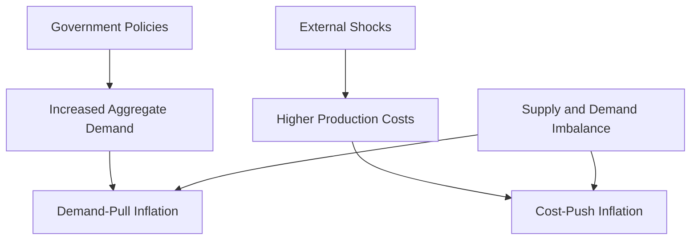

## 4.16 Causes of Inflation

Inflation is a critical economic concept that affects purchasing power, investment decisions, and overall economic stability. Understanding the causes of inflation is essential for financial professionals, policymakers, and investors. In this section, we will delve into the primary causes of inflation, focusing on demand-pull and cost-push dynamics, and explore how these factors interplay within the Canadian economic landscape.

### Demand-Pull Inflation

**Demand-Pull Inflation** occurs when the aggregate demand in an economy surpasses its aggregate supply. This imbalance leads to upward pressure on prices as consumers are willing to pay more for the limited goods and services available. The following factors often contribute to demand-pull inflation:

1. **Increased Consumer Spending:** When consumers have more disposable income, perhaps due to tax cuts or wage increases, they tend to spend more, driving up demand for goods and services.

2. **Government Spending:** Expansionary fiscal policies, such as increased government spending on infrastructure projects, can boost demand in the economy, leading to inflationary pressures.

3. **Monetary Policy:** Central banks, like the Bank of Canada, may lower interest rates to stimulate economic growth. Lower interest rates reduce the cost of borrowing, encouraging both consumer and business spending.

4. **Export Demand:** A surge in demand for a country's exports can increase aggregate demand, especially if the global economy is robust and foreign buyers are purchasing more Canadian goods.

#### Real-World Example: Canadian Housing Market

A practical example of demand-pull inflation can be observed in the Canadian housing market. Over the past decade, low interest rates and increased foreign investment have fueled demand for housing, particularly in cities like Toronto and Vancouver. The resulting demand-pull inflation has led to significant increases in home prices, impacting affordability for many Canadians.

### Cost-Push Inflation

**Cost-Push Inflation** arises when the costs of production increase, leading to a decrease in the aggregate supply of goods and services. Producers, facing higher costs, pass these expenses onto consumers in the form of higher prices. Key contributors to cost-push inflation include:

1. **Rising Wages:** If wages increase significantly, businesses may raise prices to maintain profit margins, especially in labor-intensive industries.

2. **Increased Raw Material Costs:** A rise in the cost of essential raw materials, such as oil or metals, can lead to higher production costs and, consequently, higher consumer prices.

3. **Supply Chain Disruptions:** Events such as natural disasters, geopolitical tensions, or pandemics can disrupt supply chains, reducing the availability of goods and increasing costs.

4. **Regulatory Changes:** New regulations that increase compliance costs for businesses can also contribute to cost-push inflation.

#### Real-World Example: Oil Price Shocks

A classic example of cost-push inflation is the oil price shocks experienced in the 1970s. The Organization of the Petroleum Exporting Countries (OPEC) imposed an oil embargo, leading to a dramatic increase in oil prices. This increase in a critical raw material led to higher production costs across various industries, resulting in widespread inflation.

### Supply and Demand Dynamics

The interplay between supply and demand is fundamental to understanding inflationary pressures. When demand outpaces supply, prices tend to rise, leading to demand-pull inflation. Conversely, when supply constraints increase production costs, cost-push inflation occurs. These dynamics are influenced by various factors, including consumer behavior, business investment, and external economic conditions.

### Government Policies and External Shocks

Government policies and external shocks can significantly impact inflation. Expansionary fiscal and monetary policies can stimulate demand, potentially leading to demand-pull inflation. Conversely, contractionary policies may aim to curb inflation by reducing demand.

External shocks, such as global financial crises or trade disruptions, can also trigger inflation. For instance, a sudden increase in tariffs can raise import costs, contributing to cost-push inflation.

### Visualizing Inflation Dynamics

To better understand the causes of inflation, consider the following diagram illustrating the flow of demand-pull and cost-push inflation:

### Best Practices and Challenges

**Best Practices:**
- Monitor economic indicators such as GDP growth, unemployment rates, and consumer price indices to anticipate inflation trends.
- Diversify investment portfolios to hedge against inflation risks.
- Stay informed about government policy changes and global economic developments.

**Common Challenges:**
- Predicting inflation accurately can be difficult due to the complex interplay of various factors.
- Inflation can erode purchasing power, affecting both consumers and businesses.
- Rapid inflation can lead to uncertainty and reduced economic growth.

### Conclusion

Understanding the causes of inflation is crucial for navigating the complexities of the Canadian economy. By recognizing the dynamics of demand-pull and cost-push inflation, financial professionals can make informed decisions and develop strategies to mitigate inflationary risks. As you continue to explore economic principles, consider how these concepts apply to your financial planning and investment strategies.

For further reading, consider "Principles of Economics" by N. Gregory Mankiw and explore articles such as [Types of Inflation: Demand-Pull and Cost-Push](https://www.investopedia.com/terms/i/inflation.asp).

### **Ready to Test Your Knowledge?**

**Practice 10 Essential CSC Exam Questions to Master Your Certification**



### What is demand-pull inflation?

- [x] Inflation caused by an increase in aggregate demand exceeding aggregate supply.
- [ ] Inflation caused by an increase in production costs.
- [ ] Inflation caused by a decrease in consumer spending.
- [ ] Inflation caused by government regulation.

> **Explanation:** Demand-pull inflation occurs when aggregate demand exceeds aggregate supply, leading to higher prices.

### Which of the following is a cause of cost-push inflation?

- [x] Rising raw material costs
- [ ] Increased consumer spending
- [ ] Decreased government spending
- [ ] Lower interest rates

> **Explanation:** Cost-push inflation is caused by rising production costs, such as raw material costs, which lead to higher prices.

### How can government policies contribute to demand-pull inflation?

- [x] By increasing government spending
- [ ] By decreasing consumer taxes
- [ ] By increasing interest rates
- [ ] By reducing export demand

> **Explanation:** Increased government spending can boost aggregate demand, leading to demand-pull inflation.

### What role do external shocks play in inflation?

- [x] They can disrupt supply chains, leading to cost-push inflation.
- [ ] They always decrease inflation.
- [ ] They only affect demand-pull inflation.
- [ ] They have no impact on inflation.

> **Explanation:** External shocks can disrupt supply chains, increasing production costs and causing cost-push inflation.

### Which of the following is an example of demand-pull inflation in Canada?

- [x] Rising housing prices due to low interest rates
- [ ] Increased oil prices due to geopolitical tensions
- [x] Increased consumer spending due to tax cuts
- [ ] Rising wages in the manufacturing sector

> **Explanation:** Low interest rates and tax cuts can increase demand, leading to demand-pull inflation, as seen in the Canadian housing market.

### What is a common challenge in predicting inflation?

- [x] The complex interplay of various economic factors
- [ ] The simplicity of economic models
- [ ] The lack of historical data
- [ ] The predictability of government policies

> **Explanation:** Predicting inflation is challenging due to the complex interplay of various economic factors.

### How can investors hedge against inflation risks?

- [x] By diversifying their investment portfolios
- [ ] By investing solely in fixed-income securities
- [x] By staying informed about economic indicators
- [ ] By ignoring government policies

> **Explanation:** Diversification and staying informed about economic indicators can help investors hedge against inflation risks.

### What is a potential effect of rapid inflation on the economy?

- [x] Reduced economic growth
- [ ] Increased purchasing power
- [ ] Decreased uncertainty
- [ ] Increased consumer confidence

> **Explanation:** Rapid inflation can lead to uncertainty and reduced economic growth.

### Which book is recommended for further reading on inflation?

- [x] "Principles of Economics" by N. Gregory Mankiw
- [ ] "The Wealth of Nations" by Adam Smith
- [ ] "Capital in the Twenty-First Century" by Thomas Piketty
- [ ] "The General Theory of Employment, Interest, and Money" by John Maynard Keynes

> **Explanation:** "Principles of Economics" by N. Gregory Mankiw is recommended for further reading on inflation.

### True or False: Cost-push inflation is caused by an increase in aggregate demand.

- [ ] True
- [x] False

> **Explanation:** Cost-push inflation is caused by an increase in production costs, not aggregate demand.


