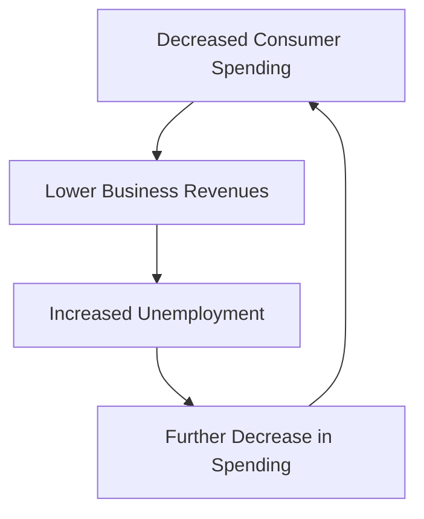

## 4.17 Deflation and Disinflation

In the realm of economics, understanding the nuances between deflation and disinflation is crucial for financial professionals, especially those operating within the Canadian market. These concepts not only influence monetary policy but also have profound effects on consumer behavior, business profitability, and investment strategies. This section delves into the definitions, implications, and relationships of deflation and disinflation, providing a comprehensive overview for those preparing for the CSC® exam.

### Defining Deflation and Disinflation

**Deflation** is characterized by a sustained decrease in the general price level of goods and services. This phenomenon indicates a negative inflation rate, where the purchasing power of money increases over time. In contrast, **disinflation** refers to a decrease in the rate of inflation. Prices continue to rise, but at a slower pace than before. Understanding the distinction between these two terms is essential, as they have different implications for economic policy and market behavior.

### Economic Implications of Sustained Deflation

Deflation can have severe economic consequences. When prices fall consistently, consumers may delay purchases in anticipation of even lower prices, leading to decreased demand. This behavior can result in a vicious cycle of reduced consumer spending, lower business revenues, and increased unemployment. For businesses, deflation can squeeze profit margins, as they may be unable to reduce costs at the same rate as prices fall.

#### Impact on Consumer Behavior

In a deflationary environment, consumers often adopt a wait-and-see approach, postponing spending on non-essential items. This behavior can lead to a significant drop in aggregate demand, exacerbating economic slowdowns. For example, during the Great Depression, deflationary pressures led to widespread consumer reluctance to spend, further deepening the economic crisis.

#### Business Profitability and Investment

Businesses face unique challenges during deflationary periods. With declining prices, companies may struggle to maintain profitability, as fixed costs remain constant while revenues decrease. This environment can lead to cost-cutting measures, including layoffs, which further dampen economic activity. Additionally, deflation can deter investment, as the real value of debt increases, making borrowing less attractive for both businesses and consumers.

### Relationship Between Deflation, Unemployment, and Economic Growth

The relationship between deflation, unemployment, and economic growth is complex and interdependent. Deflation often leads to higher unemployment rates, as businesses cut costs to maintain profitability. This increase in unemployment can further suppress consumer spending, creating a feedback loop that hinders economic growth. In Canada, policymakers closely monitor these dynamics to implement measures that prevent deflationary spirals.

#### Case Study: Japan's Lost Decade

Japan's experience during the 1990s, often referred to as the "Lost Decade," provides a poignant example of the deflation-unemployment-growth relationship. Persistent deflation led to stagnant economic growth and high unemployment, despite various policy interventions. This case underscores the challenges of reversing deflationary trends once they become entrenched.

### Practical Examples and Strategies

To navigate deflationary environments, investors and financial professionals can employ several strategies. Diversifying portfolios to include assets that perform well during deflation, such as government bonds, can mitigate risks. Additionally, understanding the impact of deflation on different sectors can guide investment decisions. For instance, consumer staples and utilities may be more resilient during deflationary periods due to their essential nature.

#### Canadian Context: Pension Funds and Deflation

Canadian pension funds, such as the Canada Pension Plan Investment Board (CPPIB), often adjust their asset allocations in response to deflationary pressures. By increasing exposure to fixed-income securities and reducing reliance on equities, these funds aim to preserve capital and ensure long-term sustainability.

### Diagrams and Visual Aids

To further illustrate these concepts, consider the following diagram depicting the deflationary cycle:

This diagram highlights the cyclical nature of deflation and its impact on the economy.

### Best Practices and Common Pitfalls

When dealing with deflation, it is crucial to remain vigilant and proactive. Best practices include regularly reviewing and adjusting investment strategies to account for changing economic conditions. Common pitfalls include underestimating the impact of deflation on debt burdens and failing to diversify portfolios adequately.

### References and Further Reading

For those interested in exploring these topics further, consider the following resources:

- **Books:** *"Macroeconomics"* by Olivier Blanchard provides an in-depth analysis of macroeconomic principles, including deflation and disinflation.
- **Online Resources:** [Understanding Deflation](https://www.investopedia.com/terms/d/deflation.asp) offers a comprehensive overview of deflation and its economic implications.

### Conclusion

Understanding deflation and disinflation is vital for financial professionals navigating the Canadian market. By recognizing the economic implications and employing strategic investment practices, individuals can mitigate risks and capitalize on opportunities in deflationary environments. As you prepare for the CSC® exam, consider how these concepts apply to real-world scenarios and how they can inform your financial decision-making.

### **Ready to Test Your Knowledge?**

**Practice 10 Essential CSC Exam Questions to Master Your Certification**



### What is deflation?

- [x] A sustained decrease in the general price level of goods and services
- [ ] A decrease in the rate of inflation
- [ ] An increase in the general price level of goods and services
- [ ] A temporary decrease in prices

> **Explanation:** Deflation is defined as a sustained decrease in the general price level of goods and services, leading to an increase in the purchasing power of money.

### How does deflation typically affect consumer behavior?

- [x] Consumers delay purchases in anticipation of lower prices
- [ ] Consumers increase spending due to lower prices
- [ ] Consumers maintain their usual spending habits
- [ ] Consumers invest more in equities

> **Explanation:** During deflation, consumers often delay purchases, expecting prices to fall further, which can reduce overall demand.

### What is disinflation?

- [x] A decrease in the rate of inflation
- [ ] A sustained decrease in the general price level
- [ ] An increase in the rate of inflation
- [ ] A temporary increase in prices

> **Explanation:** Disinflation refers to a decrease in the rate of inflation, meaning prices are still rising but at a slower pace.

### Which sector is typically more resilient during deflationary periods?

- [x] Consumer staples
- [ ] Technology
- [ ] Luxury goods
- [ ] Real estate

> **Explanation:** Consumer staples are essential goods that people continue to buy even during economic downturns, making them more resilient during deflation.

### What is a common strategy for investors during deflation?

- [x] Increase exposure to government bonds
- [ ] Invest heavily in equities
- [ ] Focus on high-risk investments
- [ ] Avoid fixed-income securities

> **Explanation:** During deflation, government bonds are considered safer investments as they provide fixed returns and are less affected by falling prices.

### How does deflation affect business profitability?

- [x] It can squeeze profit margins
- [ ] It increases profit margins
- [ ] It has no impact on profitability
- [ ] It guarantees higher profits

> **Explanation:** Deflation can squeeze profit margins as businesses may not be able to reduce costs at the same rate as prices fall.

### What is a potential consequence of deflation on unemployment?

- [x] Increased unemployment
- [ ] Decreased unemployment
- [ ] No change in unemployment
- [ ] Guaranteed full employment

> **Explanation:** Deflation can lead to increased unemployment as businesses cut costs to maintain profitability, often resulting in layoffs.

### What was a significant consequence of Japan's deflationary period in the 1990s?

- [x] Stagnant economic growth
- [ ] Rapid economic growth
- [ ] Decreased unemployment
- [ ] Increased consumer spending

> **Explanation:** Japan's deflationary period in the 1990s, known as the "Lost Decade," led to stagnant economic growth and high unemployment.

### What is the relationship between deflation and the real value of debt?

- [x] Deflation increases the real value of debt
- [ ] Deflation decreases the real value of debt
- [ ] Deflation has no impact on the real value of debt
- [ ] Deflation eliminates debt

> **Explanation:** Deflation increases the real value of debt, making it more burdensome for borrowers as the purchasing power of money increases.

### True or False: Disinflation means prices are decreasing.

- [ ] True
- [x] False

> **Explanation:** False. Disinflation means that prices are still rising, but at a slower rate than before, not that they are decreasing.


