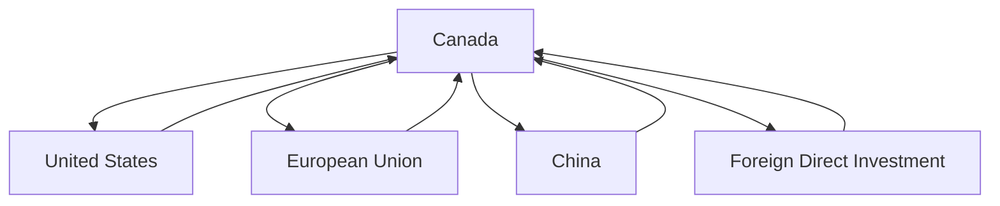

## 4.18 International Finance and Trade

International finance and trade are pivotal components of the global economic landscape, influencing the economic performance of nations, including Canada. This section delves into the intricacies of international finance, the role of trade, investments, and capital flows, and how global economic conditions impact domestic markets. We will also explore the influence of international trade agreements and policies on economic performance.

### Understanding International Finance

**International Finance** is the study of monetary interactions that occur between two or more countries. It encompasses a wide range of activities, including foreign exchange markets, international monetary systems, and global financial markets. For Canada, international finance is crucial as it facilitates cross-border trade, investment, and economic growth.

#### Significance to the Canadian Economy

Canada's economy is deeply integrated with the global market. International finance allows Canadian businesses to access foreign capital, diversify investments, and engage in international trade. This integration helps stabilize the economy by spreading risks and tapping into global growth opportunities.

### The Role of Trade, Investments, and Capital Flows

#### Trade

Trade is the exchange of goods and services across international borders. It is a fundamental aspect of international finance, enabling countries to specialize in the production of goods where they have a comparative advantage. For Canada, trade is vital, with key trading partners including the United States, China, and the European Union.

- **Example:** Canada's export of natural resources like oil and lumber to the United States and import of machinery and electronics from China.

#### Investments

International investments involve the allocation of capital across borders. These can be in the form of foreign direct investment (FDI) or portfolio investment. Canadian companies often invest abroad to access new markets and technologies, while foreign investments in Canada bring capital and create jobs.

- **Example:** Canadian pension funds investing in European infrastructure projects to diversify their portfolios and achieve stable returns.

#### Capital Flows

**Capital Flows** refer to the movement of money for investment, trade, or business production. They are essential for maintaining liquidity in the global financial system. Capital flows can be influenced by interest rates, economic stability, and investor confidence.

- **Example:** The influx of foreign capital into Canada's real estate market, driven by the country's stable economic environment.

### Impact of Global Economic Conditions on Domestic Markets

Global economic conditions, such as recessions, booms, or geopolitical tensions, can significantly impact domestic markets. For instance, a global recession can lead to reduced demand for Canadian exports, affecting the country's GDP and employment rates.

- **Case Study:** The 2008 financial crisis led to a decline in global trade, impacting Canadian industries reliant on exports, such as manufacturing and natural resources.

### International Trade Agreements and Policies

International trade agreements and policies play a crucial role in shaping economic performance. These agreements facilitate trade by reducing tariffs, eliminating trade barriers, and promoting economic cooperation.

#### Key Agreements

- **North American Free Trade Agreement (NAFTA):** Now replaced by the United States-Mexico-Canada Agreement (USMCA), it has been instrumental in boosting trade between Canada, the U.S., and Mexico.
- **Comprehensive Economic and Trade Agreement (CETA):** A trade agreement between Canada and the European Union that aims to enhance trade and investment.

### Practical Examples and Case Studies

#### Canadian Pension Funds

Canadian pension funds, such as the Canada Pension Plan Investment Board (CPPIB), actively engage in international finance by investing in global markets. This strategy helps diversify their portfolios and achieve higher returns, benefiting Canadian retirees.

#### Major Canadian Banks

Banks like RBC and TD have expanded their operations internationally, leveraging global finance to enhance their services and profitability. These banks manage foreign exchange risks and capitalize on international growth opportunities.

### Diagrams and Visuals

Below is a diagram illustrating the flow of capital between Canada and its trading partners:

### Best Practices and Challenges

#### Best Practices

- Diversifying investments across different countries and sectors to mitigate risks.
- Staying informed about global economic trends and geopolitical developments.

#### Common Challenges

- Managing foreign exchange risks due to currency fluctuations.
- Navigating complex international regulations and trade policies.

### References and Further Reading

- **Books:** *"International Economics"* by Paul Krugman and Maurice Obstfeld
- **Articles:** [Basics of International Finance](https://www.investopedia.com/terms/i/international-finance.asp)

### Encouragement for Application

Understanding international finance and trade is crucial for making informed investment decisions and strategic business moves. By applying these principles, readers can enhance their financial planning and capitalize on global opportunities.

### **Ready to Test Your Knowledge?**

**Practice 10 Essential CSC Exam Questions to Master Your Certification**



### What is international finance?

- [x] The study of monetary interactions that occur between two or more countries.
- [ ] The study of domestic financial markets.
- [ ] The study of local trade practices.
- [ ] The study of personal finance.

> **Explanation:** International finance involves the study of financial interactions between countries, including trade, investments, and capital flows.

### Which of the following is a key trading partner for Canada?

- [x] United States
- [ ] Brazil
- [ ] India
- [ ] Russia

> **Explanation:** The United States is Canada's largest trading partner, with significant trade in goods and services.

### What are capital flows?

- [x] Movements of money for the purpose of investment, trade, or business production.
- [ ] Movements of goods across borders.
- [ ] Movements of people for employment.
- [ ] Movements of technology between companies.

> **Explanation:** Capital flows refer to the movement of money across borders for various economic activities.

### How can global economic conditions impact domestic markets?

- [x] By affecting demand for exports and influencing GDP.
- [ ] By changing local weather patterns.
- [ ] By altering domestic cultural practices.
- [ ] By influencing local sports events.

> **Explanation:** Global economic conditions can impact domestic markets by affecting trade, investment, and economic growth.

### What is the purpose of international trade agreements?

- [x] To reduce tariffs and promote economic cooperation.
- [ ] To increase tariffs and restrict trade.
- [ ] To eliminate all forms of trade.
- [ ] To focus solely on domestic markets.

> **Explanation:** International trade agreements aim to facilitate trade by reducing barriers and promoting cooperation.

### Which Canadian entity is known for investing in global markets?

- [x] Canada Pension Plan Investment Board (CPPIB)
- [ ] Canadian Broadcasting Corporation (CBC)
- [ ] Canada Post
- [ ] Canadian Space Agency

> **Explanation:** The CPPIB invests globally to diversify its portfolio and achieve higher returns.

### What is a common challenge in international finance?

- [x] Managing foreign exchange risks.
- [ ] Managing local grocery prices.
- [ ] Managing domestic sports teams.
- [ ] Managing local weather conditions.

> **Explanation:** Foreign exchange risks are a significant challenge due to currency fluctuations in international finance.

### Which agreement replaced NAFTA?

- [x] United States-Mexico-Canada Agreement (USMCA)
- [ ] Comprehensive Economic and Trade Agreement (CETA)
- [ ] Trans-Pacific Partnership (TPP)
- [ ] European Union Trade Agreement (EUTA)

> **Explanation:** The USMCA replaced NAFTA as the trade agreement between the U.S., Canada, and Mexico.

### What is a benefit of international investments for Canadian companies?

- [x] Access to new markets and technologies.
- [ ] Increased local taxes.
- [ ] Reduced domestic employment.
- [ ] Limited access to resources.

> **Explanation:** International investments allow Canadian companies to access new markets and technologies, enhancing growth.

### True or False: International finance only deals with trade between countries.

- [ ] True
- [x] False

> **Explanation:** International finance encompasses a broader range of activities, including investments, capital flows, and monetary interactions.


