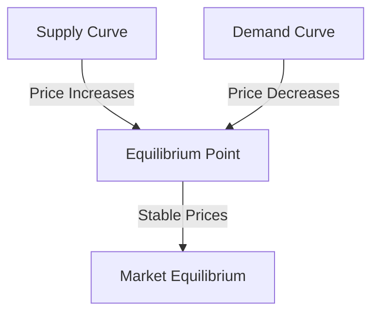

## Chapter 4: Overview of Economics

### 4.1 Defining Economics

Economics is a social science that studies how individuals, businesses, and governments make choices on allocating resources to satisfy their needs and wants. It plays a crucial role in financial markets, influencing everything from individual investment decisions to national economic policies. Understanding economics is essential for anyone involved in the financial services industry, particularly in Canada, where economic principles guide regulatory frameworks and market operations.

#### The Scope of Economics in Financial Markets

Economics encompasses a wide range of topics, including the behavior of individuals and firms, the functioning of markets, and the role of government in the economy. In the context of financial markets, economics helps us understand how prices are determined, how resources are allocated, and how economic policies can impact market conditions. For example, the Bank of Canada's monetary policy decisions are based on economic principles and have significant implications for interest rates and inflation, which in turn affect financial markets.

#### The Basic Economic Problem: Scarcity and Choice

At the heart of economics is the problem of scarcity. Scarcity refers to the limited nature of resources in the world, which are insufficient to satisfy all human wants and needs. This fundamental problem forces individuals, businesses, and governments to make choices about how to allocate their limited resources.

**Scarcity** is the driving force behind the need for economic decision-making. For example, a Canadian investor must decide how to allocate their limited capital among various investment options, such as stocks, bonds, and real estate. Similarly, the Canadian government must decide how to allocate its budget across different sectors, such as healthcare, education, and infrastructure.

#### Decision-Making in Economics

Economic decision-making involves weighing the costs and benefits of different options to make the best possible choice. This process is influenced by various factors, including preferences, incentives, and available information.

1. **Consumers** make decisions based on their preferences and budget constraints. For instance, a consumer might choose between saving in a Tax-Free Savings Account (TFSA) or spending on a new car.

2. **Businesses** aim to maximize profits by deciding what goods and services to produce, how to produce them, and at what price to sell them. A Canadian company might decide to invest in new technology to improve efficiency and reduce costs.

3. **Governments** make decisions to achieve economic objectives such as growth, stability, and equity. The Canadian government, for example, might implement fiscal policies to stimulate economic growth during a recession.

#### Market Equilibrium: The Intersection of Supply and Demand

Market equilibrium is a key concept in economics, representing a state where the quantity of a good or service supplied equals the quantity demanded, resulting in stable prices. This balance is achieved through the interaction of supply and demand forces.

**Supply and Demand** are fundamental economic concepts that describe how markets function:

- **Supply** refers to the quantity of a good or service that producers are willing and able to sell at different prices.
- **Demand** refers to the quantity of a good or service that consumers are willing and able to purchase at different prices.

The interaction between supply and demand determines the market price and quantity of goods and services. When demand exceeds supply, prices tend to rise, encouraging producers to increase supply. Conversely, when supply exceeds demand, prices tend to fall, encouraging consumers to increase demand.

Below is a diagram illustrating market equilibrium:

In this diagram, the equilibrium point is where the supply curve intersects with the demand curve, indicating the price at which the quantity supplied equals the quantity demanded.

#### Practical Examples and Case Studies

To illustrate these concepts, consider the following real-world Canadian scenarios:

- **Canadian Pension Funds:** These funds must allocate resources efficiently to meet future liabilities. They often use economic principles to decide on asset allocation strategies, balancing risk and return to achieve long-term objectives.

- **Major Canadian Banks:** Institutions like RBC and TD use economic analysis to forecast market trends and make strategic decisions. For example, they might adjust their lending practices based on anticipated changes in interest rates driven by economic conditions.

#### References and Further Exploration

For those interested in exploring these topics further, consider the following resources:

- **Books:** *"Economics"* by Paul Samuelson and William Nordhaus provides a comprehensive overview of economic principles and their applications.

- **Articles:** [Market Equilibrium Explained](https://www.investopedia.com/terms/m/market-equilibrium.asp) offers a detailed explanation of how market equilibrium is achieved and its significance.

- **Canadian Financial Regulations:** Understanding the role of institutions like the Bank of Canada and the Canadian Securities Administrators can provide insights into how economic principles are applied in regulatory frameworks.

#### Conclusion

Understanding economics is essential for navigating the complexities of financial markets. By grasping the concepts of scarcity, choice, and market equilibrium, individuals and institutions can make informed decisions that optimize resource allocation and contribute to economic stability. As you continue your journey in the financial services industry, consider how these principles apply to your own financial planning and investment strategies.

### **Ready to Test Your Knowledge?**

**Practice 10 Essential CSC Exam Questions to Master Your Certification**



### What is the fundamental economic problem?

- [x] Scarcity
- [ ] Inflation
- [ ] Unemployment
- [ ] Recession

> **Explanation:** Scarcity is the fundamental economic problem of having seemingly unlimited human wants in a world of limited resources.

### What does market equilibrium represent?

- [x] A condition where market supply equals market demand
- [ ] A situation where prices are constantly rising
- [ ] A state where only producers benefit
- [ ] A scenario where demand exceeds supply

> **Explanation:** Market equilibrium is a condition where market supply equals market demand, resulting in stable prices.

### Which of the following is NOT a factor influencing economic decision-making?

- [ ] Preferences
- [ ] Incentives
- [x] Weather
- [ ] Available information

> **Explanation:** Economic decision-making is influenced by preferences, incentives, and available information, not weather.

### How do consumers make economic decisions?

- [x] Based on preferences and budget constraints
- [ ] By following government regulations
- [ ] By maximizing supply
- [ ] By minimizing demand

> **Explanation:** Consumers make decisions based on their preferences and budget constraints.

### What role do businesses play in the economy?

- [x] They aim to maximize profits by deciding what goods and services to produce.
- [ ] They regulate market prices.
- [ ] They provide unlimited resources.
- [ ] They control consumer demand.

> **Explanation:** Businesses aim to maximize profits by deciding what goods and services to produce, how to produce them, and at what price to sell them.

### What happens when demand exceeds supply?

- [x] Prices tend to rise
- [ ] Prices tend to fall
- [ ] Supply increases
- [ ] Demand decreases

> **Explanation:** When demand exceeds supply, prices tend to rise, encouraging producers to increase supply.

### What is the role of the Canadian government in economic decision-making?

- [x] To achieve economic objectives such as growth, stability, and equity
- [ ] To maximize profits
- [ ] To minimize consumer spending
- [ ] To control all market prices

> **Explanation:** The Canadian government makes decisions to achieve economic objectives such as growth, stability, and equity.

### What is the significance of the equilibrium point in a market?

- [x] It indicates the price at which the quantity supplied equals the quantity demanded.
- [ ] It shows the maximum profit for producers.
- [ ] It represents the lowest possible price.
- [ ] It marks the highest consumer demand.

> **Explanation:** The equilibrium point indicates the price at which the quantity supplied equals the quantity demanded, resulting in stable prices.

### How do major Canadian banks use economic analysis?

- [x] To forecast market trends and make strategic decisions
- [ ] To control consumer spending
- [ ] To set government policies
- [ ] To provide unlimited loans

> **Explanation:** Major Canadian banks use economic analysis to forecast market trends and make strategic decisions, such as adjusting lending practices.

### True or False: Scarcity only affects consumers, not businesses or governments.

- [ ] True
- [x] False

> **Explanation:** Scarcity affects consumers, businesses, and governments, as all must make choices about how to allocate limited resources.


