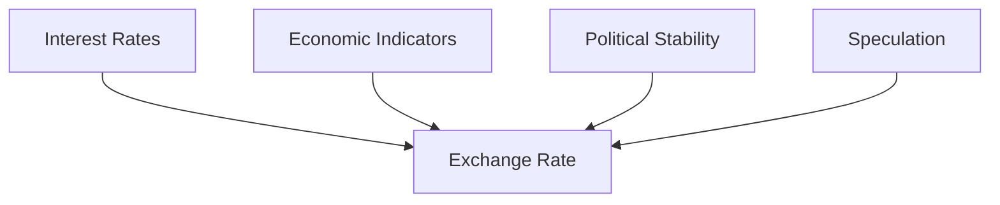

---

linkTitle: "4.20 The Exchange Rate"
title: "Exchange Rate Dynamics: Understanding Their Role in International Finance"
description: "Explore the intricacies of exchange rates, their determination, and their impact on global trade and investment within the Canadian context."
categories:
- Economics
- International Finance
- Canadian Market
tags:
- Exchange Rate
- Foreign Exchange Market
- International Trade
- Investment Strategies
- Canadian Finance
date: 2024-10-25
type: docs
nav_weight: 61000

canonical: "https://securitiesexamsmastery.ca/13/4/21"
license: "© 2023 Tokenizer Inc. CC BY-NC-SA 4.0"
---

## 4.20 The Exchange Rate

In the realm of international finance, the exchange rate plays a pivotal role in determining the economic interactions between countries. Understanding exchange rates is crucial for financial professionals, as they influence trade balances, investment flows, and economic policies. This section delves into the fundamentals of exchange rates, their determination, and their impact on trade and investment, with a particular focus on the Canadian context.

### Defining the Exchange Rate

The **exchange rate** is the price of one currency in terms of another currency. It serves as a critical indicator of a country's economic health and competitiveness in the global market. For instance, if the exchange rate between the Canadian dollar (CAD) and the US dollar (USD) is 1.25, it means that 1 USD can be exchanged for 1.25 CAD.

### The Role of Exchange Rates in International Finance

Exchange rates are fundamental to international finance as they affect the relative prices of goods and services between countries. A change in the exchange rate can alter the cost of imports and exports, influencing trade balances and economic growth. For Canadian businesses, a strong CAD makes imports cheaper but can make exports less competitive abroad, impacting sectors like manufacturing and natural resources.

### Determination of Exchange Rates

Exchange rates are primarily determined by supply and demand dynamics in the **foreign exchange market**, a global marketplace where currencies are traded. Several factors influence these dynamics:

- **Interest Rates:** Higher interest rates offer lenders in an economy a higher return relative to other countries. Therefore, higher interest rates attract foreign capital and cause the exchange rate to rise.
- **Economic Indicators:** Indicators such as GDP growth, employment rates, and inflation can influence investor perceptions and currency demand.
- **Political Stability and Economic Performance:** Countries with less risk for political turmoil are more attractive to foreign investors, leading to a stronger currency.
- **Speculation:** Traders' expectations about future currency movements can drive demand and supply, affecting exchange rates.

### Fixed vs. Floating Exchange Rate Systems

Exchange rate systems can be broadly categorized into fixed and floating systems:

- **Fixed Exchange Rate System:** In this system, a country's currency value is tied or pegged to another major currency, such as the USD or gold. The Canadian dollar was pegged to the USD until 1970. Fixed systems provide stability in international prices but require large reserves of foreign currency to maintain the peg.

- **Floating Exchange Rate System:** Here, the currency value is determined by market forces without direct government or central bank intervention. Canada adopted a floating exchange rate in 1970, allowing the CAD to fluctuate based on economic conditions and market perceptions.

### Impact of Exchange Rate Fluctuations on Trade and Investment

Exchange rate fluctuations can have significant implications for trade and investment:

- **Trade Balance:** A depreciating currency makes exports cheaper and imports more expensive, potentially improving a country's trade balance. Conversely, an appreciating currency can have the opposite effect.
  
- **Investment Flows:** Exchange rate movements can affect foreign direct investment (FDI) and portfolio investments. A strong currency might deter foreign investment due to higher costs, while a weaker currency could attract investors seeking cheaper assets.

- **Inflation:** Exchange rate changes can influence inflation. A depreciating currency can lead to higher import prices, contributing to inflationary pressures.

### Practical Example: Canadian Pension Funds and Exchange Rates

Consider a Canadian pension fund investing in foreign assets. If the CAD depreciates against the currency of the investment, the value of the foreign assets in CAD terms increases, potentially boosting the fund's returns. Conversely, if the CAD appreciates, the value of foreign investments may decrease, affecting the fund's performance.

### Case Study: The Impact of Exchange Rate on Canadian Banks

Major Canadian banks like RBC and TD operate globally, and exchange rate fluctuations can impact their financial statements. For instance, a strong CAD can reduce the value of foreign earnings when converted back to CAD, affecting profitability. Banks often use hedging strategies to mitigate these risks, such as forward contracts and options.

### Diagram: Exchange Rate Determination

Below is a simplified diagram illustrating the factors influencing exchange rate determination:

### Best Practices and Challenges

- **Hedging Strategies:** Financial professionals should consider hedging strategies to manage exchange rate risks, such as using derivatives like futures and options.
- **Monitoring Economic Indicators:** Regularly monitor economic indicators and geopolitical events that could impact exchange rates.
- **Diversification:** Diversifying investments across different currencies can mitigate the impact of exchange rate volatility.

### Conclusion

Understanding exchange rates and their implications is essential for financial professionals operating in the global market. By analyzing the factors that influence exchange rates and their impact on trade and investment, professionals can make informed decisions to optimize financial outcomes. As the Canadian economy continues to integrate with global markets, mastering exchange rate dynamics becomes increasingly important.

For further reading, consider the book *"Exchange Rate Economics"* by Lucio Sarno and Mark P. Taylor, and the article [How Exchange Rates Work](https://www.investopedia.com/terms/e/exchangerate.asp).

### **Ready to Test Your Knowledge?**

**Practice 10 Essential CSC Exam Questions to Master Your Certification**



### What is the exchange rate?

- [x] The price of one currency in terms of another currency.
- [ ] The interest rate set by a central bank.
- [ ] The rate at which goods are exchanged in international trade.
- [ ] The rate of inflation in a country.

> **Explanation:** The exchange rate is defined as the price of one currency in terms of another currency, crucial for international finance.

### Which market determines exchange rates?

- [x] Foreign Exchange Market
- [ ] Stock Market
- [ ] Commodity Market
- [ ] Real Estate Market

> **Explanation:** Exchange rates are determined in the foreign exchange market, where currencies are traded globally.

### What is a fixed exchange rate system?

- [x] A system where a currency's value is pegged to another currency or a basket of currencies.
- [ ] A system where a currency's value is determined by market forces.
- [ ] A system where a currency's value is determined by the government.
- [ ] A system where a currency's value is determined by inflation rates.

> **Explanation:** In a fixed exchange rate system, a currency's value is pegged to another currency or a basket of currencies, providing stability.

### How does a floating exchange rate system work?

- [x] Currency value is determined by market forces without direct government intervention.
- [ ] Currency value is pegged to another currency.
- [ ] Currency value is fixed by the central bank.
- [ ] Currency value is determined by international agreements.

> **Explanation:** In a floating exchange rate system, the currency value is determined by market forces, allowing for natural fluctuations.

### What impact does a depreciating currency have on exports?

- [x] Makes exports cheaper and more competitive.
- [ ] Makes exports more expensive.
- [ ] Has no impact on exports.
- [ ] Reduces the demand for exports.

> **Explanation:** A depreciating currency makes exports cheaper and more competitive in the global market, potentially increasing demand.

### What is one effect of exchange rate fluctuations on Canadian banks?

- [x] It can affect the value of foreign earnings when converted to CAD.
- [ ] It has no impact on their financial statements.
- [ ] It only affects domestic operations.
- [ ] It reduces the need for hedging strategies.

> **Explanation:** Exchange rate fluctuations can affect the value of foreign earnings for Canadian banks when converted to CAD, impacting profitability.

### What is a common strategy to manage exchange rate risk?

- [x] Hedging with derivatives like futures and options.
- [ ] Ignoring exchange rate movements.
- [ ] Investing only in domestic markets.
- [ ] Relying solely on government interventions.

> **Explanation:** Hedging with derivatives like futures and options is a common strategy to manage exchange rate risk.

### How can exchange rate changes influence inflation?

- [x] A depreciating currency can lead to higher import prices, contributing to inflation.
- [ ] A depreciating currency reduces inflation.
- [ ] Exchange rate changes have no impact on inflation.
- [ ] A strong currency always leads to higher inflation.

> **Explanation:** A depreciating currency can lead to higher import prices, contributing to inflationary pressures in an economy.

### What is the impact of a strong CAD on Canadian exports?

- [x] It can make exports less competitive abroad.
- [ ] It makes exports more competitive.
- [ ] It has no impact on exports.
- [ ] It increases the demand for exports.

> **Explanation:** A strong CAD can make Canadian exports less competitive abroad, potentially reducing demand.

### True or False: Exchange rates only affect international trade, not domestic economic policies.

- [ ] True
- [x] False

> **Explanation:** Exchange rates affect both international trade and domestic economic policies, influencing inflation, interest rates, and economic growth.


