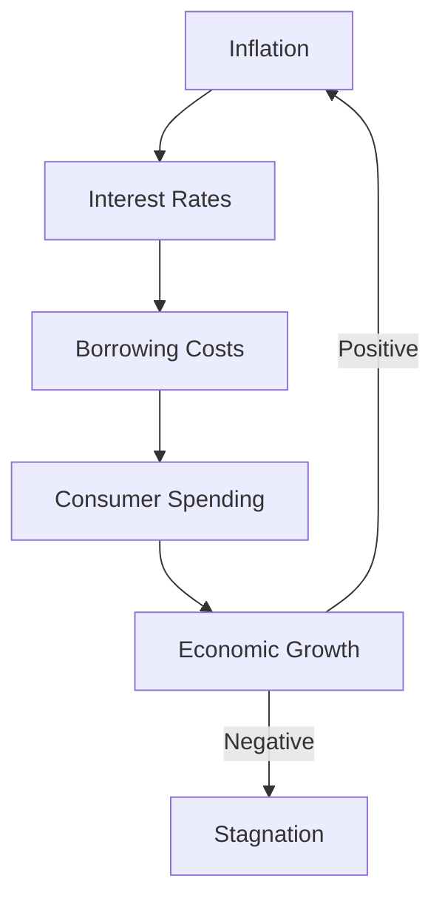

## 4.23 The Impact of Inflation

Inflation is a critical economic phenomenon that affects various aspects of the economy, from individual purchasing power to the broader financial markets. Understanding inflation's impact is essential for investors, policymakers, and financial professionals, particularly within the Canadian context. This section delves into the effects of inflation on different economic agents, its influence on investment strategies, and the intricate relationship between inflation and interest rates.

### The Effects of Inflation on Economic Agents

Inflation, defined as the general increase in prices over time, affects different economic agents in distinct ways:

- **Consumers:** Inflation erodes purchasing power, meaning that consumers can buy less with the same amount of money. This reduction in value can lead to decreased consumer spending, particularly on non-essential goods and services.

- **Businesses:** Companies may face higher costs for raw materials and labor, which can squeeze profit margins. Businesses might pass these costs onto consumers through higher prices, potentially reducing demand.

- **Investors:** Inflation can diminish the real returns on investments. For instance, if an investment yields a 5% return but inflation is at 3%, the real return is only 2%.

- **Government:** Inflation can impact fiscal policy, as governments may need to adjust spending and taxation to manage inflationary pressures. Additionally, inflation affects the real value of government debt.

### Inflation's Influence on Investment Strategies

Investors must consider inflation when developing investment strategies. Here are some ways inflation influences these strategies:

- **Asset Allocation:** During periods of high inflation, investors might shift towards assets that traditionally perform well in such environments, such as real estate, commodities, and inflation-protected securities like Real Return Bonds (RRBs) in Canada.

- **Equities vs. Fixed Income:** Equities may offer better protection against inflation compared to fixed-income securities, as companies can increase prices to maintain profit margins. However, the performance of equities can vary significantly across sectors.

- **Diversification:** A diversified portfolio can help mitigate the risks associated with inflation. Including a mix of asset classes, such as stocks, bonds, and alternative investments, can provide a hedge against inflationary pressures.

### The Relationship Between Inflation and Interest Rates

Inflation and interest rates are closely linked, with significant implications for borrowers and lenders:

- **Interest Rate Premium:** Lenders require an interest rate premium to compensate for the risk of inflation eroding the value of future repayments. This premium is reflected in higher nominal interest rates during inflationary periods.

- **Borrowers:** Higher interest rates increase the cost of borrowing, affecting consumer loans, mortgages, and business financing. This can lead to reduced spending and investment, slowing economic growth.

- **Lenders:** While higher interest rates can benefit lenders by increasing returns on loans, they also carry the risk of default if borrowers struggle to meet higher repayment obligations.

### Long-term Consequences of Sustained Inflation

Sustained inflation can have profound long-term effects on economic growth and stability:

- **Economic Growth:** Persistent inflation can lead to uncertainty, discouraging investment and savings. This uncertainty can stifle economic growth and innovation.

- **Price Stability:** Central banks, such as the Bank of Canada, aim to maintain price stability to foster a stable economic environment. Unchecked inflation can lead to hyperinflation, severely disrupting economic activity.

- **Income Distribution:** Inflation can disproportionately affect lower-income households, as they spend a larger portion of their income on necessities. This can exacerbate income inequality and social tensions.

### Practical Examples and Case Studies

To illustrate these concepts, consider the following Canadian scenarios:

- **Canadian Pension Funds:** These funds often adjust their asset allocations to protect against inflation. For example, they may increase exposure to real assets like infrastructure and real estate, which can offer inflation-linked returns.

- **Major Canadian Banks:** Banks such as RBC and TD adjust their lending rates in response to inflationary trends, impacting mortgage rates and consumer loans. These adjustments influence borrowing costs for individuals and businesses.

### Diagrams and Visuals

Below is a simplified diagram illustrating the relationship between inflation, interest rates, and economic growth:

### Best Practices and Common Pitfalls

- **Best Practices:** Regularly review and adjust investment portfolios to account for inflationary trends. Consider inflation-protected securities and diversify across asset classes.

- **Common Pitfalls:** Ignoring inflation risk can lead to inadequate retirement savings and diminished real returns. Over-reliance on fixed-income investments during inflationary periods can erode purchasing power.

### References and Further Reading

- **Books:** *"Macroeconomics"* by Olivier Blanchard provides an in-depth exploration of inflation and its economic implications.
- **Online Resources:** The [Bank of Canada](https://www.bankofcanada.ca/rates/interest-rates/) offers valuable insights into current inflation trends and interest rate policies.

### Summary

Inflation is a multifaceted economic force with significant implications for consumers, businesses, investors, and governments. By understanding its effects and incorporating inflation considerations into investment strategies, financial professionals can better navigate the challenges and opportunities presented by inflation. As you continue to explore the Canadian financial landscape, consider how inflation impacts your financial planning and investment decisions.

### **Ready to Test Your Knowledge?**

**Practice 10 Essential CSC Exam Questions to Master Your Certification**



### How does inflation affect consumers?

- [x] It erodes purchasing power.
- [ ] It increases purchasing power.
- [ ] It has no effect on purchasing power.
- [ ] It stabilizes purchasing power.

> **Explanation:** Inflation erodes purchasing power, meaning consumers can buy less with the same amount of money.

### What is an interest rate premium?

- [x] An additional return required by lenders to compensate for the risk of inflation.
- [ ] A discount offered by lenders during deflation.
- [ ] A fixed rate applied to all loans.
- [ ] A government subsidy for borrowers.

> **Explanation:** An interest rate premium is an additional return required by lenders to compensate for the risk of inflation eroding the value of future repayments.

### Which asset class is typically considered a good hedge against inflation?

- [x] Real estate
- [ ] Fixed-income securities
- [ ] Cash
- [ ] Technology stocks

> **Explanation:** Real estate is often considered a good hedge against inflation because property values and rental income can rise with inflation.

### How does inflation impact fixed-income investments?

- [x] It diminishes real returns.
- [ ] It increases real returns.
- [ ] It has no impact on real returns.
- [ ] It stabilizes real returns.

> **Explanation:** Inflation diminishes the real returns on fixed-income investments, as the purchasing power of interest payments decreases.

### What is the relationship between inflation and interest rates?

- [x] Higher inflation leads to higher interest rates.
- [ ] Higher inflation leads to lower interest rates.
- [ ] Inflation and interest rates are unrelated.
- [ ] Inflation causes interest rates to stabilize.

> **Explanation:** Higher inflation typically leads to higher interest rates, as lenders demand a premium to compensate for inflation risk.

### What is a potential long-term consequence of sustained inflation?

- [x] Economic stagnation
- [ ] Increased economic growth
- [ ] Decreased income inequality
- [ ] Stabilized prices

> **Explanation:** Sustained inflation can lead to economic stagnation by creating uncertainty and discouraging investment and savings.

### How can investors protect their portfolios against inflation?

- [x] Diversify across asset classes
- [ ] Concentrate investments in fixed-income securities
- [ ] Avoid equities
- [ ] Hold only cash

> **Explanation:** Diversifying across asset classes can help protect portfolios against inflation by spreading risk and including assets that may perform well in inflationary environments.

### What is a common pitfall when considering inflation in investment strategies?

- [x] Ignoring inflation risk
- [ ] Overestimating inflation risk
- [ ] Investing only in equities
- [ ] Avoiding real assets

> **Explanation:** Ignoring inflation risk can lead to inadequate retirement savings and diminished real returns, making it a common pitfall.

### How does inflation affect government fiscal policy?

- [x] It may require adjustments in spending and taxation.
- [ ] It has no impact on fiscal policy.
- [ ] It leads to increased government debt.
- [ ] It stabilizes government budgets.

> **Explanation:** Inflation can impact fiscal policy, as governments may need to adjust spending and taxation to manage inflationary pressures.

### True or False: Inflation can exacerbate income inequality.

- [x] True
- [ ] False

> **Explanation:** Inflation can exacerbate income inequality, as lower-income households spend a larger portion of their income on necessities, which are affected by rising prices.


