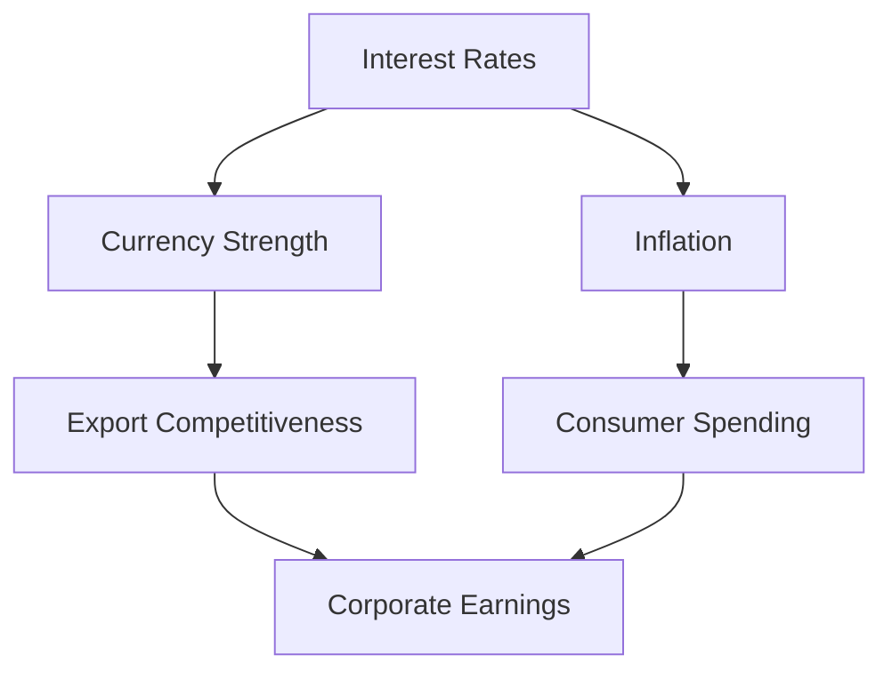

## 4.24 Summary of Chapter 4

In Chapter 4, we delved into the foundational economic concepts that are vital for understanding the broader financial landscape and making informed investment decisions. This summary encapsulates the key ideas discussed, emphasizing their relevance to the Canadian financial market and investment strategies.

### Understanding GDP and Economic Growth

Gross Domestic Product (GDP) is a critical measure of a country's economic performance. It represents the total value of all goods and services produced over a specific time period within a nation. Understanding GDP is essential for investors as it provides insights into the economic health and growth potential of a country. A growing GDP typically signals a healthy economy, which can lead to increased corporate profits and higher stock prices.

#### Practical Example: Canadian GDP Trends

Consider the historical GDP growth trends in Canada. During periods of robust economic growth, such as the post-2008 recovery, Canadian equities often experienced significant appreciation. Investors who monitored GDP trends could align their portfolios to capitalize on these growth phases.

### Business Cycles and Their Impact

Business cycles refer to the fluctuations in economic activity that an economy experiences over time, typically characterized by periods of expansion and contraction. Understanding these cycles is crucial for investors as they influence market conditions and investment opportunities.

#### Case Study: The 2008 Financial Crisis

The 2008 financial crisis serves as a poignant example of a business cycle downturn. During this period, the Canadian economy, like many others, faced a severe contraction. Investors who recognized the signs of an impending recession, such as declining consumer confidence and rising unemployment, could adjust their strategies to mitigate losses.

### Economic Indicators: Tools for Market Analysis

Economic indicators are statistics that provide insights into the economic performance and future direction of an economy. Key indicators include inflation rates, unemployment rates, and consumer confidence indices. These indicators help investors gauge the economic environment and make informed decisions.

#### Example: Monitoring Inflation in Canada

Inflation is a critical economic indicator that affects purchasing power and interest rates. In Canada, the Consumer Price Index (CPI) is a primary measure of inflation. By tracking CPI trends, investors can anticipate changes in interest rates and adjust their fixed-income portfolios accordingly.

### The Interconnectedness of Economic Variables

Economic variables are deeply interconnected, and changes in one can significantly impact others. For instance, a rise in interest rates can lead to a stronger currency, affecting export competitiveness and corporate earnings. Understanding these relationships is crucial for developing comprehensive investment strategies.

#### Diagram: Interconnected Economic Variables

### The Role of Microeconomics and Macroeconomics

Both microeconomic and macroeconomic factors play a vital role in investment decision-making. Microeconomics focuses on individual markets and consumer behavior, while macroeconomics examines the economy as a whole. A balanced understanding of both is essential for investors to navigate complex market dynamics.

### Continuous Monitoring and Adaptation

The financial markets are dynamic, and economic conditions can change rapidly. Continuous monitoring of economic indicators and trends is crucial for staying informed and adapting investment strategies accordingly. This proactive approach helps investors capitalize on opportunities and mitigate risks.

### References and Further Exploration

To deepen your understanding of the economic concepts covered in this chapter, consider the following resources:

- **Review Resources:** Revisit sections on GDP, inflation, and exchange rates for a comprehensive understanding.
- **Further Reading:** *"Economics"* by Paul Samuelson and William Nordhaus provides a thorough exploration of economic principles.
- **Online Courses:** [edX's Principles of Economics](https://www.edx.org/course/principles-of-economics) offers a structured approach to learning economic fundamentals.

### Conclusion

In conclusion, a solid grasp of economic concepts such as GDP, business cycles, and economic indicators is indispensable for making informed investment decisions. By understanding the interconnectedness of these variables and continuously monitoring economic trends, investors can navigate the Canadian financial landscape with confidence and strategic foresight.

### **Ready to Test Your Knowledge?**

**Practice 10 Essential CSC Exam Questions to Master Your Certification**



### What does GDP stand for?

- [x] Gross Domestic Product
- [ ] General Domestic Product
- [ ] Gross Development Product
- [ ] General Development Product

> **Explanation:** GDP stands for Gross Domestic Product, which measures the total value of goods and services produced in a country.

### Which of the following is a key economic indicator?

- [x] Inflation Rate
- [ ] Stock Prices
- [ ] Real Estate Values
- [ ] Corporate Profits

> **Explanation:** The inflation rate is a key economic indicator that reflects the rate at which prices for goods and services rise.

### What characterizes a business cycle?

- [x] Periods of expansion and contraction
- [ ] Constant economic growth
- [ ] Continuous economic decline
- [ ] Stable economic conditions

> **Explanation:** A business cycle is characterized by periods of expansion and contraction in economic activity.

### How can investors use GDP trends?

- [x] To align their portfolios with economic growth phases
- [ ] To predict stock prices
- [ ] To determine interest rates
- [ ] To calculate inflation

> **Explanation:** Investors can use GDP trends to align their portfolios with economic growth phases, potentially benefiting from market upswings.

### What is the Consumer Price Index (CPI) used to measure?

- [x] Inflation
- [ ] Unemployment
- [x] Cost of living
- [ ] Interest rates

> **Explanation:** The CPI measures inflation and the cost of living by tracking changes in the price level of a basket of consumer goods and services.

### What is the relationship between interest rates and currency strength?

- [x] Higher interest rates can lead to a stronger currency
- [ ] Higher interest rates weaken the currency
- [ ] Interest rates do not affect currency strength
- [ ] Currency strength determines interest rates

> **Explanation:** Higher interest rates can attract foreign investment, leading to a stronger currency.

### Why is continuous monitoring of economic indicators important?

- [x] To stay informed about market trends
- [ ] To predict future stock prices
- [x] To adapt investment strategies
- [ ] To calculate GDP

> **Explanation:** Continuous monitoring of economic indicators helps investors stay informed about market trends and adapt their strategies accordingly.

### What does microeconomics focus on?

- [x] Individual markets and consumer behavior
- [ ] The economy as a whole
- [ ] Government policies
- [ ] International trade

> **Explanation:** Microeconomics focuses on individual markets and consumer behavior, analyzing how they interact within the economy.

### How can inflation affect investment decisions?

- [x] By influencing interest rates and purchasing power
- [ ] By determining stock prices
- [ ] By setting corporate profits
- [ ] By controlling GDP

> **Explanation:** Inflation affects investment decisions by influencing interest rates and purchasing power, impacting returns on investments.

### True or False: Economic variables are interconnected and can impact each other.

- [x] True
- [ ] False

> **Explanation:** Economic variables are interconnected, meaning changes in one can significantly impact others, affecting the overall economy.


