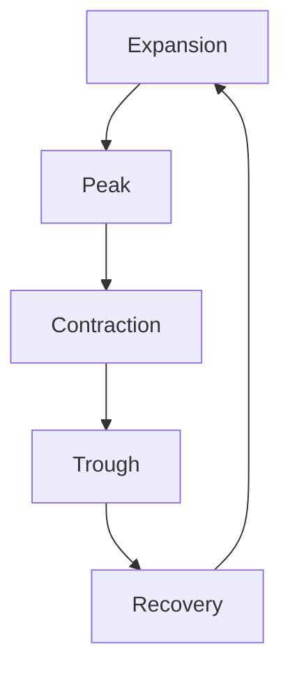

## 4.3.1 Phases of the Business Cycle

The business cycle is a fundamental concept in economics that describes the fluctuations in economic activity that an economy experiences over time. Understanding these phases is crucial for financial professionals, as they impact investment strategies, fiscal policies, and economic forecasting. In this section, we will delve into each phase of the business cycle, illustrate these phases with graphs, and assess the policy responses that aim to stabilize the economy.

### Expansion

The expansion phase is characterized by increased economic activity. During this period, production levels rise, leading to higher incomes and increased consumer spending. Unemployment rates are typically low, as businesses hire more workers to meet the growing demand for goods and services. This phase is marked by optimism and confidence in the economy, often leading to increased investment in capital projects.

**Key Characteristics:**
- Rising GDP
- Increased consumer confidence and spending
- Low unemployment rates
- Higher levels of business investment

**Example:** In Canada, the expansion phase can be observed during periods of robust economic growth, such as the years following the 2008 financial crisis when government stimulus and low-interest rates spurred economic recovery.

### Peak

The peak phase represents the zenith of economic activity. At this point, the economy operates at maximum output, and GDP is at its highest. However, this phase often brings inflationary pressures as demand outstrips supply, leading to higher prices. The peak is a critical juncture, as it signals the end of expansion and the beginning of contraction.

**Key Characteristics:**
- Maximum GDP output
- Potential inflationary pressures
- High consumer and business confidence

**Example:** The Canadian economy experienced a peak in the mid-2000s, characterized by high commodity prices and strong economic performance, particularly in the energy sector.

### Contraction

During the contraction phase, economic activity begins to decline. Consumer spending decreases, businesses reduce production, and unemployment rates rise. This phase is often associated with a decrease in GDP, leading to a recession if prolonged. The contraction phase can be challenging for policymakers, as they must balance stimulating the economy without exacerbating inflation.

**Key Characteristics:**
- Decreasing GDP
- Rising unemployment rates
- Reduced consumer and business spending

**Example:** The global financial crisis of 2008 led to a significant contraction in the Canadian economy, with declining exports and rising unemployment.

### Trough

The trough is the lowest point of the business cycle, where economic activity stabilizes after a period of contraction. It marks the end of declining economic activity and sets the stage for recovery. During this phase, the economy begins to show signs of improvement, although growth is typically slow.

**Key Characteristics:**
- Stabilization of economic activity
- Low consumer and business confidence
- Potential for economic recovery

**Example:** The trough following the 2008 financial crisis saw the Canadian government implement fiscal stimulus measures to stabilize the economy and promote recovery.

### Recovery

The recovery phase is characterized by a gradual increase in economic activity. GDP begins to rise, unemployment rates decrease, and consumer and business confidence improve. This phase sets the foundation for a new expansion, as economic conditions continue to strengthen.

**Key Characteristics:**
- Rising GDP
- Decreasing unemployment rates
- Improving consumer and business confidence

**Example:** The recovery phase in Canada post-2009 was marked by increased government spending and accommodative monetary policies, which helped boost economic growth and employment.

### Illustrating the Business Cycle with Graphs

To better understand the progression through the business cycle phases, we can visualize GDP growth over time. Below is a simplified representation of the business cycle:

This diagram illustrates the cyclical nature of the economy, highlighting the transitions between each phase.

### Assessing Policy Responses

Governments and central banks use fiscal and monetary policies to mitigate the effects of different business cycle phases and promote economic stability.

#### Fiscal Policy

Fiscal policy involves government adjustments to taxation and spending to influence the economy. During a contraction, governments may increase spending or cut taxes to stimulate demand. Conversely, during an expansion, they might reduce spending or increase taxes to cool down the economy and prevent inflation.

**Example:** The Canadian government's Economic Action Plan in 2009 included infrastructure spending and tax cuts to stimulate the economy during the recession.

#### Monetary Policy

Monetary policy refers to central bank actions to control the money supply and interest rates. During a contraction, central banks may lower interest rates to encourage borrowing and investment. In contrast, during an expansion, they might raise rates to prevent overheating and inflation.

**Example:** The Bank of Canada lowered interest rates in response to the 2008 financial crisis to support economic recovery.

### Glossary

- **Fiscal Policy:** Government adjustments to taxation and spending to influence the economy.
- **Monetary Policy:** Central bank actions to control the money supply and interest rates to achieve economic objectives.
- **GDP Growth Rate:** The rate at which a country's GDP changes from one period to the next, indicating economic health.

Understanding the phases of the business cycle and the policy responses available is crucial for financial professionals. By recognizing these patterns, investors and policymakers can make informed decisions to navigate economic fluctuations effectively.

## Quiz Time!



### Which phase of the business cycle is characterized by increased production and low unemployment rates?

- [x] Expansion
- [ ] Peak
- [ ] Contraction
- [ ] Trough

> **Explanation:** The expansion phase is marked by increased production, rising incomes, higher consumer spending, and low unemployment rates.

### What typically occurs during the peak phase of the business cycle?

- [x] Maximum GDP output
- [ ] Rising unemployment
- [ ] Decreasing consumer spending
- [ ] Economic stabilization

> **Explanation:** The peak phase represents the maximum output and highest GDP, often accompanied by inflationary pressures.

### During which phase does the economy experience declining GDP and rising unemployment?

- [ ] Expansion
- [ ] Peak
- [x] Contraction
- [ ] Recovery

> **Explanation:** The contraction phase is characterized by declining economic activity, reduced consumer spending, increased unemployment, and decreasing GDP.

### What marks the end of the contraction phase in the business cycle?

- [ ] Peak
- [ ] Expansion
- [x] Trough
- [ ] Recovery

> **Explanation:** The trough marks the end of the contraction phase, where economic activity stabilizes, setting the stage for recovery.

### Which phase involves a gradual increase in economic activity and decreasing unemployment rates?

- [ ] Peak
- [ ] Contraction
- [ ] Trough
- [x] Recovery

> **Explanation:** The recovery phase is characterized by a gradual increase in economic activity, rising GDP, and decreasing unemployment rates.

### What is the primary goal of fiscal policy during a contraction phase?

- [x] Stimulate demand
- [ ] Increase taxes
- [ ] Reduce government spending
- [ ] Raise interest rates

> **Explanation:** During a contraction, fiscal policy aims to stimulate demand through increased government spending or tax cuts.

### How does monetary policy typically respond during an expansion phase?

- [ ] Lower interest rates
- [x] Raise interest rates
- [ ] Increase government spending
- [ ] Cut taxes

> **Explanation:** During an expansion, monetary policy may raise interest rates to prevent overheating and inflation.

### What is the role of the Bank of Canada in managing the business cycle?

- [x] Control the money supply and interest rates
- [ ] Adjust taxation and government spending
- [ ] Implement trade policies
- [ ] Regulate financial markets

> **Explanation:** The Bank of Canada uses monetary policy to control the money supply and interest rates to manage the business cycle.

### Which phase is associated with high consumer and business confidence?

- [x] Peak
- [ ] Trough
- [ ] Contraction
- [ ] Recovery

> **Explanation:** The peak phase is associated with high consumer and business confidence, as the economy operates at maximum output.

### True or False: The trough phase is where economic activity reaches its highest point.

- [ ] True
- [x] False

> **Explanation:** False. The trough phase is where economic activity stabilizes at its lowest point, marking the end of the contraction phase.


