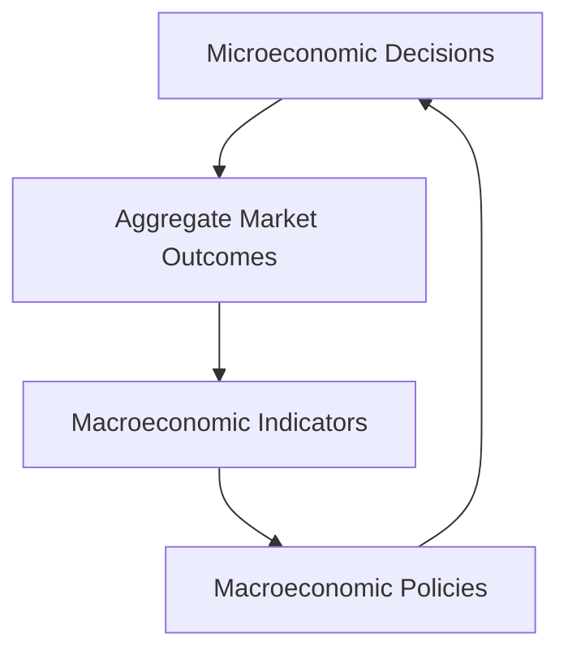

## 4.2 Microeconomics and Macroeconomics

In the realm of economics, understanding the distinction between microeconomics and macroeconomics is crucial for grasping how financial systems operate, both on a small scale and within the broader economy. This section delves into these two branches of economics, exploring their focus areas, interactions, and relevance to the Canadian financial landscape.

### Differentiating Microeconomics and Macroeconomics

**Microeconomics** and **macroeconomics** are two fundamental branches of economics that, while distinct, are interrelated and together provide a comprehensive understanding of economic dynamics.

- **Microeconomics** focuses on the behavior of individual agents, such as households, firms, and industries. It examines how these entities make decisions regarding resource allocation, production, and consumption. Key areas include market structures, consumer behavior, and production costs.

- **Macroeconomics**, on the other hand, looks at the economy as a whole. It analyzes aggregate indicators such as national income, economic growth, unemployment, and inflation. Macroeconomics seeks to understand the broader economic environment and the policies that influence it.

### Focus Areas of Microeconomics

Microeconomics is concerned with the intricacies of individual markets and the decision-making processes of economic agents. Here are some key focus areas:

#### Individual Markets

Microeconomics studies how supply and demand interact within individual markets to determine prices and quantities of goods and services. For instance, the housing market in Toronto can be analyzed to understand price fluctuations based on demand from buyers and the supply of available properties.

#### Consumer Behavior

Understanding consumer behavior is central to microeconomics. It involves analyzing how consumers make choices based on their preferences, budget constraints, and the utility they derive from different goods and services. For example, the decision of Canadian households to allocate their income between savings and consumption can be studied to predict spending patterns.

#### Production Costs

Microeconomics also examines how firms decide on the optimal level of production and pricing strategies. This involves analyzing production costs, economies of scale, and the competitive landscape. For instance, a Canadian manufacturing firm might evaluate its cost structure to determine the most efficient production level.

### Topics in Macroeconomics

Macroeconomics addresses broader economic issues that affect the entire economy. Key topics include:

#### National Income

National income accounting measures the total economic output of a country. It includes metrics such as Gross Domestic Product (GDP), which provides insights into the economic performance of Canada. Understanding GDP trends helps policymakers and investors assess the health of the economy.

#### Economic Growth

Economic growth refers to the increase in a country's output over time. It is a critical indicator of economic prosperity and is influenced by factors such as technological advancements, capital investment, and labor force growth. In Canada, economic growth can be driven by sectors like technology and natural resources.

#### Unemployment

Unemployment is a key macroeconomic indicator that reflects the health of the labor market. High unemployment rates can signal economic distress, while low rates indicate a robust economy. In Canada, unemployment trends are closely monitored to guide labor market policies.

#### Inflation

Inflation measures the rate at which the general level of prices for goods and services rises, eroding purchasing power. The Bank of Canada targets a specific inflation rate to maintain economic stability. Understanding inflation dynamics is crucial for making informed investment decisions.

### Interaction Between Microeconomics and Macroeconomics

While microeconomics and macroeconomics focus on different aspects of the economy, they are interconnected. Microeconomic decisions by individuals and firms aggregate to influence macroeconomic outcomes. Conversely, macroeconomic conditions can impact microeconomic behavior.

For example, a macroeconomic policy such as a change in interest rates by the Bank of Canada can affect consumer spending and business investment decisions at the microeconomic level. Similarly, microeconomic trends, such as technological innovations in a specific industry, can contribute to macroeconomic growth.

### Practical Examples and Case Studies

To illustrate these concepts, consider the following Canadian scenarios:

- **Investment Strategies of Canadian Pension Funds**: Pension funds like the Canada Pension Plan Investment Board (CPPIB) use macroeconomic indicators to guide their investment strategies, while also considering microeconomic factors such as industry trends and firm performance.

- **Impact of Inflation on Canadian Banks**: Major banks like RBC and TD adjust their interest rates and lending practices based on inflation trends, demonstrating the interplay between macroeconomic conditions and microeconomic decisions.

### Diagrams and Visuals

To enhance understanding, consider the following diagram illustrating the interaction between microeconomics and macroeconomics:

### Best Practices and Challenges

When applying economic principles, consider the following best practices and challenges:

- **Best Practices**: Stay informed about both microeconomic and macroeconomic trends to make well-rounded financial decisions. Use economic indicators to guide investment strategies and business planning.

- **Challenges**: Economic conditions can be unpredictable, and external factors such as global events can disrupt economic forecasts. It's essential to remain adaptable and continuously update your understanding of economic dynamics.

### References and Further Reading

For those interested in exploring these topics further, consider the following resources:

- **Books**: 
  - *"Microeconomics"* by Robert Pindyck and Daniel Rubinfeld
  - *"Macroeconomics"* by Olivier Blanchard

- **Online Resources**: 
  - [Khan Academy's Microeconomics](https://www.khanacademy.org/economics-finance-domain/microeconomics)

### Encouragement for Application

Understanding microeconomics and macroeconomics is essential for navigating the financial landscape. By applying these principles, you can make informed decisions that align with your financial goals and adapt to changing economic conditions.

### **Ready to Test Your Knowledge?**

**Practice 10 Essential CSC Exam Questions to Master Your Certification**



### What is the primary focus of microeconomics?

- [x] Individual markets and consumer behavior
- [ ] National income and economic growth
- [ ] Unemployment and inflation
- [ ] Government fiscal policies

> **Explanation:** Microeconomics focuses on individual markets, consumer behavior, and production costs.

### Which of the following is a key topic in macroeconomics?

- [ ] Consumer preferences
- [x] National income
- [ ] Production costs
- [ ] Market structures

> **Explanation:** Macroeconomics deals with national income, economic growth, unemployment, and inflation.

### How do microeconomic decisions influence macroeconomic outcomes?

- [x] They aggregate to affect overall economic indicators.
- [ ] They have no impact on macroeconomic conditions.
- [ ] They only influence individual firms.
- [ ] They are unrelated to macroeconomic policies.

> **Explanation:** Microeconomic decisions by individuals and firms aggregate to influence macroeconomic outcomes.

### What is the role of inflation in macroeconomics?

- [x] It measures the rate at which prices rise, affecting purchasing power.
- [ ] It determines consumer preferences.
- [ ] It sets production costs for firms.
- [ ] It is unrelated to economic growth.

> **Explanation:** Inflation measures the rate at which prices rise, impacting purchasing power and economic stability.

### Which Canadian institution targets inflation rates to maintain economic stability?

- [ ] RBC
- [ ] TD Bank
- [x] Bank of Canada
- [ ] Canada Pension Plan Investment Board

> **Explanation:** The Bank of Canada targets specific inflation rates to maintain economic stability.

### What is a common challenge when applying economic principles?

- [x] Economic conditions can be unpredictable.
- [ ] Economic indicators are always accurate.
- [ ] Microeconomic trends are irrelevant.
- [ ] Macroeconomic policies never change.

> **Explanation:** Economic conditions can be unpredictable, requiring adaptability and continuous learning.

### How can understanding microeconomics benefit financial decision-making?

- [x] By analyzing consumer behavior and market trends.
- [ ] By focusing solely on national income.
- [ ] By ignoring production costs.
- [ ] By disregarding individual markets.

> **Explanation:** Understanding microeconomics helps analyze consumer behavior and market trends for informed decision-making.

### What is the relationship between microeconomics and macroeconomics?

- [x] They are interconnected and influence each other.
- [ ] They are completely separate and unrelated.
- [ ] They only affect government policies.
- [ ] They focus on the same economic indicators.

> **Explanation:** Microeconomics and macroeconomics are interconnected, with microeconomic decisions influencing macroeconomic outcomes and vice versa.

### Which book is recommended for further reading on microeconomics?

- [x] "Microeconomics" by Robert Pindyck and Daniel Rubinfeld
- [ ] "Macroeconomics" by Olivier Blanchard
- [ ] "The Wealth of Nations" by Adam Smith
- [ ] "Capital in the Twenty-First Century" by Thomas Piketty

> **Explanation:** "Microeconomics" by Robert Pindyck and Daniel Rubinfeld is a recommended resource for further reading on microeconomics.

### True or False: Macroeconomics focuses on individual consumer behavior.

- [ ] True
- [x] False

> **Explanation:** False. Macroeconomics focuses on the economy as a whole, not individual consumer behavior.


