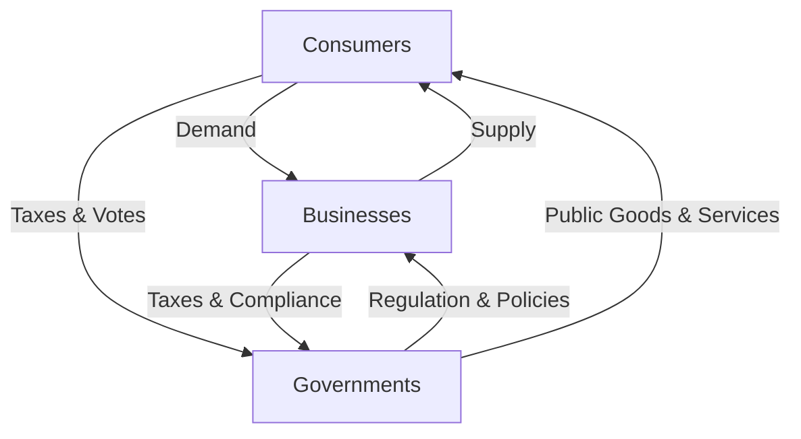

## 4.3 The Decision Makers

In the intricate web of economic systems, three primary decision-makers stand at the forefront: consumers, businesses, and governments. Each plays a pivotal role in the allocation of resources, influencing economic activity and growth. Understanding the objectives and behaviors of these groups, as well as their interactions, is crucial for grasping the dynamics of any economy, particularly within the Canadian context.

### Consumers: The Demand Drivers

**Consumers** are individuals or households that purchase goods and services for personal use. They are the backbone of demand in the economy, influencing what products are produced and how resources are allocated.

#### Objectives and Behaviors

- **Maximizing Utility:** Consumers aim to maximize their satisfaction or utility from the goods and services they purchase. This involves making choices based on preferences, budget constraints, and the prices of goods and services.
- **Budget Constraints:** Consumers must allocate their limited income among various goods and services, balancing needs and wants.
- **Influence on Markets:** Through their purchasing decisions, consumers signal to businesses what products are in demand, driving production and innovation.

#### Practical Example

Consider a Canadian household deciding between investing in a new energy-efficient appliance or saving for a vacation. This decision involves weighing the immediate utility of the appliance against the future enjoyment of the vacation, reflecting typical consumer behavior.

### Businesses: The Producers and Innovators

**Businesses** are organizations that produce goods or services to satisfy consumer demand and earn profits. They are the engines of economic growth, driving innovation and employment.

#### Objectives and Behaviors

- **Profit Maximization:** Businesses strive to maximize profits by efficiently utilizing resources to produce goods and services that meet consumer demand.
- **Cost Management:** Businesses must manage production costs, including labor, materials, and overhead, to remain competitive.
- **Innovation and Growth:** To stay ahead, businesses invest in research and development, seeking new ways to improve products and services.

#### Practical Example

A Canadian tech startup developing a new software application must decide how to allocate its resources between development, marketing, and customer support. This decision impacts its ability to attract and retain customers, ultimately influencing its profitability and growth.

### Governments: The Regulators and Providers

**Governments** are entities that enact policies, regulate markets, and provide public goods and services. They play a crucial role in stabilizing the economy and ensuring equitable resource distribution.

#### Objectives and Behaviors

- **Economic Stability:** Governments aim to maintain economic stability through fiscal and monetary policies, addressing issues like inflation and unemployment.
- **Public Goods and Services:** Governments provide essential services such as education, healthcare, and infrastructure, which are not efficiently provided by the private sector.
- **Regulation and Oversight:** Governments regulate markets to prevent monopolies, protect consumers, and ensure fair competition.

#### Practical Example

The Canadian government’s decision to implement carbon pricing is an example of using regulation to influence business behavior and consumer choices, aiming to reduce greenhouse gas emissions and promote sustainable practices.

### Interactions Among Decision Makers

The interactions among consumers, businesses, and governments drive economic activity and growth. These interactions are dynamic and complex, often involving feedback loops and adjustments.

#### Economic Activity and Growth

- **Market Dynamics:** Consumers' demand influences businesses' production decisions, while businesses' supply affects consumer choices. Governments intervene to correct market failures and ensure stability.
- **Policy Impacts:** Government policies, such as tax incentives or subsidies, can encourage businesses to invest in certain sectors, influencing economic growth.
- **Consumer Confidence:** Economic policies and business innovations can affect consumer confidence, impacting spending and saving behaviors.

#### Case Study: Canadian Housing Market

The Canadian housing market exemplifies the interplay between these decision-makers. Consumers' demand for housing influences prices and construction activity. Businesses, including real estate developers and financial institutions, respond by adjusting supply and financing options. The government regulates the market through policies on mortgage lending and zoning laws, aiming to ensure affordability and stability.

### Visualizing Economic Interactions

Below is a diagram illustrating the interactions among consumers, businesses, and governments:

### Best Practices and Challenges

- **Best Practices:** Effective communication and collaboration among decision-makers can enhance economic outcomes. For example, public-private partnerships can leverage the strengths of both sectors.
- **Common Challenges:** Balancing short-term needs with long-term goals is a challenge for all decision-makers. Economic shocks, such as recessions or technological disruptions, require adaptive strategies.
- **Strategies for Overcoming Challenges:** Continuous learning, innovation, and policy adjustments are essential for navigating economic complexities.

### Conclusion

Understanding the roles and interactions of consumers, businesses, and governments is fundamental to comprehending economic systems. By recognizing the objectives and behaviors of each group, individuals and organizations can make informed decisions that contribute to economic growth and stability.

For further exploration, consider the following resources:

- **Articles:** [Roles of Consumers, Businesses, and Governments in Economics](https://www.investopedia.com/terms/c/consumer-business-government.asp)
- **Online Courses:** [MIT OpenCourseWare - Principles of Microeconomics](https://ocw.mit.edu/courses/economics/14-01sc-principles-of-microeconomics-fall-2011/)

### **Ready to Test Your Knowledge?**

**Practice 10 Essential CSC Exam Questions to Master Your Certification**



### Who are considered the primary decision-makers in an economy?

- [x] Consumers, Businesses, and Governments
- [ ] Consumers, Banks, and Investors
- [ ] Businesses, Banks, and Governments
- [ ] Consumers, Investors, and Governments

> **Explanation:** The primary decision-makers in an economy are consumers, businesses, and governments, each playing a distinct role in resource allocation and economic activity.

### What is the main objective of consumers in the economy?

- [x] Maximizing utility
- [ ] Minimizing costs
- [ ] Maximizing profits
- [ ] Regulating markets

> **Explanation:** Consumers aim to maximize their utility or satisfaction from the goods and services they purchase, within their budget constraints.

### How do businesses primarily contribute to economic growth?

- [x] By producing goods and services
- [ ] By regulating markets
- [ ] By providing public goods
- [ ] By maximizing utility

> **Explanation:** Businesses contribute to economic growth by producing goods and services that meet consumer demand, driving innovation and employment.

### What role do governments play in the economy?

- [x] Enacting policies and providing public goods
- [ ] Maximizing profits
- [ ] Purchasing goods for personal use
- [ ] Producing goods and services

> **Explanation:** Governments enact policies, regulate markets, and provide public goods and services, ensuring economic stability and equitable resource distribution.

### How do consumers influence businesses?

- [x] Through their purchasing decisions
- [ ] By enacting policies
- [ ] By providing public goods
- [ ] By maximizing profits

> **Explanation:** Consumers influence businesses through their purchasing decisions, signaling demand for certain products and services.

### What is a key challenge for all economic decision-makers?

- [x] Balancing short-term needs with long-term goals
- [ ] Maximizing utility
- [ ] Minimizing costs
- [ ] Regulating markets

> **Explanation:** A key challenge for all decision-makers is balancing short-term needs with long-term goals, especially during economic shocks.

### How do government policies impact businesses?

- [x] By providing tax incentives or subsidies
- [ ] By maximizing utility
- [ ] By purchasing goods for personal use
- [ ] By producing goods and services

> **Explanation:** Government policies, such as tax incentives or subsidies, can encourage businesses to invest in certain sectors, influencing economic growth.

### What is an example of a government regulation affecting consumers?

- [x] Carbon pricing
- [ ] Profit maximization
- [ ] Utility maximization
- [ ] Cost management

> **Explanation:** Carbon pricing is a government regulation that affects consumers by influencing their choices towards more sustainable practices.

### What is the primary goal of businesses?

- [x] Profit maximization
- [ ] Utility maximization
- [ ] Providing public goods
- [ ] Enacting policies

> **Explanation:** The primary goal of businesses is to maximize profits by efficiently utilizing resources to meet consumer demand.

### True or False: Consumers, businesses, and governments operate independently without influencing each other.

- [ ] True
- [x] False

> **Explanation:** Consumers, businesses, and governments interact dynamically, influencing each other's decisions and driving economic activity and growth.


