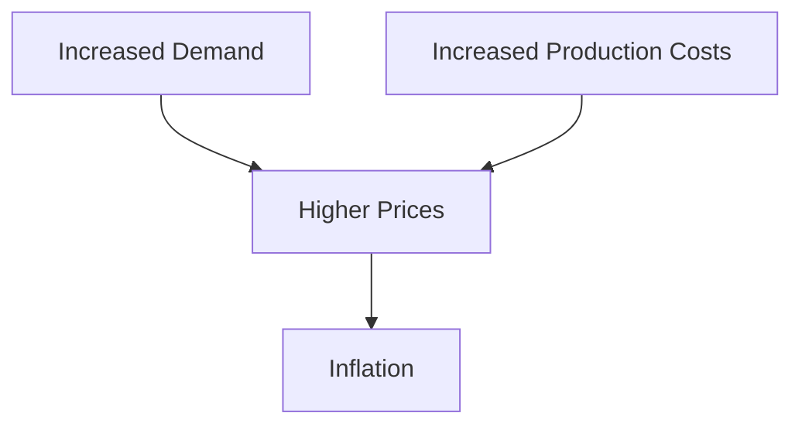

## 4.6.1 Measuring Inflation

Inflation is a critical economic indicator that reflects the rate at which the general level of prices for goods and services is rising, and subsequently, how purchasing power is eroding. Understanding how inflation is measured, particularly through the Consumer Price Index (CPI), is essential for financial professionals and investors. This section delves into the mechanics of CPI, historical inflation trends in Canada, and the broader implications of inflation on the economy.

### Understanding the Consumer Price Index (CPI)

The Consumer Price Index (CPI) is a vital tool used to measure inflation. It represents the average change over time in the prices paid by urban consumers for a market basket of consumer goods and services. The CPI is a crucial indicator for economic policy, business planning, and personal financial decisions.

#### Definition and Significance

The CPI is a statistical estimate constructed using the prices of a sample of representative items whose prices are collected periodically. It is significant because it provides a clear picture of the cost of living and is used to adjust salaries, pensions, and tax brackets to maintain purchasing power.

#### Construction and Updating of the CPI Basket

The CPI basket is a collection of goods and services that represents the typical consumption habits of households. Statistics Canada periodically updates this basket to reflect changes in consumer spending patterns. The basket includes categories such as food, housing, clothing, transportation, and healthcare.

- **Basket Composition:** The composition of the CPI basket is determined through surveys that track consumer spending habits. This ensures that the CPI remains relevant and accurately reflects the current economic environment.
- **Weighting:** Each item in the basket is assigned a weight based on its importance in the average consumer's budget. For example, housing typically has a higher weight than entertainment.
- **Updating Process:** The basket is updated every few years to incorporate new products and services and to adjust for changes in consumer preferences.

#### Interpreting CPI Figures and Calculating Inflation Rates

CPI figures are expressed as an index number, with a base year set to 100. Changes in the CPI from one period to another indicate the rate of inflation.

- **Calculating Inflation Rate:** The inflation rate can be calculated using the formula:

  
  \text{Inflation Rate} = \left( \frac{\text{CPI in Current Year} - \text{CPI in Previous Year}}{\text{CPI in Previous Year}} \right) \times 100
  

- **Example Calculation:** If the CPI was 110 in 2022 and 115 in 2023, the inflation rate would be:

  
  \left( \frac{115 - 110}{110} \right) \times 100 = 4.55\%
  

### Analyzing Historical Inflation Trends in Canada

Examining historical inflation trends provides insights into the economic landscape and the effectiveness of monetary policies.

#### Historical Data and Patterns

Canada has experienced varying inflation rates over the decades, influenced by both domestic and global factors. Key historical periods include:

- **1970s-1980s:** High inflation rates due to oil price shocks and expansive fiscal policies.
- **1990s:** A period of stabilization as the Bank of Canada adopted inflation targeting.
- **2000s-Present:** Generally low and stable inflation, with occasional spikes due to economic crises or global events.

#### Influence of the Bank of Canada’s Policies

The Bank of Canada plays a pivotal role in managing inflation through its monetary policy tools, primarily the setting of interest rates.

- **Inflation Targeting:** Since 1991, the Bank of Canada has targeted an inflation rate of 2%, with a control range of 1% to 3%. This policy aims to provide a stable economic environment conducive to growth.
- **Interest Rates:** By adjusting the overnight rate, the Bank of Canada influences borrowing costs, consumer spending, and investment, thereby impacting inflation.

### Causes and Consequences of Inflation

Understanding the causes of inflation helps in anticipating its effects and formulating appropriate responses.

#### Demand-Pull and Cost-Push Inflation

- **Demand-Pull Inflation:** Occurs when aggregate demand in an economy outpaces aggregate supply. This can happen during periods of strong economic growth, where increased consumer spending drives up prices.
- **Cost-Push Inflation:** Results from rising costs of production, such as wages and raw materials, leading producers to increase prices to maintain profit margins.

#### Relationship Between Wages, Production Costs, and Price Levels

Wage increases can lead to higher production costs, which may be passed on to consumers in the form of higher prices. This cycle can perpetuate inflation if not managed carefully.

#### Impact on Economic Growth and Financial Markets

- **Sustained Inflation:** Moderate inflation is generally associated with economic growth, as it encourages spending and investment. However, high inflation can erode purchasing power and savings, leading to economic instability.
- **Deflation:** A decrease in the general price level can lead to reduced consumer spending, as people anticipate lower prices in the future, potentially stalling economic growth.

### Glossary

- **Demand-Pull Inflation:** Inflation caused by increased demand for goods and services in an economy.
- **Cost-Push Inflation:** Inflation caused by increases in the cost of production and supply.
- **Real Interest Rate:** The interest rate adjusted for inflation, reflecting the true cost of borrowing and the true yield on savings.

### Visualizing Inflation Trends

Below is a simple diagram illustrating the relationship between demand-pull and cost-push inflation:

### Best Practices and Challenges

- **Best Practices:** Regularly monitor CPI data and adjust financial strategies accordingly. Consider inflation-protected securities, such as Real Return Bonds, to hedge against inflation risk.
- **Common Challenges:** Predicting inflation trends can be difficult due to the influence of unpredictable external factors, such as geopolitical events or natural disasters.

### Conclusion

Understanding inflation and its measurement through the CPI is crucial for making informed financial decisions. By analyzing historical trends and recognizing the causes and consequences of inflation, financial professionals can better navigate the economic landscape and develop strategies to mitigate inflationary risks.

## Quiz Time!



### What is the Consumer Price Index (CPI)?

- [x] A measure of the average change over time in the prices paid by urban consumers for a market basket of consumer goods and services.
- [ ] A measure of the total output of goods and services produced by an economy.
- [ ] A measure of the unemployment rate in an economy.
- [ ] A measure of the total amount of money in circulation in an economy.

> **Explanation:** The CPI is a statistical estimate that measures the average change in prices paid by consumers for a basket of goods and services.

### How is the CPI basket updated?

- [x] Through surveys that track consumer spending habits.
- [ ] By government mandate every year.
- [ ] Based on stock market performance.
- [ ] By adjusting for changes in the GDP.

> **Explanation:** The CPI basket is updated based on surveys that reflect changes in consumer spending patterns to ensure it remains relevant.

### What is demand-pull inflation?

- [x] Inflation caused by increased demand for goods and services in an economy.
- [ ] Inflation caused by increases in the cost of production and supply.
- [ ] Inflation caused by government intervention in the economy.
- [ ] Inflation caused by a decrease in consumer spending.

> **Explanation:** Demand-pull inflation occurs when aggregate demand in an economy outpaces aggregate supply, leading to higher prices.

### What role does the Bank of Canada play in managing inflation?

- [x] It sets interest rates to influence borrowing costs and consumer spending.
- [ ] It directly controls the prices of goods and services.
- [ ] It mandates wage increases to control inflation.
- [ ] It regulates the stock market to manage inflation.

> **Explanation:** The Bank of Canada manages inflation primarily through monetary policy, including setting interest rates.

### What is cost-push inflation?

- [x] Inflation caused by increases in the cost of production and supply.
- [ ] Inflation caused by increased demand for goods and services.
- [ ] Inflation caused by government fiscal policy.
- [ ] Inflation caused by a decrease in the money supply.

> **Explanation:** Cost-push inflation occurs when rising production costs lead producers to increase prices to maintain profit margins.

### How can inflation affect economic growth?

- [x] Moderate inflation can encourage spending and investment, while high inflation can erode purchasing power.
- [ ] Inflation always leads to economic recession.
- [ ] Inflation has no impact on economic growth.
- [ ] Inflation only affects the stock market, not the broader economy.

> **Explanation:** Moderate inflation is generally associated with economic growth, but high inflation can lead to economic instability.

### What is the real interest rate?

- [x] The interest rate adjusted for inflation.
- [ ] The nominal interest rate offered by banks.
- [ ] The interest rate set by the government.
- [ ] The interest rate before taxes.

> **Explanation:** The real interest rate reflects the true cost of borrowing and the true yield on savings after adjusting for inflation.

### What is the primary goal of the Bank of Canada's inflation targeting policy?

- [x] To maintain a stable economic environment conducive to growth.
- [ ] To increase the money supply.
- [ ] To decrease consumer spending.
- [ ] To control the stock market.

> **Explanation:** The Bank of Canada's inflation targeting policy aims to provide a stable economic environment by maintaining inflation within a target range.

### What is the formula for calculating the inflation rate using CPI?

- [x] \\(\left( \frac{\text{CPI in Current Year} - \text{CPI in Previous Year}}{\text{CPI in Previous Year}} \right) \times 100\\)
- [ ] \\(\left( \frac{\text{GDP in Current Year} - \text{GDP in Previous Year}}{\text{GDP in Previous Year}} \right) \times 100\\)
- [ ] \\(\left( \frac{\text{Unemployment Rate in Current Year} - \text{Unemployment Rate in Previous Year}}{\text{Unemployment Rate in Previous Year}} \right) \times 100\\)
- [ ] \\(\left( \frac{\text{Interest Rate in Current Year} - \text{Interest Rate in Previous Year}}{\text{Interest Rate in Previous Year}} \right) \times 100\\)

> **Explanation:** The inflation rate is calculated using the change in CPI from one year to the next, divided by the previous year's CPI, multiplied by 100.

### True or False: Deflation can lead to reduced consumer spending.

- [x] True
- [ ] False

> **Explanation:** Deflation can lead to reduced consumer spending as people anticipate lower prices in the future, potentially stalling economic growth.


