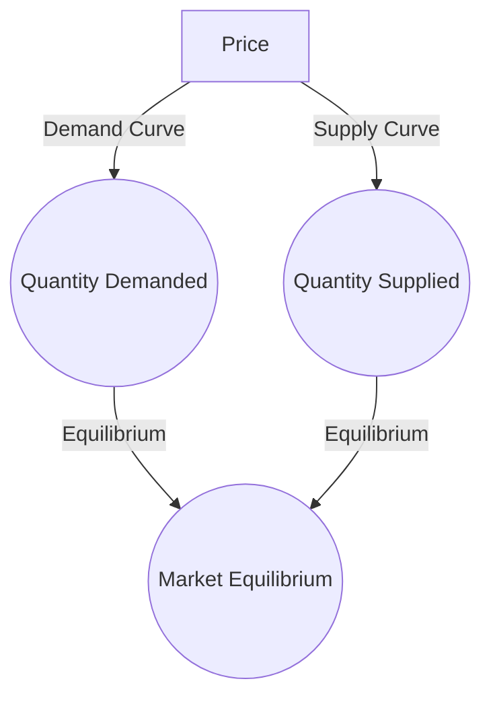

## 4.5 Demand, Supply, and Market Equilibrium

Understanding the interplay between demand, supply, and market equilibrium is crucial for anyone involved in financial markets, whether you're a seasoned investor or a newcomer to the Canadian securities landscape. This section will delve into these fundamental economic concepts, illustrating their significance and application in real-world scenarios.

### The Laws of Demand and Supply

#### The Law of Demand

The law of demand states that, all else being equal, as the price of a good or service decreases, the quantity demanded increases, and vice versa. This inverse relationship is foundational to understanding consumer behavior. The demand curve, typically downward sloping, graphically represents this relationship.

#### The Law of Supply

Conversely, the law of supply posits that as the price of a good or service increases, the quantity supplied also increases, assuming all other factors remain constant. This direct relationship is depicted by an upward-sloping supply curve. Producers are more willing to supply more of a good as its price rises, driven by the potential for higher revenue.

### Interaction of Demand and Supply: Market Equilibrium

Market equilibrium occurs where the demand and supply curves intersect. At this point, the quantity demanded by consumers equals the quantity supplied by producers, resulting in a stable market price. This equilibrium price is crucial as it reflects the collective behavior of buyers and sellers in the market.

#### Visualizing Market Equilibrium

Below is a simple diagram illustrating the interaction between demand and supply curves:

In this diagram, the intersection point (Market Equilibrium) represents the equilibrium price and quantity.

### Shifts in Demand and Supply

Market conditions are dynamic, and shifts in demand or supply can disrupt equilibrium, leading to changes in price and quantity.

#### Shifts in Demand

Factors such as consumer preferences, income levels, and the prices of related goods can cause the demand curve to shift. For example, an increase in consumer income might shift the demand curve to the right, indicating a higher quantity demanded at each price level.

#### Shifts in Supply

Supply can shift due to changes in production costs, technological advancements, or regulatory changes. For instance, a technological breakthrough that reduces production costs can shift the supply curve to the right, indicating a higher quantity supplied at each price level.

### Impact on Equilibrium

When demand or supply shifts, the equilibrium price and quantity will adjust accordingly. For example, if demand increases (shifts right) while supply remains constant, the equilibrium price will rise, and the equilibrium quantity will increase. Conversely, if supply increases (shifts right) while demand remains constant, the equilibrium price will fall, and the equilibrium quantity will increase.

### Real-World Examples of Market Equilibrium

#### Canadian Housing Market

The Canadian housing market provides a vivid example of demand and supply dynamics. In recent years, increased demand due to population growth and low-interest rates has driven up housing prices, illustrating a rightward shift in the demand curve. However, supply constraints, such as limited land availability and regulatory hurdles, have restricted the supply response, maintaining high equilibrium prices.

#### Oil and Gas Industry

The oil and gas sector in Canada is another example where market equilibrium is constantly shifting. Changes in global oil prices, technological advancements in extraction methods, and environmental regulations can all influence supply and demand, affecting equilibrium prices and quantities.

### Practical Application and Strategic Insights

Understanding demand and supply dynamics is essential for making informed investment decisions. For instance, recognizing a potential shift in demand for a particular commodity can guide investment strategies in related sectors. Similarly, anticipating regulatory changes that might affect supply can help investors adjust their portfolios accordingly.

### Best Practices and Common Pitfalls

- **Best Practices:** Stay informed about economic indicators and market trends that can signal shifts in demand or supply. Use this information to anticipate changes in market equilibrium and adjust investment strategies proactively.
- **Common Pitfalls:** Avoid making investment decisions based solely on short-term market fluctuations. Instead, focus on long-term trends and underlying economic fundamentals.

### References and Further Reading

- **Books:** *"Principles of Economics"* by N. Gregory Mankiw
- **Online Resources:** [Supply and Demand Explained](https://www.khanacademy.org/economics-finance-domain/microeconomics/supply-demand-equilibrium)

By mastering these concepts, you can better navigate the complexities of the Canadian financial market, making strategic decisions that align with market dynamics.

### **Ready to Test Your Knowledge?**

**Practice 10 Essential CSC Exam Questions to Master Your Certification**



### What does the law of demand state?

- [x] As the price of a good decreases, the quantity demanded increases.
- [ ] As the price of a good increases, the quantity demanded increases.
- [ ] As the price of a good decreases, the quantity supplied increases.
- [ ] As the price of a good increases, the quantity supplied decreases.

> **Explanation:** The law of demand states that there is an inverse relationship between price and quantity demanded.

### What does the law of supply state?

- [x] As the price of a good increases, the quantity supplied increases.
- [ ] As the price of a good decreases, the quantity supplied increases.
- [ ] As the price of a good increases, the quantity demanded increases.
- [ ] As the price of a good decreases, the quantity demanded increases.

> **Explanation:** The law of supply states that there is a direct relationship between price and quantity supplied.

### What happens at market equilibrium?

- [x] Quantity demanded equals quantity supplied.
- [ ] Quantity demanded exceeds quantity supplied.
- [ ] Quantity supplied exceeds quantity demanded.
- [ ] Prices are at their lowest point.

> **Explanation:** Market equilibrium occurs when the quantity demanded equals the quantity supplied, resulting in a stable market price.

### What can cause a shift in the demand curve?

- [x] Changes in consumer preferences.
- [ ] Changes in production costs.
- [ ] Technological advancements.
- [ ] Changes in regulatory policies.

> **Explanation:** Changes in consumer preferences, income levels, and the prices of related goods can cause the demand curve to shift.

### What can cause a shift in the supply curve?

- [x] Changes in production costs.
- [x] Technological advancements.
- [ ] Changes in consumer preferences.
- [ ] Changes in income levels.

> **Explanation:** Changes in production costs, technological advancements, and regulatory changes can cause the supply curve to shift.

### What happens if demand increases while supply remains constant?

- [x] Equilibrium price rises.
- [ ] Equilibrium price falls.
- [ ] Equilibrium quantity decreases.
- [ ] Equilibrium quantity remains constant.

> **Explanation:** If demand increases while supply remains constant, the equilibrium price will rise, and the equilibrium quantity will increase.

### What happens if supply increases while demand remains constant?

- [x] Equilibrium price falls.
- [x] Equilibrium quantity increases.
- [ ] Equilibrium price rises.
- [ ] Equilibrium quantity decreases.

> **Explanation:** If supply increases while demand remains constant, the equilibrium price will fall, and the equilibrium quantity will increase.

### Which industry in Canada is an example of shifting market equilibrium?

- [x] Oil and Gas Industry
- [ ] Technology Sector
- [ ] Retail Industry
- [ ] Healthcare Sector

> **Explanation:** The oil and gas industry in Canada is an example where market equilibrium is constantly shifting due to changes in global oil prices, technological advancements, and environmental regulations.

### What is a common pitfall when analyzing market equilibrium?

- [x] Making decisions based on short-term fluctuations.
- [ ] Focusing on long-term trends.
- [ ] Considering underlying economic fundamentals.
- [ ] Staying informed about economic indicators.

> **Explanation:** A common pitfall is making investment decisions based solely on short-term market fluctuations instead of focusing on long-term trends and economic fundamentals.

### True or False: Market equilibrium is where the quantity demanded equals the quantity supplied.

- [x] True
- [ ] False

> **Explanation:** True. Market equilibrium is the point where the quantity demanded equals the quantity supplied, resulting in a stable market price.


