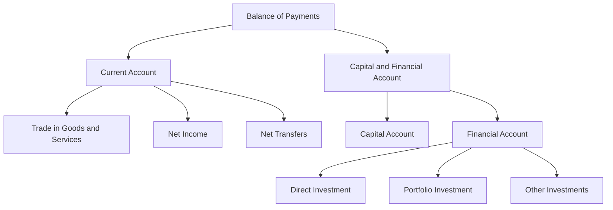

## 4.7.1 The Balance of Payments

The balance of payments (BOP) is a comprehensive record of a country's economic transactions with the rest of the world over a specific period, typically a year. It is a crucial tool for understanding a nation's economic interactions and provides insights into its economic health, trade relationships, and financial stability. The BOP is divided into two main components: the current account and the capital and financial account. Each of these components plays a vital role in depicting the economic activities of a country.

### Understanding the Balance of Payments

The balance of payments is akin to a financial statement for a nation, detailing all economic transactions between residents of a country and the rest of the world. These transactions include trade in goods and services, cross-border investments, and financial transfers. The BOP helps policymakers, economists, and investors assess the economic standing of a country and make informed decisions.

#### The Current Account

The current account is a primary component of the balance of payments and reflects the net flow of goods, services, income, and current transfers between a country and its international partners. It consists of three main sub-components:

1. **Trade in Goods and Services:** This is the most visible part of the current account, representing the export and import of tangible goods and intangible services. A positive trade balance (surplus) occurs when exports exceed imports, while a negative trade balance (deficit) indicates the opposite.

2. **Net Income:** This includes earnings from foreign investments, such as dividends and interest, minus payments made to foreign investors. It reflects the income generated from a country's investments abroad compared to the income paid to foreign investors within the country.

3. **Net Transfers:** These are unilateral transfers of money without a corresponding exchange of goods or services. Examples include remittances sent by individuals working abroad to their home country and foreign aid.

The current account balance is a critical indicator of a nation's economic position. A surplus suggests that a country is a net lender to the rest of the world, while a deficit indicates a net borrower status.

#### The Capital and Financial Account

The capital and financial account complements the current account by recording all transactions that involve the transfer of ownership of assets between a country and the rest of the world. It includes:

1. **Capital Account:** This records capital transfers and the acquisition or disposal of non-produced, non-financial assets, such as patents and trademarks.

2. **Financial Account:** This is the more substantial part of the capital and financial account, capturing transactions in financial assets and liabilities. It includes direct investment, portfolio investment, and other investments, such as loans and banking capital.

The capital and financial account plays a crucial role in financing current account imbalances. For instance, if a country has a current account deficit, it needs to attract foreign capital through investments or loans to balance its payments.

### Real-World Examples and Analysis

To illustrate the balance of payments in action, consider Canada's economic interactions. Suppose Canada experiences a trade deficit, importing more goods and services than it exports. This deficit would be reflected in the current account as a negative balance. To finance this deficit, Canada might attract foreign investments or borrow from international markets, which would be recorded in the capital and financial account.

Changes in the balance of payments can signal shifts in an economy's reliance on foreign capital. For example, a persistent current account deficit might indicate an increasing dependence on foreign investments, which could affect the country's economic sovereignty and financial stability.

### Visualizing the Balance of Payments

To better understand the flow of transactions within the balance of payments, consider the following diagram:

This diagram illustrates how the balance of payments is structured, highlighting the relationship between its components.

### Glossary

- **Trade Balance:** The difference between a country's exports and imports of goods and services.
- **Net Income:** Earnings from foreign investments minus payments made to foreign investors.
- **Net Transfers:** Transfers of money without an exchange of goods or services, such as remittances or foreign aid.

### Best Practices and Challenges

Understanding the balance of payments is essential for making informed economic decisions. Policymakers should aim to maintain a sustainable balance, avoiding excessive reliance on foreign capital. Investors can use BOP data to assess a country's economic stability and investment potential.

However, interpreting the balance of payments can be challenging due to its complexity and the dynamic nature of international finance. It requires a comprehensive understanding of global economic trends and their impact on national economies.

### Conclusion

The balance of payments is a vital tool for understanding a country's economic interactions with the world. By analyzing the current account and the capital and financial account, stakeholders can gain insights into trade relationships, investment flows, and economic stability. As you continue to explore international finance and trade, consider how changes in the balance of payments can influence economic policy and investment strategies.

## Quiz Time!



### What does the balance of payments represent?

- [x] A country's economic transactions with the rest of the world
- [ ] A country's domestic economic activities
- [ ] A country's fiscal policy
- [ ] A country's monetary policy

> **Explanation:** The balance of payments records all economic transactions between a country and the rest of the world.

### Which of the following is a component of the current account?

- [x] Trade in goods and services
- [ ] Direct investment
- [ ] Portfolio investment
- [ ] Capital transfers

> **Explanation:** The current account includes trade in goods and services, net income, and net transfers.

### What does a current account surplus indicate?

- [x] A country is a net lender to the rest of the world
- [ ] A country is a net borrower from the rest of the world
- [ ] A country has a trade deficit
- [ ] A country has a fiscal surplus

> **Explanation:** A current account surplus means the country exports more than it imports, making it a net lender.

### What is recorded in the capital and financial account?

- [x] Transactions involving the transfer of ownership of assets
- [ ] Trade in goods and services
- [ ] Net income
- [ ] Net transfers

> **Explanation:** The capital and financial account records transactions involving the transfer of ownership of assets.

### Which of the following is a type of transaction in the financial account?

- [x] Direct investment
- [x] Portfolio investment
- [ ] Trade in services
- [ ] Net transfers

> **Explanation:** The financial account includes direct investment, portfolio investment, and other investments.

### What does a trade deficit in the current account indicate?

- [x] Imports exceed exports
- [ ] Exports exceed imports
- [ ] Net income is positive
- [ ] Net transfers are positive

> **Explanation:** A trade deficit occurs when a country imports more than it exports.

### How can a country finance a current account deficit?

- [x] Attracting foreign investments
- [x] Borrowing from international markets
- [ ] Increasing exports
- [ ] Reducing imports

> **Explanation:** A current account deficit can be financed by attracting foreign investments or borrowing from international markets.

### What is the role of the capital and financial account?

- [x] Financing current account imbalances
- [ ] Recording trade in goods and services
- [ ] Calculating net income
- [ ] Tracking net transfers

> **Explanation:** The capital and financial account helps finance current account imbalances through foreign investments and loans.

### What is net income in the context of the balance of payments?

- [x] Earnings from foreign investments minus payments to foreign investors
- [ ] The difference between exports and imports
- [ ] Transfers of money without an exchange of goods or services
- [ ] Capital transfers

> **Explanation:** Net income is the earnings from foreign investments minus payments made to foreign investors.

### True or False: The balance of payments only records transactions within a country.

- [ ] True
- [x] False

> **Explanation:** The balance of payments records transactions between a country and the rest of the world.


