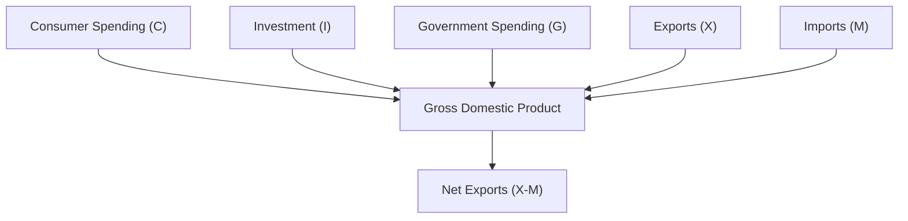

## 4.6 Measuring Economic Growth

Economic growth is a fundamental indicator of a nation's prosperity and economic health. It reflects an increase in the production of goods and services within an economy over time, leading to improved living standards and increased wealth. Understanding how to measure economic growth is crucial for policymakers, investors, and financial professionals, as it influences decisions on investment, policy-making, and economic forecasting.

### Understanding Economic Growth

Economic growth is defined as the increase in the production of goods and services in an economy over a specific period. It is typically measured as the percentage increase in real Gross Domestic Product (GDP), which adjusts for inflation to reflect the true increase in value. Economic growth is vital because it leads to higher income levels, improved employment opportunities, and better public services, contributing to the overall well-being of a society.

### Gross Domestic Product (GDP) as a Measure of Economic Growth

Gross Domestic Product (GDP) is the most widely used indicator to measure economic growth. It represents the total monetary value of all finished goods and services produced within a country's borders in a specific time period. GDP can be calculated using three primary approaches: the expenditure approach, the income approach, and the production (or output) approach. Each method provides a different perspective on the economy's performance.

### Approaches to Calculating GDP

#### 1. Expenditure Approach

The expenditure approach calculates GDP by summing up all expenditures made in an economy over a period. This method is based on the principle that all products must be purchased by someone, so the total expenditure on the economy's output is equal to the value of the output. The formula for GDP using the expenditure approach is:

 \text{GDP} = C + I + G + (X - M) 

Where:
- \\( C \\) = Consumer spending on goods and services
- \\( I \\) = Investment by businesses in capital goods
- \\( G \\) = Government spending on public goods and services
- \\( X \\) = Exports of goods and services
- \\( M \\) = Imports of goods and services

**Advantages:**
- Provides a clear picture of demand-side economic activity.
- Useful for understanding consumer behavior and government policy impacts.

**Limitations:**
- May not accurately reflect the informal economy.
- Sensitive to changes in trade balance, which can be volatile.

#### 2. Income Approach

The income approach calculates GDP by summing all incomes earned by individuals and businesses in the economy, including wages, profits, rents, and taxes, minus subsidies. This approach is based on the premise that the total output of an economy is equal to the total income generated by producing that output.

**Advantages:**
- Highlights the distribution of income among different economic agents.
- Useful for analyzing the impact of fiscal policies on income distribution.

**Limitations:**
- Data collection can be complex and time-consuming.
- May not capture all income sources, particularly in informal sectors.

#### 3. Production (Output) Approach

The production approach, also known as the output approach, calculates GDP by adding up the value of output produced by each sector of the economy. It focuses on the supply side, measuring the total value added at each stage of production.

**Advantages:**
- Provides insights into the structure and performance of different economic sectors.
- Useful for identifying growth drivers within the economy.

**Limitations:**
- Requires detailed data on production processes.
- May not account for all intermediate goods and services.

### Practical Examples and Case Studies

To illustrate these concepts, consider the Canadian economy. For instance, the expenditure approach might highlight the impact of consumer spending during a holiday season, while the income approach could reveal changes in wage distribution following a new tax policy. The production approach might show how the technology sector contributes to GDP growth compared to traditional industries.

### Diagrams and Visual Aids

To enhance understanding, consider the following diagram illustrating the expenditure approach to GDP calculation:

### Best Practices and Common Pitfalls

When analyzing GDP data, it's essential to consider the context and limitations of each method. For example, relying solely on the expenditure approach might overlook income distribution issues, while the income approach might not fully capture informal economic activities. Combining insights from all three methods provides a more comprehensive view of economic growth.

### Further Reading and Resources

For those interested in exploring these topics further, consider the following resources:
- **Books:** *"Macroeconomics"* by Olivier Blanchard provides an in-depth analysis of economic growth and GDP measurement.
- **Articles:** [Different Methods to Calculate GDP](https://www.investopedia.com/terms/g/gdp.asp) offers a detailed overview of GDP calculation techniques.

### Conclusion

Measuring economic growth through GDP is a complex but essential task for understanding a nation's economic health. By examining GDP through different lenses—expenditure, income, and production—financial professionals can gain valuable insights into the economy's performance and make informed decisions. As you continue your studies, consider how these concepts apply to real-world scenarios and explore additional resources to deepen your understanding.

### **Ready to Test Your Knowledge?**

**Practice 10 Essential CSC Exam Questions to Master Your Certification**



### What is economic growth?

- [x] An increase in the production of goods and services in an economy over time.
- [ ] A decrease in unemployment rates.
- [ ] A rise in inflation rates.
- [ ] A reduction in government spending.

> **Explanation:** Economic growth refers to the increase in the production of goods and services in an economy over time, leading to improved living standards and increased wealth.

### Which method calculates GDP by summing consumer spending, investment, government spending, and net exports?

- [x] Expenditure Approach
- [ ] Income Approach
- [ ] Production Approach
- [ ] Savings Approach

> **Explanation:** The expenditure approach calculates GDP by summing consumer spending, investment, government spending, and net exports.

### What is a limitation of the income approach to calculating GDP?

- [x] It may not capture all income sources, particularly in informal sectors.
- [ ] It does not account for government spending.
- [ ] It ignores consumer spending.
- [ ] It only considers exports.

> **Explanation:** The income approach may not capture all income sources, especially those in informal sectors, making data collection complex.

### Which GDP calculation method focuses on the supply side of the economy?

- [x] Production (Output) Approach
- [ ] Expenditure Approach
- [ ] Income Approach
- [ ] Demand Approach

> **Explanation:** The production (output) approach focuses on the supply side by measuring the total value added at each stage of production.

### What is a key advantage of the expenditure approach?

- [x] It provides a clear picture of demand-side economic activity.
- [ ] It highlights income distribution among economic agents.
- [ ] It requires detailed data on production processes.
- [ ] It captures all informal economic activities.

> **Explanation:** The expenditure approach provides a clear picture of demand-side economic activity, useful for understanding consumer behavior and government policy impacts.

### What does GDP stand for?

- [x] Gross Domestic Product
- [ ] General Domestic Production
- [ ] Gross Domestic Profit
- [ ] General Domestic Profit

> **Explanation:** GDP stands for Gross Domestic Product, representing the total monetary value of all finished goods and services produced within a country's borders.

### Which approach to GDP calculation is based on the principle that total output equals total income?

- [x] Income Approach
- [ ] Expenditure Approach
- [ ] Production Approach
- [ ] Savings Approach

> **Explanation:** The income approach is based on the principle that the total output of an economy is equal to the total income generated by producing that output.

### What is a limitation of the production approach?

- [x] It may not account for all intermediate goods and services.
- [ ] It does not consider consumer spending.
- [ ] It ignores government spending.
- [ ] It only focuses on exports.

> **Explanation:** The production approach may not account for all intermediate goods and services, requiring detailed data on production processes.

### Which of the following is NOT a component of GDP in the expenditure approach?

- [x] Savings
- [ ] Consumer Spending
- [ ] Investment
- [ ] Government Spending

> **Explanation:** Savings is not a component of GDP in the expenditure approach, which includes consumer spending, investment, government spending, and net exports.

### True or False: GDP can be calculated using only one method.

- [ ] True
- [x] False

> **Explanation:** False. GDP can be calculated using multiple methods: expenditure, income, and production approaches, each providing different insights into the economy.


