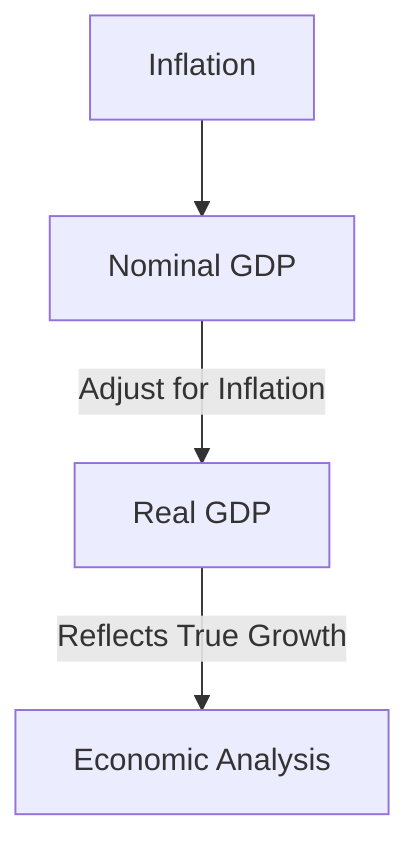

## 4.7 Real and Nominal GDP

Gross Domestic Product (GDP) is a crucial indicator used to gauge the economic performance of a country. It represents the total value of all goods and services produced over a specific time period. However, when analyzing GDP, it's essential to distinguish between nominal GDP and real GDP, as each provides different insights into the economy's health. This section will delve into these two concepts, their differences, and their implications for economic analysis, particularly within the Canadian context.

### Understanding Nominal GDP

**Nominal GDP** is the market value of all finished goods and services produced within a country's borders in a specific time period, measured using current prices. It does not account for changes in the price level or inflation. As a result, nominal GDP can be misleading when comparing economic output over time, as it may reflect changes in price rather than actual growth in production.

#### Example of Nominal GDP

Consider a simple economy that produces only apples. If in Year 1, the economy produces 100 apples at $1 each, the nominal GDP is $100. In Year 2, if the same economy produces 100 apples but the price rises to $1.10 each due to inflation, the nominal GDP becomes $110. Although the nominal GDP has increased, the actual production has not changed, illustrating how nominal GDP can be affected by price changes rather than real growth.

### Understanding Real GDP

**Real GDP**, on the other hand, measures the value of economic output adjusted for price changes, providing a more accurate reflection of an economy's size and how it's growing over time. By using constant prices from a base year, real GDP strips out the effects of inflation, allowing for a more meaningful comparison of economic performance across different periods.

#### Example of Real GDP

Using the same apple economy, if Year 1 is chosen as the base year, the real GDP in Year 2 would still be $100, as it reflects the same quantity of apples produced, adjusted for inflation. This adjustment highlights that there has been no real growth in production, despite the increase in nominal GDP.

### The Impact of Inflation on Nominal GDP

Inflation can significantly impact nominal GDP, as it causes the general price level of goods and services to rise. When inflation is present, nominal GDP may increase even if there is no actual growth in the quantity of goods and services produced. This can lead to an overestimation of economic growth if only nominal GDP is considered.

#### Inflation's Role in Economic Analysis

In Canada, the Consumer Price Index (CPI) is often used to measure inflation. By comparing nominal GDP with the CPI, economists can adjust for inflation to calculate real GDP, providing a clearer picture of economic growth. For instance, during periods of high inflation, such as the 1970s, nominal GDP figures were significantly inflated, necessitating adjustments to understand true economic performance.

### Importance of Real GDP in Assessing Economic Growth

Real GDP is a vital tool for assessing the true growth of an economy. It allows policymakers, investors, and analysts to:

- **Evaluate Economic Health:** By focusing on real GDP, stakeholders can assess whether an economy is genuinely expanding or merely experiencing price increases.
- **Make Informed Decisions:** Real GDP provides a stable basis for making economic decisions, such as setting monetary policy or planning fiscal budgets.
- **Compare Economies:** Real GDP enables comparisons between different time periods and across countries, as it accounts for differences in price levels.

### Practical Applications and Case Studies

#### Canadian Context

In Canada, real GDP is a critical measure used by institutions like the Bank of Canada to guide monetary policy. For example, during the 2008 financial crisis, real GDP was closely monitored to assess the recession's impact and to formulate appropriate policy responses.

#### Investment Strategies

Investors often use real GDP growth rates to inform their strategies. For instance, a consistent increase in real GDP may signal a robust economy, encouraging investment in growth-oriented sectors. Conversely, stagnation or decline in real GDP might prompt a shift towards more defensive investments.

### Visualizing Real and Nominal GDP

Below is a simple diagram illustrating the relationship between nominal GDP, real GDP, and inflation:

### Best Practices and Common Pitfalls

- **Best Practice:** Always consider both nominal and real GDP when analyzing economic data to get a comprehensive view.
- **Common Pitfall:** Relying solely on nominal GDP can lead to misinterpretations of economic health, especially during periods of inflation or deflation.

### Conclusion

Understanding the distinction between real and nominal GDP is crucial for accurately assessing economic performance. By adjusting for inflation, real GDP provides a clearer picture of an economy's true growth, enabling more informed decision-making. As you continue to explore economic indicators, remember the importance of context and the role of inflation in shaping economic narratives.

### Further Reading and Resources

- **Books:** *"Intermediate Macroeconomics"* by Robert J. Barro
- **Online Resources:** [Real vs. Nominal GDP](https://www.khanacademy.org/economics-finance-domain/macroeconomics/gdp-topic/gdp-tutorial/a/real-vs-nominal-gdp)

### **Ready to Test Your Knowledge?**

**Practice 10 Essential CSC Exam Questions to Master Your Certification**



### What is nominal GDP?

- [x] GDP measured at current market prices, without adjusting for inflation.
- [ ] GDP adjusted for changes in price level, reflecting true volume of production.
- [ ] GDP that accounts for both inflation and deflation.
- [ ] GDP measured using constant prices from a base year.

> **Explanation:** Nominal GDP is the market value of all finished goods and services produced within a country's borders in a specific time period, measured using current prices.

### How does inflation impact nominal GDP?

- [x] It can cause nominal GDP to increase without an actual increase in production.
- [ ] It decreases nominal GDP by reducing the value of money.
- [ ] It has no impact on nominal GDP.
- [ ] It causes nominal GDP to decrease as prices rise.

> **Explanation:** Inflation can cause nominal GDP to increase because it raises the general price level of goods and services, which may not reflect an actual increase in production.

### Why is real GDP important for assessing economic growth?

- [x] It provides a more accurate reflection of an economy's size by adjusting for price changes.
- [ ] It measures the total value of goods and services at current prices.
- [ ] It only considers the quantity of goods produced.
- [ ] It is not affected by inflation or deflation.

> **Explanation:** Real GDP is important because it adjusts for price changes, providing a clearer picture of an economy's true growth over time.

### Which of the following is a common pitfall when analyzing GDP?

- [x] Relying solely on nominal GDP can lead to misinterpretations of economic health.
- [ ] Using real GDP to compare different countries.
- [ ] Adjusting nominal GDP for inflation.
- [ ] Considering both nominal and real GDP in analysis.

> **Explanation:** Relying solely on nominal GDP can be misleading, especially during periods of inflation, as it may not accurately reflect true economic growth.

### What does real GDP allow policymakers to do?

- [x] Evaluate economic health and make informed decisions.
- [ ] Measure the total value of goods and services at current prices.
- [ ] Ignore inflation when setting monetary policy.
- [ ] Focus only on price changes without considering production.

> **Explanation:** Real GDP allows policymakers to evaluate economic health by providing a stable basis for making economic decisions, as it accounts for inflation.

### In the context of GDP, what does the Consumer Price Index (CPI) measure?

- [x] Inflation
- [ ] Deflation
- [ ] Real GDP
- [ ] Nominal GDP

> **Explanation:** The Consumer Price Index (CPI) measures inflation, which is used to adjust nominal GDP to calculate real GDP.

### How can real GDP growth rates inform investment strategies?

- [x] By signaling a robust economy, encouraging investment in growth-oriented sectors.
- [ ] By indicating a decline in economic performance, prompting defensive investments.
- [ ] By showing nominal GDP changes without inflation adjustments.
- [ ] By focusing only on price changes.

> **Explanation:** Real GDP growth rates can signal a robust economy, encouraging investment in growth-oriented sectors, or indicate economic stagnation, prompting defensive strategies.

### What is the relationship between nominal GDP, real GDP, and inflation?

- [x] Nominal GDP is adjusted for inflation to calculate real GDP.
- [ ] Real GDP is adjusted for inflation to calculate nominal GDP.
- [ ] Inflation is subtracted from real GDP to get nominal GDP.
- [ ] Nominal GDP and real GDP are unrelated to inflation.

> **Explanation:** Nominal GDP is adjusted for inflation to calculate real GDP, providing a clearer picture of economic growth.

### Which of the following best describes real GDP?

- [x] GDP adjusted for changes in price level, reflecting true volume of production.
- [ ] GDP measured at current market prices, without adjusting for inflation.
- [ ] GDP that accounts for both inflation and deflation.
- [ ] GDP measured using constant prices from a base year.

> **Explanation:** Real GDP is adjusted for changes in price level, reflecting the true volume of production, and provides a more accurate measure of economic growth.

### True or False: Real GDP is unaffected by inflation.

- [x] True
- [ ] False

> **Explanation:** True. Real GDP is adjusted for inflation, meaning it is unaffected by changes in price levels, providing a more accurate measure of economic growth.


