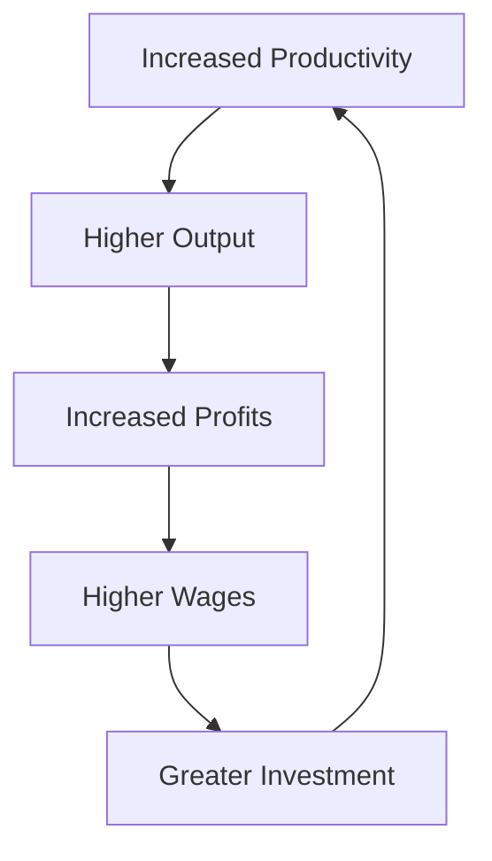

## 4.8 Productivity and Determinants of Economic Growth

Productivity is a cornerstone of economic growth, representing the efficiency with which goods and services are produced. It is typically measured as output per unit of input, such as labor or capital. Understanding productivity and its determinants is crucial for financial professionals, as it directly impacts economic performance, investment returns, and policy decisions.

### Understanding Productivity

Productivity is the ratio of output to input in the production process. It reflects how efficiently resources are utilized to produce goods and services. High productivity means more output is generated with the same amount of input, leading to increased profitability and economic growth.

#### Role of Productivity in Economic Growth

Productivity growth is a primary driver of economic expansion. When productivity increases, it allows for more goods and services to be produced without a proportional increase in inputs. This efficiency leads to higher incomes, improved standards of living, and enhanced competitiveness in global markets. In Canada, productivity improvements have been pivotal in sustaining economic growth and maintaining a high quality of life.

### Key Determinants of Productivity

Several factors influence productivity, including technological advancements, education, and capital investment. Each plays a vital role in enhancing production capabilities and efficiency.

#### Technological Advancements

Technological advancement refers to innovations that enhance production capabilities and efficiency. It includes the development of new products, processes, and services that improve productivity. In Canada, technological innovation has been a significant driver of productivity growth, particularly in sectors like information technology and manufacturing.

**Example:** The adoption of automation and artificial intelligence in Canadian manufacturing has streamlined operations, reduced costs, and increased output, contributing to higher productivity levels.

#### Education and Skills Development

Education equips the workforce with the skills and knowledge necessary to perform tasks efficiently. A well-educated workforce is more adaptable to technological changes and can contribute to innovation and productivity improvements.

**Example:** Canadian universities and colleges play a crucial role in providing education and training that align with industry needs, ensuring that the workforce is prepared for the demands of a rapidly changing economy.

#### Capital Investment

Investment in capital goods, such as machinery, infrastructure, and technology, enhances productivity by enabling more efficient production processes. Capital investment is essential for maintaining and improving the productive capacity of an economy.

**Example:** Investments in infrastructure projects, such as transportation networks and energy systems, have facilitated trade and commerce in Canada, boosting productivity and economic growth.

### Contribution of Productivity Gains to Long-Term Economic Growth

Productivity gains contribute to long-term economic growth by increasing the output potential of an economy. As productivity rises, businesses can produce more with the same resources, leading to higher profits, increased wages, and greater investment opportunities. This virtuous cycle supports sustainable economic development and enhances living standards.

**Diagram: Productivity and Economic Growth Cycle**

### Factors Hindering Productivity and Economic Growth

While productivity is crucial for economic growth, several factors can impede its progress:

#### Regulatory Barriers

Excessive regulation can stifle innovation and productivity by imposing unnecessary burdens on businesses. Streamlining regulations can enhance productivity by allowing firms to operate more efficiently.

#### Insufficient Investment

Lack of investment in education, technology, and infrastructure can limit productivity growth. Ensuring adequate investment in these areas is essential for maintaining competitiveness and economic vitality.

#### Economic Uncertainty

Economic uncertainty, such as volatile markets or political instability, can deter investment and innovation, hindering productivity growth. Stable economic conditions are conducive to productivity improvements.

### Conclusion

Understanding the determinants of productivity and their impact on economic growth is essential for financial professionals. By recognizing the factors that drive productivity, such as technological advancements, education, and capital investment, and addressing those that hinder it, Canada can continue to foster a robust and dynamic economy.

### Further Reading and Resources

- **Books:** *"Productivity and Economic Growth"* by Dale W. Jorgenson
- **Articles:** [How Productivity Drives Economic Growth](https://www.investopedia.com/terms/p/productivity.asp)

### **Ready to Test Your Knowledge?**

**Practice 10 Essential CSC Exam Questions to Master Your Certification**



### What is productivity?

- [x] The efficiency with which goods and services are produced
- [ ] The total output of an economy
- [ ] The amount of labor used in production
- [ ] The level of technological advancement

> **Explanation:** Productivity is defined as the efficiency with which goods and services are produced, typically measured as output per unit of input.

### Which of the following is a key determinant of productivity?

- [x] Technological advancements
- [ ] Inflation rates
- [ ] Trade deficits
- [ ] Population growth

> **Explanation:** Technological advancements are a key determinant of productivity as they enhance production capabilities and efficiency.

### How do productivity gains contribute to economic growth?

- [x] By increasing output without a proportional increase in inputs
- [ ] By reducing the workforce
- [ ] By increasing inflation
- [ ] By decreasing exports

> **Explanation:** Productivity gains allow for more goods and services to be produced without a proportional increase in inputs, leading to economic growth.

### What role does education play in productivity?

- [x] It equips the workforce with necessary skills and knowledge
- [ ] It reduces the need for capital investment
- [ ] It increases regulatory barriers
- [ ] It decreases technological advancements

> **Explanation:** Education equips the workforce with the skills and knowledge necessary to perform tasks efficiently, contributing to productivity improvements.

### Which factor can hinder productivity growth?

- [x] Regulatory barriers
- [ ] Increased capital investment
- [ ] Technological advancements
- [ ] Education and skills development

> **Explanation:** Regulatory barriers can hinder productivity growth by imposing unnecessary burdens on businesses.

### What is the impact of insufficient investment on productivity?

- [x] It limits productivity growth
- [ ] It enhances technological advancements
- [ ] It increases economic uncertainty
- [ ] It reduces regulatory barriers

> **Explanation:** Insufficient investment in education, technology, and infrastructure can limit productivity growth.

### How does economic uncertainty affect productivity?

- [x] It deters investment and innovation
- [ ] It enhances regulatory efficiency
- [ ] It increases capital investment
- [ ] It improves workforce education

> **Explanation:** Economic uncertainty can deter investment and innovation, hindering productivity growth.

### What is a benefit of increased productivity?

- [x] Higher wages
- [ ] Increased regulatory barriers
- [ ] Decreased output
- [ ] Reduced technological advancements

> **Explanation:** Increased productivity can lead to higher wages as businesses generate more output and profits.

### Which of the following is NOT a determinant of productivity?

- [x] Trade deficits
- [ ] Technological advancements
- [ ] Education
- [ ] Capital investment

> **Explanation:** Trade deficits are not a determinant of productivity; they are more related to a country's balance of trade.

### True or False: Productivity gains can lead to higher living standards.

- [x] True
- [ ] False

> **Explanation:** True. Productivity gains contribute to higher living standards by increasing output and income, leading to improved quality of life.


