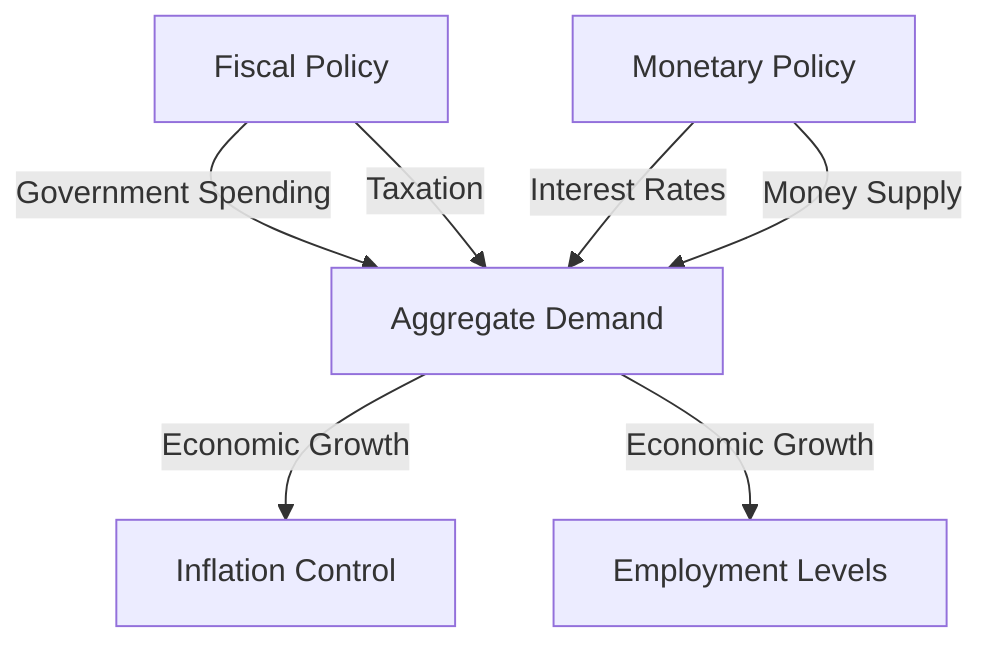

## 5.9 Fiscal and Monetary Policy Interaction

In the complex world of economic management, fiscal and monetary policies serve as the primary tools for governments and central banks to influence a nation's economic performance. Understanding the interaction between these two policies is crucial for financial professionals, as it impacts everything from inflation rates to employment levels and overall economic growth. This section delves into the dynamics of fiscal and monetary policy interaction, focusing on the Canadian context, and provides insights into how these policies can be coordinated to achieve economic stability and growth.

### The Role of Fiscal Policy

Fiscal policy involves government decisions on taxation and spending to influence the economy. In Canada, fiscal policy is primarily managed by the federal government, with significant input from provincial governments. The main objectives of fiscal policy include:

- **Stimulating Economic Growth:** By increasing government spending or cutting taxes, fiscal policy can boost aggregate demand, leading to higher economic output.
- **Controlling Inflation:** Conversely, reducing government spending or increasing taxes can help cool down an overheating economy and control inflation.
- **Redistributing Income:** Through progressive taxation and social welfare programs, fiscal policy can help reduce income inequality.

### The Role of Monetary Policy

Monetary policy, on the other hand, is the domain of the central bank—in Canada's case, the Bank of Canada. The primary tools of monetary policy include:

- **Interest Rates:** Adjusting the policy interest rate to influence borrowing and spending.
- **Open Market Operations:** Buying or selling government securities to influence the money supply.
- **Quantitative Easing:** Increasing the money supply by purchasing financial assets from banks.

The main goals of monetary policy are to maintain price stability (controlling inflation) and support economic growth and employment.

### Interplay Between Fiscal and Monetary Policy

The interaction between fiscal and monetary policy is a delicate balancing act. Both policies aim to stabilize the economy, but they can sometimes work at cross purposes if not well-coordinated.

#### Complementary Actions

Fiscal and monetary policies can complement each other in several ways:

- **Stimulus in Recessions:** During economic downturns, both fiscal and monetary policies can be expansionary. For example, the government may increase spending on infrastructure projects while the central bank lowers interest rates to encourage borrowing and investment.
- **Controlling Inflation:** In times of high inflation, fiscal policy can reduce spending or increase taxes, while monetary policy can raise interest rates to reduce money supply and demand.

#### Counteracting Actions

There are instances where fiscal and monetary policies may counteract each other:

- **Fiscal Expansion vs. Monetary Tightening:** If the government increases spending while the central bank raises interest rates to control inflation, the policies may work against each other, leading to mixed signals in the economy.
- **Monetary Easing vs. Fiscal Austerity:** Conversely, if the central bank lowers interest rates to stimulate growth while the government cuts spending to reduce deficits, the effectiveness of monetary policy may be undermined.

### Coordination Challenges

Coordinating fiscal and monetary policy poses several challenges:

- **Timing and Implementation:** Fiscal policy changes often require legislative approval and can take time to implement, whereas monetary policy adjustments can be made more swiftly by the central bank.
- **Political Considerations:** Fiscal policy is subject to political influences, which can lead to decisions that prioritize short-term gains over long-term stability.
- **Independence of the Central Bank:** The Bank of Canada operates independently from the government, which can lead to differing priorities and approaches to economic management.

### Case Study: The 2008 Financial Crisis

The 2008 financial crisis provides a clear example of fiscal and monetary policy interaction. In response to the crisis, the Canadian government implemented a fiscal stimulus package, increasing spending on infrastructure and social programs. Simultaneously, the Bank of Canada lowered interest rates to near-zero levels to encourage borrowing and investment. This coordinated response helped Canada recover more quickly than many other countries.

### Practical Implications for Financial Professionals

Understanding the interaction between fiscal and monetary policy is essential for financial professionals. Here are some practical implications:

- **Investment Strategies:** Changes in fiscal and monetary policy can impact interest rates, inflation, and economic growth, influencing investment returns. Financial professionals must consider these factors when developing investment strategies.
- **Risk Management:** Policy changes can introduce economic volatility. Professionals should be prepared to adjust portfolios in response to shifts in fiscal or monetary policy.
- **Regulatory Compliance:** Staying informed about policy changes can help professionals ensure compliance with regulatory requirements and anticipate potential impacts on financial markets.

### Visualizing Fiscal and Monetary Policy Interaction

Below is a diagram illustrating the interaction between fiscal and monetary policy:

### Best Practices and Common Pitfalls

- **Best Practices:** Encourage open communication between fiscal authorities and the central bank to align policy objectives and enhance economic outcomes.
- **Common Pitfalls:** Avoid policy measures that send mixed signals to the market, such as simultaneous fiscal expansion and monetary tightening.

### Conclusion

The interaction between fiscal and monetary policy is a critical component of economic management. By understanding how these policies can complement or counteract each other, financial professionals can better navigate the complexities of the Canadian economic landscape. Continuous learning and adaptation are key to leveraging these insights for effective financial decision-making.

For further exploration, consider the following resources:

- [Fiscal and Monetary Policy Interaction](https://www.bankofcanada.ca/2018/06/fiscal-policy-measures-bank-canadas-role-economic-activity/)
- [Economic Policy Coordination](https://www.canada.ca/en/department-finance/programs/financial-sector-policy.html)

### **Ready to Test Your Knowledge?**

**Practice 10 Essential CSC Exam Questions to Master Your Certification**



### What is the primary goal of fiscal policy?

- [x] Stimulating economic growth
- [ ] Controlling the money supply
- [ ] Setting interest rates
- [ ] Managing foreign exchange reserves

> **Explanation:** Fiscal policy aims to stimulate economic growth through government spending and taxation decisions.

### Which institution is responsible for monetary policy in Canada?

- [ ] The Department of Finance
- [x] The Bank of Canada
- [ ] The Canadian Securities Administrators
- [ ] The Office of the Superintendent of Financial Institutions

> **Explanation:** The Bank of Canada is responsible for conducting monetary policy in Canada.

### How can fiscal and monetary policies complement each other during a recession?

- [x] By increasing government spending and lowering interest rates
- [ ] By decreasing government spending and raising interest rates
- [ ] By increasing taxes and lowering interest rates
- [ ] By decreasing taxes and raising interest rates

> **Explanation:** During a recession, increasing government spending and lowering interest rates can stimulate economic activity.

### What is a potential challenge in coordinating fiscal and monetary policy?

- [x] Timing and implementation differences
- [ ] Lack of available financial instruments
- [ ] Excessive market transparency
- [ ] Overlapping regulatory jurisdictions

> **Explanation:** Timing and implementation differences pose challenges as fiscal policy changes require legislative approval, while monetary policy can be adjusted more swiftly.

### What was a key feature of Canada's response to the 2008 financial crisis?

- [x] Coordinated fiscal stimulus and monetary easing
- [ ] Fiscal austerity measures
- [ ] Increased interest rates
- [ ] Reduction in government spending

> **Explanation:** Canada responded to the 2008 financial crisis with coordinated fiscal stimulus and monetary easing to support economic recovery.

### What is a common pitfall in fiscal and monetary policy interaction?

- [x] Sending mixed signals to the market
- [ ] Over-reliance on a single policy tool
- [ ] Excessive transparency in policy decisions
- [ ] Lack of political influence

> **Explanation:** Sending mixed signals, such as simultaneous fiscal expansion and monetary tightening, can confuse market participants.

### What is the main tool used by the Bank of Canada to influence monetary policy?

- [x] Interest rates
- [ ] Taxation
- [ ] Government spending
- [ ] Foreign exchange reserves

> **Explanation:** The Bank of Canada primarily uses interest rates to influence monetary policy.

### How can fiscal policy help control inflation?

- [x] By reducing government spending or increasing taxes
- [ ] By increasing government spending or cutting taxes
- [ ] By lowering interest rates
- [ ] By increasing the money supply

> **Explanation:** Fiscal policy can help control inflation by reducing government spending or increasing taxes to decrease aggregate demand.

### What is a key objective of monetary policy?

- [x] Maintaining price stability
- [ ] Redistributing income
- [ ] Increasing government revenue
- [ ] Managing trade balances

> **Explanation:** A key objective of monetary policy is to maintain price stability by controlling inflation.

### True or False: Fiscal policy changes can be implemented more swiftly than monetary policy adjustments.

- [ ] True
- [x] False

> **Explanation:** Fiscal policy changes often require legislative approval and can take time to implement, whereas monetary policy adjustments can be made more swiftly by the central bank.


