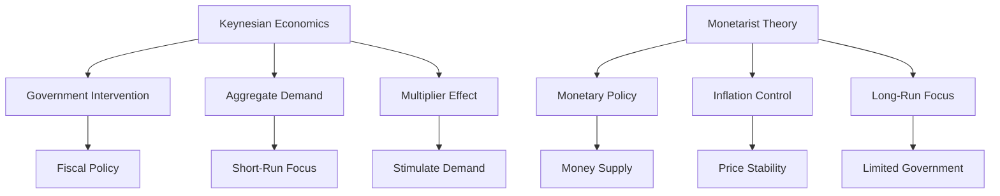

## 5.11 Economic Theories: Keynesian and Monetarist

Economic theories provide the foundation for understanding how economies function and how policy decisions can influence economic outcomes. Two of the most influential economic theories are Keynesian economics and Monetarist theory. These frameworks offer contrasting views on the role of government intervention and monetary policy in managing economic cycles and ensuring stability.

### Understanding Keynesian Economics

Keynesian economics, named after the British economist John Maynard Keynes, advocates for active government intervention to manage economic cycles. This theory emerged during the Great Depression of the 1930s, a period marked by severe economic downturns and high unemployment. Keynes argued that during such times, private sector demand often falls short, leading to prolonged periods of economic stagnation.

#### Key Principles of Keynesian Economics

1. **Government Intervention:** Keynesian economics suggests that during economic downturns, governments should increase spending and cut taxes to stimulate demand. This fiscal policy approach aims to boost consumption and investment, thereby reducing unemployment and spurring economic growth.

2. **Aggregate Demand:** The theory emphasizes the importance of aggregate demand (total demand for goods and services in the economy) as the primary driver of economic activity. Keynesians believe that fluctuations in aggregate demand can lead to economic instability.

3. **Multiplier Effect:** Keynes introduced the concept of the multiplier effect, where an initial increase in spending leads to a larger overall increase in economic output. For example, government spending on infrastructure projects can create jobs, leading to increased consumer spending and further economic growth.

4. **Short-Run Focus:** Keynesian economics primarily focuses on short-term economic fluctuations and the need for immediate policy responses to stabilize the economy.

### Exploring Monetarist Theory

Monetarist theory, associated with economist Milton Friedman, emphasizes the role of the money supply in controlling inflation and ensuring economic stability. Monetarists argue that managing the money supply is the most effective way to regulate economic activity and prevent inflationary pressures.

#### Key Principles of Monetarist Theory

1. **Monetary Policy:** Monetarists advocate for controlling the money supply through monetary policy as the primary tool for managing the economy. They believe that changes in the money supply directly influence inflation and economic output.

2. **Inflation Control:** According to monetarists, inflation is primarily a monetary phenomenon. By regulating the growth of the money supply, central banks can maintain price stability and prevent inflation from eroding purchasing power.

3. **Long-Run Focus:** Monetarist theory emphasizes long-term economic stability and the importance of maintaining a steady growth rate of the money supply to avoid economic fluctuations.

4. **Limited Government Intervention:** Monetarists generally favor minimal government intervention in the economy, arguing that markets are self-regulating and that excessive intervention can lead to inefficiencies.

### Comparing Keynesian and Monetarist Approaches

The Keynesian and Monetarist approaches offer contrasting views on fiscal and monetary policy:

- **Fiscal Policy:** Keynesians advocate for active fiscal policy, using government spending and taxation to influence economic activity. In contrast, monetarists focus on monetary policy, arguing that fiscal policy is less effective and can lead to budget deficits and inflation.

- **Monetary Policy:** Monetarists prioritize controlling the money supply to manage inflation, while Keynesians view monetary policy as a complementary tool to fiscal policy, particularly during economic downturns.

- **Role of Government:** Keynesians support a more active role for government in managing the economy, whereas monetarists prefer limited government intervention, emphasizing the self-regulating nature of markets.

### Historical Applications in Canadian Economic Policy

Canada has experienced periods where both Keynesian and Monetarist policies have been applied:

- **Keynesian Policies:** During the 1960s and 1970s, Canada adopted Keynesian policies to address economic challenges. The government increased spending on infrastructure and social programs to stimulate demand and reduce unemployment.

- **Monetarist Influence:** In the 1980s and 1990s, Canada shifted towards monetarist policies, focusing on controlling inflation through monetary policy. The Bank of Canada adopted inflation targeting, aiming to maintain low and stable inflation rates.

### Practical Examples and Case Studies

#### Canadian Pension Funds

Canadian pension funds, such as the Canada Pension Plan Investment Board (CPPIB), have utilized Keynesian principles by investing in infrastructure projects during economic downturns. These investments not only provide returns for the funds but also stimulate economic activity and job creation.

#### Major Canadian Banks

Major Canadian banks, like RBC and TD, have been influenced by monetarist principles in their lending practices. By adjusting interest rates and credit availability, these banks help manage economic growth and inflation in line with monetary policy objectives.

### Diagrams and Visuals

To better understand the differences between Keynesian and Monetarist theories, consider the following diagram illustrating their approaches to economic policy:

### Best Practices and Challenges

- **Best Practices:** Understanding the strengths and limitations of both theories can help policymakers design effective economic strategies. Combining elements of both approaches may provide a balanced framework for addressing economic challenges.

- **Common Challenges:** Policymakers must navigate the trade-offs between short-term economic stabilization and long-term fiscal sustainability. Balancing fiscal and monetary policies requires careful consideration of economic conditions and potential impacts.

### References and Further Reading

- [Keynesian vs. Monetarist Economics](https://www.investopedia.com/terms/k/keynesianeconomics.asp)
- [Monetarist Economics Explained](https://www.bankofcanada.ca/education/monetary-policy/principal-theories/monetarism/)

### Glossary

- **Keynesian Economics:** An economic theory advocating for active government intervention through fiscal policy to manage economic cycles.
- **Monetarist Theory:** An economic theory emphasizing the role of the money supply in controlling inflation and stabilizing the economy.

### **Ready to Test Your Knowledge?**

**Practice 10 Essential CSC Exam Questions to Master Your Certification**



### What is the primary focus of Keynesian economics?

- [x] Active government intervention to manage economic cycles
- [ ] Controlling the money supply to regulate inflation
- [ ] Reducing government spending to balance budgets
- [ ] Promoting free market principles without intervention

> **Explanation:** Keynesian economics advocates for active government intervention through fiscal policy to manage economic cycles, particularly during downturns.

### Which economic theory emphasizes controlling the money supply?

- [ ] Keynesian Economics
- [x] Monetarist Theory
- [ ] Supply-Side Economics
- [ ] Classical Economics

> **Explanation:** Monetarist theory emphasizes the role of the money supply in controlling inflation and ensuring economic stability.

### What is a key tool used in Keynesian economics to stimulate demand?

- [x] Government spending
- [ ] Interest rate adjustments
- [ ] Tax increases
- [ ] Reducing the money supply

> **Explanation:** Keynesian economics uses government spending as a tool to stimulate demand and boost economic activity.

### What is the primary goal of monetarist monetary policy?

- [x] Controlling inflation
- [ ] Reducing unemployment
- [ ] Increasing government spending
- [ ] Promoting exports

> **Explanation:** Monetarist monetary policy aims to control inflation by regulating the money supply.

### How do Keynesians view the role of fiscal policy?

- [x] As a primary tool for managing economic activity
- [ ] As a secondary tool to monetary policy
- [ ] As an ineffective means of economic management
- [ ] As a tool for long-term economic planning

> **Explanation:** Keynesians view fiscal policy as a primary tool for managing economic activity, particularly during economic downturns.

### What is the multiplier effect in Keynesian economics?

- [x] An initial increase in spending leads to a larger overall increase in economic output
- [ ] A decrease in taxes leads to a decrease in government revenue
- [ ] An increase in interest rates leads to reduced borrowing
- [ ] A reduction in government spending leads to increased private investment

> **Explanation:** The multiplier effect in Keynesian economics refers to how an initial increase in spending can lead to a larger overall increase in economic output.

### Which theory emphasizes long-term economic stability?

- [ ] Keynesian Economics
- [x] Monetarist Theory
- [ ] Supply-Side Economics
- [ ] Behavioral Economics

> **Explanation:** Monetarist theory emphasizes long-term economic stability through the regulation of the money supply.

### What is a common challenge in implementing Keynesian policies?

- [x] Balancing short-term stabilization with long-term fiscal sustainability
- [ ] Achieving rapid inflation control
- [ ] Reducing government intervention
- [ ] Promoting free market efficiency

> **Explanation:** A common challenge in implementing Keynesian policies is balancing short-term economic stabilization with long-term fiscal sustainability.

### How did Canada apply monetarist policies in the 1980s and 1990s?

- [x] By focusing on controlling inflation through monetary policy
- [ ] By increasing government spending on social programs
- [ ] By reducing taxes across all income brackets
- [ ] By deregulating financial markets

> **Explanation:** In the 1980s and 1990s, Canada applied monetarist policies by focusing on controlling inflation through monetary policy, including adopting inflation targeting.

### True or False: Monetarists generally favor minimal government intervention in the economy.

- [x] True
- [ ] False

> **Explanation:** Monetarists generally favor minimal government intervention, emphasizing the self-regulating nature of markets and the importance of controlling the money supply.


