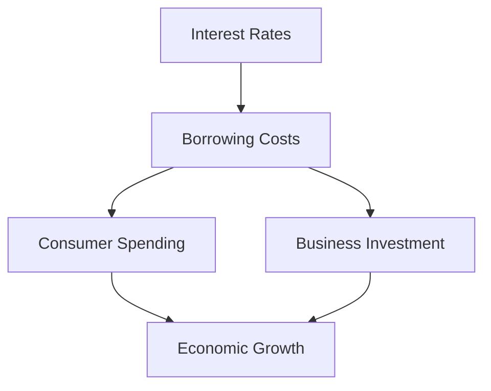

## 5.12 The Role of Interest Rates

Interest rates are a fundamental component of the financial ecosystem, influencing a wide array of economic activities. They affect how consumers and businesses borrow and spend, determine the flow of investment capital, and ultimately drive economic growth. Understanding the role of interest rates is crucial for anyone involved in financial services, investment, or economic policy.

### How Interest Rates Influence Borrowing and Spending

Interest rates are the cost of borrowing money. When interest rates are low, borrowing becomes cheaper for consumers and businesses. This typically leads to an increase in spending and investment, as individuals are more inclined to take out loans for big-ticket items like homes and cars, and businesses are more likely to finance expansion projects.

Conversely, high interest rates make borrowing more expensive, which can dampen consumer spending and business investment. This is because the higher cost of borrowing reduces disposable income for consumers and increases the cost of capital for businesses.

#### Example: Canadian Mortgage Rates

Consider the impact of interest rates on the Canadian housing market. When the Bank of Canada lowers interest rates, mortgage rates typically follow suit. This reduction makes home loans more affordable, encouraging more people to buy homes, which can lead to a rise in housing prices due to increased demand.

### The Relationship Between Interest Rates, Investment Capital, and Economic Growth

Interest rates play a pivotal role in determining the availability and cost of investment capital. Lower interest rates reduce the cost of borrowing for businesses, making it easier for them to invest in new projects, hire more employees, and expand operations. This can lead to increased economic growth as businesses drive productivity and innovation.

#### Investment Capital

Investment capital refers to the funds used by businesses and governments to finance operations and investments. When interest rates are low, the cost of acquiring this capital decreases, encouraging more investment. This can lead to a virtuous cycle of growth, where increased investment leads to higher economic output, which in turn can lead to further investment.

#### Economic Growth

Economic growth is often measured by the increase in a country's gross domestic product (GDP). Interest rates can influence GDP by affecting consumer spending, business investment, and government borrowing. Lower interest rates can stimulate growth by making it cheaper to finance spending and investment, while higher rates can slow growth by increasing the cost of borrowing.

### Central Bank Decisions and Their Impact

Central banks, such as the Bank of Canada, play a critical role in setting short-term interest rates through monetary policy. By adjusting the policy interest rate, central banks influence economic activity to achieve macroeconomic objectives like controlling inflation and stabilizing the currency.

#### Short-term Interest Rates

Short-term interest rates are typically set by central banks and influence the rates that banks charge each other for overnight loans. These rates serve as a benchmark for other interest rates in the economy, including those on savings accounts, loans, and mortgages.

#### Broader Economic Impact

Central bank decisions on interest rates can have wide-ranging effects on the economy. For instance, a decision to lower interest rates can boost economic activity by making borrowing cheaper, while a decision to raise rates can help control inflation by curbing spending.

#### Case Study: The Bank of Canada's Response to Economic Challenges

During economic downturns, the Bank of Canada may lower interest rates to stimulate the economy. For example, in response to the economic challenges posed by the COVID-19 pandemic, the Bank of Canada reduced its policy interest rate to support economic recovery. This action helped lower borrowing costs for consumers and businesses, encouraging spending and investment.

### Glossary

- **Investment Capital:** Funds used by businesses and governments to finance operations and investments.
- **Nominal Interest Rate:** The interest rate before adjusting for inflation.

### Practical Examples and Real-World Scenarios

To illustrate the impact of interest rates, consider the following scenarios:

1. **Personal Finance:** A Canadian family considering a mortgage will find that lower interest rates reduce their monthly payments, freeing up income for other expenditures or savings.

2. **Corporate Finance:** A Canadian company looking to expand its operations might take advantage of low interest rates to finance new projects, expecting that the growth in revenue will outpace the cost of borrowing.

3. **Government Policy:** The Canadian government might issue bonds at lower interest rates to finance infrastructure projects, stimulating economic activity and job creation.

### Diagrams and Visual Aids

Below is a simple diagram illustrating the relationship between interest rates, borrowing, and economic growth:

### Best Practices and Common Pitfalls

- **Best Practices:** Monitor central bank announcements and economic indicators to anticipate changes in interest rates and adjust financial strategies accordingly.
- **Common Pitfalls:** Failing to account for interest rate changes in financial planning can lead to unexpected costs or missed opportunities.

### References

- [Interest Rates and Economic Impact](https://www.bankofcanada.ca/rates/interest-rates/)
- [Understanding Nominal vs Real Interest Rates](https://www.bankofcanada.ca/education/interest-rates/nominal-real-interest-rates/)

### Encouragement for Further Exploration

Understanding interest rates is crucial for making informed financial decisions. By keeping abreast of economic trends and central bank policies, you can better navigate the complexities of the financial markets and optimize your investment strategies.

### **Ready to Test Your Knowledge?**

**Practice 10 Essential CSC Exam Questions to Master Your Certification**



### How do low interest rates affect consumer borrowing?

- [x] They make borrowing cheaper, encouraging more spending.
- [ ] They make borrowing more expensive, discouraging spending.
- [ ] They have no effect on consumer borrowing.
- [ ] They only affect business borrowing.

> **Explanation:** Low interest rates reduce the cost of borrowing, making it more attractive for consumers to take loans for purchases, thus encouraging spending.

### What is the relationship between interest rates and investment capital?

- [x] Lower interest rates reduce the cost of investment capital.
- [ ] Higher interest rates reduce the cost of investment capital.
- [ ] Interest rates do not affect investment capital.
- [ ] Investment capital is only affected by inflation.

> **Explanation:** Lower interest rates decrease the cost of borrowing, making it cheaper for businesses to acquire investment capital for growth and expansion.

### How do central banks influence short-term interest rates?

- [x] By setting the policy interest rate.
- [ ] By controlling inflation directly.
- [ ] By adjusting tax rates.
- [ ] By regulating stock markets.

> **Explanation:** Central banks set the policy interest rate, which influences short-term interest rates and affects economic activity.

### What is the nominal interest rate?

- [x] The interest rate before adjusting for inflation.
- [ ] The interest rate after adjusting for inflation.
- [ ] The interest rate set by banks.
- [ ] The interest rate on government bonds.

> **Explanation:** The nominal interest rate is the rate before any adjustments for inflation, reflecting the basic cost of borrowing.

### How can high interest rates impact economic growth?

- [x] They can slow growth by increasing borrowing costs.
- [ ] They can accelerate growth by reducing borrowing costs.
- [ ] They have no impact on economic growth.
- [ ] They only affect consumer spending, not business investment.

> **Explanation:** High interest rates increase the cost of borrowing, which can reduce spending and investment, slowing economic growth.

### What happens to mortgage rates when the Bank of Canada lowers interest rates?

- [x] Mortgage rates typically decrease.
- [ ] Mortgage rates typically increase.
- [ ] Mortgage rates remain unchanged.
- [ ] Mortgage rates are unaffected by central bank rates.

> **Explanation:** When the Bank of Canada lowers interest rates, mortgage rates often decrease, making home loans more affordable.

### Why might a central bank raise interest rates?

- [x] To control inflation by curbing spending.
- [ ] To stimulate economic growth by encouraging borrowing.
- [ ] To increase government revenue.
- [ ] To decrease the value of the currency.

> **Explanation:** Raising interest rates can help control inflation by making borrowing more expensive, thus reducing spending.

### What is a common pitfall when planning finances related to interest rates?

- [x] Failing to account for changes in interest rates.
- [ ] Overestimating the impact of inflation.
- [ ] Ignoring tax implications.
- [ ] Focusing too much on short-term gains.

> **Explanation:** Not considering potential changes in interest rates can lead to unexpected costs or missed financial opportunities.

### How do interest rates affect government borrowing?

- [x] Lower rates make it cheaper for governments to issue bonds.
- [ ] Higher rates make it cheaper for governments to issue bonds.
- [ ] Interest rates do not affect government borrowing.
- [ ] Government borrowing is only affected by tax policies.

> **Explanation:** Lower interest rates reduce the cost of issuing bonds, making it cheaper for governments to finance projects.

### True or False: Central bank decisions on interest rates have no impact on the broader economy.

- [ ] True
- [x] False

> **Explanation:** Central bank decisions on interest rates significantly impact the broader economy by influencing borrowing costs, spending, and investment.


